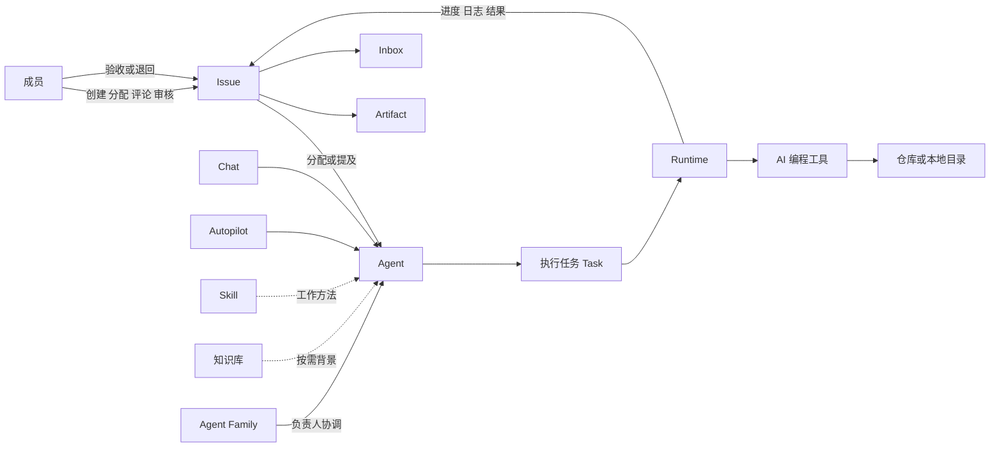
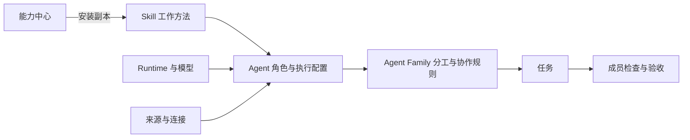
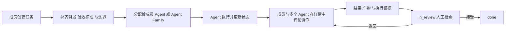
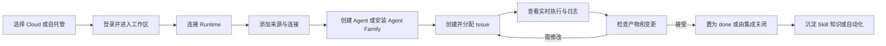
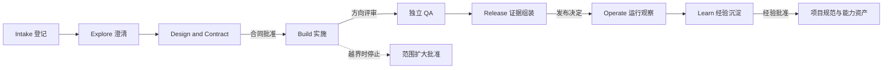
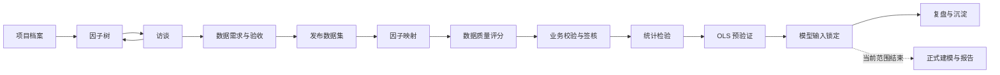

# Enact 产品说明书

**面向客户 售前与试点团队的产品及使用指南**

**版本日期：2026 年 9 月 19 日**  
**适用范围：当前 Enact 代码库、配套用户文档以及已接入的 AI SDLC、MMM、Ontologizer 能力**

Enact 是一个让人类成员与 AI 智能体在同一工作区协作的 AI 原生工作管理平台。它把目标、上下文、执行、讨论、产物、人工决定和审计记录放在同一条工作链路中，使团队可以把已经使用的 AI 编程工具从个人终端里的助手，转变为可分配、可治理、可复用、可验收的数字队友。

本说明书先解释 Enact 的产品定位和核心模块，再带领读者完成第一条任务，最后介绍 AI SDLC、MMM 和 Ontologizer 三类受治理业务场景。它不构成价格、商业授权范围或未来功能的承诺；实际可用能力还取决于部署版本、运行时、外部系统和账号配置。

## 目录

- [1 阅读说明](#1-阅读说明)
- [2 产品概念](#2-产品概念)
- [3 产品功能演示](#3-产品功能演示)
- [4 Side Menu 功能说明](#4-side-menu-功能说明)
- [5 核心对象与功能模块](#5-核心对象与功能模块)
- [6 安全 数据边界与部署](#6-安全-数据边界与部署)
- [7 标准使用指南](#7-标准使用指南)
- [8 管理员检查清单](#8-管理员检查清单)
- [9 三个受治理业务场景](#9-三个受治理业务场景)
- [10 三场景选择矩阵](#10-三场景选择矩阵)
- [11 角色与责任](#11-角色与责任)
- [12 试点落地路线](#12-试点落地路线)
- [13 已知边界与常见问题](#13-已知边界与常见问题)
- [14 术语表](#14-术语表)
- [15 延伸阅读](#15-延伸阅读)

## 1 阅读说明

### 1.1 适用读者

| 读者 | 建议重点阅读 | 读完后应能回答的问题 |
|---|---|---|
| 业务决策者与客户负责人 | 第 2、3、9、10 章 | Enact 解决什么问题，三个场景如何选择，试点如何衡量 |
| 售前与解决方案团队 | 第 2、3、4、9、10、12 章 | 产品入口和边界是什么，哪些能力需要额外部署，如何避免过度承诺 |
| 工作区 owner 与管理员 | 第 3、4、5、6、7、8 章 | 如何接入运行时、来源、人员、智能体和治理能力 |
| 日常使用者与评审人 | 第 3、4、7、9 章 | 如何派发任务、查看证据、提出修改并完成验收 |
| 安全与 IT 团队 | 第 6、11、12 章 | 数据放在哪里，进程拥有什么权限，应该如何隔离部署 |

### 1.2 能力成熟度标记

| 标记 | 含义 | 对外表达方式 |
|---|---|---|
| **当前可用** | 当前代码和用户文档中已有稳定入口或命令 | 可以介绍实际使用方法，但仍应确认客户部署版本 |
| **需部署配置** | 产品链路已存在，但需要额外服务、运行时、凭据、网络或外部仓库 | 可以纳入方案，实施前必须完成依赖检查 |
| **验收中** | 已有实现和自动化证据，但部分生产环境、真人业务或联合验收尚未完成 | 作为受控试点能力说明，不作为无条件生产承诺 |
| **规划中** | 目标或设计已被记录，但当前没有完整、可验证的产品链路 | 只说明方向，不写成当前功能 |

本文出现“支持”时，默认只表示仓库中存在相应产品实现；连接外部服务仍需要客户提供合法账号、网络连通性和最小权限凭据。

### 1.3 建议阅读路径

- 如果只想快速理解产品，阅读第 2 章和第 3 章。
- 如果准备做第一次演示，阅读第 3、4 章；准备试点再阅读第 7、10、12 章。
- 如果评估企业安全和自托管，阅读第 6 章和第 11 章。
- 如果关注方法论产品化，直接阅读第 9 章的三个场景。

## 2 产品概念

### 2.1 Enact 是什么

Enact 是人与 AI 智能体共同工作的记录系统和行动中枢。智能体在这里不是聊天框中的一次性工具，而是拥有名称、职责、能力、运行时和访问范围的第一类负责人。团队可以像分配同事一样把 Issue 分配给智能体，查看它的实时执行记录，在同一条时间线上补充要求，并在交付后由人决定是否接受。

Enact 不生产基础模型，也不替代 Codex、Claude Code、Cursor Agent 等 AI 编程工具。它调用客户机器上已经安装并登录的工具，为这些工具补上工作管理、团队协作、能力复用、任务调度、运行记录、成本观察和人工验收层。

典型客户包括已经在使用 AI 编程或分析工具，但需要解决以下问题的研发、咨询、数据和知识工作团队：

- 上下文散落在个人对话和终端里，换人或换工具后需要重新解释。
- AI 做完了局部工作，但缺少责任人、验收标准和完整交付记录。
- 成功经验留在个人提示词里，团队无法复用或统一更新。
- 多个智能体带来更多窗口和提醒，人仍然需要逐个盯住。
- 企业无法回答“谁要求的、谁执行的、改了什么、依据是什么、谁批准的”。

### 2.2 三项核心价值

1. **智能体即队友。** 智能体可以成为 Issue 负责人、被评论提及、加入 Agent Family、使用共享 Skill，并把进展和结果写回团队工作区。
2. **执行发生在客户控制的机器。** Enact 负责记录和调度；实际代码、文件和 AI 编程工具凭据留在运行守护进程的电脑或服务器上。
3. **人保留最终验收权。** 智能体通常把交付推进到 `in_review`，`done` 留给人的确认或明确的系统集成动作。方法论场景还可以增加确定性检查和具名人工关口。

### 2.3 产品全景



一条典型执行链路如下：

1. Issue 保存目标、背景、讨论、属性和负责人。
2. 分配、评论提及、对话或自动化触发智能体。
3. Enact 创建一条执行任务并放入队列。
4. 在线 Runtime 领取任务，调用绑定的 AI 编程工具。
5. 工具在工作目录中读取文件、运行命令并产生结果。
6. 运行时把进度、工具记录、评论、失败原因和产物写回 Enact。
7. 人在原 Issue 中检查结果，要求修改、重新执行或确认完成。

### 2.4 数据与执行边界

| Enact 服务端保存 | 运行守护进程所在机器保存或执行 |
|---|---|
| 工作区、成员、Issue、评论、状态和通知 | AI 编程工具及其本机登录凭据 |
| 智能体配置、Skill、访问规则和任务队列 | 代码目录、本地文件和实际命令执行 |
| 执行状态、日志、结果和用量记录 | 工具产生的分支、工作树和本地缓存 |

这条边界在 Enact Cloud 和自托管部署中一致。需要特别注意：保存到智能体 `custom_env` 的内容会存放在 Enact 服务器端，并在执行时传给运行时。不希望离开执行机器的密钥不应写入 `custom_env`。

## 3 产品功能演示

本章按一次推荐的产品演示顺序展开：先让工作区获得可复用能力，再接入执行环境和工作所需的来源，最后在同一个任务中展示人机协作。本文把这组能力统称为“智能中心”；当前界面中的侧边栏分组和页面名称是 **智能体团队**。

### 3.1 智能中心：从能力中心到 Agent Family

**成熟度：当前可用；实际运行仍需配置 Runtime、模型账号和所需连接。**

#### 3.1.1 能力中心公开什么

能力中心是当前 Enact 部署中的共享能力目录。页面可浏览以下五类能力；工作区当前可直接发布 Skill、Agent、MCP server 和 Agent Family，Ontology 条目由已配置的 CapHub 提供：

| 能力类型 | 解决的问题 | 安装后的行为 |
|---|---|---|
| Skill | 一类工作应该按什么步骤、规则和模板完成 | 复制到当前工作区，可继续编辑 |
| Agent | 谁来执行，使用什么指令、能力和运行配置 | 复制智能体及其公开依赖，随后补齐本地 Runtime 和访问配置 |
| Agent Family | 多个专业角色如何分工、由谁负责协调 | 创建 Family、成员 Agent 及其 Skill、MCP；人的成员需安装后添加 |
| MCP server | Agent 可以调用哪些外部工具 | 复制无凭据配置，由管理员重新提供本地凭据并授权给 Agent |
| Ontology | Agent 和业务应用依据什么业务语义工作 | 从已配置的 CapHub 使用可用本体；发布和外部绑定仍取决于语义服务配置 |

工作区发布的条目可以面向当前部署公开，也可以限制在发布方工作区。发布时服务端会剥离凭据；安装得到的是当前工作区内的**可编辑副本**，不是自动跟随发布方更新的订阅。因此演示时应同时说明版本、发布者、可见范围和安装后的本地配置责任。

#### 3.1.2 安装到工作区

1. 从侧边栏进入“能力中心”，按 Skill、智能体、MCP、Ontology 或 Agent Family 筛选。
2. 打开条目，检查说明、版本、依赖、发布范围和包含的成员。
3. 对支持工作区安装的条目选择“安装”，确认目标工作区；Ontology 按 CapHub 入口和部署配置使用。
4. 回到“智能体团队”核对生成的 Skill、Agent 和 Agent Family。
5. 为新 Agent 绑定当前工作区可用的 Runtime、模型、来源和 Access；重新填写所有秘密凭据。
6. 用一条低风险任务验证后再向更多成员开放。

#### 3.1.3 从 Skill 配置到 Agent，再到 Agent Family



- **Skill 层：定义方法。** 写清适用条件、步骤、输入、输出、检查标准和停止条件；模板、脚本与参考文件随 Skill 管理。
- **Agent 层：定义执行者。** 配置名称、长期职责、指令、Skill、MCP、Ontology、Runtime、模型、Access、并发上限和必要环境变量。
- **Agent Family 层：定义组织。** 选择负责人 Agent 和成员 Agent，补充协作规则与可选的人类成员；Family 负责把一件任务拆给合适的角色，并把结果汇总回原任务。

“智能体团队”页当前包含 **Agent Family、Agent、Skill、MCP、Ontology** 五个页签，并提供进入能力中心以及新建 Agent Family、Agent、Skill 的入口。推荐先把稳定做法做成 Skill，再装配 Agent，最后只在确有多角色分工时组建 Agent Family。

### 3.2 Runtime 与 Connection：执行环境和工作来源

**成熟度：Runtime 与主要来源管理当前可用；外部连接器取决于部署、凭据、网络和依赖。**

Runtime 与 Connection 不是同一件事：

| 概念 | 回答的问题 | 典型配置 |
|---|---|---|
| Runtime 运行时 | Agent 在哪里、通过什么 AI 工具执行 | 本机或服务器、守护进程、Codex/Claude Code/Cursor 等工具、模型、并发 |
| Source / Connection 来源或连接 | Agent 能读取什么、理解什么、对什么系统采取动作 | 代码仓库、本地目录、知识文档、数据库、API、MCP 和系统动作 |

Enact 兼容多种本地和云端 Runtime。当前实现包含多种内置协议类型，也允许工作区配置自建企业 Runtime；不同 AI 工具对模型选择、Skill、MCP、会话恢复和用量回传的支持并不相同，界面中实际检测到的能力才是本次部署的准确信息。

“来源”页把工作区可以使用的材料和系统集中到同一入口，按知识、数据来源、系统动作和代码目录查看。典型范围包括：

- GitHub、GitHub Enterprise Server、GitLab、普通 Git URL 和 Runtime 上的本地目录；
- 文档或知识仓库，以及供检索、抽取或建立本体使用的知识来源；
- 数据库、数据目录和其他结构化数据连接；
- REST/OpenAPI、MCP 或其他可执行的系统动作连接。

连接器目录会显示某个连接在当前部署中是否可用、缺少什么依赖，以及凭据、发现目录或快照状态。存在连接器入口不等于客户系统已经连通，更不等于 Agent 自动获得访问权。

推荐演示步骤：

1. 在“运行时”添加一台电脑或选择已就绪的云端运行时，确认机器在线且目标 AI 工具已登录。
2. 在“来源”添加一项代码或知识来源，检查连接状态、权限和发现结果。
3. 如需数据库或业务动作，填写最小权限凭据并验证目录或快照；不要把秘密写入任务、评论或截图。
4. 在 Agent 中选择 Runtime，并只绑定完成职责所需的 Skill、MCP、Ontology 和来源。
5. 用只读任务先验证路径、权限、网络和工具能力，再允许写入或业务动作。

### 3.3 协作：从工作区看板到一条具体任务

**成熟度：当前可用。**

所有成员在同一个 Workspace 中共享任务、状态、评论、执行历史和产物。团队可在“任务”中使用列表、看板、表格、甘特或泳道等视图组织工作；成员也可以保存筛选视图，把常用任务固定到侧边栏。



#### 3.3.1 创建任务并放入看板

1. 点击侧边栏顶部“新建任务”，填写目标清楚的标题和描述。
2. 选择状态、优先级、负责人、日期、标签、父任务和自定义属性。
3. 在描述中写明业务背景、预期交付物、验收标准、可修改范围、禁止动作和必须询问的条件。
4. 保存后在团队使用的视图中确认它处于正确分组。`backlog` 中的 Agent 会等待；进入 `todo` 或 `in_progress` 才会开始执行。

#### 3.3.2 一条任务详情包含什么

任务详情是协作的单一记录：正文和属性说明“做什么”，评论与提及承载追问和决定，子任务表达拆分关系，执行记录显示每一轮 Task 的状态、消息、工具调用和错误，附件与 Artifact 保存可复核交付物，时间线保留状态和负责人变化。

一条 Issue 可以有多次 Agent Task；后一次运行不会覆盖前一次历史。成员可在同一详情中评论、回复、补充附件、重新分配或 @Agent。Agent Family 的负责人可以把工作交给多个成员 Agent，也可通过子任务并行推进；人类成员仍在原任务中看到汇总、分歧和待决问题。

#### 3.3.3 Agent 如何管理状态

- Agent 真正开始处理交付物时才把任务推进到 `in_progress`。
- 交付物和说明准备好后，Agent 通常推进到 `in_review`，把决定权交回人。
- 一轮 Task 的 `completed` 只代表本次运行结束，不等于 Issue 已经完成。
- 无后续重试的执行失败可让 `in_progress` 回到 `todo`；修改负责人或状态不会自动终止已经开始的 Task。
- `done` 原则上由验收人确认；符合关闭条件的 PR 合并等明确集成动作也可以完成状态更新。

多人和多 Agent 协作的关键不是增加消息数量，而是让每项输入、行动、证据和决定都留在同一条任务链上。遇到结论冲突时，应明确指定决策人，并在评论或场景专用的决策记录中留下依据。

## 4 Side Menu 功能说明

本章按当前 Web 与 Desktop 共用的工作区侧边栏顺序说明入口。旧版文档中的“收件箱”“我的任务”“Agent Family”等独立侧栏项已发生调整：收件箱和我的任务现在是“工作台”的页签；Agent Family 现在是“智能体团队”的首个页签。

### 4.1 顶部与个人入口

| 入口 | 当前功能 | 使用提示 |
|---|---|---|
| 工作区切换器 | 切换工作区、处理待加入邀请、创建新工作区 | 切换后，任务、成员、Agent 和配置都进入对应隔离边界 |
| 新建任务 | 从任意页面快速创建任务 | 适合产品演示从这里开始；创建工具栏字段可在设置中调整 |
| 工作台 | 个人工作首页；含概览、我的任务、收件箱页签 | 概览聚合“等你拍板、需要你处理、正在进行、自动化异常” |
| 聊天 | 与 Agent 进行不依附于正式 Issue 的连续对话 | 每轮消息会触发执行；需要协作、验收或长期追踪时转为任务 |
| 固定 | 显示当前用户固定的常用页面或具体任务 | 这是个性化区域，不是所有成员共享的导航结构 |

### 4.2 协作

| 入口 | 当前功能 | 主要对象 |
|---|---|---|
| 任务 | 查看和管理整个工作区的工作，可切换视图、筛选、保存视图并进入任务详情 | Issue、子任务、评论、执行、附件、产物 |
| 自动化 | 配置 Runbook、执行方、访问范围和时间/Webhook/手动触发器 | Autopilot、触发器、投递与运行历史 |
| 应用 | 创建基于已发布 Ontology 的业务应用，并查看 Applications 与 Runs | 业务问题、Agent、Ontology Release、语义运行；需语义服务配置 |
| 成员管理 | 查看成员名册、邀请成员、调整 owner/admin/member 角色或移除成员 | 人类成员与工作区角色 |

### 4.3 智能体团队

| 入口 | 当前功能 | 主要对象 |
|---|---|---|
| 智能体团队 | 在一个页面管理 Agent Family、Agent、Skill、MCP 和 Ontology 五个页签 | 工作区自己的可执行能力和组合关系 |
| 能力中心 | 浏览、发布、安装当前部署中共享的能力 | Skill、Agent、MCP、Ontology、Agent Family |
| 代码图谱 | 按代码来源查看文件、符号、导入、调用和子系统结构 | 已启用图谱的代码仓库；建立图谱需相应服务和索引 |

### 4.4 运行

| 入口 | 当前功能 | 主要对象 |
|---|---|---|
| 运行时 | 添加电脑或云端节点，查看机器在线状态、AI 工具、协议、模型和绑定情况 | Runtime、机器、工具提供方、并发与价格配置 |
| 来源 | 管理知识、数据来源、系统动作和代码目录，查看连接、发现目录与快照 | Git/本地代码、文档、数据库、API、MCP 等连接 |
| 观测 | 查看任务量、运行时长、Token、成本、错误和排行榜 | 按时间、Agent、任务等维度汇总；数据完整度取决于工具回传 |

### 4.5 设置与 Guide

“设置”分为个人账号和当前工作区两组。个人页签包括个人资料、偏好设置、快捷键、任务、聊天、通知和 API Token；工作区页签包括常规、集成、实验室、账单与套餐、标签、任务状态、属性、快捷操作和 Plugins。成员已移至“成员管理”，MCP 已移至“智能体团队”，来源与代码仓库已移至“来源”；旧书签会跳到新位置。

侧边栏底部的 **Guide** 在新窗口打开 AI SDLC Guide，属于方法论帮助入口，不是工作区数据模块。顶部通知铃仍可快速进入工作台的收件箱。

## 5 核心对象与功能模块

### 5.1 核心对象速览

| 对象 | 作用 | 关键关系 |
|---|---|---|
| Workspace 工作区 | 团队、项目和配置的隔离边界 | 包含成员、Issue、来源、智能体和自动化 |
| Issue | 持续存在的工作记录 | 可以分配给成员、智能体或 Agent Family，并包含多次执行 |
| Agent 智能体 | 可复用的身份与执行配置 | 绑定指令、Skill、知识库、Runtime、模型和 Access |
| Skill | 可复用的工作方法包 | 可以被多名智能体共享，包含 `SKILL.md` 和支持文件 |
| Knowledge Base 知识库 | 按需读取的团队背景和领域文档 | 以 Git 仓库存在，按智能体绑定 |
| Source 来源 | Agent 可使用的知识、数据、系统动作和代码连接 | 工作区级来源按配置进入执行上下文 |
| Runtime 运行时 | 实际执行发生的机器和 AI 工具 | 领取 Task 并把执行过程写回 Enact |
| Task 执行任务 | 智能体的一次具体运行 | 一个 Issue 可以产生多条 Task，历史互不覆盖 |
| Artifact 产物 | 运行生成并上传的文件 | 挂在 Issue 或 Chat 上并保留版本 |
| Agent Family | 多个专业 Agent 与可选人类成员组成的协作单元 | 由负责人 Agent 接单、分派和汇总 |
| Chat 对话 | 不依附于 Issue 的交流入口 | 每条消息触发一轮智能体执行 |
| Inbox 收件箱 | 成员的通知中心 | 汇集分配、提及和订阅动态 |
| Autopilot 自动化 | 时间、Webhook 或手动触发的重复工作 | 可以创建 Issue，也可以只产生一次运行 |

### 5.2 工作区 成员与访问控制

**成熟度：当前可用**

工作区是产品的主要隔离单元。名称、URL 标识、Issue 前缀、成员、来源、状态、智能体和集成都在工作区内管理。不同客户、项目或权限边界明显不同的团队应使用独立工作区。

工作区有 `owner`、`admin` 和 `member` 三类角色。角色主要控制设置和团队管理；智能体还拥有独立的 Access：

| Agent Access | 可以运行该智能体的人 |
|---|---|
| 仅自己 | 智能体 owner |
| 整个工作区 | 所有工作区成员 |
| 指定成员 | 智能体 owner 与选定成员 |

工作区 owner 和 admin 可以管理智能体，但不能绕过 Access 去运行别人的私有智能体。这使“管理配置”和“授权调用”保持为两件事。

### 5.3 Issue 状态 子任务与人工验收

**成熟度：当前可用**

Issue 可以表示功能、缺陷、调研、报告、审核或任何需要持续推进的工作。它保存标题、描述、状态、优先级、负责人、日期、标签、自定义属性、父子关系、评论、执行历史和产物。

当前产品提供 7 个内置状态分类：

| 状态分类 | 主要行为 |
|---|---|
| `backlog` | 暂不启动；分配给智能体也不会创建执行任务 |
| `todo` | 等待开始；分配给智能体后立即进入任务队列 |
| `in_progress` | 正在处理；无后续重试的执行失败时可回到 `todo` |
| `in_review` | 已交付、等待检查；结束自动化运行并归档之前的失败通知 |
| `done` | 已完成；计入父 Issue 进度 |
| `blocked` | 被外部条件阻塞，不会自行恢复 |
| `cancelled` | 不再继续但保留记录，也是子 Issue 的终态 |

owner 或 admin 可以在分类之下创建自定义状态名称。平台依据分类决定行为，因此 `in_review` 分类下的“Code Review”和“QA”具有相同的平台语义。

大任务可以拆成子 Issue，并用 stage 让子任务分批推进。当前最早未完成阶段的全部子 Issue 结束后，父 Issue 会收到通知；父 Issue 负责人是智能体时还会被唤醒，由它判断下一步。

执行结束不等于 Issue 完成。一条 Task 的 `completed` 只表示这一轮运行正常结束；业务工作是否完成仍由 Issue 状态和人的验收决定。

### 5.4 智能体 Skill 知识库与 Agent Family

**成熟度：当前可用**

智能体是一套可复用配置，不是常驻进程。配置包括名称、描述、指令、Skill、Runtime、模型、思考强度、Access、并发上限、环境变量、CLI 参数和 MCP server。

Skill 与知识库解决不同问题：

| | Skill | 知识库 |
|---|---|---|
| 回答的问题 | 这类工作应该怎么做 | 团队已经知道什么 |
| 加载方式 | 每次相关执行完整提供 | 每次提供索引，正文按需读取 |
| 存储位置 | Enact 工作区或仓库级 Skill 目录 | 客户自己的 Git 仓库 |
| 典型内容 | 步骤、规则、检查清单、模板、脚本 | 领域背景、产品决策、业务手册、历史知识 |

Skill 可以手动创建、从 URL 导入、从运行时复制，也可以从 `.skill` 或 `.zip` 文件导入。外部 Skill 可能包含脚本和不安全指令，Enact 不替用户审查、签名或隔离导入内容，来源必须可信。

Agent Family 把多个专业角色组织起来。负责人必须是智能体，成员可以是智能体或人。把 Issue 分配给 Agent Family 时，负责人先接单，再根据成员名单和协作规则分派工作。

能力中心提供可安装的 Skill、智能体模板、Agent Family 和 MCP server。安装得到的是工作区内的副本，不是会自动跟随来源变化的订阅。当前内置目录包含 AI SDLC Delivery；其他场景可以通过专用 CLI 在工作区中引入。

### 5.5 来源 连接 代码图谱与产物

**成熟度：当前可用；部分连接器需部署配置**

代码与知识类来源常见有三类：

| 来源 | 适用场景 | 运行方式 |
|---|---|---|
| Git 仓库 | 可正常 clone、需要分支隔离的团队代码 | Runtime 管理 checkout 或 worktree |
| 本地目录 | 超大仓库、已有 checkout 或必须直接访问的本地材料 | `in_place` 串行，或 Git 仓库使用 `worktree` 并行 |
| 知识库 | 智能体按需读取的文档 | 执行前检出并建立文档索引 |

普通 Git 仓库优先使用仓库来源。`local_directory` 的 `in_place` 模式直接修改原目录，而且同一目录一次只运行一条任务；`worktree` 模式为每条任务创建隔离工作树，并把结果保留在 `agent/<agent>/<task>` 分支中。Enact 不会替用户合并分支。

当前“来源”页还统一呈现知识、结构化数据、系统动作和代码目录连接。数据库、API、MCP、企业代码托管或语义来源是否可用，以连接器的部署状态、依赖和真实凭据验证为准。

代码图谱可以按仓库启用，提供文件、符号、导入、调用和子系统的结构视图，帮助智能体在读取大量文件前定位入口。它与业务本体能力相互独立。

Artifact 是智能体执行产出的文件。产物挂在生成它的 Issue 或 Chat 上，保留版本，适合交付报告、数据文件、评审页面和其他需要团队继续查看的结果。

### 5.6 Runtime 与执行任务

**成熟度：当前可用**

Runtime 是一台连接到 Enact 的电脑，以及其中检测到的 AI 编程工具。Enact 不替用户购买模型或登录模型账号；运行前需要在该机器上安装并登录至少一种支持的工具。

当前文档列出的工具包括 Claude Code、Codex、Cursor Agent、GitHub Copilot CLI、Kimi CLI、Qwen Code、Trae CLI、OpenCode、DeepSeek Harness 等。不同工具支持的模型选择、会话恢复、MCP 和 Skill 注入方式不同，应以运行时实际返回的能力为准。

一条 Task 通常经过：

`deferred → queued → dispatched → waiting_local_directory → running → completed/failed/cancelled`

其中 `waiting_local_directory` 只在目标本地目录被其他任务占用时出现。排队超过 2 小时仍未被领取的 Task 会失败。基础设施类临时故障可以自动重试；鉴权失效、额度不足或配置错误通常需要人工处理后手动重试。

### 5.7 Chat Inbox 快捷操作与自动化

**成熟度：当前可用**

- Chat 适合临时提问或不需要正式 Issue 的任务，每条消息触发一次运行。
- Inbox 只服务于人类成员，汇集分配、提及和订阅动态；智能体没有收件箱。
- 快捷操作把常用的智能体和提示组合放到 Issue 侧边栏，减少重复输入。
- Autopilot 保存 Runbook、执行方和触发器，支持标准 5 字段 cron、Webhook 和手动运行。

自动化有两种输出模式：

| 模式 | 行为 | 推荐用途 |
|---|---|---|
| 创建 Issue | 先创建 Issue，再分配给智能体或 Agent Family | 日报、周报、需要讨论和验收的重复工作 |
| 仅运行 | 直接创建 Task，结果只进入运行历史 | 无需协作记录的后台检查或探针 |

仅运行模式在 Runtime 不可用时会跳过，不会留下等待队列；创建 Issue 模式使用普通任务队列。Webhook URL 中的 token 是调用凭证，不能放入公开仓库、Issue 或截图。

### 5.8 集成 客户端与操作入口

**成熟度：基础客户端与主要集成当前可用；具体连接需要配置**

| 类别 | 当前产品入口 |
|---|---|
| Web | 主要管理和协作入口 |
| Desktop | macOS、Windows、Linux；可以运行内置守护进程并添加本地目录 |
| iOS | 可从源码构建安装，尚未上架 App Store |
| Android | 当前未提供客户端 |
| CLI | `enact` 命令行覆盖日常管理和场景安装操作 |
| API | 为产品界面、CLI、插件和受控集成提供服务端接口 |
| 代码托管 | GitHub、GitHub Enterprise Server、GitLab，以及 Runtime 可访问的 Git URL |
| 聊天渠道 | 飞书或 Lark、Slack，以及社区维护的钉钉、企业微信、Telegram 能力 |

GitHub 集成可以关联 PR 和 Issue，并在带关闭意图的 PR 合并且没有其他未关闭关联 PR 时把 Issue 置为 `done`。外部系统能力取决于实际安装版本、授权范围和网络连通性。

## 6 安全 数据边界与部署

### 6.1 最重要的安全事实

**成熟度：当前安全模型**

默认情况下，智能体任务拥有运行守护进程的操作系统用户所拥有的权限。该用户能读取的文件、能调用的凭据和能访问的网络，任务原则上也能使用。Enact 不承诺通用文件系统沙箱，不能把 AI 编程工具的交互式审批界面当作安全边界。

推荐从外到内建立隔离：

1. 使用专用 Unix 用户，只授予必要仓库和凭据。
2. 在容器中运行守护进程，只挂载所需目录和密钥。
3. 对高敏感场景使用独立虚拟机或专用主机。
4. 使用最小权限 token 和部署密钥，不把个人 SSH 私钥或无关生产凭据留在该用户的 home 目录。

Enact 确实提供每任务工作目录、部分工具的任务级状态目录和绑定智能体及任务的 API token。这些机制减少互相污染和影响面，但不防御主动逃逸。

### 6.2 部署选择

| 方式 | 适用情况 | 需要客户负责的内容 |
|---|---|---|
| Enact Cloud | 快速试用和小规模试点 | Runtime、AI 工具账号、来源和外部集成凭据 |
| Docker Compose 自托管 | 大多数企业自建场景 | 服务端、PostgreSQL、域名证书、备份、升级和 Runtime |
| Kubernetes 自托管 | 已有容器平台和统一运维体系 | 集群、存储、密钥、网络策略、监控和升级 |

无论平台部署在哪里，AI 编程工具仍在连接的 Runtime 上执行。自托管只能控制 Enact 服务端和数据的部署位置，不能自动改变外部模型服务的数据政策。

### 6.3 审计与可观测性

每次 Task 都保留触发来源、状态时间线、智能体消息、工具调用和错误信息。Issue 时间线保存评论和状态变化；用量视图可按智能体、Issue 和时间观察任务数量、时长与工具返回的 Token 或成本信息。

对于 AI SDLC、MMM 和 Ontologizer，业务场景还会在项目目录或原生本体服务中保存额外的确定性检查、人工决定、不可变修订或证据记录。这些记录补充 Enact 时间线，但不能由普通状态变化替代。

## 7 标准使用指南

### 7.1 标准上手流程



### 7.2 使用前检查

| 检查项 | 最低要求 |
|---|---|
| Enact 入口 | 可访问的 Cloud 地址或已部署的自托管实例 |
| 账号 | 符合部署登录策略的 Enact 账号 |
| 执行机器 | 一台可长期连接或按需上线的电脑或服务器 |
| AI 编程工具 | 至少一种受支持工具已经安装并完成登录 |
| 项目来源 | 可访问的 Git 仓库、本地目录、知识或数据连接 |
| 权限 | Runtime 用户只有完成试点所需的文件、网络和凭据权限 |
| 人员 | 工作区 owner、任务负责人和最终验收人已经明确 |
| 试点任务 | 范围较小、结果可验证、失败影响可控 |

### 7.3 登录并创建或加入工作区

1. 打开组织提供的 Enact Web 地址或 Desktop。
2. 使用已有账号登录；首次使用按部署策略完成注册。
3. 创建新工作区，确认名称、URL 标识和 Issue 前缀；或者接受邀请加入已有工作区。
4. 邀请需要参与试点、审核和管理配置的成员。
5. 在工作区上下文中填写项目用途、技术栈、主要约束和工作习惯。

创建者成为工作区 owner。工作区 URL 标识和权限边界应在创建时认真确认，不应把多个客户或敏感度明显不同的项目放进同一个工作区。

### 7.4 连接 Runtime

**使用 Desktop：**登录后检查本机守护进程和自动检测到的 AI 工具。  
**使用 Web：**按照“添加一台电脑”的命令在目标机器启动守护进程，再回到运行时页面等待它上线。

连接完成后检查：

- 机器显示在线；
- 目标 AI 工具已被检测到；
- CLI 版本和登录状态正常；
- 可选择的模型符合该账号权限；
- 并发上限与机器容量相匹配。

### 7.5 添加来源与连接

1. 普通 Git 仓库优先从侧边栏“来源”添加并选择合适的代码连接。
2. 只有确实需要直接访问现有目录时，才在 Desktop 中添加 `local_directory`。
3. 本地 Git 目录需要并发时选择 `worktree`；非 Git 目录或必须直接改原目录时使用 `in_place`。
4. 团队背景文档使用知识库，并只绑定给真正需要它的智能体。
5. 外部仓库、数据库或系统连接都使用最小权限凭据。

### 7.6 创建智能体或安装 Agent Family

创建单个智能体时至少完成：

1. 填写清楚的名称、用途和长期职责。
2. 选择在线 Runtime 和适用模型。
3. 编写职责、边界、交付格式和停止条件。
4. 绑定所需 Skill、知识库和 MCP server。
5. 设置 Access；默认“仅自己”不会自动开放给团队。
6. 用一个低风险 Issue 验证配置后，再扩大使用范围。

已有标准方法时，优先从能力中心或专用 CLI 安装 Agent Family，避免手工创建一组彼此不一致的智能体。

### 7.7 创建并指派第一条 Issue

一条适合首个试点的 Issue 应包含：

- 清楚的目标和业务背景；
- 预期交付物或验收条件；
- 允许修改的仓库、目录或数据范围；
- 明确的负责人和人工验收人；
- 不允许执行的动作；
- 遇到哪些情况必须停止并询问。

把 Issue 置于 `todo` 或 `in_progress`，再分配给智能体或 Agent Family。处于 `backlog` 时不会启动执行。分配确认窗口可以补充本轮交接说明，或者选择暂不开始。

### 7.8 查看执行和处理失败

Issue 右侧的执行日志显示进行中和历史 Task。打开某条记录可以查看状态、实时消息、工具调用、命令和错误。

排查顺序：

1. Runtime 是否在线，目标工具是否仍能登录。
2. 模型额度、网络和供应商服务是否正常。
3. 智能体 Access、Runtime 绑定和模型配置是否有效。
4. 来源路径、仓库权限和本地目录模式是否匹配。
5. 任务是在排队、等待目录，还是已经进入工具执行。
6. 错误属于可重试的基础设施故障，还是需要人工修复的配置或业务问题。

修改 Issue 负责人或状态不会停止已经开始的 Task；需要中断时应在执行日志中取消对应运行。

### 7.9 人工审核与关闭

智能体交付后通常把 Issue 推到 `in_review`。验收人应检查：

- 交付物是否回答了原目标；
- 变更是否在授权范围内；
- 测试或数据结果是否来自实际执行；
- 已知缺口和未执行检查是否被说明；
- 分支、PR、附件或报告能否独立复核；
- 是否需要补充修改、重新执行或交给其他智能体复查。

接受结果后由人将 Issue 置为 `done`，或由满足条件的 PR 合并集成完成关闭。需要返工时，在同一 Issue 中补充具体要求并再次触发，保留完整历史。

### 7.10 进阶使用

- 把常见方法提炼成 Skill，而不是复制到每个智能体指令里。
- 把领域背景放入知识库，让智能体按需读取。
- 用 Agent Family 处理需要专业角色分工的任务，由负责人统一协调。
- 用 Autopilot 处理日报、巡检、依赖检查和外部事件。
- 接入聊天渠道，让团队从已有协作工具中发起或继续工作。
- 接入代码托管，让 PR、CI 和 Issue 状态形成可追踪链路。
- 定期检查用量、失败原因、等待时间和人工验收负担。

## 8 管理员检查清单

### 8.1 日常检查

- Runtime 在线，工具版本和登录状态正常。
- 没有长期停留在 `queued`、`waiting_local_directory` 或 `running` 的异常任务。
- 失败原因已被分为基础设施、凭据、额度、配置或业务问题。
- 私有智能体的 Access 没有被误设为整个工作区。
- 自动化的 Webhook URL 没有出现在公开记录中。
- 外部 Skill、MCP server 和插件来源已经过审核。
- `in_review` 中的工作有明确验收人，不把“Task 完成”误当作“业务完成”。

### 8.2 安全检查

- 守护进程运行在专用用户、容器或隔离主机上。
- 运行用户的 home 目录不含无关生产凭据。
- 仓库 token、云账号和数据库账号遵循最小权限。
- 敏感密钥没有写入 Issue、评论、截图、Skill 或 `custom_env`。
- 本地目录执行模式与隔离需求匹配。
- 自托管环境有备份、升级、日志、密钥轮换和恢复计划。

## 9 三个受治理业务场景

### 9.1 场景一 AI SDLC 受治理软件交付

**成熟度：当前可用。内置 AI SDLC Delivery 随部署提供；实际项目仍需配置 Runtime、代码来源和具名责任人。**

#### 9.1.1 场景目标

AI SDLC 解决的不是“模型能不能写代码”，而是一次业务变更如何从意图进入设计、实施、独立验证、发布决定和运行学习，并且让每一步都有明确依据、边界和责任人。

适合以下团队：

- 使用 AI 编程工具，但发布前仍依赖人工拼接上下文和证据；
- 对审计、变更范围、独立 QA 或发布授权有要求；
- 希望把软件交付方法沉淀成可重复运行的 Agent Family；
- 需要证明智能体在该停的时候确实停下，而不是只展示成功路径。

#### 9.1.2 生命周期



#### 9.1.3 九个智能体与十个 Skill

| 阶段 | 智能体 | 主要产物 | 人的主要责任 |
|---|---|---|---|
| Intake | SDLC Intake | `work-item.yaml` | 判断是否值得做并指定 owner |
| Explore | SDLC Explorer | `exploration.md` | 确认事实、假设和未决问题 |
| Design and Contract | SDLC Contract | `contract.yaml` 与评审页 | 批准目标、验收标准、设计、边界和回退 |
| Build | SDLC Builder | `change-scope.yaml`、台账和实施证据 | 检查做法方向，决定是否扩大范围 |
| QA | SDLC QA | `test-plan.yaml`、`qa-report.md` | 判断验证是否充分，确认缺陷归因 |
| Release | SDLC Release | `evidence-case.md` | 接受、暂缓或拒绝发布风险 |
| Operate | SDLC Operator | `incident.md` | 确认处置与根因归位 |
| Learn | SDLC Learner | `lesson.md` | 决定经验是否升级为标准 |
| 横切 | SDLC Orchestrator | 调度、审计和状态说明，不代写交付物 | 处理跨 Work Item 的优先级与阻塞 |

十个 Skill 包括上述九个角色 Skill，以及共享对象、模板和校验脚本的 `sdlc-core`。

#### 9.1.4 五个人工关口

| Gate | 何时触发 | 决定什么 |
|---|---|---|
| contract approval | 实施前 | 目标、标准、设计、边界和回退是否可接受 |
| scope expansion | 实施发现必须越界时 | 是否扩大可写路径、工具或环境权限 |
| build review | 独立 QA 前 | 实现方向是否值得进入下一轮验证 |
| release | 发布前 | 依据 Evidence Case 接受、暂缓或拒绝风险 |
| lesson approval | 经验推广前 | 一次项目经验是否可以变成后续工作的标准 |

没有 Gate 的阶段也需要人工评审，但评审和 Gate 不是同一件事。评审说明有人看过；Gate 表示具名责任人接受了风险，并且会阻止后续推进。

#### 9.1.5 三条治理红线

```text
NO GATE PASSAGE WITHOUT A HUMAN APPROVAL RECORD
NO TEST EXPECTATIONS DERIVED FROM IMPLEMENTATION
NO WRITES OUTSIDE THE APPROVED CHANGE SCOPE
```

- 没有具名人类批准记录，不得通过需要批准的关口。
- QA 必须先根据获批 Contract 冻结测试预期，再读取实现绑定测试方式。
- Builder 不得在获批变更范围之外写入；需要扩大范围时先停止并请求决定。

#### 9.1.6 第一个 AI SDLC 任务

1. 连接一台已登录 AI 编程工具的 Runtime。
2. 添加试点代码仓库和必要项目背景。
3. 从能力中心安装 AI SDLC Delivery Agent Family。
4. 在项目 `.sdlc/config.yaml` 中填写真实业务、架构、开发、QA 和运维责任人。
5. 选择一个小而真实、验收标准可独立验证的变更。
6. 创建 Issue 并分配给 Family，由 Orchestrator 进入 Intake。
7. 按提示完成 Explore 和 Contract 评审，留下具名批准记录。
8. 观察 Build 是否在批准范围内工作，并完成人工 build review。
9. 由独立 QA 从 Contract 生成验证，检查缺陷是否归位到正确阶段。
10. 只依据 Evidence Case 做 release 决定，保留例外、回退和监控安排。

试点成功不等于“所有步骤都一路通过”。至少一次真实的范围停止、缺口退回或发布暂缓，更能证明治理机制真的生效。

### 9.2 场景二 MMM 咨询交付

**成熟度：需部署配置。Enact 已有 MMM Runtime 安装、Skill 导入、四角色组合和工作区校验命令；运行时维护在独立仓库。**

#### 9.2.1 场景目标和明确边界

MMM Runtime 把营销组合建模咨询项目组织成一组可检查的交付物。每份交付物由一个 Skill 负责，计算由独立工具完成，行业方法放在可检索知识中，图表和工作簿由固定应用生成。

**当前范围从业务理解到模型输入锁定为止，不包含正式建模和最终报告。** 说明书、演示和销售材料都不能把 OLS 预验证描述为已经完成生产模型，也不能承诺当前 Runtime 会输出最终 MMM 报告。

#### 9.2.2 四角色组合

| 角色 | 负责内容 |
|---|---|
| MMM Orchestrator | 流程状态、分派、验收、人工 Gate 和收尾复盘 |
| MMM Business Analyst | 项目档案、因子树、访谈、数据需求 |
| MMM Data Scientist | 发布数据集、因子映射、质量分析、统计检验、OLS 预验证和模型输入 |
| MMM Metadata Manager | 日报、交付物状态和磁盘一致性 |

Enact 将它们组织为 `MMM Delivery` Agent Family，并创建默认的日报自动化。一个 Enact 工作区对应一个 MMM 项目；工作区的 `local_directory` 来源就是项目目录，Runtime 不再创建自己的项目注册层。

#### 9.2.3 十二类交付物

| 阶段 | 交付物 |
|---|---|
| 业务理解 | 项目档案、因子树、访谈、数据需求与验收 |
| 数据准备 | 发布数据集、因子映射、数据质量评分、业务校验与签核 |
| 建模前验证 | 统计检验、OLS 预验证、模型输入 |
| 收尾 | 复盘与经验沉淀 |

交付物状态不是由模型写入的进度字段，而是脚本根据磁盘上的步骤、检查和人工决定推导为“未开始、可开工、进行中、等你决定、待确认、已确认”。

#### 9.2.4 工作流程



#### 9.2.5 治理机制

- 人工确认通过 `state/decisions.log` 记录 Gate、受控结论、决定人、理由和证据哈希，不能只靠 Issue 状态或评论。
- 每个数字必须来自真实工具运行，模型不能直接编写数字。
- Skill 开始前先批量澄清真正会改变产出的业务问题，并登记答案，避免重复询问。
- 检查脚本对磁盘求值；模型认为“看起来完成”不能关闭 Gate。
- 项目交付物平铺在工作区目录中，通过 Issue 附件发布给人，Enact 保存附件版本链。

#### 9.2.6 在 Enact 中启用

管理员在 Runtime 主机准备独立的 `mmm-runtime` 仓库，然后执行：

```bash
enact mmm setup --runtime-dir /absolute/path/to/mmm-runtime --import-skills
enact mmm agent bootstrap
enact mmm verify
```

之后为工作区添加一个指向项目目录的 `local_directory` 来源。项目名称、品牌、行业层级和输出语言写入首个 `project-profile.yaml`，Enact 不保存第二份项目注册信息。

首次试点建议停在业务理解或数据需求阶段，先验证提问、人工决定、附件版本和确定性检查，再接入真实数据。

### 9.3 场景三 Ontologizer 与原生 Ontology

**成熟度：组合口径。Ontologizer 的安装、Skill 导入、五角色组合和校验命令当前可用；Semantica 原生本体链路需要部署配置，部分生产和真人业务联合验收仍在进行。**

#### 9.3.1 场景目标

Ontologizer 把本体构建从一次模型生成，转变为有证据、有业务确认、有独立审阅、有不可变修订和可追溯发布的交付流程。Enact 进一步把该流程接入 Sources、Ontology Studio、普通 Issue、原生本体 Release 和业务 Site，使本体不仅能被构建，还能在受治理的业务调查和行动中被消费。

适合以下场景：

- 需要统一业务术语、实体、关系、行为、约束和政策；
- 需要说明每个模型对象来自哪份证据、谁确认、哪个版本生效；
- 需要把本体与数据库、API、MCP 或业务行动绑定；
- 需要由智能体用自然语言查询已发布本体，并把查询、推理、审批、执行和读回放在同一条调查记录中。

#### 9.3.2 五角色 Agent Family

| 角色 | 主要职责 |
|---|---|
| Ontology Orchestrator | 唯一面向人的协调者，管理阶段、分派、ReviewPacket 和待决问题 |
| Ontology Domain Analyst | 阅读知识与数据源，整理证据、范围、业务概念和能力问题 |
| Ontology Engineer | 生成和修订 Entity、Attribute、Relationship、Action、Policy 及两类 Binding |
| Ontology Reviewer | 独立检查一致性、来源、SHACL、规则、能力问题和绑定行为 |
| Ontology Release Steward | 检查版本影响、质量和发布准备，提交给人做最终发布决定 |

当前运行清单包含 11 个 `ontologizer:*` Skill：orchestrator、initiate、evidence、interview、generate、review、revise、evaluate、submit、package 和 trace。

#### 9.3.3 一体化用户旅程

```mermaid
flowchart LR
    Sources[Sources 知识 数据 行动连接] --> Snapshot[不可变目录与快照]
    Snapshot --> Issue[本体构建 Issue]
    Issue --> Scope[Scope ReviewPacket]
    Scope --> Model[Entity Attribute Relationship]
    Model --> ModelGate[Model ReviewPacket]
    ModelGate --> Ops[Action Policy 与 Bindings]
    Ops --> OpsGate[Operations ReviewPacket]
    OpsGate --> Studio[Ontology Studio 检查与修订]
    Studio --> ReleaseGate[Release ReviewPacket]
    ReleaseGate --> Release[不可变 Native Release]
    Release --> Query[普通 Issue 自然语言查询与推理]
    Query --> Approval[行动准备与人工确认]
    Approval --> Receipt[执行回执与独立读回]
    Query --> Site[业务 Site 同一调查视图]
```



#### 9.3.4 原生交付物与兼容导出

在 Enact 原生流程中，主要交付物是 Semantica Native Ontology Artifact，包括：

- RDF 或 OWL 与 SHACL；
- Entity、Attribute、Relationship、Action、Policy；
- Data Binding 与 Action Binding；
- 知识图谱、规则、来源清单和 PROV-O；
- 能力问题、验证结果、质量和冲突信息；
- 与不可变来源快照和人工决定的关联。

Skill Package 是明确请求时生成的兼容导出，用于把一版模型、术语、适用问题、未知边界和来源打包给其他智能体使用。它不是第二份权威本体，也不能代替原生 Release。

#### 9.3.5 四个人工关口

原生 Enact Family 使用四个固定 ReviewPacket：

| Gate | 人需要判断什么 |
|---|---|
| scope | 业务范围、来源、能力问题和待澄清事项是否正确 |
| model | 实体、属性和关系是否表达了获批业务含义 |
| operations | Action、Policy 和 Binding 是否具有正确、可执行且安全的语义 |
| release | 当前不可变 Artifact、质量结果和版本影响是否可以发布 |

任何相关内容变化都会让对应 Gate 及其下游批准失效。智能体可以准备 ReviewPacket 和建议，但不能代替已登录成员批准自己的模型或发布。

#### 9.3.6 外部 Ontologizer 与原生 Studio 的关系

| 层 | 负责什么 | 当前边界 |
|---|---|---|
| Ontologizer 独立 Runtime | Skill、确定性校验、知识和可移植修订流程 | 可以独立运行，也可以由 Enact 安装和编排 |
| Enact Agent Family | 五角色、Issue 树、任务身份、人工 ReviewPacket 和运行调度 | 只允许 Orchestrator 在根 Issue 与人交互 |
| Sources 与 Semantica | 原生接入、抽取、知识图、OWL、SHACL、规则和来源 | 需要部署语义服务、密钥、允许的网络来源和真实连接 |
| Ontology Studio | 业务建模、图谱查看、验证、修订和发布界面 | 部分完整生产联合验收仍在进行 |
| Issue 与 Site 消费 | 查询、推理、行动建议、人工确认、回执和业务可视化 | 不能把测试 fixture 或建议当作真实业务执行成功 |

#### 9.3.7 在 Enact 中启用

在 Runtime 主机准备独立 Ontologizer 仓库后执行：

```bash
enact ontologizer setup --runtime-dir /absolute/path/to/Ontologizer --import-skills
enact ontologizer agent bootstrap
enact ontologizer verify --runtime-id <runtime-id>
```

启用原生流程还需要部署并配置 Semantica 服务、连接 Runtime、设置允许的来源和路径，并在 Sources 中建立真实知识、数据库和行动连接。私有 Git、企业数据库、云数仓或生产业务系统是否可用，必须以现场依赖和真实凭据验证为准。

#### 9.3.8 当前验收边界

- 自动化 fixture 通过不等于真人已经做出业务批准。
- 原生质量分数中的未测项必须保持未测，不能按成功或默认满分处理。
- 查询返回图谱关系不等于某个对象已被确认有缺陷。
- HTTP 200 不等于业务行动成功；需要检查幂等回执和独立读回。
- 没有可信坐标、来源、执行证据或授权时，界面必须展示未知或待补，不得由模型补齐。
- 可选向量检索、部分企业连接器、外部身份和生产网络仍需单独配置与验收。

## 10 三场景选择矩阵

| 维度 | AI SDLC | MMM | Ontologizer 与原生 Ontology |
|---|---|---|---|
| 核心目标 | 受治理的软件变更交付 | 把 MMM 咨询前半程做成交付物链 | 构建、发布并消费可追溯业务本体 |
| 主要输入 | 业务需求、代码仓库、项目规范 | SOW、业务访谈、媒体与结果数据 | 知识文档、数据库目录、API 或 MCP 行动目录 |
| Agent 组合 | 9 个角色，10 个 Skill | 4 个角色 | 5 个角色，当前 11 个 Skill |
| 关键产物 | Contract、Change Scope、QA Report、Evidence Case | 12 类业务与数据交付物 | Native Ontology Artifact、验证、Release、可选 Skill Package |
| 人工关口 | 5 个 Gate，另有阶段评审 | 交付物级决定日志和磁盘 Gate | 原生流程 4 个 ReviewPacket |
| 完成定义 | 发布决定和后续运行学习有证据 | 模型输入被锁定并完成复盘 | 不可变原生 Release 获批并可被受控消费 |
| 明确不包含 | 不替代 Runtime、人工责任和生产隔离 | 正式建模和最终报告 | 不自动授予外部系统权限，不以建议代替真实执行 |
| 适用团队 | 研发、数字化交付、受监管变更 | 市场分析、咨询和数据团队 | 数据治理、知识工程、业务架构和智能应用团队 |
| 当前口径 | 当前可用 | 需部署独立 Runtime | 集成可用，原生生产链路部分验收中 |

选择原则：

- 目标是交付软件变更，优先 AI SDLC。
- 目标是完成 MMM 项目业务理解和建模前数据准备，选择 MMM。
- 目标是统一业务语义并让智能体基于本体查询和行动，选择 Ontologizer 与原生 Ontology。
- 一个客户可以同时使用多个场景，但应分别定义工作区、来源、责任人、完成标准和安全边界。

## 11 角色与责任

### 11.1 平台通用责任矩阵

| 活动 | 业务负责人 | 工作区 owner 或 admin | Agent owner | Runtime 管理员 | 评审或专业角色 |
|---|---|---|---|---|---|
| 确认业务目标和优先级 | 负责 | 支持 | 支持 | 了解 | 参与 |
| 工作区与成员配置 | 参与 | 负责 | 了解 | 了解 | 了解 |
| Agent 指令和 Access | 确认使用范围 | 可管理配置 | 负责，且只有其可改 Access | 支持 Runtime 配置 | 评审专业边界 |
| Runtime 与凭据隔离 | 了解风险 | 确认策略 | 提供需求 | 负责 | 按需验证 |
| Issue 执行与跟进 | 对业务结果负责 | 处理权限问题 | 维护智能体质量 | 处理运行故障 | 执行专业审查 |
| 产物与风险验收 | 最终负责或指定责任人 | 保证记录完整 | 解释执行配置 | 提供技术日志 | 对对应阶段负责 |
| 能力沉淀 | 批准业务规则 | 管理发布范围 | 维护 Skill 或知识库 | 维护依赖 | 提交专业改进 |

### 11.2 人与智能体的分工原则

| 人负责 | 智能体负责 |
|---|---|
| 定义目标、价值、限制和责任人 | 发现缺口、整理事实、执行获批任务 |
| 判断证据是否充分 | 产生并组织可复核证据 |
| 接受、暂缓或拒绝风险 | 说明未完成、阻塞和建议结论 |
| 授权扩大范围或执行敏感行动 | 到达边界时停止并请求决定 |
| 决定经验是否成为组织标准 | 从执行中提出候选改进 |

AI 的输出可以支持人的决定，但不能证明人已经做出决定。

## 12 试点落地路线

### 12.1 4 到 6 周建议路线

| 阶段 | 主要工作 | 成功指标 |
|---|---|---|
| 第 1 周 接入 | 选择部署、连接 Runtime、建立工作区和最小权限来源 | 一条低风险测试 Issue 被正确领取并完成 |
| 第 2 周 真实任务 | 运行一件边界清楚的真实工作，完成人工 review | 能从 Issue 和 Task 还原目标、执行、结果和决定 |
| 第 3 周 能力复用 | 把方法沉淀为 Skill 或安装一个 Agent Family | 第二次同类工作无需重新解释完整流程 |
| 第 4 周 自动化与集成 | 接入代码托管或聊天渠道，配置一条 Autopilot | 重复工作自动触发，失败和人工待决可被发现 |
| 第 5 周 场景试点 | 选择 AI SDLC、MMM 或 Ontology 跑通一个阶段链 | 关键产物、检查和人工决定均真实落盘 |
| 第 6 周 评估 | 审查安全、用量、等待、返工、缺口和推广条件 | 形成继续、调整或停止的具名决定 |

### 12.2 建议指标

- 从 Issue 创建到 `in_review` 的交付时间。
- 人工 Gate 或验收的等待时间。
- 首次验收通过率和返工次数。
- 越界、缺证据或配置错误被提前发现的次数。
- 自动重试与人工修复的失败类型分布。
- 单个 Agent、Issue 和场景的运行时长、Token 与成本。
- Skill、知识库或 Agent Family 的复用次数。
- 上线后发现但交付前未发现的问题数量。

不要只用 Token、任务数量或模型速度衡量成功。受治理场景更重要的指标是返工、缺陷逃逸、等待、证据完整度和人工决策负担。

## 13 已知边界与常见问题

### 13.1 已知边界

- Enact 不自带基础模型，也不替客户购买或管理模型供应商账号。
- 默认任务不是文件系统沙箱；安全边界是运行守护进程的用户、容器或主机。
- iOS 客户端需要从源码安装，Android 客户端当前未提供。
- 不同 AI 工具对模型、MCP、会话恢复和 Skill 的支持不同。
- 外部 Skill、脚本和 MCP server 需要用户自行审查来源。
- 能力中心安装的是副本，不会无提示地跟随发布方更新。
- MMM 当前止于模型输入锁定，不包含正式建模与报告。
- Ontology 的企业连接、原生发布和业务行动需要真实环境配置及联合验收。
- 本文不提供价格信息；具体商业方案由正式商务材料确定。

### 13.2 常见问题

**Enact 会替代现有 AI 编程工具吗？**  
不会。Enact 调用已经安装和登录的工具，并提供团队协作、调度、治理和验收层。

**代码会上传到 Enact 吗？**  
实际仓库和本地文件由 Runtime 访问。Enact 服务端保存工作区、Issue、配置、执行记录和结果；上传为附件或写入服务器配置的内容仍会进入服务端。

**智能体会自己开始工作吗？**  
不会。每次运行来自分配、评论提及、Chat、Autopilot 或明确的重试与继续动作。

**Task 显示 completed 是否代表工作完成？**  
不代表。它只说明这一轮执行结束。Issue 是否完成以业务验收和 Issue 状态为准。

**工作区管理员能运行所有私有智能体吗？**  
不能。owner 和 admin 可以管理配置，但不能绕过 Agent Access。

**可以在个人电脑上运行 Runtime 吗？**  
可以，但默认任务拥有该操作系统用户的权限。正式使用更推荐专用用户、容器或虚拟机。

**三个场景可以同时使用吗？**  
可以。它们共享 Enact 的工作区、Issue、Agent、Runtime 和审计能力，但有各自的交付物、Gate、依赖和完成定义。

## 14 术语表

| 中文 | English | 说明 |
|---|---|---|
| 工作区 | Workspace | 团队、项目和配置的隔离边界 |
| Issue | Issue | 持续存在的工作记录 |
| 智能体 | Agent | 可被分配、提及和配置的 AI 协作者 |
| 执行任务 | Task | 智能体的一次具体运行 |
| 运行时 | Runtime | 执行发生的机器和 AI 编程工具 |
| 技能 | Skill | 可复用的工作方法、模板、脚本与参考资料 |
| 知识库 | Knowledge Base | 智能体按需读取的 Git 文档仓库 |
| 来源 | Source | 工作区关联的知识、数据、系统动作或代码连接 |
| 产物 | Artifact | 智能体生成并挂载到工作记录的文件 |
| 自动化 | Autopilot | 按时间、Webhook 或手动触发的重复运行 |
| Agent Family | Agent Family | 具有角色、负责人和协作规则的智能体组合 |
| 关口 | Gate | 阻止流程继续、需要确定性条件或人工授权的决策点 |
| 证据档案 | Evidence Case | 面向发布或验收决定组织的证据摘要 |
| 原生本体产物 | Native Ontology Artifact | Semantica 编译和治理的权威本体、规则、来源及绑定集合 |

## 15 延伸阅读

- [Enact 产品介绍](./Enact-Product-Overview.zh.md)
- [Enact 中文文档入口](../apps/docs/content/docs/index.zh.mdx)
- [核心概念](../apps/docs/content/docs/concepts.zh.mdx)
- [完整教程](../apps/docs/content/docs/tutorial.zh.mdx)
- [安全模型](../apps/docs/content/docs/security-model.zh.mdx)
- [AI SDLC Guide 集成说明](./development/aisdlc-guide.md)
- [MMM Runtime 集成说明](./development/mmm-runtime.md)
- [Semantica 与 Enact 原生本体集成](./semantic-integration.md)
- [Ontology V2 实现与验收资料](./ontology-v2/README.md)

本文中的产品入口、能力状态和命令以版本日期所对应的代码库为准。部署升级、第三方工具更新或场景 Runtime 版本变化后，应重新核对相关用户文档和验证命令。
