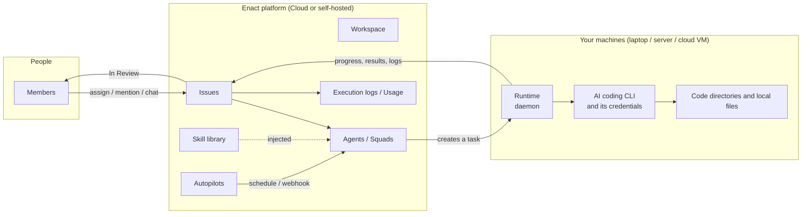

# Enact — Product Overview

**Make humans and AI agents work as one team.**

> For business and pre-sales audiences · **English | [简体中文](Enact-Product-Overview.zh.md)** · Written against what is actually in the codebase

---

## 1. One-page summary

**What Enact is.** A work management platform that puts AI agents and human colleagues in the same workspace. Here an agent is not a tool in a chat box but a teammate with a name, a permission scope, and the ability to be assigned work: it picks up an issue, runs on your own machine, reports as it goes, and moves the work to *In Review* for a human to accept.

**Who it is for.** Teams and enterprises already using Claude Code, Codex, Cursor and similar AI coding tools who have found the output hard to manage, hard to reuse, and hard to account for — engineering, data, consulting delivery, and any knowledge work that needs background understanding, collaboration, and a final acceptance step.

**Three sentences of value.**

1. **It turns scattered agents into a manageable team.** Task, context, decisions, execution records and deliverables all hang off the same work record, so nothing has to be re-explained when the work changes hands.
2. **Your code and data never leave your machines.** Enact ships no model; it drives the AI coding CLIs you have already installed and authenticated. Execution happens on your own computers or servers — the platform only coordinates task state and broadcasts events.
3. **Nothing ships without a human saying yes.** Agents deliver as far as *In Review*; acceptance stays with people. Every run, every command and every cost is replayable and attributable.

**Three differentiators.**

| | |
|---|---|
| **Agents as teammates** | They have avatars, profile pages and access scopes; they can be made assignee, and they can open issues and hand work to others. A Squad is a mixed team of people and agents led by an agent |
| **Your machines, your boundary** | Self-hosted (Docker Compose / Kubernetes), any Git host, isolated per workspace, authorized per agent. The data boundary is identical in Cloud and self-hosted |
| **Methodology as product** | Enact packages an entire delivery methodology as a runnable governance layer: the **AI-SDLC governed delivery suite** — nine agents, one object model, five human approval gates, nine deterministic validators, shipped with the server and provisioned per workspace. See section 6 |

---

## 2. The problem customers have today

AI coding and analysis tools went mainstream over the past year. The bottleneck is no longer "can the model do it" but **the output cannot be managed**.

- **Context is scattered across sessions.** Every tool lives in its own terminal tab or chat window and forgets everything when the session ends. The same business background gets re-explained several times a week.
- **There is no audit trail.** The work got done, but who asked for it, what changed along the way, on what basis, and which step a human actually signed off on — none of that can be reassembled afterwards.
- **Nothing accumulates.** The prompts and working methods one person tuned stay on their machine; everyone else starts from zero.
- **There is no acceptance gate.** Either nobody dares delegate, or work is delegated with no structured checkpoint that can stop output which merely *looks* finished.
- **The more you use, the busier you get.** Each additional agent is one more window to babysit. Capacity is not freed, only relocated.

For an enterprise these collapse into one problem: **work produced by AI has not entered the organization's existing management, audit and accountability system.**

That layer is what Enact adds.

---

## 3. What Enact is

Enact is a **system of record and action for people and AI agents working together**.

It does not produce models and does not replace your AI coding tools. It adds a management layer on top of them: task queue, team collaboration, capability reuse, runtime monitoring, cost visibility, and human acceptance.

### 3.1 Product landscape



One full execution chain:

1. **The issue supplies context** — objective, background, attachments, discussion, linked repositories and directories.
2. **Enact creates a task and queues it** — if no runtime is online, the task waits in the queue.
3. **An online runtime claims it** — a runtime is your own machine plus the AI coding CLI on it.
4. **The AI coding tool executes locally** — reads the working directory, runs commands, produces results.
5. **Results are written back** to the issue timeline and the execution log — progress, comments, deliverables and failure reasons all attached to the same work record.

> Agents never start on their own. Every run is triggered by an explicit action: assigning an issue, an @-mention in a comment, a direct chat, or an automation rule.

### 3.2 Core objects

| Object | In one line |
|---|---|
| **Workspace** | The isolation boundary for a team; all work and configuration live inside it |
| **Issue** | The atomic unit of daily work: context, assignee, status, discussion, execution history. The assignee can be a member, an agent or a squad |
| **Agent** | A reusable configuration: name, instructions, model, skills, access scope, runtime. Not a resident process — it runs only when triggered |
| **Skill** | A reusable capability pack. Instructions define *who this agent is*; a skill defines *how this kind of work is done*, shared across agents |
| **Resource** | A GitHub repository or a local directory the workspace's agents run against; it enters the context of every run |
| **Artifact** | A file an agent run produced, kept on the issue or chat that produced it, sub-issues included, with every version kept |
| **Runtime** | Where execution actually happens: a connected machine plus the AI coding CLI on it |
| **Task** | One concrete agent run: queued → claimed → started → completed or failed, with results written back to the issue |
| **Squad** | A mixed team of people and agents, led by an agent who assigns the work |
| **Chat** | Conversation without an issue; each message triggers a run |
| **Inbox** | The member notification centre — it only interrupts you when a decision is needed |
| **Autopilot** | A run triggered by a schedule or an event |

---

## 4. Core capabilities

### 4.1 Agents as teammates

An agent is a configuration, not a resident process. It defines: name and description, instructions, bound skills, runtime, model and thinking level, access scope, environment variables and credentials, MCP servers. Three ways to create one: from blank, from a template, or **generated by AI** — describe the role you want in a few sentences and the configuration is produced. Agents can also be created from the CLI.

**Four trigger paths**, covering how teams actually collaborate:

| Path | When |
|---|---|
| Assign an issue | Hand work over the way you would to a colleague |
| @-mention in a comment | Pull it into a discussion already under way |
| Direct chat | Ad-hoc questions or delegation without creating an issue |
| Autopilot | Daily reports, sweeps and weekly summaries that run themselves |

**Access is a layer of authorization independent of the workspace role.** Each agent has an owner and an access setting: only me (default), the whole workspace, or named members. Workspace `owner` and `admin` can see and manage all agents but **cannot bypass Access to run someone else's private agent**; only the owner can change it.

**Squads** give complex work an explicit dispatcher. The leader must be an agent; members can be agents or people. When an issue is assigned to a squad only the leader is queued: it receives the squad roster and an operating protocol, delegates by @-mention, records an evaluation entry on the timeline, then stops and is woken when a delegate replies. The leader can push the parent issue only as far as *In Review* — `done` is reserved for human confirmation or a merged PR with close intent.

### 4.2 Work management and human acceptance

An issue is a persistent work record; a task is one concrete agent run. One issue can produce many tasks over time — first implementation, follow-up changes, another review — and each leaves a new record without overwriting the previous one.

**Five built-in status categories**, each of which a team can rename with its own custom statuses:

| Category | Platform behaviour |
|---|---|
| `backlog` | Parked. Assigning an agent does not start execution |
| `todo` | Queued. Assigning an agent starts execution immediately |
| `in_progress` | In flight. If a run fails and no other run is active, the issue returns to `todo` |
| `in_review` | Delivered, awaiting checking. Ends autopilot runs; earlier failure notifications are auto-archived |
| `done` | Complete. Counts towards parent issue progress |

Custom statuses only change names; the platform always acts on the category — so a status called "Code Review" under `in_review` behaves exactly like `in_review`.

**Acceptance stays with people.** Agents write status based on the work's actual effect on the issue: `in_progress` as soon as they start producing, `in_review` once delivered. `done` is normally left to human confirmation, or completed by an integration such as a merged PR with close intent. Work enters review, not `main`.

**Sub-issues support stages**, advancing in batches of 1, 2, 3; when every sub-issue in the earliest incomplete stage finishes, an agent assignee on the parent is woken to decide whether to advance.

**Quick actions** freeze a frequently used "this agent plus this prompt" combination into a one-click action from any issue sidebar.

### 4.3 Accumulating capability

**Skills are the team's operating manual.** A skill is a `SKILL.md` plus supporting files (references, templates, scripts). Written once, shared by every agent in the workspace. Changing a definition means changing one line of text and it takes effect on the next run — **no deployment, no code**.

Three ways in: write it, import from a URL (GitHub / ClawHub / Skills.sh), or copy from a connected runtime. Imported skills support version updates and bulk upgrades, can be organized by tag, and are distinguished as workspace-level or repository-level.

**An MCP server library** is maintained at the workspace level and assigned and toggled per agent.

**Plugins** are published within a workspace, installed at a specific version, and require per-scope consent at install time: read/write issues, read/write comments, read/write agent tasks, read agents, read members, per-member storage, workspace storage, network egress to a named domain. The product's stated guarantee is explicit — **a plugin can only do what these permissions allow, and never exceeds the permissions of the person using it**. Uninstalling deletes the plugin's storage and secrets.

### 4.4 Runtimes and execution

**Enact ships no model.** It drives the AI coding CLIs you already have installed and authenticated, so switching providers is a dropdown, not a migration. Around two dozen mainstream tools are supported, including Claude Code, OpenAI Codex, Cursor Agent, GitHub Copilot CLI, Kimi, Qwen Code, Trae and DeepSeek Harness (full list in Appendix B).

- **The daemon auto-detects installed CLIs on first start** and registers a runtime for each. The desktop app does this automatically after login.
- Runtimes are grouped **local / remote / cloud** in the UI; private and public runtimes, per-agent concurrency caps and custom run commands are supported.
- **Task lifecycle**: queued → claimed → started → completed / failed / cancelled. With a runtime online tasks usually start quickly; a task queued for more than two hours without being claimed ends as failed.
- **Failures and automatic retries**: transient faults — a runtime briefly offline, a daemon restart, an execution timeout, a network interruption to the coding tool — trigger automatic retries (normally at most two attempts, three for tool network interruptions). Causes that need a human, such as expired authentication, exhausted quota or misconfiguration, are not retried automatically; the run stops and tells you why.

### 4.5 Automation

Autopilots trigger on a **cron schedule, a webhook event, or manually**, with two output modes:

| Mode | Behaviour | Use for |
|---|---|---|
| **Create issue** | Creates an issue, then dispatches. If no runtime is online the task waits in the queue | Daily and weekly reports, and any routine work that needs a trace and a discussion |
| **Run only** | Produces a run whose result lands in run history. Skipped if no runtime is available | Sweeps and probes, lightweight routine actions |

Webhooks support event filtering and URL rotation; failures, pauses, deletions, run history and delivery history are all inspectable.

### 4.6 Observability and cost

- **Execution logs**: every tool call, command and error is timestamped and fully replayable.
- **Usage**: spend and tokens (input / output), run duration and task counts, by day and week, per agent and per issue.
- **Failure attribution**: reasons are split into platform-recorded codes and classified AI-tool errors, covering authentication, rate limiting, timeouts, providers, runtimes and the agent itself, each with a suggested remedy.
- **The inbox** only interrupts you when an agent needs a decision, not at every step.

---

## 5. Fitting into how the team already works

Enact does not ask a team to move house. It connects to where they already are.

**Chat (5 channels)** — Feishu / Lark, Slack, DingTalk, WeCom, Telegram. Bots are configured per agent, with DMs, in-group @-mentions, `/issue` and `/new` commands, file and audio attachment pass-through, session isolation and account binding; self-hosting is supported. *DingTalk, WeCom and Telegram are community-maintained.*

**Git hosting (4 kinds)** — GitHub (GitHub App, PR ↔ issue linking, merged PR sets `done`, CI status write-back), plus self-hosted Forgejo / Gitea / GitLab connected per workspace.

**Clients**

| Client | Status |
|---|---|
| Web | Primary surface |
| Desktop | macOS / Windows / Linux; after login it starts a built-in daemon and registers the machine as a runtime; per-workspace tab groups, in-app updates, can connect to a self-hosted instance |
| iOS | Must be built from source on a Mac with Xcode; **not on the App Store**. A PWA add-to-home-screen path also exists. No Android client |
| CLI | The `enact` binary covers workspaces, issues, agents, skills, squads, autopilots, runtimes, resources, repositories, attachments and authentication |
| API | Anything clickable in the UI is callable through the API |

**Agents drive Enact through the same CLI a human uses.** This sets the ceiling for automation: an agent can open its own issues, link its own PRs, and hand work to another agent.

**Languages**: the product UI ships in Simplified Chinese, English, Japanese and Korean.

---

## 6. AI-SDLC: turning a delivery methodology into a governance layer that actually runs

This is Enact's most important difference from a general collaboration platform. A general platform answers *where the work happens*. It does not answer **to what standard the work is done, who signs off at each step, and why anyone should believe the result**.

Enact's **AI-SDLC governed delivery suite** is the executable implementation of a complete methodology: nine agents, an object model, a state machine, five human approval gates and nine deterministic validators. It ships inside the server binary and is provisioned per workspace — not a demo, something that runs as installed.

This chapter is organized as *what the methodology says → how the suite implements it*, item by item.

### 6.1 Where the methodology comes from

The authoritative document is the **Enterprise Work Intelligence Platform — Product & Functional Specification v0.2** (18 August 2026), held in this repository. Its one-line definition:

> A cross-domain enterprise work intelligence foundation platform: it composes traceable facts, governed capabilities and external AI runtimes into configurable Agent Families, so that every piece of work — from intent through execution, verification, decision and learning — is controllable, explainable and reusable.

**It states explicitly that it does not solve "can the model do it" but four enterprise problems:**

| Enterprise problem | Platform responsibility | Observable result |
|---|---|---|
| AI does not know which facts are trustworthy | Provide source, version, scope of validity and human confirmation status | Answers and deliverables trace back to a definite source of fact |
| Capability is scattered across prompts and individual experience | Treat Ontology, Skill, Tool, Policy and Eval as versioned assets | The same capability is reusable across teams, projects and runtimes |
| AI executes fast but with fuzzy boundaries | Assemble objective, writable scope, available tools, forbidden actions and escalation conditions into the workspace | The runtime executes within explainable permissions and change scope |
| People can only read large volumes of output and then decide | Organize runs, tests, approvals and exceptions into an Evidence Case | The accountable person accepts, returns or stops work based on evidence |

**Its logical architecture is "one experience, three governance layers":**

| Layer | Owns the truth about | Core outputs | Must not overstep |
|---|---|---|---|
| **Intelligence Space** | Project and domain facts, versions, sources, validation and relations | Artifact, Revision, Source Link, Context Index | Must not auto-promote unvalidated experience into global capability |
| **Capability Hub** | Reusable capability assets and their lifecycle | Ontology, Skill, Tool, Policy, Eval, Capability Bundle | Not responsible for task orchestration or runtime sessions |
| **Enact** | Task state, agent configuration, execution, gates, evidence and learning candidates | Work Item, AgentSpec, Context Bundle, Evidence Case, Lesson Proposal | Must not become a new island of facts; domain facts return to the Space |

**The methodology is equally explicit about what it does not do**, which matters just as much in a customer conversation:

- It does not reimplement general runtimes such as Codex or Claude Code, and does not automate desktop GUIs.
- It does not require everyone to move onto a single project board; chat, IDE/CLI and existing systems remain primary entry points.
- It does not copy all raw knowledge into the platform; Confluence, Jira and Git can remain authoritative sources.
- **It does not allow an LLM to declare a gate passed**; critical gates are decided by deterministic rules and explicit human authorization.

**Strategic boundary**, in the specification's own words: if the product becomes "another agent builder, another runtime or another project board" it is easily replaced; if it becomes the governance layer for enterprise facts, capabilities, evidence and work families, then **the stronger general agents get, the more valuable the platform becomes**.

### 6.2 The concept model, mapped item by item

Section 5 of the methodology defines a unified concept model and requires that "all subsequent user stories, APIs and pages reference these objects." The suite lands each object as a file on disk. This table is the heart of the chapter:

| Methodology object | Meaning | Form in the suite | Status |
|---|---|---|---|
| **Space** | Fact container for a project, method or domain | The `.sdlc/` directory plus the project repository and docs | ✅ Implemented |
| **Artifact** | A fact or deliverable with an identity | Each artifact file under `.sdlc/` | ✅ |
| **Revision** | An immutable version of an artifact | A git commit | ✅ |
| **Artifact Change Proposal** | A candidate revision | `amendments/AMD-###.md` | ✅ |
| **Merge Decision** | Approval, hold or rejection of a candidate revision | The approval record in `gates/*.yml` | ✅ |
| **Work Item** | A tracked piece of work | `work-items/WI-###-slug/work-item.yaml` | ✅ |
| **Execution Contract** | Verifiable intent and boundary | `contract.yaml` | ✅ |
| **Capability Asset** | A governed asset reusable across agents | The suite's own references, templates and scripts | ✅ |
| **Capability Bundle** | Version-pinned capability set for one task | The templates and checklists a run actually referenced (`capability_bundle_pinned` event) | ✅ |
| **AgentSpec** | Declaration configuring a general runtime for a specific responsibility | Each `sdlc-*` skill's `SKILL.md` | ✅ |
| **FamilySpec** | The stages, handoffs and gates of a class of work | `.sdlc/family.yaml` | ✅ |
| **Experience Pack** | Domain Guide / Canvas / Review / Report | Each skill's interaction conventions plus HTML generated by `render_review.py` | ⚠️ Partial: six fixed renderers, not a general rendering framework |
| **Context Bundle** | Snapshot of the context a run actually received | The files and versions a run actually relied on | ✅ |
| **Evidence Event** | An authoritative fact event from a stage | Each line of `evidence.jsonl` (append-only) | ✅ |
| **Evidence Case** | Evidence assembled for a human decision | `evidence-case.md` | ✅ |
| **Gate Decision** | Stage decision from deterministic rules plus human authorization | `gates/<name>.yml` | ✅ |
| **Lesson Proposal** | Experience identified but not yet promoted | `lessons/LP-###-slug/lesson.md` | ✅ |

**All state is files — `git diff`-able, reviewable in a PR, auditable offline. No database, no reliance on session memory.** This is the suite's most direct answer to the methodology's traceability requirement: an audit needs access to no system at all, because `git log` *is* the audit trail.

### 6.3 Stage structure and the nine agents

The methodology's recommended stage structure is **Intake / Enact → Explore → Design & Contract → Build → QA → Release → Operate & Learn**, and it stresses: *keep the familiar lifecycle, do not invent a new pipeline; what actually changes is the explicitness and evidence machine execution requires.*

The suite assigns one agent per stage plus a cross-cutting leader, forming a serial squad:

| Stage | Agent | Exit artifact | Exit gate |
|---|---|---|---|
| Intake / Enact | **SDLC Intake** — registers work, reports status and metrics | `work-item.yaml` | None (but an owner is required to proceed) |
| Explore | **SDLC Explorer** — converges facts, assumptions, scope and open questions | `exploration.md` | Self-check list + business owner review |
| Design & Contract | **SDLC Contract** — produces the contract, EARS criteria and design | `contract.yaml` | **contract-approval (human)** |
| Build | **SDLC Builder** — implements only inside the approved scope | `change-scope.yaml` + `ledger.md` + `build-evidence.md` | **scope-expansion (human, on breach)** + **build-review (human, before QA)** |
| QA | **SDLC QA** — independently freezes test intent, verifies and attributes | `test-plan.yaml` + `qa-report.md` | Coverage self-check (deterministic) |
| Release | **SDLC Release** — pre-flight checks, assembles the evidence case | `evidence-case.md` | **release (human)** |
| Operate | **SDLC Operator** — diagnoses incidents and routes root cause upstream | `incident.md` | Incident closure self-check |
| Learn | **SDLC Learner** — governs the lesson lifecycle | `lesson.md` | **lesson-approval (human)** |
| Cross-cutting | **SDLC Orchestrator** (leader) — scheduling, audit, acceptance, routing | Produces no deliverable | None |

**Each agent's boundary is hard** and written into its own definition: Intake makes no cross-work-item judgements; Explorer writes neither the contract nor code; Builder does not carry independent QA; QA does not fix business implementation; Release neither deploys nor self-signs; Operator turns fixes into new work items instead of patching in place.

**Two lanes.** The methodology warns that "all capabilities plus a short timeline" cannot both hold; the suite's answer for small changes is the `lane` field: `full` (all eight stages) and `quick` (compressed transitions). **Ceremony scales with the task; approval gates never scale.** The quick lane still requires a contract (possibly with only two criteria), a change scope, a release decision and a gate record. What is dropped is length, not the chain of accountability.

### 6.4 Three redlines, and the methodology clauses behind them

The suite writes the three rules most easily dissolved by "this time is special" in non-negotiable form:

```
NO GATE PASSAGE WITHOUT A HUMAN APPROVAL RECORD
NO TEST EXPECTATIONS DERIVED FROM IMPLEMENTATION
NO WRITES OUTSIDE THE APPROVED CHANGE SCOPE
```

**Violating the letter is violating the spirit.**

| Redline | Methodology clause | How the suite enforces it |
|---|---|---|
| No gate passage without a human approval record | §03 "does not allow an LLM to declare a gate passed"; §11 "an LLM may gather, explain and surface evidence, but may not declare a critical gate passed" | `validate_gate.py` checks that `approved_by` is non-empty and not `AI` / `Claude` / `system`. AI may gather, explain and recommend — **not sign**. "Do whatever you think" authorizes progressing the work, not signing. An old approval does not carry over to a modified version |
| No test expectations derived from implementation | §02 "QA is not reverse-engineering tests from the implementation"; §15 "test design is generated independently against the Contract; the implementation may influence how tests run but must not determine expected results" | **Structural isolation**: a separate QA agent — or a subagent with a fresh context — freezes test intents from a payload containing only the contract, under the hard constraint that it must not read any implementation code. Only after freezing may implementation be read, to bind endpoints, fixtures and locators |
| No writes outside the approved change scope | §14 "the runtime may understand the whole system but may only change it within explicit write and action boundaries" | `check_scope.py` compares the `git diff` file list against the whitelist. The stated rationale: *AI can change dozens of files at once, and human review bandwidth has not grown to match. The scope boundary is what makes review possible at all* |

**Written waivers.** An unavoidable violation may be waived, but it must pay a written price: which redline, why it was unavoidable, what was done instead, what compensating record exists, and by when. **"Waived" and "passed" are different things in statistics and in an audit**; a violation that skips this process is simply a violation.

Three supporting rules: an upstream gap must not be patched downstream (raise an amendment); experience must not automatically become standard; no factual conclusion without a trustworthy source.

### 6.5 The Execution Contract: how far "machine-checkable" actually goes

The methodology defines the Execution Contract as *not turning natural-language requirements into more words, but turning objectives, acceptance criteria, boundaries, applicable capabilities, open questions and points requiring human judgement into a machine-checkable object.*

The suite's `contract.yaml` is **immutable once approved**; changes go through an amendment. Four blocks, each with a defined audience:

| Block | Contents | Primary readers |
|---|---|---|
| **Business statement** | `outcomes` / `requirements` / `criteria` / `scope` | Business owner, product, QA |
| **Technical design** `design` | `approach` / `diagrams` / `decisions` / `impact` / `nfr` | Architecture, development |
| **Change boundary** `boundary` | `may_change` / `must_not_change` / `allowed_actions` / `escalation` | Development, architecture |
| **Release and operations** `release` | `strategy` / `rollback` / `rollback_data_state` / `monitoring` / `support` | Operations, release authority |

**Why it is one file** — three reasons learned in practice: a separate `design.md` becomes a second hand-written truth (only `contract.yaml` is hand-written; the human review page is rendered from it); letting Build define the change scope means letting the executor draw its own boundary; and a rollback plan that first appears at Release comes too late — **some approaches simply cannot be rolled back, and that should have influenced the technical choice at contract time**.

`criteria` carries three hard requirements that QA depends on entirely:

1. **EARS syntax**, five patterns: `The system SHALL <behaviour>` (ubiquitous); `WHEN … THEN the system SHALL …` (event); `WHILE … the system SHALL …` (state); `WHERE … the system SHALL …` (optional feature); `IF … THEN the system SHALL …` (unwanted behaviour).
2. **Hierarchical numbering** (`1.1`, `2.3`) — the numbering is the suite's connecting coordinate; tasks, test intents and evidence all align through it.
3. **Independent verifiability.**

**Open questions must be closed.** The methodology states that "only when critical open questions are explicitly accepted or closed can the Contract become Approved; a finished document is not a finished design." The suite turns every open question from Explore into a contract `open_decisions` entry, each of which must be either explicitly accepted (with a stated risk) or closed (with an answer).

**Amendments and defects are cleanly separated**, which turns out to matter a great deal in practice:

| | Amendment (AMD) | Defect (DEF) |
|---|---|---|
| Says | The contract was wrong or unclear | The contract was right; the code did not deliver it |
| Attribution | `requirement` / `design` | `implementation` |
| Returns to | Contract stage, needs a human ruling | Build stage, fix directly |
| Work item state | → `Contracted` or `Held` | → `Executing` |

Rejected amendments are retained as an audit trail and a source of lessons.

### 6.6 The Managed Change Area: five boundaries, five fields

Section 14 of the methodology defines five boundaries for the Managed Change Area and, importantly, **who confirms each**. The suite's `change-scope.yaml` implements them one for one:

| Methodology boundary | Definition | Who confirms | Suite field |
|---|---|---|---|
| Read / discover | Service catalogues, code, designs, history and dependencies that may be queried | Project policy + resolver | `read` (usually the whole project) |
| Write | Paths modifiable this time, and where new content lands | Agent proposes; developer/lead confirms by risk | `write` (explicit path whitelist, narrow) |
| Protected | Read-only directories, shared interfaces, data models, infrastructure and security configuration | Organization/project policy | `protected` |
| Tool actions | Available tools, commands, network, credentials, environment and budget | AI engineer + project authorization | `tool_actions` (allowed / forbidden + `environment` + `credentials`) |
| Escalation | Conditions that trigger a stop, a scope expansion or a human decision | FamilySpec + gate policy | `escalation` |

On top of these the suite adds a field the methodology does not list separately: **`read_excluded`** — paths never read into context even when inside `read` (keys, credentials, `.env`, real personal data), inherited from the project-level `data_policy.never_read`. The reasoning is practical: **write protection is not read protection**. A `.pem` sitting inside a `protected` directory is still readable, and only this field stops it.

The core principle is **read wide, write narrow**. Unlisted sensitive areas default to protected: shared interfaces, data models, infrastructure, security configuration, CI configuration.

**Two boundary layers, with the containment checked by script**: the intent layer (the contract's `boundary`, written by Contract) ⊇ the file layer (`change-scope.yaml`, written by Build); `check_scope.py` verifies the latter is a subset of the former.

**A breach stops the run.** The methodology's acceptance example reads: *when a change touches an unapproved directory or requires an unauthorized tool, the runtime must stop and give a reason for expanding scope; once confirmed, a new version of the Change Scope and Context Bundle is produced and execution continues.* The suite records that stop as a `boundary_stop` event — **it is the proof that the boundary is actually working**, and the methodology lists it as one of the pilot's definition-of-done criteria.

### 6.7 Independent QA: from "the code looks fine" to "the approved intent holds in the target environment"

Section 15 of the methodology, verbatim: *testing is not proving the code looks fine, it is proving the approved intent holds in the target environment.*

**Two work lines**, both fully implemented:

| Work line | Input | Output |
|---|---|---|
| Conventional verification | Execution Contract + environment/data + implementation | Test design, execution, defects, regression and report |
| Evidence assurance | Contract + build evidence + runtime trace references | Coverage gaps, broken links, error attribution, unauthorized actions, inconsistencies |

**"Freeze first" is structure, not attitude.** The methodology requires generating test intents from approved criteria, freezing expected behaviour, and only then reading the implementation to bind endpoints, fixtures, locators and environment. The suite implements this by having an independent QA agent — or a subagent with a fresh context — perform the freeze from a payload containing only the contract, with the constraint written into the payload: **do not read any implementation code**. If a criterion is too abstract to derive an observable expectation, do not guess — list it under `unverifiable` and state what is missing.

The suite also ships an **excuse table**, every line of which happens in real life:

| Excuse | Reality |
|---|---|
| "Let me run the existing tests first and see what breaks" | You have just defined expectations from the implementation's current behaviour. The failing ones may be the only ones that were right |
| "Spinning up a subagent is a hassle; I can stay neutral myself" | You cannot. The implementation is already in your context. **Isolation comes from structure, not from discipline** |
| "There are already unit tests; I'll reuse them" | Those tests are the implementation's self-attestation. Run them — that is regression — but they **count as coverage for no criterion** |
| "This criterion is too abstract; let me see how the implementation reads it" | The implementation's reading may be exactly the defect. A criterion too abstract to test is a contract defect — raise an amendment |
| "This class takes 40 minutes to run; skip it this time" | Cost is not a reason to skip a gate test. Skipping requires a named person accepting the risk and a gate record |

**Failures must be attributed to the right source**: requirement/contract defect, design defect, implementation defect, environment/data problem, or test problem. **An environment that is not ready is not a failure, it is a blocker** — record it as `blocked`, do not attribute it to the implementation, and do not paper over it with retries.

For compute-intensive testing the methodology defines six execution classes with default scheduling (fast deterministic, integration, browser, cross-service/release, heavy specialized, human/subjective) and rules that **cross-service and release classes are mandatory before a gate and may not be silently skipped for cost**; the suite lands this as a "non-deferrable classes" setting in project configuration.

### 6.8 Three layers of evidence: nobody should have to read the event stream

Section 11 of the methodology defines three evidence layers and their audiences. The suite implements each:

| Layer | Contents per the methodology | Audience | File in the suite |
|---|---|---|---|
| Runtime trace | Tool calls, commands, files, tokens, errors | Engineering troubleshooting and audit | Session records, command output, test logs |
| Evidence event | Input versions, action, output, check result, responsible actor | System correlation and deterministic rules | `evidence.jsonl` (append-only) |
| Evidence case | Objective coverage, exceptions, failures, approvals, ops/rollback readiness | QA, release authority, business owner | `evidence-case.md` |

**The design goal is stated plainly: no one is required to read the event stream in order to decide.** The methodology puts it as "the system keeps the full evidence chain internally; people are shown a single Evidence Case organized around the release decision" — engineering traceability and customer comprehensibility can hold at the same time.

The event stream is append-only: **never modified, never deleted, never reordered**. The controlled action vocabulary runs to roughly two dozen verbs, of which `boundary_stop` (a breach was stopped), `test_intent_frozen` (when expectations were fixed), `capability_bundle_pinned` (which capability versions were used), `gate_decided` and `phase_reviewed` are the ones audits reach for most.

**One hard rule worth raising with a security team: no secrets in evidence.** The event stream and ledger are permanent, git-tracked and PR-reviewable, and every rule encourages never deleting — *a governance mechanism will turn one slip into a permanent leak*. So notes and references are redaction-checked before writing; on a hit the value is written as `[redacted]` and the result set to `blocked`; raw command output is never pasted.

**The Evidence Case has fixed sections**, so the accountable person finds the same thing in the same place every time: business objective and scope → contract coverage (per criterion: verification method, result, evidence) → interface compatibility → security and privacy → QA results → known exceptions → deployment and rollback → monitoring and support readiness → named approvals. **If a criterion is missing from the coverage table, pre-flight should fail.**

### 6.9 Gates: deterministic pre-flight first, human authorization second

The methodology's gate principles are three: an LLM may gather, explain and surface evidence but may not declare a critical gate passed; computable conditions are judged by deterministic gates while risk acceptance is decided by a named accountable person; a Hold must return the missing evidence or the source to fix, and a Reject must record the reason and the conditions for re-entry.

**The suite defines five gates that require human approval** — the methodology mandates three (contract, scope expansion, release) and the suite adds two of its own:

| Gate | Stage | Decides | Why it must be human |
|---|---|---|---|
| `contract-approval` | Contract | Whether the intent and boundary are right | Everything downstream is measured against it; if it is wrong, everything is wrong |
| `scope-expansion-###` | Build | Whether to allow changes outside the protected scope | An irreversible expansion of trust |
| `build-review` ⭐ | Build → QA | Whether the approach is right and worth entering QA | Added by the suite — see below |
| `release` | Release | Whether to accept production risk | Accountability must land on a specific person |
| `lesson-approval` ⭐ | Learn | Whether to harden an experience into a standard | Added by the suite — it affects all future work |

**⭐ The origin of `build-review` is the best story in this suite.** Before it existed, **nobody looked at the code between contract approval and the release decision**. Three reasons for adding it:

1. QA is the most expensive stage. A directional error caught here costs one build rework; caught after QA it costs a full QA round plus rework plus retest.
2. Deterministic checks cannot detect "wrong approach" — *a feature implemented with polling where it should have used events passes every mechanical check*.
3. "Verified" hardens judgement. Once QA passes, sunk cost makes people accept rather than question.

**It approves direction, not correctness.** The quick lane may compress the presentation to three lines, but the gate file and the named approver remain. Turning it off requires a named `self_check_decided_by` in configuration — *a human review that can be switched off without a signature is not a human review*. The `full` lane has no such switch.

**Two phases, order non-reversible**: deterministic pre-flight first (conditions a script can judge; on failure it produces a gap list and **does not enter the human step** — *do not spend someone else's judgement on something you already know is incomplete*), then human authorization (a named person accepting the risk).

**A four-value controlled vocabulary**, no variants:

| Value | Meaning |
|---|---|
| `PASS` | Passed |
| `CONCERNS` | **Not a polite way of saying "close enough"** — I have seen these issues, I accept them, and I know who owns each. **An issue with no owner is not CONCERNS, it is FAIL** |
| `FAIL` | Both Hold and Reject land here, distinguished by whether re-entry conditions have a value: empty for Hold, mandatory for Reject |
| `WAIVED` | A violation that went through the written waiver process |

**`PENDING` is deliberately excluded from the vocabulary**: waiting for approval is expressed by **the file not existing yet**. No placeholder files, no empty approver field, no vocabulary value filled in "to complete the flow." Waiting is recorded in the work item's `blocked_by`, in a `boundary_stop` event, and in the approval request itself.

**The five roles are also a controlled vocabulary that cannot be invented** — a role is both a view and a permission:

| Role | Accountable for | Which contract blocks to read |
|---|---|---|
| Business owner | Business outcome and acceptance criteria | outcomes, requirements, criteria, scope |
| Architecture | Approach, change boundary, technical decisions | design, boundary, policies |
| Development | Implementation approach | criteria, design, boundary |
| QA | Sufficiency of verification | criteria, scope, design.impact, release.rollback |
| Operations | Release, rollback, monitoring | release, design.nfr, design.impact |

Contract approval requires three roles signing together, which was discovered in practice: with only business owner and architecture, the release-strategy-and-rollback block **falls into no signer's field of view**. The validator now enforces it — the roles signing contract approval must, between them, cover every block of the contract. One person holding several roles is normal and is recorded as **one record with multiple roles**, not split into three to pretend three people looked.

**The approval request protocol has three rules**: ask the right people (name each required role and tell each which blocks to read — do not make them guess); use fixed wording (for the release gate: "The evidence case is ready. Please give Release / Hold / Reject."); and **accept only explicit affirmation** — "looks good", "should be fine", silence, and an earlier "up to you" all do not count. Any change to the artifact requires re-approval, because *what they approved was the version they read*.

**The presentation format is fixed**: what is being decided / deterministic pre-flight (N passed, N failed) / key contents (3–5 bullet summary, not a full paste) / known issues / what happens if it passes / what happens if it does not / please give one of these options. *The accountable person needs organized decision material, not raw material.*

**Review ≠ gate.** The suite also defines non-blocking reviews for eight phases, answering "has anyone actually looked at this"; a gate answers "has anyone accepted this risk." *A gate is a transfer of risk, not a receipt for having read something.*

### 6.10 State machine and rollback

Section 10 of the methodology gives a minimal state machine and requires that "any return must state which stage it returns to, what is missing and who handles it, and must retain the old version." The suite implements it one for one:

```
Proposed → Exploring → Contracted → Planned → Executing → Verifying → Decision → Completed
                                                          ↘ Held    ↘ Cancelled
```

Each transition has a deterministic entry condition: `Exploring` requires an owner; `Contracted` requires a valid contract approval (PASS with a named approver); `Verifying` requires build evidence in place **and** a valid build review; `Completed` requires the release gate to be PASS.

**`Held` is not failure, it is honesty.** An unreachable approver, an external dependency not ready, a tripped circuit breaker, a contract gap awaiting an amendment — all go to Held. Entering Held requires stating what is blocking, who is blocking, since when, and where it returns to once unblocked. **A Held missing any of these is "stuck with nobody knowing what to do", which is equivalent to losing the work.**

**Circuit breaker**: after three different approaches to the same problem have failed, stop; record all three in the ledger and go to Held. *There are only two legal terminal states: complete, or a recorded blocker. "Probably fine", "mostly works" and "should be OK" are not among them.*

**Six rollback paths** are explicit, including one that is easy to overlook: `Decision → Cancelled` (rejected and should not be done). *Without that exit, a judgement of "this should not be built" can only be written as an Exploring state that never returns.*

### 6.11 Operate and the learning loop

Section 16 of the methodology requires writing production facts back into the same chain of intent and evidence, and defines a six-stage lesson lifecycle with an owner per stage. The suite's implementation:

| Stage | Platform action per the methodology | Owner per the methodology | Suite implementation |
|---|---|---|---|
| Observe | Generate candidate lessons from clarifications, failures, exceptions, rework and successful patterns | Enact | Any stage that spots one registers `lessons/LP-###/` and fills only section 1 |
| Classify | Decide whether facts, ontology, skill, policy, template, eval or tool should change | Domain expert / AI engineer | Seven change target kinds: project-doc / template / checklist / policy / eval / tool / skill |
| Validate | Validate scope of validity against historical cases, counter-examples and regression sets | AI engineer / QA | `scope_of_validity` + `counter_examples`; **a lesson whose boundary cannot be stated does not advance** |
| Approve | Confirm benefit, risk, scope and version | Capability steward | **The `lesson-approval` human gate** |
| Publish | Create a new version; record which families/bundles may adopt it | Capability Hub | `target_version` / `published_version` / `adoption_scope` |
| Observe again | Monitor effect; roll back or retire | AI QA / platform ops | An `observation` field, rollbackable; rejected lessons are archived, not deleted |

**The closure requirement**, in the methodology's words: *"retrospective complete" is not the end. Only when experience has been validated, approved and entered a governed asset does the next execution actually get better.*

The incident side aligns too: an incoming incident is linked to the current release, work item, artifact revision and evidence case; once root cause is confirmed, the suite **locates the upstream object that should change** (contract, interface rule, test standard, skill or policy) rather than submitting only a downstream patch; the fix enters the same family as **a new work item or amendment**, retaining the original version and the incident relationship.

**Memory tiers** are a mechanism the suite adds on top of the methodology, answering one question: may this content be cited as fact?

| Tier | What it is | Citation rule |
|---|---|---|
| `released` | Approved contracts, completed work items, observed lessons | May be cited directly as fact |
| `current work` | All artifacts of an active work item | May be cited, but with the work item number noting it is still in progress |
| `experimentation` | Exploration assumptions, accepted open decisions, lessons not yet approved | **Must be labelled as an assumption when cited; must not be written as fact** |

The reasoning is specific: the redline stops unvalidated experience from becoming standard, but not the subtler path where it gets cited as established fact in the next work item's exploration.

### 6.12 Metrics: do not look only at tokens

Section 19 of the methodology is explicit: *look at lead time, first-pass rate, rework, defect escape, gate wait, context failures, human approval burden, asset reuse and running cost together. Individual performance must not be derived from token usage or AI adoption rate.*

The suite's `metrics.py` computes eight metrics from files that already exist: lead time, first-pass rate, rework, defect escape, gate wait, human approval burden, context failures, asset reuse. **The raw material is already there; it just needs computing.**

Two qualifications worth reproducing verbatim:

- **Running cost is not among them**, because tokens and elapsed time do not live in the governance directory. If it cannot be computed it is not listed — *listing a metric you cannot compute makes the reader think they failed to find it.* (Cost visibility is provided by the Enact platform's usage dashboard; see 4.6.)
- **These numbers describe the delivery system, not a person.** High rework usually means the contract was not clear enough — an upstream problem. Long gate waits usually mean approvers are overloaded — a scheduling problem. **None of them may be used to derive individual performance**, and token consumption or AI adoption rate may not be substituted for them, because those measure *how much AI was used*, which is unrelated to *how well the work was delivered*.

### 6.13 Nine deterministic validators

Governance that relies on discipline alone decays by week three. The suite scripts everything mechanically decidable, all in the Python 3 standard library, with **no network access**:

| Script | What it decides |
|---|---|
| `sdlc_init.py` | Initializes the governance directory skeleton and project config |
| `new_work_item.py` | Allocates the number, creates the directory, instantiates templates (manual numbering collides; manual directories miss files) |
| `validate_gate.py` | Gate YAML vocabulary, required fields, and that the approver is non-empty and not an AI |
| `check_scope.py` | `git diff` file list vs the change-scope whitelist |
| `coverage_stats.py` | Criterion ↔ task ↔ test-intent coverage and gaps; also enforces that contract-approval signers' role views cover the whole contract |
| `wi_status.py` | Status, blockers and pending decisions across all work items |
| `metrics.py` | The eight delivery metrics above |
| `render_review.py` | Renders self-contained HTML review pages from artifacts |
| `sdlc_audit.py` | Record-versus-disk consistency: state ↔ artifacts, missing build review, empty evidence, gate ↔ state, overlapping scopes, dangling pointers |

One detail captures the attitude of the whole suite: the "history is append-only" check runs **against the committed git version**; outside a repository, or when the file is uncommitted, *this check does not run, and does not pretend to have run.*

### 6.14 The visual review layer: stopping "too much to read" from becoming a rubber stamp

Section 03 of the methodology lists "people can only read large volumes of output and then decide" as one of the four enterprise problems. The suite's answer is not only the assembled evidence case but a generated review layer.

The problem statement is blunt: **a gate that is too long to read degrades into a glance and a signature — and at that point the process is still there but the accountability is gone.**

`render_review.py` produces self-contained HTML with **exactly six renderers** (matrix, graph, path, tree, compare, report) — not an arbitrary low-code UI builder. Three design rules:

1. **Every layer must degrade to text** — nothing readable only via tooltip, only via colour, or only via a diagram.
2. **Inverted ink allocation** — normal cells are near-invisible; only anomalies carry ink. Gaps must be filled explicitly with a symbol rather than left blank, because a blank cannot be told apart from "not checked".
3. **The first screen answers three questions**: can this pass, what is still missing, who has to decide.

It is a **regenerable snapshot, not a portal to maintain** — the stated anti-goal is "degenerating into another Jira." This matches the methodology's own position in section 10: *a board is an optional projection of the work item, not the primary record and not a mandatory entry point.*

### 6.15 Against the methodology's pilot definition of done

Section 20 of the methodology gives four pilot completion criteria. This is the best checklist for judging whether any of this is actually usable:

| Methodology criterion | The suite's corresponding mechanism |
|---|---|
| A real business change enters as a request, becomes an approved contract, and completes a controlled change on a real runtime | Intake → Explore → Contract (human gate) → Build (change scope + ledger), running on a runtime connected to Enact |
| QA generates checks from the contract; the release authority can decide Release/Hold by reading only the Evidence Case | Structurally isolated test-intent freezing; fixed Evidence Case sections plus fixed release-gate wording |
| Fact versions, capability versions, tools and outputs used in a run are traceable; **out-of-bounds actions are blocked or escalated** | `capability_bundle_pinned` pins capability versions; `check_scope.py` plus the `boundary_stop` event |
| At least one valid Lesson Proposal is reviewed to publish or reject, with the reason retained | The six-stage lesson lifecycle plus the `lesson-approval` gate; rejected lessons are archived |

The methodology also states a **scope discipline** we recommend reproducing verbatim to customers: *"all capabilities in six weeks" cannot hold. Six weeks should promise only a demonstrable thin slice; the full module set belongs to the roadmap and must not be disguised as the same MVP.*

### 6.16 What is deliberately not implemented

The methodology's object model is larger than the suite. **The following are deliberately absent**, each with a reason. For enterprise evaluation this list is more valuable than a feature list:

| Methodology object / capability | Status | Reason |
|---|---|---|
| Ontology / Skill / Tool / Policy / Evaluation asset libraries (a full Capability Hub) | Not implemented | The suite's own templates and scripts play the Capability Asset role; a full asset library belongs to the platform layer, not a delivery suite |
| Context Recipe budgets and quotas | Not implemented | No token metering |
| Runtime adapter / multi-runtime failover | Not implemented | Carried by the Enact platform's runtime layer |
| Cross-work-item fact index / context resolver | Not implemented | Accepted cost: several work items will re-verify the same facts |
| Permission / tenant / identity system | Not implemented | Carried by git and filesystem permissions; **explicitly stated not to cover two things**: secrets entering context is handled by the data policy, and asset applicability by a lesson's adoption scope |
| **Board / kanban** | **Deliberately not built** | *Once a board exists it becomes a second record that has to be maintained* |
| **Delegated approval** | **Deliberately not built** | An unreachable approver means `Held`; there is no proxy-signing chain — *"it could not be sent" is cheaper than "it was sent but nobody is really accountable"* |
| Two-way Jira sync | Deliberately not built | External references store links only and never write back |
| Outward knowledge-space sync | Off by default | Writes out business-layer conclusions one way only; **the governance layer does not cross over** (work item ids, file paths, commit hashes and approvers' real names stay in this repository); the merge on the receiving side is decided by their people — this suite only files a proposal |

### 6.17 The same skeleton can carry your own methodology

Section 17 of the methodology concludes: do not force DevOps vocabulary onto other domains, and do not rewrite the platform for each domain. Work in different domains follows the same rhythm — **intent → explore → frame/contract → produce/act → verify → decide → learn** — but the interface, objects and reports a user sees must be decided by the domain.

For a customer this means two things:

1. The AI-SDLC suite is a complete instance of that skeleton for **software delivery**, usable as is.
2. The same skeleton can carry your own methodology. What it takes is writing "how this kind of work is done" as a skill, turning "who signs off at which step" into gates, and turning "why anyone should believe this result" into checkable evidence. **A methodology stops being a slide deck nobody reads and becomes something that will actually stop you when it runs.**

---

## 7. Security, compliance and the data boundary

The three questions enterprises ask first: does our code leave the building, what can an agent touch, and can we investigate afterwards. This chapter answers each — **including the parts that are not flattering**.

### 7.1 The data boundary

| Stored by Enact | Stays on your machine |
|---|---|
| Workspace, issues, comments and status | The AI coding tool and its credentials |
| Agent configuration and skills | Code directories and local files |
| Task state, execution records and results | Actual file modification and command execution |

**This boundary is identical in Enact Cloud and self-hosted.** Code never passes through Enact's servers; the platform only coordinates task state and broadcasts events.

> **One exception that must be stated**: anything saved into an agent's `custom_env` is stored **on the Enact server** and passed to the runtime at execution time. **Do not put a secret you do not want leaving your machine into `custom_env`.**

### 7.2 The isolation Enact does provide

These three are real, but they are positioned as **convenience and blast-radius reduction, not a security boundary against active escape**:

- **A separate working directory per task.** Concurrent tasks never fight over the same checkout.
- **Separate agent state per task.** A task-scoped tool configuration directory that does not pollute your own.
- **A task-scoped API token.** The token handed to a task is bound server-side to that agent and that task, so a task cannot act through the Enact API as you or as another agent.

### 7.3 What is not a boundary

Enact is unambiguous about this, and we recommend saying it to customers proactively:

- **The AI coding tool's own sandbox and approval settings are not a boundary.** Enact runs agents unattended, approval prompts are auto-answered, and on the default path the tool's filesystem sandbox is off. (Exception: on Windows, if you explicitly configure the Codex native sandbox, Enact honours that opt-in.)
- **The daemon user's `HOME` directory is not a boundary.** Tasks inherit the daemon user's real `HOME` — which is exactly why `gh`, `aws`, `kubectl` and `gcloud` behave inside a task as they do in your shell. It also means everything under that home is reachable.

In the product documentation's own words: **Enact does not do filesystem sandboxing for you. The isolation must come from the outer boundary you set for the daemon.**

This is a deliberate trade-off, and the reasoning is worth relaying: agents need to install dependencies, run builds and use cloud CLIs, all of which assume a normal home directory; a half-finished filesystem sandbox breaks them in hard-to-diagnose ways ("not logged in", or silently using the wrong account) **while still failing at the thing that matters most — it cannot stop a task reading credentials and sending them out over the network**. So Enact does not pretend to be that boundary and asks you to put one around it.

### 7.4 Recommended deployment patterns

In order from light to heavy; pick the one that fits your infrastructure:

1. **A dedicated Unix user.** Create an `enact` user, give it only the repositories and credentials agents need, and run the daemon as that user. Your own account is entirely unaffected.
2. **A container.** Run the daemon in a container with only the directories and secrets agents need mounted.
3. **A virtual machine.** The most complete isolation, at the cost of provisioning a machine.

Whichever you choose, treat every credential reachable in that environment as a credential the agent may use: narrow token scopes, prefer dedicated deploy keys over personal SSH keys, and keep unrelated production credentials out of that user's home directory.

**One practice you can cite directly** (from the official use case): an analytics agent connects to a **read-only replica** with a `SELECT`-only account. The replica means no query can affect production, and read-only means **even a successful prompt injection cannot write anything**.

### 7.5 The permission model

Three independent layers:

| Layer | Granularity | Notes |
|---|---|---|
| Workspace role | `owner` / `admin` / `member` | Governs workspace settings and team management only; creating issues and commenting are open to all members. A workspace must always retain at least one `owner` |
| Agent access | Only me / whole workspace / named members | Independent of role. `owner` and `admin` **cannot bypass it** to run an agent they are not authorized for |
| Plugin consent | Per scope | Issues, comments, tasks, members, storage, egress to a named domain; a plugin's permissions never exceed those of the person using it |

### 7.6 Auditability

- Every tool call, command and error is timestamped and fully replayable.
- Every status change records who wrote it and when, on the issue timeline.
- The AI-SDLC suite (section 6) adds an append-only evidence stream and approval ledger: never modified, never deleted, never reordered — `git log` is the audit trail.

---

## 8. Deployment and selection

| | Enact Cloud | Self-hosted Docker Compose | Self-hosted Kubernetes |
|---|---|---|---|
| Suits | A fast start, small pilots | Most enterprise self-hosting | Existing K8s platforms needing elasticity and unified operations |
| How | Sign up and go | One-line installer + `enact setup self-host` | Official Helm chart |
| Data boundary | Identical to self-hosted (see 7.1) | Entirely within your infrastructure | Entirely within your infrastructure |
| Where code lives | Your machines | Your machines | Your machines |
| Git hosting | GitHub / self-hosted GitLab, Gitea, Forgejo | Same | Same |

**The only prerequisite**: the machine running agents must have at least one supported AI coding CLI installed and signed in. **Enact drives them; it does not install them, and it ships no model.** That also means model cost, quota and compliance remain a relationship between you and your model provider — Enact does not sit in the middle.

Stack, for a customer IT review: Go backend, PostgreSQL 17 with pgvector, Next.js web, Electron desktop, and a local daemon on the execution side.

---

## 9. A landing path

We suggest a four-to-six-week pilot where every step has a verifiable success criterion, rather than "let's just start using it".

| Phase | What to do | Success criterion |
|---|---|---|
| **Week 1: connect** | Deploy (Cloud or self-hosted), connect one runtime, confirm the AI coding CLI is signed in, create the workspace, bring in 3–5 people | The runtime is online and a test issue is claimed and run end to end |
| **Week 2: one real thing** | Pick one real, well-bounded piece of work, assign it to an agent, and take it through `todo → in_progress → in_review → done` | A human performed a real acceptance at the review step, and the execution log makes what happened reconstructable |
| **Weeks 3–4: accumulate** | Write the approach up as your first skill; create one or two dedicated agents that reuse it; connect your team's chat channel | The second agent handles similar work without re-explaining the background, and changing one line of the skill changes behaviour |
| **Weeks 4–5: let it run** | Configure an autopilot (weekly report / sweep / daily report); open the usage dashboard for cost and failure attribution | Routine work no longer needs chasing; you can say what was spent this month, on what, and where it failed |
| **Weeks 5–6: adopt the methodology** (optional) | Run one real change through the AI-SDLC suite, or follow 6.17 to encode your own method | Against the methodology's pilot definition of done (see 6.15): the contract was approved, QA generated checks independently from it, the release owner decided from the Evidence Case alone, and **at least one out-of-bounds action was genuinely stopped** |

The last criterion is the most valuable: **a gate that has never stopped anything is not a gate.**

---

## 10. Licensing and commercials

**Licence.** Enact is released under the Enact License — the full Apache 2.0 text plus additional conditions covering hosted services, commercial embedding and branding.

- ✅ **Internal use within a single organization (including multiple workspaces) requires no commercial licence.** Self-hosting, modification and building on it are likewise permitted. This covers the great majority of enterprise customers.
- ⚠️ **Providing a hosted service to third parties requires a commercial licence — even if it is free, carries no advertising and sells no paid tier.** The test is operating a publicly accessible instance for users outside your own organization.
- ⚠️ Embedding Enact as a component of a product or service sold to third parties likewise requires a commercial licence.
- ⚠️ Removing or modifying branding and copyright information requires a separate written waiver.

**Pricing.**

> **TODO (commercial team to supply)**: the repository contains no public price list or plan definition. A quota and entitlement gate exists on the Cloud side (off by default in self-hosted deployments, which keep unrestricted paths), but plan names, limits and prices are not in this repository. Quote from the commercial team's own figures; this document makes no pricing statement.

**Scale.** Capacity depends mainly on the hardware you put behind it: each agent has a configurable concurrency cap, and runtimes scale horizontally — connect more machines (laptops, servers, cloud VMs) to the same workspace.

---

## 11. FAQ

**Q: Will this replace my team?**
No, and the product is explicit about it. In Enact's own words: it is not an autonomous company running beyond human control, it is the shared operating system for people and agents doing consequential work together. People set direction, judge what is worth doing, define what good means, and are accountable for the result. All delivery stops at *In Review* by default.

**Q: Does our code get uploaded to your servers?**
No. Code stays on your machines. Enact stores the workspace, issues, comments, status, agent configuration and execution records. The full boundary is in 7.1 — **including the `custom_env` exception**.

**Q: We already bought a model service. Is moving to Enact a migration?**
No. Enact ships no model and drives the AI coding CLIs you have already installed and authenticated; switching provider is a dropdown. Around two dozen mainstream tools are supported — see Appendix B.

**Q: Can it run in an air-gapped or intranet environment?**
The platform itself can be fully self-hosted (Docker Compose / Helm), and Git hosting can be self-hosted GitLab, Gitea or Forgejo. Whether the AI coding CLI itself needs to reach an external model service depends on the tool and model you choose — that part is outside Enact's control and should be settled during selection.

**Q: How does this relate to Jira and our existing project management?**
Enact governs the layer where people and agents work together, and has its own issues and board. It can reference external tickets by link but does not do two-way sync — the AI-SDLC suite states the reason explicitly: two-way sync would cost the contract its uniqueness. Whether to replace or run alongside depends on actual usage and is best settled during the pilot.

**Q: Can agents go off on their own?**
No. Every run is triggered by an explicit action: assigning an issue, an @-mention, a direct chat, or an automation rule. No trigger, no run.

**Q: If something goes wrong, can we investigate?**
Yes. Every tool call, command and error is timestamped and replayable; failure reasons are classified; usage and cost are visible per agent and per issue. With the AI-SDLC suite there is additionally an append-only evidence stream and approval ledger.

---

## Appendices

### Appendix A: glossary

| English | 中文 | Note |
|---|---|---|
| Workspace | 工作区 | Team isolation boundary |
| Issue | 任务 / 工作项 | Atomic unit of daily work |
| Agent | 智能体 | An AI teammate that can be assigned work |
| Squad | 小队 | A mixed team of people and agents |
| Skill | 技能 | A reusable capability pack |
| Resource | 资源 | A repository or local directory agents run against |
| Artifact | 产物 | A file an agent run produced |
| Runtime | 运行时 | The machine plus CLI where execution happens |
| Task | 执行任务 | One concrete agent run |
| Autopilot | 自动化 | A scheduled or event-triggered run |
| Inbox | 收件箱 | Member notification centre |
| Access | 访问范围 | Who may run a given agent |
| Gate | 审批关口 | A checkpoint that requires a human signature |
| Execution Contract | 执行契约 | Verifiable intent and boundary, immutable once approved |
| Managed Change Area | 受管变更区 | The declared read / write / protected / tool-action boundary |
| Evidence Case | 证据档案 | Evidence assembled for one human decision |
| Lesson Proposal | 经验提案 | A candidate lesson under the six-stage lifecycle |

### Appendix B: supported AI coding CLIs

| Provider | CLI | Provider | CLI |
| --- | --- | --- | --- |
| Claude Code | `claude` | OpenAI Codex | `codex` |
| Cursor Agent | `cursor-agent` | GitHub Copilot CLI | `copilot` |
| OpenCode | `opencode` | OpenClaw | `openclaw` |
| Hermes | `hermes` | Pi | `pi` |
| Antigravity | `agy` | CodeBuddy | `codebuddy` |
| DevEco Code | `deveco` | Grok | `grok` |
| Kimi | `kimi` | Kiro CLI | `kiro-cli` |
| Qoder CLI | `qodercli` | Qoder CN | `qoderclicn` |
| Qwen Code | `qwen` | QwenPaw | `qwenpaw` |
| Reasonix | `reasonix` | Trae CLI | `traecli` |
| DeepSeek Harness | `dsh` | Oh-My-Pi | `omp` |
| MiniMax Code | `mcode` | Dim | `dim` |

### Appendix C: further material

| Material | Location | Use |
|---|---|---|
| Vision | `VISION.md` | Product direction and long-term thesis |
| Developer README | `README.md` | Quick start and technical overview |
| Documentation site | `apps/docs/` | Full feature documentation (EN / ZH / JA / KO) |
| Self-hosting guides | `SELF_HOSTING.md`, `SELF_HOSTING_ADVANCED.md` | Customer IT evaluation and implementation |
| CLI and daemon | `CLI_AND_DAEMON.md` | Command line and execution-side detail |
| Security model | `apps/docs/content/docs/security-model.mdx` | The authoritative basis for security questionnaires |
| Methodology master spec | `docs/Enterprise_Work_Intelligence_Platform_Product_Functional_Spec_v0.2_20260818.docx` | The authority for section 6 |
| AI-SDLC suite source | `server/internal/service/builtin_sdlc/skills/` | The nine skills, templates and validators |

---

## To confirm before publishing

This document states only what can be verified in the codebase. Four items need confirmation from product and commercial before an external release:

1. **The supported-CLI count.** External copy has long used "23"; the English README table lists 24 (the Chinese README has not yet picked up MiniMax Code). The body of this document says "around two dozen"; Appendix B lists all 24. Please settle on one figure.
2. **Pricing and plans.** No public price list exists in the repository; section 10 leaves a placeholder and makes no pricing statement.
3. **Whether the AI-SDLC suite is on the sellable list.** It ships inside the server binary and is provisioned per workspace, and section 6 is written on that basis; whether it is offered as a committed commercial deliverable, and how it is priced, needs confirmation. If it is not to be offered externally, keep 6.17 and drop the rest.
4. **How much of the master specification may be disclosed.** Section 6 quotes the *Enterprise Work Intelligence Platform — Product & Functional Specification v0.2* extensively. It is currently an internal specification; whether its strategic boundary, pilot discipline and naming discussion may be shown to customers needs confirmation.

Two current-state facts are stated honestly in the body and should not be softened externally: the iOS client is not on the App Store, and the DingTalk, WeCom and Telegram integrations are community-maintained.
