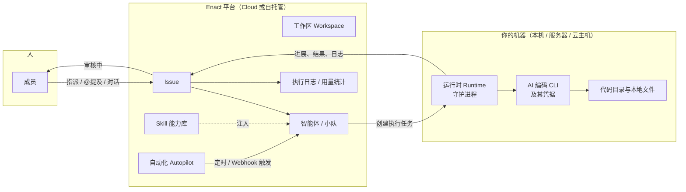

# Enact 产品介绍

**让人和 AI 智能体成为一支真正的团队。**

> 面向业务与商务售前 · **简体中文 | [English](Enact-Product-Overview.md)** · 基于当前代码库事实撰写

---

## 1. 一页纸速览

**Enact 是什么。** 一个把 AI 智能体和人类同事放进同一个工作区的工作管理平台。智能体在这里不是聊天框里的工具，而是有名字、有权限、能被指派任务的队友：它接任务、在你自己的机器上执行、边做边汇报、完成后进入"审核中"等人验收。

**给谁用。** 已经在用 Claude Code、Codex、Cursor 这类 AI 编码工具，但发现产出难以管理、难以复用、难以交代的团队与企业——研发、数据、咨询交付、以及任何需要"背景理解 + 多人协作 + 最终验收"的知识工作。

**三句话价值。**

1. **把散落的智能体收拢成一支可管理的队伍。** 任务、上下文、决策、执行记录、产出，全部挂在同一条工作记录下，换人换智能体都不必重讲一遍。
2. **代码和数据不出你的机器。** Enact 不自带模型，驱动的是你已经装好并登录的 AI 编码 CLI；执行发生在你自己的电脑或服务器上，平台只调度任务状态与广播事件。
3. **没有人点头，什么都不上线。** 智能体交付到"审核中"为止，验收权始终在人手上；每一次执行、每一条命令、每一次花费都可回放、可归因。

**三个差异化。**

| | 说明 |
|---|---|
| **智能体即队友** | 有头像、有个人页、有权限范围，可以被指派为负责人，也可以自己开单派给别人；小队（Squad）由智能体领队分派人和智能体混编的工作 |
| **你的机器、你的边界** | 自托管（Docker Compose / Kubernetes）、任意 Git 服务、按工作区隔离、按智能体授权；数据边界在 Cloud 与自托管下完全一致 |
| **方法论即产品** | Enact 把一整套交付方法论打包成可运行的治理层：**AI-SDLC 受治理交付套件**——九个智能体、一套对象模型、五道人工关口、九个确定性校验脚本，随服务端发布、按工作区下发。详见第 6 章 |

---

## 2. 客户当下的问题

AI 编码与分析工具在过去一年迅速普及。真正的瓶颈已经不是"模型能不能做"，而是**做出来的东西没法管**。

- **上下文散在会话里。** 每个工具活在自己的终端标签页或对话框里，会话一关就什么都不记得。同一段业务背景，一周之内要重复交代好几遍。
- **没有审计线索。** 事情做完了，但谁让它做的、中间改了什么、依据是什么、哪一步是人拍的板，事后拼不回来。
- **经验不沉淀。** 一个人调教好的提示词和工作方法留在他自己的机器上，团队其他人从零开始。
- **没有验收关口。** 要么完全不敢放手，要么放手之后没有一道结构化的关口能挡住"看起来做完了"的产出。
- **越用越忙。** 每多接一个智能体，就多一个需要人盯着的窗口。人力没有被释放，只是换了个地方消耗。

对企业来说，这几条最终会收敛成同一个问题：**AI 产生的工作，没有进入组织既有的管理、审计与问责体系。**

Enact 补的就是这一层。

---

## 3. Enact 是什么

Enact 是**人与 AI 智能体共同工作的记录系统与行动中枢**。

它不生产模型，也不替代你现有的 AI 编码工具——它给这些工具补上一层管理层：任务队列、团队协作、能力复用、运行时监控、成本可见、人工验收。

### 3.1 产品全景



一条完整的执行链路：

1. **Issue 提供上下文**——目标、背景、附件、讨论、关联的仓库与目录。
2. **Enact 创建一条执行任务并入队**——没有在线运行时时，任务留在队列里等待。
3. **一台在线的运行时领取任务**——运行时就是你自己的机器加上机器上的 AI 编码 CLI。
4. **AI 编码工具在本地执行**——读取工作目录、运行命令、产生结果。
5. **结果写回 Issue 时间线与执行日志**——进展、评论、产出、失败原因，全部挂回同一条工作记录。

> 智能体不会自己开始工作。每一次运行都由一个明确动作触发：指派 Issue、评论里 @ 它、直接对话，或者一条自动化规则。

### 3.2 核心对象

| 对象 | 一句话 |
|---|---|
| **工作区 Workspace** | 团队的隔离边界，所有工作与配置都在里面 |
| **Issue** | 日常工作的最小单位：上下文、负责人、状态、讨论、执行历史。负责人可以是成员、智能体或小队 |
| **智能体 Agent** | 一份可复用的配置：名字、指令、模型、Skill、访问范围、运行时。不是常驻进程，被触发时才运行 |
| **Skill** | 可复用的能力包。指令定义"这个智能体是谁"，Skill 定义"这类活怎么干"，多个智能体共享 |
| **资源 Resource** | 工作区的智能体所操作的 GitHub 仓库或本地目录，会进入每一次执行的上下文 |
| **产物 Artifact** | 智能体执行产出的文件，挂在产出它的 Issue 或对话上（含子 Issue），并保留全部版本 |
| **运行时 Runtime** | 执行真正发生的地方：一台已连接的机器，加上机器上的 AI 编码 CLI |
| **执行任务 Task** | 智能体的一次具体执行：入队 → 领取 → 启动 → 完成或失败，结果写回 Issue |
| **小队 Squad** | 人和智能体的混编队伍，由一名智能体担任领队负责分派 |
| **对话 Chat** | 不建 Issue 的私下对话，每条消息触发一次运行 |
| **收件箱 Inbox** | 成员的通知中心，只在需要你拍板时提醒 |
| **自动化 Autopilot** | 按时间表或事件触发的运行 |

---

## 4. 核心能力

### 4.1 智能体即队友

一个智能体是一份配置，不是一个常驻进程。创建时定义：名字与描述、指令、绑定的 Skill、运行时、模型与思考等级、访问范围、环境变量与凭据、MCP 服务器。三种创建方式：从空白开始、套用模板，或者**用 AI 生成**——描述几句你要一个什么样的角色，配置自动生成。也可以通过 CLI 创建。

**四种触发方式**，覆盖团队真实的协作习惯：

| 方式 | 场景 |
|---|---|
| 指派 Issue | 像挑同事一样把一件事交出去 |
| 评论里 @ 它 | 在已有讨论里把它拉进来 |
| 直接对话（Chat） | 不建 Issue 的临时提问或临时派活 |
| 自动化 | 日报、巡检、周报按计划自己跑 |

**访问范围（Access）是独立于工作区角色的一层授权。** 每个智能体有自己的所有者和访问范围：仅自己（默认）、整个工作区、指定成员。工作区的 `owner` 和 `admin` 能看到和管理所有智能体，但**不能绕过 Access 去运行别人的私有智能体**；只有所有者本人能改 Access。

**小队（Squad）** 让复杂工作有一个明确的分派者。领队必须是智能体，成员可以是智能体也可以是人。把 Issue 指派给小队时，只有领队入队：它拿到小队名册和分派协议，按 @提及 把活分出去，在时间线上留下评估记录，然后停下来等回复被唤醒。领队最多把父 Issue 推到"审核中"——`done` 留给人工确认或带关闭意图的 PR 合并。

### 4.2 工作管理与人工验收

Issue 是持续存在的工作记录，执行任务是智能体的一次具体执行。一个 Issue 可以先后产生多条执行任务——第一次实现、补充修改、再次检查——每次都留下新记录，之前的不会被覆盖。

**五个内置状态分类**，团队可以在每个分类下自定义自己的状态名：

| 分类 | 平台行为 |
|---|---|
| `backlog` | 停着不动。指派给智能体不会启动执行 |
| `todo` | 排队等待。一分配智能体就立即启动 |
| `in_progress` | 正在处理。执行失败且没有其他执行在进行时，自动退回 `todo` |
| `in_review` | 已交付、等待检查。会结束自动化的运行，之前的失败通知自动归档 |
| `done` | 已完成。计入父 Issue 进度 |

自定义状态只改名字，平台依据的始终是分类——所以 `in_review` 分类下叫 "Code Review" 的状态，行为和 `in_review` 完全一样。

**验收权在人手上。** 智能体按工作对 Issue 的实际影响写状态：开始产出就推到 `in_progress`，交付后推到 `in_review`。`done` 通常留给人工确认，或者由集成完成（例如带关闭意图的 PR 合并）。工作先进"审核中"，不直接进 main。

**子 Issue 支持阶段（stage）**，按 1、2、3 分批推进；当前最早未完成阶段的全部子 Issue 结束时，父 Issue 的负责人（如果是智能体）会被唤醒决定是否推进下一阶段。

**快捷操作**让常用的"某个智能体 + 某段提示词"组合固化下来，在任何 Issue 侧边栏一键触发。

### 4.3 能力沉淀

**Skill 是团队的操作手册。** 一个 Skill 是一份 `SKILL.md` 加上支撑文件（参考资料、模板、脚本）。写一次，全工作区的智能体共享。改一条定义就是改一行文本，下一次运行就生效——**不用部署、不碰代码**。

三种引入方式：手写、从 URL 导入（GitHub / ClawHub / Skills.sh）、从已连接的运行时复制。导入的 Skill 支持版本更新与批量升级，可以按标签组织，也区分工作区级与仓库级。

**MCP 服务器库**在工作区层统一维护，按智能体逐个分配和开关。

**插件（Plugin）** 在工作区内发布、按版本安装，安装时需要逐项授权：读写 Issue、读写评论、读写执行任务、读取智能体、读取成员、按成员存储、工作区存储、访问指定域名的网络。产品对此的承诺是明确的——**插件只能做这些权限允许的事，且永远不会超过使用者本人的权限**；卸载时删除插件的存储与密钥。

### 4.4 运行时与执行

**Enact 不自带模型。** 它驱动的是你本来就装好、登录好的 AI 编码 CLI，所以换提供方是切一个下拉框，谈不上迁移。目前支持 20 余款主流工具，包括 Claude Code、OpenAI Codex、Cursor Agent、GitHub Copilot CLI、Kimi、Qwen Code、Trae、DeepSeek Harness 等（完整清单见附录 B）。

- **守护进程首次启动时自动检测**机器上装了哪些 CLI，并为每一个注册一个运行时。桌面端登录后自动完成这一步。
- 运行时在界面上按 **本机 / 远程 / 云端** 分组；支持私有与公开运行时、按智能体的并发上限、自定义运行命令。
- **任务生命周期**：入队 → 领取 → 启动 → 完成 / 失败 / 取消。运行时在线时通常很快开始；排队超过 2 小时无人领取则以失败结束。
- **失败与自动重试**：运行时短暂离线、守护进程重启、执行超时、工具网络中断等临时故障会自动重试（普通任务默认最多两次，工具网络中断最多三次）。鉴权失效、额度不足、配置错误这类需要人处理的原因不会自动重试，而是停下来告诉你为什么。

### 4.5 自动化

自动化（Autopilot）按 **cron 时间表、Webhook 事件，或手动**触发，有两种输出模式：

| 模式 | 行为 | 适用 |
|---|---|---|
| **创建 Issue** | 先建 Issue 再派发。运行时离线时任务留在队列里等待 | 日报、周报、需要留痕和讨论的例行工作 |
| **仅运行** | 只产生一次执行，结果进运行历史。没有可用运行时则跳过 | 巡检、探针类的轻量例行动作 |

Webhook 支持事件过滤与 URL 轮换；失败、暂停、删除、运行与投递历史都可查。

### 4.6 可观测与成本

- **执行日志**：每一次工具调用、每一条命令、每一个报错都带时间戳，可以完整回放。
- **用量统计**：花费与 Token（输入 / 输出）、运行时长、任务数量，按天与周、按智能体、按 Issue 分别可见。
- **失败归因**：失败原因分为平台记录的原因码与 AI 工具报错归类两类，覆盖鉴权、限流、超时、供应商、运行时、智能体自身等场景，每一类都给出处理建议。
- **收件箱**只在智能体需要你拍板时提醒你，而不是每一步都来打扰。

---

## 5. 融入现有工作方式

Enact 不要求团队搬家。它接到你们已经在用的地方。

**聊天工具（5 个渠道）**——飞书 / Lark、Slack、钉钉、企业微信、Telegram。按智能体配置机器人，支持私聊、群内 @提及、`/issue` 与 `/new` 命令、文件与语音附件透传、会话隔离与账号绑定，自托管同样支持。*其中钉钉、企业微信、Telegram 由社区维护。*

**代码托管（4 类）**——GitHub（GitHub App、PR 与 Issue 双向关联、PR 合并自动置 `done`、CI 状态回写），以及按工作区接入的自建 Forgejo / Gitea / GitLab。

**客户端**

| 客户端 | 状态 |
|---|---|
| Web | 主要入口 |
| 桌面端 | macOS / Windows / Linux；登录后自动启动内置守护进程并把本机注册为运行时；支持按工作区的标签页组、应用内更新、连接自托管实例 |
| iOS | 需在装有 Xcode 的 Mac 上从源码编译安装，**尚未上架 App Store**；另有添加到主屏幕的 PWA 方式。暂无 Android 客户端 |
| CLI | `enact` 命令行覆盖工作区、Issue、智能体、Skill、小队、自动化、运行时、资源、仓库、附件、鉴权等全部操作 |
| API | 界面上能点的，API 里都能调 |

**智能体操作 Enact，用的就是人用的那套 CLI。** 这一点决定了自动化的天花板：智能体可以自己开单、自己关联 PR、自己把活派给另一个智能体。

**多语言**：产品界面提供简体中文、English、日本語、한국어。

---

## 6. AI-SDLC：把交付方法论变成跑得起来的治理层

这是 Enact 相对通用协作平台最关键的差异。通用平台解决"在哪干活"，不解决"这活按什么标准干、每一步谁签字、凭什么相信结果"。

Enact 的 **AI-SDLC 受治理交付套件**是一套完整方法论的可执行实现：九个智能体、一套对象模型、一条状态机、五道人工关口、九个确定性校验脚本。它随服务端二进制发布并按工作区下发——不是演示，是装好就能跑的东西。

本章按"方法论怎么说 → 套件怎么落"的顺序展开，逐项对应。

### 6.1 方法论从哪来

方法论的权威文档是仓库内的《**企业工作智能平台 产品与功能规格 v0.2**》（Enterprise Work Intelligence Platform — Product & Functional Specification，2026-08-18）。它的一句话定义是：

> 一个跨领域的企业工作智能基础平台：把可追溯的事实、经过治理的能力和外部 AI Runtime 组合成可配置的 Agent Family，使每项工作从意图到执行、验证、决策和学习都可控、可解释、可复用。

**它明确说自己解决的不是"模型会不会做"，而是四个企业问题：**

| 企业问题 | 平台责任 | 可观察结果 |
|---|---|---|
| AI 不知道哪份事实可信 | 给出来源、版本、适用范围和人工确认状态 | 回答与产出能回到明确事实源 |
| 能力散落在 Prompt 和个人经验里 | 将 Ontology、Skill、Tool、Policy、Eval 作为版本化资产 | 同一能力可跨团队、项目和 Runtime 重用 |
| AI 执行快但边界模糊 | 把目标、可改范围、可用工具、禁止动作和升级条件装配进工作空间 | Runtime 在可解释的权限和变更范围内执行 |
| 人只能阅读大量输出再决定 | 把运行、测试、批准和例外整理为 Evidence Case | 责任人基于证据接受、退回或停止工作 |

**方法论的逻辑架构是"一个体验，三层治理"：**

| 层 | 拥有的真相 | 核心产出 | 不得越界 |
|---|---|---|---|
| **Intelligence Space** | 项目/领域事实、版本、来源、验证与关系 | Artifact、Revision、Source Link、Context Index | 不把未经验证的经验自动升级为全局能力 |
| **Capability Hub** | 可复用能力资产及其生命周期 | Ontology、Skill、Tool、Policy、Eval、Capability Bundle | 不负责具体任务编排和 Runtime 会话 |
| **Enact** | 任务状态、Agent 配置、执行、Gate、Evidence 和学习候选 | Work Item、AgentSpec、Context Bundle、Evidence Case、Lesson Proposal | 不成为新的事实孤岛；领域事实仍回到 Space |

**方法论同样明确写了"不做什么"**，这几条对客户沟通同样重要：

- 不重新实现 Codex、Claude Code 等通用 Runtime，也不自动化桌面 GUI。
- 不要求所有人进入统一项目看板；聊天、IDE/CLI 和原有系统仍是主要工作入口。
- 不把所有原始知识复制到平台；Confluence、Jira、Git 可继续作为权威源。
- **不允许 LLM 自己声明 Gate 通过**；关键 Gate 必须由确定性规则和明确的人类授权决定。

**战略边界**（方法论原话）：如果产品变成"另一个 Agent Builder、另一个 Runtime 或另一个项目看板"，它很容易被替代；如果它成为企业事实、能力、证据和工作家族的治理层，则**通用 Agent 越强，平台越有价值**。

### 6.2 概念模型逐项落地对照

方法论第 5 章给出统一概念模型，要求"后续所有 User Story、API 和页面都引用这些对象"。套件把每一个对象落成了磁盘上的一个文件。这张表是本章的核心：

| 方法论对象 | 含义 | 套件中的形式 | 状态 |
|---|---|---|---|
| **Space** | 项目/方法/领域的事实容器 | `.sdlc/` 目录 + 项目代码库与文档 | ✅ 已落地 |
| **Artifact** | 有身份的事实或交付物 | `.sdlc/` 下的每个产物文件 | ✅ |
| **Revision** | Artifact 的不可变版本 | git commit | ✅ |
| **Artifact Change Proposal** | 候选修订 | `amendments/AMD-###.md` | ✅ |
| **Merge Decision** | 对候选修订的批准/退回/拒绝 | `gates/*.yml` 中的批准记录 | ✅ |
| **Work Item** | 被持续跟踪的一项工作 | `work-items/WI-###-slug/work-item.yaml` | ✅ |
| **Execution Contract** | 可验证的意图与边界 | `contract.yaml` | ✅ |
| **Capability Asset** | 可跨 Agent 复用的治理资产 | Skill 套件自身的 references / templates / scripts | ✅ |
| **Capability Bundle** | 一次任务固定版本的能力集合 | 一次执行实际引用的模板与清单版本（`capability_bundle_pinned` 事件） | ✅ |
| **AgentSpec** | 把通用 Runtime 配置为特定职责 | 每个 `sdlc-*` Skill 的 `SKILL.md` | ✅ |
| **FamilySpec** | 一类工作的阶段、交接与 Gate | `.sdlc/family.yaml` | ✅ |
| **Experience Pack** | 领域 Guide / Canvas / Review / Report | 各 Skill 的交互约定 + `render_review.py` 生成的 HTML | ⚠️ 部分：六个固定渲染器，非通用渲染框架 |
| **Context Bundle** | 一次执行真正获得的上下文快照 | 一次执行实际依据的文件与版本 | ✅ |
| **Evidence Event** | 阶段产生的权威事实事件 | `evidence.jsonl` 的每一行（追加式） | ✅ |
| **Evidence Case** | 面向人类决策组装的证据包 | `evidence-case.md` | ✅ |
| **Gate Decision** | 确定性规则 + 人类授权的阶段决定 | `gates/<name>.yml` | ✅ |
| **Lesson Proposal** | 尚未推广的经验 | `lessons/LP-###-slug/lesson.md` | ✅ |

**一切状态都是文件——可 `git diff`、可 PR 评审、可离线审计。不用数据库，不靠会话记忆。** 这是套件对方法论"可追溯"要求给出的最直接答案：审计时不需要访问任何系统，`git log` 就是审计线索。

### 6.3 阶段结构与九个智能体

方法论推荐的阶段结构是：**Intake / Enact → Explore → Design & Contract → Build → QA → Release → Operate & Learn**，并强调"保留熟悉的生命周期，不发明一条新流水线；真正变化的是机器执行所需的明确性与证据"。

套件为每个阶段配一个智能体，加一个横切领队，组成一支串行小队：

| 阶段 | 智能体 | 出口产物 | 出口关口 |
|---|---|---|---|
| Intake / Enact | **SDLC Intake** — 登记新工作、读取状态与度量 | `work-item.yaml` | 无（但 owner 必填才能往下走） |
| Explore | **SDLC Explorer** — 澄清事实、假设、范围和未决 | `exploration.md` | 自检清单 + 业务负责人评审 |
| Design & Contract | **SDLC Contract** — 产出契约、EARS 标准、设计 | `contract.yaml` | **contract-approval（人工）** |
| Build | **SDLC Builder** — 只在已批准范围内实施 | `change-scope.yaml` + `ledger.md` + `build-evidence.md` | **scope-expansion（越界时人工）**+**build-review（进 QA 前人工）** |
| QA | **SDLC QA** — 独立冻结测试意图、验证与归因 | `test-plan.yaml` + `qa-report.md` | 覆盖自检（确定性） |
| Release | **SDLC Release** — 发布预检、组装证据档案 | `evidence-case.md` | **release（人工）** |
| Operate | **SDLC Operator** — 诊断事故并把根因归位上游 | `incident.md` | 事故关闭自检 |
| Learn | **SDLC Learner** — 治理经验生命周期 | `lesson.md` | **lesson-approval（人工）** |
| 横切 | **SDLC Orchestrator**（领队）— 排程、审计、验收、路由 | 不产出交付物 | 无 |

**每个智能体的职责边界是硬的**，写在它自己的定义里：Intake 不做跨工作项判断；Explorer 不写契约也不写代码；Builder 不承担独立 QA；QA 不修业务实现；Release 不部署、不自签；Operator 把修改转为新工作项而不是就地改。

**两条通道。** 方法论警告过"全能力 + 短周期"不可同时成立，套件对小改动的答案是 `lane` 字段：`full`（完整八环节）与 `quick`（压缩状态转换）。**仪式随任务缩放，审批关口从不缩放**——quick 通道仍然要有契约（可以只有 2 条标准）、要有变更范围、要有发布决定与关口记录。省掉的是篇幅，不是责任链。

### 6.4 三条铁律，及它们对应的方法论条款

套件把方法论中最容易被"这次情况特殊"消解掉的三条，写成不可协商的形式：

```
NO GATE PASSAGE WITHOUT A HUMAN APPROVAL RECORD   没有人类批准记录，不得通过关口
NO TEST EXPECTATIONS DERIVED FROM IMPLEMENTATION  测试期望不得从实现推导
NO WRITES OUTSIDE THE APPROVED CHANGE SCOPE       不得在批准范围外写入
```

**违反字面就是违反精神。**

| 铁律 | 对应的方法论条款 | 套件的执行方式 |
|---|---|---|
| 关口必须有人类批准记录 | §03「不允许 LLM 自己声明 Gate 通过」、§11「LLM 可以收集、解释和提示证据，但不能自行宣布关键 Gate 通过」 | `validate_gate.py` 校验 `approved_by` 非空、非 `AI`/`Claude`/`system`。AI 可以收集、解释、推荐，**不能签字**。"你看着办"授权的是推进工作，不是签字。旧的批准不顺延到改动后的版本 |
| 测试期望不得从实现推导 | §02「QA 不是从实现结果反推测试」、§15「测试设计以 Contract 为基准独立生成；实现可以影响执行方式，但不能决定预期结果」 | **结构性隔离**：由独立 QA 智能体或全新上下文的子代理冻结测试意图，任务载荷里只有契约全文，硬约束是"不得读取任何实现代码"。冻结之后才允许读实现来绑定接口、夹具与定位器 |
| 不得在批准范围外写入 | §14「Runtime 可以理解全局，但只能在明确的写入和动作边界内改变系统」 | `check_scope.py` 比对 `git diff` 文件清单与白名单。理由写得很直白：*AI 能一次改动几十个文件，而人的复核带宽没有同步增长。范围边界是让复核成为可能的前提* |

**书面豁免。** 不可避免的违反可以豁免，但要付出书面代价：写明违反了哪条、为什么无法避免、改用了什么替代做法、留下什么补偿记录、期限是多久。**「已豁免」和「已通过」在统计和审计里是两回事**；未经这个流程的违背，就只是违背。

三条支撑规则：上游缺口不得在下游打补丁（要提修订案）；经验不得自动变成标准；没有可信来源不得下事实性结论。

### 6.5 执行契约：方法论要求"机器可检查"，套件做到什么程度

方法论对执行契约的定义是：*不是把自然语言需求换成更多文字，而是把目标、验收标准、边界、适用能力、未决问题和需要人工判断的事项形成机器可检查的对象。*

套件的 `contract.yaml` 是一份**批准后不可变**的文件，改动必须走修订案。四块内容，每块有明确读者：

| 块 | 内容 | 主要读者 |
|---|---|---|
| **业务声明** | `outcomes` / `requirements` / `criteria` / `scope` | 业务负责人、产品、QA |
| **技术设计** `design` | `approach` / `diagrams` / `decisions` / `impact` / `nfr` | 架构、开发 |
| **变更边界** `boundary` | `may_change` / `must_not_change` / `allowed_actions` / `escalation` | 开发、架构 |
| **发布运维** `release` | `strategy` / `rollback` / `rollback_data_state` / `monitoring` / `support` | 运维、发布责任人 |

**为什么合并成一个文件**，套件给出了三条来自实践的理由：独立的 `design.md` 会成为第二份手写真相（只有 `contract.yaml` 手写，供人评审的 HTML 由它渲染）；由 Build 定义变更范围等于让执行者划自己的边界；回退方案第一次出现在 Release 阶段太晚了——**某些方案根本回不去，那应该在契约阶段就影响技术选型**。

`criteria` 有三条硬要求，下游 QA 完全依赖它们：

1. **EARS 语法**，五种句式：`系统 SHALL <行为>`（普遍）、`WHEN … THEN 系统 SHALL …`（事件）、`WHILE … 系统 SHALL …`（状态）、`WHERE … 系统 SHALL …`（可选特性）、`IF … THEN 系统 SHALL …`（非期望行为）。
2. **分层编号**（`1.1`、`2.3`）——编号是全套件的连接坐标，任务、测试意图、证据都靠它对齐。
3. **可独立验证**。

**未决问题必须闭合。** 方法论说"只有关键未决问题被明确接受或关闭，Contract 才能进入 Approved；文档写完不等于设计完成"。套件把探索阶段的每个未决问题变成契约的 `open_decisions`，每一条必须被"明确接受（带风险声明）"或"关闭（有答案）"。

**修订案与缺陷分得很清**，这一条在实践中极其有用：

| | 修订案（AMD） | 缺陷（DEF） |
|---|---|---|
| 说的是 | 契约错了或没说清 | 契约没错，代码没做到 |
| 归因 | `requirement` / `design` | `implementation` |
| 回到哪 | 契约环节，需人裁决 | 实施环节，直接修 |
| 工作项状态 | → `Contracted` 或 `Held` | → `Executing` |

被拒绝的修订案仍然保留，作为审计线索与经验来源。

### 6.6 受管变更区：方法论的五条边界，套件的五个字段

方法论第 14 章定义 Managed Change Area 有五条边界，并且明确**每条边界由谁确认**。套件的 `change-scope.yaml` 逐条实现：

| 方法论边界 | 定义 | 谁确认 | 套件字段 |
|---|---|---|---|
| Read / discover | 允许查询的服务目录、代码、设计、历史和依赖 | 项目策略 + Resolver | `read`（通常是整个项目） |
| Write | 本次可修改的路径与新建内容落点 | Agent 提议；开发/Lead 按风险确认 | `write`（显式路径白名单，窄） |
| Protected | 只读目录、共享接口、数据模型、基础设施和安全配置 | 组织/项目策略 | `protected` |
| Tool actions | 可用工具、命令、网络、凭据、环境和预算 | AI Engineer + 项目授权 | `tool_actions`（allowed / forbidden + `environment` + `credentials`） |
| Escalation | 触发停机、扩大范围或人工决定的条件 | FamilySpec + Gate policy | `escalation` |

套件在此之上补了一条方法论没有单列的字段：**`read_excluded`**——即使落在 `read` 范围内也永不读入上下文的路径（密钥、凭据、`.env`、真实个人数据），继承自项目级 `data_policy.never_read`。理由很实际：**写保护不等于读保护**，一个躺在 `protected` 目录里的 `.pem` 仍然是可读的，必须由这个字段拦住。

核心原则是**可读范围宽、可写范围窄**。未列出的敏感区域默认受保护：共享接口、数据模型、基础设施、安全配置、CI 配置。

**两层边界，脚本校验包含关系**：意图层（契约的 `boundary`，由 Contract 环节写）⊇ 文件层（`change-scope.yaml`，由 Build 环节写），`check_scope.py` 验证后者是前者的子集。

**越界即停机。** 方法论的验收示例是：*当变更触及未批准目录或需要调用未授权工具时，Runtime 必须停止并给出扩大范围的理由；确认后生成新版本的 Change Scope 和 Context Bundle，再继续执行。* 套件把这次停机记成一个 `boundary_stop` 事件——**它证明边界真的在起作用**，方法论把它列为试点完成的判据之一。

### 6.7 独立 QA：从"看起来不错"到"已批准的意图在目标环境中成立"

方法论第 15 章的原话：*测试不是证明"代码看起来不错"，而是证明已批准的意图在目标环境中成立。*

**两条工作线**，套件完整实现：

| 工作线 | 输入 | 输出 |
|---|---|---|
| 常规验证 | 执行契约 + 环境/数据 + 实现 | 测试设计、执行、缺陷、回归和报告 |
| 证据保障 | 契约 + 实施证据 + 运行痕迹引用 | 覆盖缺口、断链、错误归因、未经授权动作和不一致 |

**"冻结在前"是结构，不是态度。** 方法论要求"从已批准 Criterion 生成 Test Intent，先冻结预期行为，再读取实现来绑定 endpoint、fixture、locator 和环境"。套件的实现方式是：由独立 QA 智能体（或全新上下文的子代理）执行冻结步骤，任务载荷只有契约全文，硬约束写在载荷里——**不得读取任何实现代码**；某条标准抽象到无法派生可观察预期时，不许猜，列进 `unverifiable` 并说明缺什么。

套件还列了一张**借口对照表**，每一条都是真实会发生的：

| 借口 | 现实 |
|---|---|
| "先跑一遍现有测试看看挂在哪" | 你已经用实现的当前行为定义了预期。挂的那几条恰恰可能是唯一测对了的 |
| "起子代理太麻烦，我自己保持中立也行" | 保持中立做不到——你的上下文里已经有实现了。**隔离靠结构，不靠自觉** |
| "实现里已经有单元测试，直接复用" | 那些测试是实现的自证。它们要跑（那是回归），但**不算任何标准的覆盖** |
| "这条标准太抽象，我看看实现怎么理解的" | 实现的理解可能正是那个缺陷。抽象到无法出测试的标准是契约缺陷，提修订案 |
| "这类用例跑一次 40 分钟，这次先跳过" | 成本不是跳过关口测试的理由。跳过要有具名责任人接受风险并落关口记录 |

**失败必须归位到正确来源**：需求/契约缺陷、设计缺陷、实现缺陷、环境/数据问题，或测试问题。**环境未就绪不是"失败"，是"阻塞"**——记 `blocked`，不归因成实现问题，也不用重试掩盖。

方法论对计算密集型测试给出了六个执行类别与默认调度（快速确定性、集成、浏览器、跨服务/发布、重型专项、人工主观），并规定**跨服务/发布类在关口前强制执行，不允许因成本静默跳过**；套件把这条落成 `config.yaml` 里的"不可延后类别"。

### 6.8 证据三层：不要求任何人通读事件流

方法论第 11 章定义了证据的三层结构与各自读者。套件逐层实现：

| 层 | 方法论定义的内容 | 面向谁 | 套件中的文件 |
|---|---|---|---|
| Runtime trace | 工具调用、命令、文件、Token、错误 | 工程排障与审计 | 会话记录、命令输出、测试日志 |
| Evidence event | 输入版本、动作、输出、检查结果、责任主体 | 系统关联与确定性规则 | `evidence.jsonl`（追加式） |
| Evidence case | 目标覆盖、例外、失败、批准、运维/回退准备 | QA、发布责任人、业务负责人 | `evidence-case.md` |

**设计目标写得很直白：不要求任何人通读事件流来做决定。** 方法论对此的表述是"系统内部保留完整 Evidence Chain；对人只呈现一个按 Release 决策组织的 Evidence Case"——工程可追溯和客户可理解可以同时成立。

事件流是追加式的：**不修改、不删除、不重排**。受控动作词表约二十余个动词，其中 `boundary_stop`（越界被拦下）、`test_intent_frozen`（测试意图冻结时刻）、`capability_bundle_pinned`（能力版本钉住）、`gate_decided`、`phase_reviewed` 是审计时最常被查的几个。

**一条硬规则值得单独讲给安全团队听：证据里不许出现密钥。** 事件流和台账是永久的、进 git 的、可被 PR 评审的，而所有规则都鼓励永不删除——*治理机制会把一次疏忽变成永久泄露*。因此写入前对备注和引用做脱敏检查，命中就写 `[redacted]` 并把结果置为 `blocked`，且永不粘贴原始命令输出。

**证据档案的章节是固定的**，让责任人每次在同一个位置找到同一样东西：业务目标与范围 → 契约覆盖（逐条标准的验证方式、结果、证据）→ 接口兼容 → 安全与隐私 → QA 结果 → 已知例外 → 部署与回退 → 监控与支持准备 → 具名批准。**有标准没出现在覆盖表里，预检就该失败。**

### 6.9 关口：确定性预检在前，人工授权在后

方法论的 Gate 原则有三条：LLM 可以收集、解释和提示证据，但不能自行宣布关键 Gate 通过；规则可计算的条件由确定性 Gate 判断，涉及风险接受的条件由具名责任人决定；Hold 必须返回缺失证据或修复来源，Reject 必须记录原因和允许重新进入的条件。

**套件设了五道必须人工批准的关口**——方法论强制要求三道（契约、范围扩大、发布），套件自己加了两道：

| 关口 | 环节 | 决定什么 | 为什么必须人工 |
|---|---|---|---|
| `contract-approval` | Contract | 意图与边界是否正确 | 后面所有工作以它为准，错了全错 |
| `scope-expansion-###` | Build | 是否允许改保护范围外的东西 | 一次不可逆的信任扩大 |
| `build-review` ⭐ | Build → QA | 做法方向对不对，值不值得进 QA | 套件自加，见下 |
| `release` | Release | 是否接受生产风险 | 责任必须落到具体的人 |
| `lesson-approval` ⭐ | Learn | 是否把一次经验固化为标准 | 套件自加，会影响之后所有工作 |

**⭐ `build-review` 的来历，是这套东西里最好的一个故事。** 在它出现之前，从契约批准到发布决定之间，**人一次都不看代码**。加它的三条理由：

1. QA 是最贵的环节。方向性错误在这里发现只赔一次实施返工；在 QA 之后发现，要赔一整轮 QA 加返工加回归。
2. 机械检查发现不了"做法不对"——*一个本该用事件却用轮询实现的功能，所有机械检查都会通过*。
3. "已验证"会硬化判断。QA 一过，沉没成本会让人倾向接受而不是质疑。

**它批的是方向，不是正确性。** quick 通道可以把呈报压缩成三行，但关口文件和具名批准人照旧；要关掉它，必须在配置里留下具名的 `self_check_decided_by`——*不签名就能关掉的人工审查，等于没有人工审查*。`full` 通道没有这个开关。

**两段式，顺序不可颠倒**：先跑确定性预检（脚本能判定的条件，没过就给缺口清单，**不进入人工步骤**——*不要拿一份自己都知道不完整的东西去占用别人的判断力*），再走人工授权（具名责任人接受风险）。

**四值受控词表**，没有变体：

| 值 | 含义 |
|---|---|
| `PASS` | 通过 |
| `CONCERNS` | **不是"差不多能过"的委婉说法**——这些问题我看见了、我接受、并且我知道由谁负责。**写不出责任人的问题不算 CONCERNS，那是 FAIL** |
| `FAIL` | Hold 与 Reject 都落在这里，靠"重新进入条件"是否有值区分：Hold 为空，Reject 必填 |
| `WAIVED` | 走过书面豁免流程的违规 |

**`PENDING` 被刻意排除在词表之外**：等待批准的表示方式是**这个文件还不存在**。不许建占位文件，不许留空的批准人字段，不许为了"把流程走完"填任何词表值。等待记录在工作项的 `blocked_by`、一条 `boundary_stop` 事件和批准请求本身里。

**五个角色也是受控词表，不能自造**——角色既是视图也是权限：

| 角色 | 对什么负责 | 该读契约的哪几块 |
|---|---|---|
| 业务负责人 | 业务结果与验收标准 | outcomes、requirements、criteria、scope |
| 架构 | 方案、变更边界、技术决定 | design、boundary、policies |
| 开发 | 实现方式 | criteria、design、boundary |
| QA | 验证充分性 | criteria、scope、design.impact、release.rollback |
| 运维 | 发布、回退、监控 | release、design.nfr、design.impact |

契约批准需要三个角色共同签，是实践中发现的：只有业务负责人和架构时，"发布策略与回退方案"这一块**落不进任何签字人的视野**。校验脚本现在强制——签契约批准的角色，其视图合起来必须盖住契约的每一块。一个人身兼多个角色是常态，记成**一条带多个角色的记录**，不拆成三条假装是三个人看过。

**批准请求协议有三条规则**：问对人（点名每个必需角色，并告诉他该读哪几块，不要让人自己猜）；固定话术（例如发布关口：「证据档案已就绪。请给出 Release / Hold / Reject。」）；**只认显式肯定**——"看起来不错""应该没问题"、沉默、以及之前说过的"随便你"，都不算数。任何对产物的改动都要重新批准，*他批准的是他看过的那个版本*。

**呈报格式是固定的**：要决定什么 / 确定性预检（N 通过、N 失败）/ 关键内容（3–5 条摘要，不是全文粘贴）/ 已知问题 / 如果通过 / 如果不通过 / 请给出明确的选项。*责任人需要的是组织过的判断材料，不是原材料。*

**评审 ≠ 关口。** 套件另设八个阶段的非阻塞评审，回答的是"有没有人真的看过"；关口回答的是"有没有人接受这个风险"。*Gate 是风险转移，不是"看过了"的收据。*

### 6.10 状态机与回退

方法论第 10 章给出最小状态机，并要求"任何返回都必须说明返回到哪个阶段、缺什么、由谁处理，并保留旧版本"。套件一比一实现：

```
Proposed → Exploring → Contracted → Planned → Executing → Verifying → Decision → Completed
                                                          ↘ Held    ↘ Cancelled
```

每个转换都有确定性的转入条件：进 `Exploring` 要求 owner 已填；进 `Contracted` 要求契约批准记录有效（PASS + 具名批准人）；进 `Verifying` 要求实施证据就位**且**实施评审有效；进 `Completed` 要求发布关口为 PASS。

**`Held` 不是失败，是诚实。** 批准人联系不上、外部依赖没就位、熔断触发、契约有缺口在等修订，都进 Held。进 Held 必须写清楚：卡在什么、卡在谁、从什么时候开始、解开之后回到哪里——**缺任何一项的 Held 都是"卡住了但没人知道该干什么"，等价于工作丢失**。

**熔断规则**：同一个问题换了三种做法都失败就停下，三种都记进台账，转 Held。*合法终态只有两个：完成，或者已记录的阻塞。不存在"大概好了""基本能跑""应该没问题"。*

**六条回退路径**都是显式的，包括一条容易被忽略的：`Decision → Cancelled`（Reject 且不该做）。*没有这条出口，一个"不该做"的判断只能被写成永远回不来的 Exploring。*

### 6.11 Operate 与学习闭环

方法论第 16 章要求把线上事实回写到同一条意图与证据链，并给出 Lesson 的六阶段生命周期与每阶段责任人。套件的实现：

| 阶段 | 方法论要求的平台动作 | 方法论指定的责任人 | 套件实现 |
|---|---|---|---|
| Observe | 从澄清、失败、例外、返工和成功模式中生成候选经验 | Enact | 任一环节发现即登记 `lessons/LP-###/`，只填第一节 |
| Classify | 判断应更新事实、Ontology、Skill、Policy、Template、Eval 还是 Tool | Domain Expert / AI Engineer | 七类变更目标：project-doc / template / checklist / policy / eval / tool / skill |
| Validate | 用历史案例、反例和回归集验证适用范围 | AI Engineer / QA | `scope_of_validity` + `counter_examples`，**说不清边界的不推进** |
| Approve | 确认收益、风险、适用范围和版本 | Capability Steward | **`lesson-approval` 人工关口** |
| Publish | 形成新版本；记录哪些 Family/Bundle 可以采用 | Capability Hub | `target_version` / `published_version` / `adoption_scope` |
| Observe again | 监控效果，可回滚或废弃 | AI QA / Platform Ops | `observation` 字段，可回滚；被拒绝的经验归档保留 |

**闭环要求**（方法论原话）：*"复盘完成"不是终点。只有经验被验证、批准并进入受治理资产，下一次执行才会真正变好。*

事故侧同样对齐：事故进入时关联当前发布、工作项、产物版本与证据档案；确认根因后**定位应更新的上游对象**（契约、接口规则、测试标准、Skill 或 Policy），而不是只提交一个下游补丁；修复作为**新的工作项或修订案**进入同一家族，保留原版本和事故关系。

**记忆层级**是套件在方法论之上补的一个机制，回答同一个问题：这条内容能不能被当作事实引用？

| 层级 | 是什么 | 引用规则 |
|---|---|---|
| `released` | 已批准的契约、已完成的工作项、已观察的经验 | 可以当作事实直接引用 |
| `current work` | 活跃工作项的全部产物 | 可以引用，但要带编号说明它还在进行中 |
| `experimentation` | 探索阶段的假设、已接受的未决问题、尚未批准的经验 | **引用时必须标注为假设，不得写成事实** |

理由很具体：铁律拦住了未验证经验直接变成标准，但拦不住更隐蔽的那条路径——它在下一个工作项的探索阶段被当作既定事实引用。

### 6.12 度量：不要只看 Token

方法论第 19 章明确要求：*至少同时看 Lead Time、一次通过率、返工、缺陷逃逸、Gate 等待、Context 失败、人工审批负担、资产复用和运行成本。个人绩效不应直接由 Token 或 AI 使用率推导。*

套件的 `metrics.py` 从现有文件算出八项指标：Lead Time、一次通过率、返工、缺陷逃逸、关口等待、人工审批负担、上下文失败、资产复用。**原料本来就在，只是需要有人去算。**

两条限定值得原样转述：

- **运行成本不在其中**，因为 token 与耗时不在治理目录里，算不出来就不列——*列一个算不出来的指标，读的人会以为是自己没找到*。（成本可见性由 Enact 平台的用量统计提供，见 4.6。）
- **这些数字描述的是交付系统，不是某个人。** 返工多通常意味着契约没写清楚，那是上游问题；关口等待长通常意味着批准人负载过高，那是排班问题。**不得用任何一项推导个人绩效**，也不得用 token 消耗或 AI 使用率替代它们——后者衡量的是"用了多少 AI"，与"交付得好不好"无关。

### 6.13 九个确定性校验脚本

治理如果只靠人自觉，第三周就会退化。套件把能机械判定的部分全部脚本化，全部 Python 3 标准库，**无网络访问**：

| 脚本 | 判定什么 |
|---|---|
| `sdlc_init.py` | 初始化治理目录骨架与项目配置 |
| `new_work_item.py` | 分配编号、建目录、实例化模板（手工编号会重号，手工建目录会漏文件） |
| `validate_gate.py` | 关口 YAML 的词表、必填字段、批准人非空非 AI |
| `check_scope.py` | `git diff` 文件清单 vs 变更范围白名单 |
| `coverage_stats.py` | 标准 ↔ 任务 ↔ 测试意图的覆盖与缺口；并强制契约批准的角色视图必须盖满契约 |
| `wi_status.py` | 所有工作项的状态、阻塞点、待决事项 |
| `metrics.py` | 上节的八项交付度量 |
| `render_review.py` | 从产物渲染自包含 HTML 评审页 |
| `sdlc_audit.py` | 记录与磁盘的一致性核对：状态↔产物、缺实施评审、证据为空、关口↔状态、范围重叠、指针失效 |

一个细节能说明这套东西的态度：**"历史只能追加"这条检查跑的是 git 已提交版本**；不在仓库里、或文件尚未提交时，*这一条不运行，也不假装运行过*。

### 6.14 可视化评审层：让"读不过来"不再退化成扫一眼签字

方法论第 03 章把"人只能阅读大量输出再决定"列为四个企业问题之一。套件对此的回答不止是组装证据档案，还有一层生成式的评审页：

问题陈述很直接——**读不过来的关口会退化成扫一眼签字，而那时候流程还在，责任已经没了。**

`render_review.py` 生成自包含 HTML，**只有六个固定渲染器**（矩阵、图、路径、树、对比、报告），不是一个任意的低代码 UI 搭建器。三条设计规则：

1. **每一层都必须能降级成文本**——没有只靠悬浮提示、只靠颜色、或只靠图才能读到的信息。
2. **反向墨水分配**——正常的格子近乎不可见，只有异常带墨水；缺口必须用符号显式填上，不能留空（留空分不出"没问题"和"没查"）。
3. **首屏回答三个问题**：能不能过、还差什么、谁要拍板。

它是**按需重生成的快照，不是要维护的门户**——明确的反目标是"退化成另一个 Jira"。这一点与方法论第 10 章的判断一致：*Board 是 Work Item 的一个可选投影，不是主记录，也不是强制入口。*

### 6.15 对照方法论的"试点完成定义"

方法论第 20 章给出了试点完成的四条判据。这是评估这套东西是否真的可用的最好清单：

| 方法论的判据 | 套件对应的机制 |
|---|---|
| 一个真实业务变更从请求进入，形成已批准 Contract，并在真实 Runtime 中完成受控变更 | Intake → Explore → Contract（人工关口）→ Build（变更范围 + 台账），运行在 Enact 已连接的运行时上 |
| QA 从 Contract 生成检查；Release Authority 只看 Evidence Case 即可做 Release/Hold 决定 | 结构性隔离的测试意图冻结；证据档案的固定章节 + 发布关口的固定话术 |
| 运行中使用的事实版本、能力版本、工具和输出可回溯；**越界动作被阻止或升级** | `capability_bundle_pinned` 钉住能力版本；`check_scope.py` + `boundary_stop` 事件 |
| 至少一条有效 Lesson Proposal 被评审为发布或拒绝，并保留理由 | 经验六阶段 + `lesson-approval` 关口；被拒绝的经验归档保留 |

方法论同时给出一条**范围纪律**，我们建议原样转述给客户：*"全能力 + 1.5 个月"不可同时成立。1.5 个月只应承诺可演示的薄切片；全部模块属于后续路线图，不应伪装成同一个 MVP。*

### 6.16 有意未实现的部分

方法论的对象模型比套件大。**以下这些是有意没做的**，并且每一条都有理由。对企业选型来说，这份清单比功能列表更有价值：

| 方法论对象/能力 | 状态 | 理由 |
|---|---|---|
| Ontology / Skill / Tool / Policy / Evaluation 资产库（完整 Capability Hub） | 未实现 | 套件自身的模板与脚本承担了 Capability Asset 的角色；完整资产库属于平台层，不属于交付套件 |
| Context Recipe 的预算与配额 | 未实现 | 不做 token 计量 |
| Runtime Adapter / 多 Runtime 主备 | 未实现 | 由 Enact 平台的运行时层承担 |
| 跨工作项事实索引 / Context Resolver | 未实现 | 已接受的代价：多个工作项会重复验证同一批事实 |
| 权限 / 租户 / 身份系统 | 未实现 | 由 git 与文件系统权限承担；**明确声明不覆盖两件事**：密钥进入上下文由数据策略处理，资产适用性由经验的适用范围处理 |
| **Board / 看板** | **有意不做** | *Board 一旦存在就会变成需要维护的第二份记录* |
| **代理审批** | **有意不做** | 批准人联系不上就是 `Held`，不存在替签链条——*"发不出去"比"发出去了但没人真正负责"便宜* |
| Jira 双向同步 | 有意不做 | 外部引用只存链接，从不回写 |
| 对外知识空间同步 | 默认关闭 | 只单向写出业务层结论；**治理层不过界**（工作项编号、文件路径、提交哈希、批准人真名留在本仓库）；对方仓库的合并由对方的人决定，本套件只提交提案 |

### 6.17 这套骨架可以复制到你自己的业务

方法论第 17 章的判断是：不要把 DevOps 术语强加给其他领域，也不要为每个领域重写平台。不同领域的工作都遵循同一条节奏——**意图 → 探索 → 成形/契约 → 执行 → 验证 → 决策 → 学习**——但用户看到的界面、对象和报告必须由领域决定。

对客户而言，这意味着两件事：

1. AI-SDLC 套件是这条骨架在**软件交付**领域的完整实例，可以直接用。
2. 同一条骨架可以承载你自己的方法论。所需要的，就是把"这类活怎么干"写成 Skill、把"谁在哪一步签字"变成关口、把"凭什么相信这个结果"变成可校验的证据。**方法论从一份没人读的 PPT，变成一套跑起来会拦住你的东西。**

---
## 7. 安全、合规与数据边界

企业选型最先问的三个问题：代码出不出门、智能体能碰到什么、出了事查不查得清。这一章逐条回答，**包括不好听的部分**。

### 7.1 数据边界

| 存在 Enact | 留在你的机器 |
|---|---|
| 工作区、Issue、评论和状态 | AI 编程工具及其凭据 |
| 智能体配置与 Skill | 代码目录和本地文件 |
| 执行任务的状态、执行记录和结果 | 实际的文件修改与命令执行 |

**这条边界在 Enact Cloud 和自托管中完全相同。** 代码不会经过 Enact 服务器，平台只协调任务状态与广播事件。

> **一个例外，必须说清楚**：保存到智能体 `custom_env` 的内容存放在 **Enact 服务器端**，执行时传给运行时。**不希望离开你电脑的 secret，不要写进 `custom_env`。**

### 7.2 Enact 确实提供的隔离

这三项是真实存在的隔离，但定位是**便利性与影响面收敛，不是用来防御主动逃逸的安全边界**：

- **每任务独立工作目录。** 每个任务有自己的工作目录，并发任务不会在同一份 checkout 上打架。
- **每任务独立的智能体状态。** 任务级的工具配置目录，不污染你自己的配置。
- **任务级 API token。** 交给任务的令牌由服务端绑定到该智能体与该任务，任务无法通过 Enact API 以你或其他智能体的身份行事。

### 7.3 不构成边界的部分

Enact 在这一点上不含糊，我们也建议在客户面前主动讲清楚：

- **AI 编程工具自带的沙箱与审批设置不构成边界。** Enact 以无人值守方式运行智能体，审批请求会被自动应答，默认路径下工具的文件系统沙箱处于关闭状态。（例外：Windows 上如果你显式配置了 Codex 原生沙箱，Enact 会尊重这个 opt-in。）
- **守护进程用户的 `HOME` 目录不构成边界。** 任务继承守护进程用户真实的 `HOME`——正因如此 `gh`、`aws`、`kubectl`、`gcloud` 在任务里的行为和在你 shell 里一致。这同时意味着该 home 下的一切都可触达。

产品文档里的原话：**Enact 不会替你做文件系统沙箱。隔离必须来自你为守护进程设置的外层边界。**

这是一个刻意的设计取舍，理由也值得转述：智能体需要装依赖、跑构建、用云 CLI，这些都假设一个正常的 home 目录；一个做了一半的文件系统沙箱会用很难诊断的方式破坏它们（"没登录"，或者悄悄用错了账号），**同时仍然挡不住最要紧的那件事——它无法阻止任务读取凭据并从网络发出去**。所以 Enact 不假装自己是那道边界，而是请你在它外面加一层。

### 7.4 推荐部署方式

按从轻到重排列，选一种适合你基础设施的：

1. **专用 Unix 用户。** 创建一个 `enact` 用户，只给它智能体需要的仓库和凭据，用该用户运行守护进程。你自己的账号完全不受影响。
2. **容器。** 在容器里运行守护进程，只挂载智能体需要的目录和密钥。
3. **虚拟机。** 隔离最彻底，代价是要额外准备一台机器。

无论选哪种，都应把该环境中可触达的凭据视为智能体可能会用到的凭据：token 权限尽量收窄，优先使用专用部署密钥而不是个人 SSH 私钥，不要把无关的生产凭据留在该用户的 home 目录里。

**一个可以直接引用的实践**（来自官方用例）：数据分析类智能体连的是**只读从库**，账号只有 `SELECT` 权限。从库隔离意味着它怎么查都不影响生产，只读权限意味着**哪怕发生提示词注入也写不进任何数据**。

### 7.5 权限模型

三层，互相独立：

| 层 | 粒度 | 说明 |
|---|---|---|
| 工作区角色 | `owner` / `admin` / `member` | 只控制工作区设置与团队管理；创建 Issue、发表评论等日常协作对所有成员开放。工作区必须始终保留至少一名 `owner` |
| 智能体访问范围 | 仅自己 / 整个工作区 / 指定成员 | 独立于角色。`owner` 和 `admin` **不能绕过它**运行未授权的智能体 |
| 插件授权 | 逐 scope 同意 | 读写 Issue、评论、执行任务、成员、存储、指定域名的网络访问；插件权限永不超过使用者本人的权限 |

### 7.6 可审计性

- 每一次工具调用、命令、报错带时间戳，可完整回放。
- 每一次状态变更由谁写入、什么时候写入，留在 Issue 时间线上。
- 交付包（第 6 章）额外提供追加式的审批台账：不可修改、不可删除，撤回一次确认的方式是追加一条重开记录。

---

## 8. 部署与选型

| | Enact Cloud | 自托管 Docker Compose | 自托管 Kubernetes |
|---|---|---|---|
| 适合 | 快速开始、小团队试点 | 大多数企业自建场景 | 已有 K8s 平台、需要弹性与统一运维 |
| 部署方式 | 注册即用 | 一行安装脚本 + `enact setup self-host` | 官方 Helm Chart |
| 数据边界 | 与自托管一致（见 7.1） | 完全在你的基础设施内 | 完全在你的基础设施内 |
| 代码位置 | 你的机器 | 你的机器 | 你的机器 |
| Git 服务 | GitHub / 自建 GitLab、Gitea、Forgejo | 同左 | 同左 |

**唯一的前置条件**：跑智能体的那台机器上，要装好并登录至少一款受支持的 AI 编码 CLI。**Enact 负责驱动它们，但不替你安装，也不自带模型。** 这也意味着模型的成本、额度与合规关系仍然在你和模型供应商之间，Enact 不做中间层。

技术栈（供客户 IT 评估）：后端 Go，数据库 PostgreSQL 17 + pgvector，Web 端 Next.js，桌面端 Electron，执行侧为本地守护进程。

---

## 9. 落地路径

建议一个 4–6 周的试点，每一步都有可验证的成功判据，而不是"先用起来看看"。

| 阶段 | 做什么 | 成功判据 |
|---|---|---|
| **第 1 周：接入** | 部署（Cloud 或自托管）、接一台运行时、确认 AI 编码 CLI 已登录、建工作区、拉 3–5 个人进来 | 运行时在线，一个测试 Issue 被智能体领取并跑通 |
| **第 2 周：跑通一件真事** | 选一件真实的、边界清楚的工作，指派给智能体，走完 `todo → in_progress → in_review → done` | 有人在"审核中"环节做了一次真实验收，并且能从执行日志复盘它做了什么 |
| **第 3–4 周：沉淀能力** | 把这次的做法写成第一条 Skill；再建 1–2 个专职智能体复用它；接入团队常用的聊天渠道 | 第二个智能体不用重讲背景就能干同类活；改一行 Skill 就能改变行为 |
| **第 4–5 周：让它自己转** | 配一条自动化（周报 / 巡检 / 日报）；打开用量统计看成本与失败归因 | 例行工作不再需要人催；能说清这个月花了多少、花在哪、失败在哪 |
| **第 5–6 周：接方法论**（可选） | 引入 AI-SDLC 套件跑通一个真实变更，或按 6.17 把你们自己的方法沉淀进去 | 对照方法论的试点完成定义（见 6.15）：契约获批、QA 从契约独立生成检查、发布责任人只看证据档案就能决定、**至少一次越界被真实拦下** |

最后一条判据是最有价值的：**一道从来没拦住过任何东西的关口，等于没有关口。**

---

## 10. 商业与授权

**许可证。** Enact 采用 Enact License —— Apache 2.0 全文加上若干附加条件，覆盖托管服务、商业嵌入与品牌使用。

- ✅ **单一组织内部使用（包含多个工作区）不需要商业授权。** 自行部署、修改、二次开发同样允许。这是绝大多数企业客户的情形。
- ⚠️ **对外提供托管服务需要商业授权——即使免费提供、无广告、无付费档也一样。** 判定标准是"面向本组织之外的用户运营一个可公开访问的实例"。
- ⚠️ 把 Enact 作为组件嵌入对外销售的产品或服务，同样需要商业授权。
- ⚠️ 品牌与版权信息的移除或修改，需要单独的书面豁免。

**定价。**

> **TODO（商务补充）**：代码库中不包含任何公开价目表或套餐定义。Cloud 侧存在配额与权益开关机制（自托管默认关闭，保持不受限），但具体的套餐名称、额度、价格不在本仓库内。对外报价请以商务口径为准，本文档不做任何价格陈述。

**规模。** 承载能力主要取决于你投入的硬件：每个智能体有可配置的并发上限，运行时可以横向增加——把多台机器（本机、服务器、云主机）接进同一个工作区即可。

---

## 11. 常见问题

**Q：这会取代我的团队吗？**
不会，产品定位上明确不是。Enact 的原话是：它不是一家脱离人类控制、自己运转的"无人公司"，而是人和智能体共同完成重要工作的那套共享操作系统。人设定方向、判断什么值得做、定义什么叫做好，并对最终结果负责。所有交付默认停在"审核中"。

**Q：我们的代码会上传到你们的服务器吗？**
不会。代码留在你自己的机器上，Enact 存的是工作区、Issue、评论、状态、智能体配置和执行记录。完整边界见 7.1，**包括那个 `custom_env` 例外**。

**Q：我们已经买了某家模型服务，换到 Enact 是不是要迁移？**
不需要。Enact 不自带模型，驱动的是你已经装好并登录的 AI 编码 CLI，换提供方是切一个下拉框。已支持 20 余款主流工具，清单见附录 B。

**Q：内网 / 断网环境能用吗？**
平台本身可完整自托管（Docker Compose / Helm），代码托管可接自建 GitLab、Gitea、Forgejo。但 AI 编码 CLI 本身是否需要访问外部模型服务，取决于你选的工具和模型——这部分不在 Enact 的控制范围内，需要在选型时一并确认。

**Q：和 Jira / 现有项目管理工具是什么关系？**
Enact 管的是"人和智能体一起干活"的那一层，包含自己的 Issue 与看板。它可以通过链接引用外部系统的工单，但不做双向同步——AI-SDLC 套件里对这一点有明确的设计说明：双向同步会让契约失去唯一性。是替换还是并存，取决于团队的实际用法，建议在试点阶段确定。

**Q：智能体会不会自己乱跑？**
不会。每一次运行都由一个明确动作触发：指派 Issue、评论 @、直接对话，或一条自动化规则。没有触发就没有运行。

**Q：出了问题能查清楚吗？**
可以。每次工具调用、命令、报错都带时间戳可回放；失败原因有分类归因；用量与成本按智能体、按 Issue 可见。引入 AI-SDLC 套件后，还额外有一条追加式的证据事件流与审批台账——不修改、不删除、不重排，`git log` 就是审计线索。

---

## 附录

### 附录 A：术语对照

| 中文 | English | 说明 |
|---|---|---|
| 工作区 | Workspace | 团队隔离边界 |
| 任务 / 工作项 | Issue | 日常工作的最小单位 |
| 智能体 | Agent | 可被指派的 AI 队友 |
| 小队 | Squad | 人与智能体的混编队伍 |
| 技能 | Skill | 可复用的能力包 |
| 资源 | Resource | 智能体操作的仓库或本地目录 |
| 产物 | Artifact | 智能体执行产出的文件 |
| 运行时 | Runtime | 执行发生的机器 + CLI |
| 执行任务 | Task | 智能体的一次具体执行 |
| 自动化 | Autopilot | 定时或事件触发的运行 |
| 收件箱 | Inbox | 成员通知中心 |
| 访问范围 | Access | 谁可以运行某个智能体 |
| 审批关口 | Gate | 必须有人签字才能通过的检查点 |
| 执行契约 | Execution Contract | 可验证的意图与边界，批准后不可变 |
| 受管变更区 | Managed Change Area | 声明的可读 / 可写 / 受保护 / 工具动作边界 |
| 证据档案 | Evidence Case | 为一次人工决策组装的证据包 |
| 经验提案 | Lesson Proposal | 走六阶段生命周期的候选经验 |

### 附录 B：已支持的 AI 编码 CLI

| Provider | CLI | Provider | CLI |
| --- | --- | --- | --- |
| Claude Code | `claude` | OpenAI Codex | `codex` |
| Cursor Agent | `cursor-agent` | GitHub Copilot CLI | `copilot` |
| OpenCode | `opencode` | OpenClaw | `openclaw` |
| Hermes | `hermes` | Pi | `pi` |
| Antigravity | `agy` | CodeBuddy | `codebuddy` |
| DevEco Code | `deveco` | Grok | `grok` |
| Kimi | `kimi` | Kiro CLI | `kiro-cli` |
| Qoder CLI | `qodercli` | Qoder CN | `qoderclicn` |
| Qwen Code | `qwen` | QwenPaw | `qwenpaw` |
| Reasonix | `reasonix` | Trae CLI | `traecli` |
| DeepSeek Harness | `dsh` | Oh-My-Pi | `omp` |
| MiniMax Code | `mcode` | Dim | `dim` |

### 附录 C：延伸材料

| 材料 | 位置 | 用途 |
|---|---|---|
| 愿景 | `VISION.zh.md` | 产品方向与长期主张 |
| 开发者 README | `README.zh.md` | 快速上手与技术概览 |
| 产品文档站 | `apps/docs/` | 完整功能文档（中/英/日/韩） |
| 自托管指南 | `SELF_HOSTING.md`、`SELF_HOSTING_ADVANCED.md` | 客户 IT 评估与实施 |
| CLI 与守护进程 | `CLI_AND_DAEMON.md` | 命令行与执行侧细节 |
| 安全模型 | `apps/docs/content/docs/security-model.zh.mdx` | 安全问卷应答的权威依据 |
| 官方用例 | `apps/web/content/use-cases/` | 24/7 数据分析师场景（截图为演示数据） |
| 方法论主规格 | `docs/Enterprise_Work_Intelligence_Platform_Product_Functional_Spec_v0.2_20260818.docx` | 第 6 章的对应依据 |
| AI-SDLC 套件源码 | `server/internal/service/builtin_sdlc/skills/` | 九个 Skill、模板与校验脚本 |
| 英文版本文档 | `docs/Enact-Product-Overview.md` | 本文档的英文对照版 |

---

## 定稿前待确认

本文档只写代码库中可查证的事实，以下三项需要商务/产品在对外定稿前确认：

1. **支持的 CLI 数量口径。** 对外文案长期使用"23 种"，英文 README 表实际列了 24 款（中文 README 尚未同步 MiniMax Code）。本文正文按"20 余款"处理，附录 B 按 24 款列全。定稿前请统一口径。
2. **定价与套餐。** 仓库内无任何公开价目表，第 10 章已留占位，不做价格陈述。
3. **AI-SDLC 套件是否列入对外可售清单。** 套件已随服务端二进制发布并按工作区下发，第 6 章按此事实撰写；但是否作为对外承诺的商品、以什么形态计价，需产品与商务确认。若暂不对外，保留 6.17 的可复制性论述、删去其余各节即可。
4. **方法论主规格的对外可见度。** 第 6 章大量引用《企业工作智能平台 产品与功能规格 v0.2》（`docs/` 下的 docx）。该文档目前是内部规格书，其中的战略边界、试点纪律、命名讨论等内容是否可对客户披露，需确认。

另有两项现状已在正文如实标注，请勿在对外材料中弱化：iOS 客户端尚未上架 App Store；钉钉、企业微信、Telegram 集成由社区维护。
