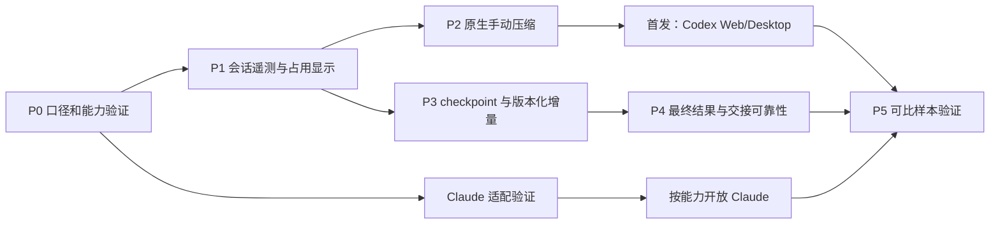

# 智能体上下文与交接效率实施计划

版本：1.1 · 日期：2026-09-14 · 状态：代码已集成至 `codex/agent-context-efficiency`，验证结果见[实施记录](agent-context-implementation.zh.md)。

规范来源：[SPEC](agent-context-spec.zh.md)。发生行为解释冲突时以 SPEC 为准；本文负责拆分交付、依赖、验证和回退。计划不包含 Semantica 或其他领域专用改动。

## 1. 最新决策

| 决策 | 实施处理 |
| --- | --- |
| 用户看见具体智能体会话的上下文占用，并主动压缩 | 第一阶段产品交付，Web/Desktop 同步。 |
| 通过原生运行时压缩保持会话连续 | 作为独立维护操作实现，必须与普通执行互斥。 |
| 长会话之外还存在重复读取与接手重建 | 第二阶段提供版本化上下文和可追溯 checkpoint。 |
| 最终交付判定过于宽泛、消息可能重复投递 | 后续修正最终结果回执和精确事件去重。 |
| 人类主导、小队 leader 判断和即时 @ 协作 | 作为回归约束，不重写其语义。 |
| 默认跳过 leader、语义抑制唤醒、70% 自动换会话 | 已撤回，不进入排期。 |

首发价值是“看得见、能主动压缩、执行可恢复”，不等待所有通用上下文优化完成。后续优化需要有可比测量，不能把 UI 上占用下降当作任务效率提升的唯一证据。

## 2. 交付与依赖

P3 的来源版本/数据设计可与 P2 并行，但生产代码涉及相同 daemon、handler 和输入框时按 PR 串行集成。P4 中最终回执修复可先独立交付，接入 checkpoint 的部分在 P3 后完成。只读能力验证和 fixture 构建可并行，不以真实 Agent 循环压测代替测试。

## 3. P0：计量与原生能力验证

交付：口径测试、运行时能力矩阵、现状基线。

1. 为 Codex 事件/JSONL 建立最小脱敏 fixture，覆盖累计与 last 区别、缓存子集、reasoning 子集和压缩后重估。
2. 修复 JSONL fallback 的 output + reasoning 重复计量；只影响新解析，不自动修改历史数据库。记录哪些旧样本存在偏差，只有原始证据完备时再单独设计回填。
3. Codex 验证 tokenUsage、有效窗口、维护 resume、compact ACK/完成/错误，以及活动任务替换行为。
4. Claude 验证当前安装版本的 headless 会话占用来源、`/compact`、`compact_boundary`、内容不足与压缩后未知快照。仅有交互式 statusline 文档不足以宣称 Enact 可直接获得该字段。
5. 记录已验证 provider/version/protocol 能力，不列未验证运行时为支持。能力探测不调用 LLM；普通单测不用本机已安装 Agent CLI。
6. 定义基线字段与缺失值；区分排队、prepare、resume、业务执行、终态上报，保留失败/取消的部分 usage。维护从原生累计基线/调用身份计算本 operation 增量，排除 resume 历史回放，重复终态不重复入账。

主要位置：[统一适配器](../../server/pkg/agent/agent.go)、[Codex](../../server/pkg/agent/codex.go)、[Claude](../../server/pkg/agent/claude.go)、[daemon 上报](../../server/internal/daemon/client.go)。

完成标准：fixture 明确证明 SPEC AC-02/04；两种原生协议的支持项和缺口可复核；无需访问真实账户的测试默认通过。

## 4. P1：上下文遥测与占用显示

建议拆成两个 PR：会话身份/遥测 API；共享界面/命令入口基础。

后端与 daemon：

- 增加 SPEC 定义的 context session、generation、快照、能力和 producer epoch/seq；与现有恢复选择逻辑关联。
- Codex 接原生 tokenUsage 事件；遥测缺失不影响正常业务执行。Claude 只在 P0 确认稳定来源后接入。
- 最新快照合并上报；daemon 在合并前聚合首尾/峰值，持久化待上报终态摘要，避免节流丢失峰值。失败、取消和断线保留已知数据与未知原因。
- 提供按 Issue/Chat 列会话接口及带版本的 WS 更新；服务端验证对象归属和权限。
- 新 migration 遵守无外键、索引独立 concurrent 构建、down migration 与应用层删除清理。

Web/Desktop：

- 在共享 core 增加 schema、API、Query keys、queries 和格式化函数；服务端数据不放入 Zustand。
- Chat 输入框与 Issue 智能体区域显示当前会话占用和详情，支持多会话、空值、上次记录及模型变化。
- 中文文案使用“智能体”“任务”“运行时”；同步已有四种语言 namespace，沿用 runtime display helper。
- 首版使用已有组件、语义 token 和字号角色；键盘/触屏可打开详情，不依赖 hover。
- 占用详情预留操作区；未达到 P2 的运行时仅展示能力状态，不暴露不能工作的按钮。

主要位置：[core agents](../../packages/core/agents)、[core chat](../../packages/core/chat)、[API schema](../../packages/core/api/schema.ts)、[Chat 输入框](../../packages/views/chat/components/chat-input.tsx)、[Issue 详情](../../packages/views/issues/components/issue-detail.tsx)、[daemon handler](../../server/internal/handler/daemon.go)。

完成标准：AC-01–04/11/20；打开页面和刷新数字产生零个额外模型请求；Web/Desktop 展示一致；缺字段及错误响应有 API 边界测试。

## 5. P2：原生手动压缩

建议拆成三个 PR：维护操作和互斥；Codex 原生执行；按钮与命令及活动记录。Claude 使用同一维护契约独立接入。

服务层：

1. 新增持久化维护 operation，幂等创建、查询、queued 取消、领取、续租、fencing 和终态回报。
2. 在普通执行与维护之间建立同一会话的准入互斥，沿用目录锁；先结束当前 run，再执行已排队维护，再开始下一轮业务执行。
3. 实际领取时再次检查权限、会话 generation 和运行时归属；用户叫停相关工作时取消 queued 操作。
4. 维护结果与快照分开：ACK、原生完成、跳过、失败、待核实各有路径。
5. 重启恢复、断线补报和未知结果核实复用现有持久化上报模式；不得自动重复一个可能已执行的 compact。永久缺少结果证据但进程已退出/会话安全时，以 closed_unknown 终止占位，不伪记失败或永久阻塞。
6. 维护活动对人可见，但不走普通评论触发器；维护 usage 与业务 usage 分开统计。

适配器：

- Codex：使用现有 home/workdir/profile 恢复原生 thread，发 compact，识别 v2 completion，收集新快照和增量维护 usage；确认进程/子进程退出并写盘结束后再释放锁。
- 不把业务 prompt 包装器、Issue 状态更新、最终结果 fallback 或下游派工套到维护操作上。
- Claude：原生已有 session 上发送 `/compact`，以 boundary 判断成功；版本支持不足时对应能力保持关闭。

界面：

- 复用斜杠命令入口，独立 `/compact` 与按钮调用同一 mutation；多目标先选择，混合正文不被吞掉。
- 显示等待、压缩中、成功待更新、无需压缩、失败及待核实；queued 可取消。
- Activity 记录操作者、目标、时间和结果。前后读数未知时不用虚构对比。
- 服务端接受操作前保留草稿；重复点击显示同一操作。

主要位置：[daemon](../../server/internal/daemon/daemon.go)、[daemon RPC](../../server/internal/daemon/wsrpc.go)、[服务层](../../server/internal/service)、[provider adapters](../../server/pkg/agent)、[Issue 输入框](../../packages/views/issues/components/comment-input.tsx)、[Issue 回复框](../../packages/views/issues/components/reply-input.tsx)、[Chat 输入框](../../packages/views/chat/components/chat-input.tsx)。

完成标准：AC-05–12/18/20；尤其证明原生 compact 不会中断正在进行的普通执行，维护不会触发 leader 或推进 Issue 状态。P2 通过后可发布首版，不以 P3/P4 为前置。

## 6. P3：可追溯 checkpoint 与版本化增量

建议拆成三个 PR：来源版本/checkpoint；claim 上下文包；workflow 收敛与可见入口。

1. 为影响执行的共享记录建立可验证的单调水位；覆盖任务内容及评论编辑/删除，不只新增条数。
2. checkpoint 按来源执行、适用范围和版本存储；定义结构、上限、证据引用与权限，拒绝乱序覆盖和跨范围写入。
3. 提供原工作记录中的可见摘要与追溯入口，明确待人决策、未完成项和来源；不另建隐藏事实库。
4. claim 组装当前目标/约束、完整触发输入、有效摘要、增量和缺口；原子读取对应水位。
5. 按接收智能体/工作范围区分 delivered 与 processed，逐消息 ID/版本保存确认及缺口，只推进连续已确认输入；压缩、prepare 或失败不消费输入，跨 Agent 接手过滤不可访问的来源。
6. 统一 global workflow 与 warm hint：只有上下文完整且版本一致时取消强制重复读取；缺包、cold 或缺口仍提供有界补读。
7. 固定 brief 保持稳定，动态 envelope 放 per-turn；预算超限必须显式补读，不截断用户约束。
8. 同步内置 working-on-issues/squads skill、命令/字段说明和 source map，修改“有权限读取等于已经拥有完整上下文”的误导表述。

主要位置：[上下文构建](../../server/internal/daemon/execenv/context.go)、[workflow](../../server/internal/daemon/execenv/runtime_config_sections.go)、[回复提示](../../server/internal/daemon/execenv/reply_instructions.go)、[小队 briefing](../../server/internal/handler/squad_briefing.go)、[内置 skills](../../server/internal/service/builtin_skills)。

完成标准：AC-13–15/17/18/20；必须测试合成后的完整 prompt，而非仅测试 warm hint。确定性 warm fixture 不再要求 `issue get + roots scan`；同一场景有来源变化时仍要求必要补读。

## 7. P4：最终结果与 handoff 可靠性

建议拆成两个 PR：最终回执/补交；精确事件身份/恢复验证。

1. 用 source task + 目标线程 + result revision 标识最终交付；新增 `comment add --final`/稳定 delivery ID，评论和回执原子写入。按 claim 记录的新协议能力启用，替换支持该契约执行的“发过任意评论即已交付”判断；旧安装版本保持原判定并单独统计已知局限，避免重复补发。
2. 普通协作评论继续即时路由，最终结果保持原目标；不要新增一次无条件 leader 唤醒。
3. 结果、必要产物引用与可交接事件原子持久化；outbox 保存原路由目标、事件版本和逐目标回执，补送重新验权但不按新负责人扩大目标；completion 重放只补未交付目标。
4. checkpoint 作为同一交付的来源引用；handoff_ready 是可读事实，不是 Issue 状态或验收。
5. 按可信事件 ID/版本/目标精准去重，保留所有合并输入和新版本；不做语义去重或任意时间窗抑制。
6. 新增 `--final` 和交付字段时，同一 PR 更新 CLI 帮助、内置 working-on-issues/squads skill 及 source map。修正小队文档 fanout 和 workflow stage barrier 的漂移，以现有代码与原生验收契约为准；不借修文档改变路由。

主要位置：[最终结果服务](../../server/internal/service/task.go)、[评论路由](../../server/internal/handler/comment.go)、[完成 handler](../../server/internal/handler/daemon.go)、[评论 SQL](../../server/pkg/db/queries/comment.sql)、[子任务 barrier](../../server/internal/handler/issue_child_done.go)、[小队文档](../../apps/docs/content/docs/squads.zh.mdx)。

完成标准：AC-16–19；进展评论不再抑制最终交付，重试不重复派工，运行中阻塞/@ 仍及时送达，`no_action` 合法且无强制评论，`in_review` 不越过验收 barrier。

## 8. P5：验证、灰度与发布

### 8.1 自动验证

| 层 | 重点 | 方法 |
| --- | --- | --- |
| Provider | 当前窗口口径、ACK/完成、压缩后估算、异常输出 | 脱敏 fixture 和测试创建的假 CLI；不发现本机真实 CLI。 |
| 服务/DB | 会话互斥、退出写盘、closed_unknown、幂等、权限、输入缺口、交付兼容/补送 | Go 单测/集成测试，使用 `internal/testutil`。 |
| API/core | 字段缺失、错误格式、未知 enum、查询隔离、快照乱序 | zod 边界与纯函数测试；无 DOM 文件使用 node 环境。 |
| 共享界面 | 多会话选择、键盘操作、命令、排队反馈、草稿保留 | views 组件测试；不在 app 测试复制共享行为矩阵。 |
| 端到端 | Issue/Chat 维护后继续、跨智能体接手、叫停、重启恢复 | fake provider 驱动固定剧本；Web/Desktop 验证共享接线。 |

每个行为选择一个主要测试层，避免同一矩阵在 helper、组件与 E2E 重复执行。文档交付阶段仅检查引用与一致性；功能实现阶段根据实际改动运行相应 Go/TS 测试、类型检查和 lint。

仓库命令以 Makefile/package.json 为准：`pnpm typecheck`、`pnpm test`、`make test`；迭代时先跑修改包的窄测试，再按风险执行完整检查。新增 SQL 后运行 `make sqlc`。涉及 CLI/skill 时同步内置说明和 source map。

真实运行时语义烟测属于后续实现验证，不由本计划自动执行。按仓库要求，只有获得真实账户/额度调用授权后，才使用 `agentintegration` build tag 和 `ENACT_RUN_REAL_AGENT_SMOKE=1`；否则报告“fixture 已验证，真实版本待验证”，不能宣称端到端已通过。

### 8.2 真实效果验证

选择研究、写作、分析、开发中的可复核任务，分别覆盖短/长会话、warm/cold、单智能体/多智能体；使用相同模型/版本与相近输入分组比较。

- 首发对比：启用显示不增加模型调用；手动压缩后的总业务耗时、维护耗时、总 Token 和验收质量一起记录。
- 增量优化对比：任务/评论补读次数、输入大小、接手首个有效行动耗时、用户纠正和遗漏率。
- 交接修复对比：重复入队、漏交付、恢复后重做及新版本误去重。
- 历史样本和线上观察只提供关联；不把用户主动选择压缩造成的样本差异解释成因果收益。

最小发布门槛：SPEC 对应验收全部通过；没有丢输入、跨权限泄漏、运行中意外中断、重复业务派工或越过验收的回归。性能比较报告样本数和口径，不先承诺统一百分比收益。

### 8.3 灰度与回退

顺序：只读遥测 → 单智能体 Codex 压缩 → Issue 多会话/并发 → 已验证 Claude 能力 → checkpoint/增量 → 最终交接完善。

功能分别受控启用；缺失能力只降级对应增强项，不阻塞原执行。停止维护入口后处理完在途操作和锁；关闭增量路径时回到有界读取；outbox/交付回执回退前核对未完成记录，禁止重放已交付版本。

## 9. 尚需在实现中验证的项目

这些是明确的验证任务，不是等待用户补充需求的阻塞项。

| 项目 | 处理原则 |
| --- | --- |
| Claude 当前 headless 版本能否稳定提供窗口值 | P0 验证；缺失则占用显示未知，原生压缩可按独立能力交付。 |
| 原生崩溃后是否有足够证据定位某次压缩 | 无法确认就待核实，不以历史任意 boundary 判成功，不盲重试。 |
| 已有任务/目录锁如何承载维护操作 | P2 在同一准入路径实现并发 fixture，不另建互不知情的两套锁。 |
| 现有上下文版本机制可复用程度 | P3 以编辑/删除/并发水位测试决定复用；不只按时间戳猜测完整性。 |
| 固定 brief 的实际重复占比与缓存影响 | P0/P3 记录字节/Token 与请求轮数，结合任务效果调整预算。 |
| 真实产品性能收益 | P5 形成可比样本报告后决定后续优化，不提前引入自动轮换。 |

## 10. 当前交付状态

P0–P4 的存储、API、daemon、CLI、共享 Web/Desktop 界面与自动验证已在独立分支实现。P5 已加入固定样本大小比较、race/组件/API 测试与页面验证；真实账户语义烟测和生产样本对照属于发布验收，不用 fixture 替代。

- 隔离分支：`codex/agent-context-efficiency`；原工作区的未提交修改未纳入。
- 新迁移：540–560，无新外键；并发索引独立迁移，登记中断清理钩子。
- 核心实现、接口、测试结果、已知边界与回退操作详见[实施记录](agent-context-implementation.zh.md)。
- 不自动发布、回填历史账单或调用真实智能体额度。
