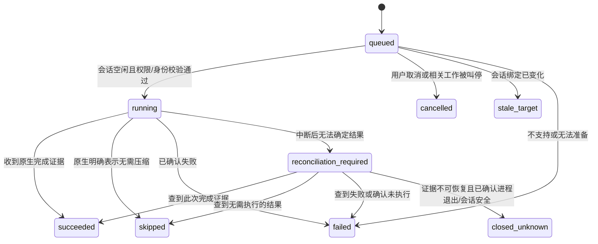

# 智能体上下文与交接效率 SPEC

版本：1.1 · 日期：2026-09-14 · 状态：分支实现，发布前验证见[实施记录](agent-context-implementation.zh.md)。

配套：[实施计划](agent-context-plan.zh.md)。本文定义产品行为、数据契约和验收要求；实施顺序以配套计划为准。本版收敛本次讨论中的优化建议，后文“已撤回”内容不进入实现。

## 1. 目标与范围

降低智能体在持续执行、恢复会话和跨智能体交接中的重复读取、上下文重建和无效等待成本，让人能够观察并控制上下文状态。适用于研究、写作、分析、开发、运营等场景，不依赖具体业务模型。

本次覆盖：

1. 任务（Issue）和对话（Chat）中的智能体会话上下文占用显示。
2. 用户发起的原生上下文压缩，包括按钮和 `/compact` 命令。
3. 持续执行所需的版本化上下文包、增量读取与可追溯工作摘要（checkpoint）。
4. 最终结果的可靠持久化、交接和精确事件去重。
5. 支撑验证的耗时、Token、上下文及交接遥测。

本次不涉及 Semantica、领域专用流程或大范围调度重写。首发界面覆盖共享 Web/Desktop；移动端沿用相同数据和权限语义，其独立界面不属于首发范围。

## 2. 原生协作不变量

| 编号 | 必须保持的行为 |
| --- | --- |
| INV-01 | 人能够查看过程和产物，提出修正、叫停、评审与验收。压缩或 checkpoint 不构成授权或验收。 |
| INV-02 | 小队 leader 保留下一步工作的判断权。`no_action` 是有效评估结果，不能直接计为错误触发。 |
| INV-03 | assignment、明确的 `@mention`、回复和成员更新沿用现有路由及权限；触发预览与实际路由一致。 |
| INV-04 | 执行中的提问、阻塞和明确交接消息及时送达；不统一延迟到执行结束。 |
| INV-05 | 执行结束、结果可交接、任务 `in_review`、人工或既有集成验收完成是不同事件。要求 `done/cancelled` 的 stage barrier 继续遵守原条件。 |
| INV-06 | Issue/Chat 的用户指令、决策、评论和产物是共享事实来源。checkpoint 是带来源的派生记录，不能覆盖用户的新决定。 |
| INV-07 | 会话、数据和操作权限继续按工作区、智能体 Access、运行时及原始资源权限隔离。 |
| INV-08 | 上下文采集、checkpoint 保存和压缩活动记录不因自身创建新的业务执行；正常协作消息仍按原机制触发。 |

已撤回：默认跳过 leader、用模型判断消息“没有价值”后抑制唤醒、达到 70% 自动换会话、将全部中途消息延迟到完成后发送。自动轮换会话不在本版范围内；运行时自带的自动压缩继续由运行时管理。

## 3. 已核实的问题与证据边界

这些是前期只读审计得到的现状，不是本方案实施后的指标。

| 观察 | 对设计的影响 |
| --- | --- |
| 近 30 天样本有 251 次执行；224 次有 usage，失败和取消记录的 usage 缺口明显。 | 建立覆盖成功、失败、取消和维护操作的用量记录；缺失值不能当零。 |
| 一个长会话的原生记录达到约 95% 窗口占用，随后发生原生压缩。 | 上下文压力确实存在，但单个样本不能证明所有慢任务都由长上下文导致。 |
| 19 次 `no_action` 执行消耗约 22.6 分钟。 | 可以优化评估时的上下文成本，不能宣称可删除这 19 次原生判断。 |
| 当前统一 `TokenUsage` 聚合消耗，没有通用的当前窗口占用结构。 | 上下文占用需要独立遥测，不能把累计 usage 除以窗口大小。 |
| Codex JSONL fallback 把 reasoning output 再加到已经包含它的 output 上。 | 先修正计量口径；历史数据只有具备原始证据时才可单独校正。 |
| 通用 workflow 要求每轮读取任务并扫描评论；warm hint 又允许部分按需读取。 | 统一“上下文是否完整”的契约，避免相互冲突的提示。 |
| 当前最终结果 fallback 依据“执行开始后是否发过任何评论”判断是否已交付。 | 普通协作评论不能代替最终交付回执，应按来源执行和交付目标判定。 |

完整来源入口见第 13 节。缓存 Token 占比高不等于零成本；当前样本缺少完整供应商费用记录，本方案不承诺具体账单降幅。

## 4. 概念与身份

| 对象 | 含义 |
| --- | --- |
| Issue / Chat | 团队共享的工作记录或对话容器。 |
| 执行（task / run） | 智能体的一次业务执行；同一原生会话可承载多次执行。 |
| 原生会话 | 由供应商运行时维护的上下文和历史，具有 provider session ID。 |
| `context_session` | Enact 对具体原生会话的受权限保护引用，供遥测和维护使用。不是新的对话容器。 |
| `context_snapshot` | 某会话在某时刻的占用快照，不是累计账单。 |
| `context_operation` | 一次用户发起的会话维护操作；本版仅支持 `compact`。 |
| checkpoint | 某次执行在明确工作范围内保存的事实、证据、未完成项与阻塞摘要。 |
| `context_envelope` | 平台为下一次执行组装的版本化上下文包。 |

会话身份绑定 `workspace_id + agent_id + scope_type + scope_id + runtime_id + provider + provider_session_id + generation`。API 对外使用服务端生成的 `context_session_id`，不得让客户端直接指定任意本机目录或仅凭 provider session ID 操作。

Issue 和 Chat 的同名智能体不因此共用上下文。原生会话重建、运行时迁移或会话目录身份变化时更新 generation；普通 resume 和原生 compact 不创建新 generation。切换模型会使旧窗口快照失效，等待新模型遥测。

历史会话可查看已有快照；首版只允许维护当前可恢复的会话绑定。实际可恢复性仍以现有 resume/retired-session 规则为准，不另造一套“最近成功即健康”的规则。

## 5. 上下文占用显示

### 5.1 界面行为

- Chat 在输入框旁显示选中智能体的“上下文 68%”；存在多个会话时先明确目标。
- Issue 在智能体区域分别显示当前会话占用，不显示整个任务的合计或平均百分比。
- 点击状态展开智能体、模型、运行时显示名、当前占用/窗口、采样时间、估算说明、最近压缩记录，以及“压缩上下文”。
- 未运行过显示“尚无会话”；无可信数据或窗口未知显示“暂不可用”；会话空闲显示“上次记录”；断线、模型变化、会话变化后标明待更新，不沿用为实时值。
- 百分比配文字，不仅靠颜色；使用已有语义颜色、Popover、按钮和键盘焦点。状态更新采用克制的可访问播报，避免每个 Token 变化都播报。
- 首版不把某一百分比描述为“智能体已经变笨”或自动操作阈值。运行时明确报告正在自动压缩时才展示该状态。

示意文案：

```text
智能体 A · Codex · 上下文 68%
占用：176k / 258k Token（估算）
更新于 14:32 · [压缩上下文]
```

### 5.2 计量契约

快照至少包含以下字段；API 使用 snake_case，TS 内部转换为 camelCase。

| 字段 | 约束 |
| --- | --- |
| `context_session_id`, `generation` | 明确采样对象。 |
| `execution_epoch`, `event_seq` | 服务端授予执行/维护租约 epoch，daemon 在该 epoch 内递增序号；旧 epoch 和乱序事件不得覆盖新快照。 |
| `source_task_id` / `source_operation_id` | 关联采样来源，业务执行与维护操作二选一。 |
| `provider`, `provider_version`, `model` | 保存生成该读数的运行时信息。 |
| `used_tokens`, `window_tokens` | 非负分子与正分母；未知使用 null。窗口以当前运行时实际值为准。 |
| `used_percent` | 按已声明口径计算，UI 四舍五入至整数并限制在 0–100；保留原始 Token，超额时详情说明。 |
| `basis`, `is_estimate` | 明确计数口径和是否估算；不能伪装成逐 Token 实时精确值。 |
| `sampled_at`, `received_at` | 分开记录采样与接收时间。 |
| `availability`, `reason` | 至少可表达 available / unknown / unsupported / stale 及原因。 |

首版确定以下口径：

| 运行时 | 读取方式与计算 |
| --- | --- |
| Codex | 接 `thread/tokenUsage/updated`，分子为 `tokenUsage.last.totalTokens`，分母为 `modelContextWindow`；`basis=codex_effective_window`，标为估算。分母已经由运行时折算。 |
| Claude | 在安装版本能可靠提供最新请求 input、cache creation、cache read 和当前窗口时，使用三项之和除以窗口；`basis=claude_input_window`。不能用运行累计的 result usage 代替。 |
| 其他运行时 | 由适配器声明经过验证的口径；未提供可靠数据时显示未知。 |

Codex 本地 TUI 另有扣除固定 baseline 的“用户可用剩余比例”，本产品选择完整有效窗口占用，详情说明可能与原生 TUI 数字不同，不硬编码它的 12,000 baseline。压缩后 Codex 的 input/output 可能为零但 `last.totalTokens` 仍是有效估算，不能自行重建为零。

缓存命中不释放窗口；上下文快照与账单 usage 分开存储。跨运行时口径有差异，不用百分比对不同模型做效率排名。

### 5.3 采集与保存

复用运行时流式事件与现有 daemon 上报连接，不为刷新数字发起 LLM 请求。普通快照最多每个会话每秒上报一次，合并中间读数；原生压缩边界、执行结束和模型变化立即更新。该频率是初始工程设置，可按传输负载调整，不是模型性能结论。

daemon 在节流前聚合每次执行的首尾/峰值，并持久化待上报的终态摘要，不能从每秒最新值反推峰值。服务端保存最新快照、这些执行摘要及压缩前后快照；首版不存每个 Token 更新的永久时序。断线时合并重试最新快照，维护结果和终态使用可恢复的持久化上报。运行指标和维护结果不能依赖可能丢批次的普通文本日志。

## 6. 手动原生压缩

### 6.1 产品契约

- 按钮与 `/compact` 使用同一后端操作。
- `/compact` 是 Enact 命令入口，不作为普通评论或聊天提示发送给业务 Agent。存在多个候选会话时显示选择器；点击提交前始终显示目标。
- 首版只支持独立的 `/compact` 命令，不附带业务指令、`@mention` 或附件；混合输入保留草稿并提示分开发送，不丢弃正文。代码块、引用和正文中的 `/compact` 不拦截。
- 沿用已有斜杠命令入口并声明命令优先级；原有 `/note` 和其他命令行为保持。输入框草稿只有服务端接受操作后才清理。
- 当前会话空闲时执行；正在执行时显示“本轮结束后压缩”。已经 queued 的维护操作在当前执行结束后、下一轮业务执行前获得一次执行机会。
- 排队期间收到的用户消息按原流程保存和排队，维护操作不标记这些消息已处理。排队请求可取消。
- 界面说明“会概括较早内容，可能耗时并消耗 Token”。保留 Enact 中的原始评论、决策和产物关联；原生运行时自行维护其会话历史。
- 首版不提供维护执行中的取消按钮，除非对应运行时已验证支持；原生失败或强制终止不能被描述为可回滚。

### 6.2 状态机



`failed`、`stale_target` 和 `cancelled` 保留原因码。权限在等待期间撤销时取消操作；会话已更换时不得自动改目标。

`succeeded` 与遥测刷新是独立结果：先收到完成证据、尚无新快照时显示“已压缩，占用待更新”。前后对比必须属于同一会话 generation 和该次维护的事件范围。读数没有下降不等于操作失败；没有新读数也不能伪造下降。

### 6.3 执行与恢复

维护流程：

1. 服务端验证工作区成员身份、Issue/Chat 访问权和运行该智能体的权限，解析可恢复会话绑定；保存幂等请求。
2. 拥有会话文件的 daemon 领取操作。普通执行和维护共享调度准入、会话互斥与现有目录锁，领取租约后再次验证 generation、权限和 runtime 绑定。
3. 沿用该会话的账户隔离、provider home、工作目录、模型及权限配置，启动维护进程并恢复原生会话。不得附加业务 workflow、创建新 checkout 或触发工具工作来“帮助压缩”。
4. 发原生 compact，等待正式完成、跳过或失败证据；期间续租并收集维护耗时、usage 和快照。
5. 持久化操作结果、审计和快照，确认维护进程及相关子进程退出、会话写盘结束，再释放会话/目录锁。完成事件已到但进程仍在退出时不能让下一轮抢占。恢复下一轮业务执行时使用原有输入队列和最新上下文。

Codex 每轮结束会关闭 app-server；空闲压缩需要重新启动并 resume 已有 thread，再调用 `thread/compact/start`。该 RPC 的空响应只是 ACK。当前 v2 应识别 `ContextCompaction` item 的完成事件，而不是仅依赖旧 `ContextCompacted` 通知。直接对活动 thread compact 可能中断当前工作，必须通过上述互斥路径。

Claude 使用已有 session 的原生 `/compact`，以 `compact_boundary` 确认实际压缩。原生报告“没有足够内容可压缩”且未出现 boundary 时记为 `skipped`，不是伪造成功或无限重试。

重复请求使用 `(workspace_id, actor_id, idempotency_key)` 返回同一操作；相同键不同 payload 返回冲突。同一会话最多一个未结束的压缩操作，重复点击或不同客户端并发请求返回该操作。

操作领取有持久化 lease 和 fencing token；daemon 重启后 queued 可恢复。执行结果不明时进入 `reconciliation_required`，按该次维护的起始原生事件位置核实；不能拿历史上任意一次 compact 当本次成功。无法证明未执行时不自动重发原生 compact，不承诺原生 API 不支持的 exactly-once。核实期间仅阻止该会话的新操作。

证据永久缺失但已确认旧进程退出、会话文件安全且可恢复时，以终态 `closed_unknown` 结束维护记录，显示“结果无法确认”，释放操作占位和互斥。原幂等键继续返回该记录；用户可另行发起新请求，系统不自动重试。会话不可恢复时沿用现有失效/恢复机制，不以强行解锁并继续原会话掩盖异常。

连接准备超时、维护执行超时与业务执行超时分开配置；无进展超时复用现有 watchdog 原则。断线不等于失败，不自动重建业务会话。对已损坏或失效的原生会话报告现有恢复原因，不能把普通“新建会话”伪装成压缩。

### 6.4 运行时能力

能力分别声明 `context_telemetry`、`native_compact`、`compact_completion_signal`，附带 `runtime_version` 和 `protocol`。首版取消只针对排队操作，不声明运行中取消能力。原生控制要求内置 vendor adapter、已检测的兼容版本及非 Windows 的进程组恢复支持；版本缺失、无法解析、未知主版本、自定义 profile 不启用控制。版本变化后重新校验。使用已有版本检测元数据，不额外执行模型请求。协议 fixture 验证与真实安装版本验收分别记录，见实施记录。

Codex 为首个端到端交付目标。Claude 原生具备压缩能力，但 Enact 的 headless 遥测与完成事件接入须通过适配验证；压缩与百分比可以独立开放。其他运行时逐个加入。无原生能力时显示“不支持”，不以普通提示词总结冒充原生压缩。

## 7. 版本化上下文与 checkpoint

### 7.1 上下文包

`context_envelope` 包含：

- schema 版本、当前工作范围、平台读取水位 `source_revision`、相关权限版本。
- 当前目标、用户约束、任务状态、负责人和必要的资源引用。
- 本次触发、所有合并输入及原始消息 ID/版本；保留原有触发身份。
- 与当前智能体/明确依赖工作有关的最新有效 checkpoint。
- 变化列表、缺口说明和明确的 `fetch_required` 引用。

按工作范围维护单调版本或等价可验证游标。影响执行的任务正文、评论新增/编辑/删除、状态、负责人、验收和资源绑定变化均使相关版本前进。构建快照及其水位必须一致；水位后的并发变化留给增量输入，不能落在读取与确认的缝隙中。

该版本只证明平台已记录的信息完整，不能证明本机文件或外部系统从未变化。引用代码、文件、数据时保存可用的 revision/hash，智能体在依赖其正确性的操作前按原流程验证。

`delivered_cursor` 表示已注入，`processed_cursor` 表示执行在指定版本上确认处理。两者按接收智能体与工作范围隔离，不能把全 scope 的最新版本当作所有智能体已处理的水位。按 `message_id + revision` 保存逐输入确认及缺口，只推进连续已确认的相关输入；跨线程先处理较新消息，不能跨过旧未处理指令。不得因准备、压缩或注入就把消息标为已处理。失败、取消和断线保留未处理输入。接收者读取原始证据时仍执行资源权限校验。

首版上下文包预算为 200 条输入、48,000 字节。超限明确返回 `complete: false` 和 `gap`，保留原有有界读取，不截断后宣称完整。Issue 使用事务内 revision；Chat 使用同一快照中头部与消息内容/版本的 SHA-256 水位，消息编辑独立增加 revision，不因消息到达锁住会话行。普通 Chat 没有有效 checkpoint 时不重复注入整个原生历史。

### 7.2 checkpoint

建议持久化字段：`workspace_id`、工作范围、`source_task_id`、`author_agent_id`、版本、来源水位、目标、用户约束引用、已完成项、证据引用、未完成项、阻塞、待人决策、适用对象和 supersedes 关系。

保存原则：

- 来自执行过程中已经形成的结构化工作事实，在实质里程碑、交接和结束时更新；不每个工具调用写一次，也不强制每轮额外调用模型生成摘要。
- 包含决策、事实和证据，不保存原始思维链、全量工具输出或账户凭据。
- 初始单条正文上限 16 KiB，超长证据用引用；超限返回可纠正错误，不静默截断约束。上限是可调工程预算。
- checkpoint 与最终结果各有作用：前者帮助续做，后者向用户交付。保存 checkpoint 不合成普通评论；在原工作记录中提供“工作摘要”入口，显示作者、来源执行、版本和证据。
- 人通过既有评论/编辑工作要求纠正摘要；新约束使相应旧摘要失效。摘要保留来源，不覆盖人类决定。
- 跨智能体只提供权限允许的共享工作事实。不得把原生私有会话、其他 Chat 或不可访问资源的内容直接复制给接手者。
- 按工作范围和来源依赖挑选摘要，不能盲取“整个任务最新一条”。乱序写入不能覆盖新版本。

### 7.3 读取决策

| 情况 | 下一轮行为 |
| --- | --- |
| warm resume，版本一致、无缺口 | 消费已提供的输入和有效摘要，不再强制重复 `issue get` 与 roots scan。 |
| 存在相关变化 | 消费增量；需要原文或证据时按引用读取。 |
| cold start、跨智能体或原生会话丢失 | 提供当前目标、约束、有效摘要及必要原始引用；缺失时执行有界补读。 |
| 评论编辑/删除、摘要过期或权限变化 | 标明失效，补读权威内容；不能以 `new_comment_count == 0` 判定无需更新。 |
| 未支持上下文包的安装客户端或缺失必要字段 | API 边界降级为现有有界读取，并记录原因。 |

初始上下文包正文预算为 32 KiB；重要指令不得静默截断。无法完整提供时明确 `complete=false` 和必须补读项，禁止将其视为完整上下文跳读。预算不是模型 Token 限制，长引用采用渐进读取。

稳定 runtime brief 只保留每轮必须遵守的短契约；动态目标、触发、cursor、checkpoint 放在 per-turn 输入中。统一全局 workflow 和 warm hint；缓存前缀不混入时间戳或动态摘要。摘要与增量仍不能阻止智能体主动查证必要信息。

## 8. 最终结果、handoff 与精确去重

最终交付回执按 `(source_task_id, destination_thread_id, result_revision)` 标识；包含结果正文引用、必要产物引用和来源 checkpoint 版本。支持一次执行向多个原触发线程分别交付。

新增最终评论声明：拟为 `enact issue comment add` 增加 `--final`，写入 API 增加 `delivery_kind=final_result` 和稳定 `delivery_id`。来源 task 从认证上下文解析，不信任任意作者字段。调用方为一次逻辑交付创建并保留 delivery ID；服务端在事务内分配该来源/目标的 result revision，写评论及回执。相同 ID 重试返回原交付，不另增 revision；不同 payload 复用 ID 返回冲突。后续实质修订创建新 ID/版本，Chat 的完成输出同样绑定来源执行的交付身份。

将 `final_result_receipts_v1` 作为 claim/协议能力记录到每次执行。仅在 server、daemon 与托管 CLI/skill 契约均支持时启用新判定；旧安装客户端的执行继续现有交付判定并记录 legacy 覆盖率，不因缺少新字段重新补发已存在评论。这个 API 边界降级保留旧路径的已知局限，不把旧模式统计为已修复；不在执行中途切换模式，也不按评论正文猜测 final。

最终结果及其可访问的必要产物先持久化，再发布可交接事实。复用现有终态/恢复 outbox 模式：结果提交与待发送事件原子落库，发布失败可补送。评论落点和被唤醒目标是两个概念：outbox 保存原事件版本、按现有路由解析的目标智能体/小队、触发身份、授权版本及逐目标投递回执。补送时重新检查当前权限，但不按后来变化的负责人重新解析或扩大目标；消息编辑产生独立新版本事件。`handoff_ready` 只表示该版本结果可读，是内部事实，不是新 Issue 状态，也不是额外唤醒一轮 leader 的独立触发器。

普通中途评论、提问和 `@mention` 继续即时路由。最终结果评论也保持原有路由目标；后续 `handoff_ready` 只补充同一交付身份，不再把同一结果重复派工。执行完成回调只补交尚未有最终回执的目标，不再用“发过任何评论”判断已交付。

运行结束不自动意味着产物已验收；`no_action` 继续允许无结果评论。必要产物缺失时可以交付明确的阻塞/部分结果，但不能将其标为完整结果已准备好。

去重键依据可信事件身份、来源版本、路由目标和交付身份。相同事件重传不重复入队；不同用户指令、编辑后的消息、新结果版本、失败恢复和重新打开后的工作不得被正文相似度或时间窗口吞掉。已有队列合并可继续使用，但所有合并输入必须有来源，并按处理水位恢复。

## 9. 服务边界与存储建议

以下为拟新增契约，不代表当前已有端点。实施时按现有 router 和服务命名收敛，行为要求不变。

| API | 作用 |
| --- | --- |
| `GET /api/context-sessions?issue_id=...` 或 `?chat_session_id=...` | 二选一工作范围，返回可访问的会话、能力与快照。 |
| `POST /api/context-sessions/{id}/compactions` | 请求体含 `expected_generation`、`idempotency_key`，返回维护操作。 |
| `GET /api/context-operations/{id}` | 查询状态、原因和压缩前后快照。 |
| `POST /api/context-operations/{id}/cancel` | 首版取消 queued 操作；已运行返回当前状态和不可取消原因。 |
| 工作范围内 checkpoint 读写端点 | 读取需原工作记录权限；智能体写入由其来源 task token 约束，不能伪造其他执行作者。 |

所有端点校验 `X-Workspace-ID` 与对象归属。daemon 上报和领取走现有认证及运行时归属检查，终态写入验证 lease/fencing token。对用户可见状态推送 `context_session.updated`、`context_operation.updated` 等带版本事件；这些 UI 事件不连接业务触发器。

逻辑存储分为三部分：会话绑定及最新快照、维护操作及持久化终态、checkpoint 版本。建议新增单数表 `agent_context_session`、`agent_context_operation`、`agent_context_checkpoint`，执行摘要复用任务用量/结果关联。避免永久保存高频快照和另建全量会话历史副本。

数据库不加外键或级联，关联校验和工作区/智能体/工作记录删除清理由应用事务完成。每个新索引使用独立单语句 migration 的 `CREATE [UNIQUE] INDEX CONCURRENTLY`，提供 down migration，编号在实现时分配。原生 session ID、路径和私有日志不进入未授权的公共界面。

界面数据由 React Query 管理，key 含 workspace ID；Zustand 仅保留客户端选择/草稿。API 用 zod + `parseWithFallback`，缺字段和未知枚举保持界面可用；未知能力默认不执行维护。共享 UI 在 `packages/views`，原子组件在 `packages/ui`，模型与查询在 `packages/core`。运行时名称沿用共享 display helper。

## 10. 可观测性与效果判定

分开记录排队、环境准备、原生 resume、首个有效事件、业务执行、压缩、结果发布与接手延迟。事件关联 `task_id`、会话 generation、触发身份、checkpoint 版本和 result revision，不能只用“总耗时”判断原因。

用量区分普通执行/维护操作、非缓存输入/缓存读取/缓存写入/输出；reasoning 若为输出子集不重复求和。维护开始时先记录原生累计基线及事件位置，resume 回放不计入本次维护；只有属于本 operation 的新增调用才计费。提供调用级 usage 时按调用身份去重，仅提供累计计数时用基线差值；计数重置或基线缺失不能得到可信增量时标记缺失。账单既不使用上下文 `last`，也不把整个会话的 `total` 记到一次压缩。终态重传按 operation/调用身份幂等入账。

供应商未报告费用时显示未知，估算费用明确标注。失败和取消使用已得到的部分 usage，并记录覆盖情况。

核心指标：

- 上下文遥测覆盖率、更新时间、峰值占用、压缩发生点。
- 压缩等待/执行耗时、完成/跳过/失败/待核实比例、维护 Token。
- 上下文补读次数和原因、已提供内容的重复读取、cold/warm 比例。
- 交接到首个有效行动的耗时、重复派工、遗漏交付、输入重放情况。
- 最终任务完成率、用户纠正、验收返工和恢复成功率。

按相同运行时/版本、模型、任务类别、上下文长度和 warm/cold 分组比较。首发不承诺统一的耗时或费用降幅；确定性验收要求见第 11 节，真实效果由上线后的可比样本决定。

## 11. 验收矩阵

| 编号 | 场景 | 必须成立 |
| --- | --- | --- |
| AC-01 | Issue 多智能体、Chat 多会话 | 占用和操作对应明确会话，不能聚合或串用。 |
| AC-02 | 累计 Token 很大、当前上下文较小、维护恢复历史 | 百分比只由当前快照计算；维护排除历史回放，缓存/reasoning/重复终态不重复计量。 |
| AC-03 | 窗口缺失、模型切换、乱序及同秒多个峰值 | 显示未知或待更新，旧事件不覆盖新状态；节流和断线恢复不丢已聚合峰值。 |
| AC-04 | Codex 压缩后 input/output 为零 | 使用 `last.totalTokens`，不显示伪造 0%。 |
| AC-05 | 按钮与 `/compact`、多目标、混合文本 | 同一操作契约，目标明确；不创建业务评论、不丢草稿。 |
| AC-06 | 业务执行与维护同时抢占、共用目录 | 最多一个写会话的执行；现有目录隔离有效。 |
| AC-07 | 排队时新消息到达或会话更换 | 输入保留；换代请求终止为 stale_target，不误操作新会话。 |
| AC-08 | 重复点击、重复 RPC、ACK 后断线 | 平台操作幂等；ACK 不算完成，结果不明先核实。 |
| AC-09 | 原生完成但无新遥测，或内容不足 | 分别显示“已压缩，占用待更新”与“无需压缩”。 |
| AC-10 | daemon 崩溃、完成后进程未退、证据永久缺失 | 进程写盘结束前不释放锁；可核实或安全 closed_unknown，无盲目重压、孤儿进程或永久占位。 |
| AC-11 | 跨工作区请求、无智能体权限、权限撤销 | 读取/执行被正确拒绝；维护不扩大资源或运行权限。 |
| AC-12 | 长会话压缩后下一次业务执行 | 同一有效会话继续，原评论/产物关联可追溯，队列输入未被消费。 |
| AC-13 | warm 且输入版本完整一致 | 合成后的完整 prompt 不再要求机械重复任务读取和 roots scan。 |
| AC-14 | 评论编辑/删除、跨线程乱序确认、并发输入 | 按接收者保留消息版本缺口，旧未处理指令不被越过；摘要过期需补读。 |
| AC-15 | 跨智能体交接或原生会话丢失 | 从有权限的共享目标、约束、摘要与证据续做；缺失部分明确。 |
| AC-16 | 进展评论、多线程 final、新旧交付协议 | 新协议原子写评论/回执，重复 completion 不重复交付；旧协议缺字段不导致二次补发。 |
| AC-17 | 执行中提问/阻塞/明确 @、leader no_action | 原路由及时送达；no_action 不被删除或强制发评论。 |
| AC-18 | in_review、人工拒绝、叫停、stage barrier | 验收边界与停止意图保持，摘要和压缩不推进业务状态。 |
| AC-19 | 结果落库后崩溃、负责人/@版本变化后补送 | 按持久化目标重新验权补交，旧事件不扩大路由或重复派工，新版本不被吞。 |
| AC-20 | 旧 Desktop/daemon、未知运行时能力 | 界面可读、普通执行可继续；只关闭缺失能力对应的增强功能。 |

AC-12/15 的语义质量用人工可复核的目标/约束/未完成项清单评估，不能以模型自报“全部保留”作为唯一证据。

## 12. 上线与回退

分别控制遥测显示、手动压缩、上下文包/增量读取和最终结果回执的启用范围。观察功能先于控制功能，Codex 先于未验证运行时，单智能体先于复杂并发小队的灰度范围。

暂停压缩入口不影响普通会话继续；已在执行的维护操作先完成或核实并释放锁。回退增量上下文后恢复原有有界读取；历史 checkpoint 与活动记录继续可查看。结果回执/去重规则只能在未完成交付已核对后停用，不能因此丢失 outbox 或重新派发已交付结果。

不在本次实现中回写历史计费数字、自动改变模型、默认自动轮换会话或改写 leader 职责。

## 13. 依据与核实入口

本地源码观察时间为 2026-09-14；行号仅作导航，实现前以符号和实际安装版本复核。

- [Enact 原生协作愿景](../../VISION.md)。
- [仓库规范](../../CLAUDE.md)与[中文及命名规范](../../apps/docs/content/docs/developers/conventions.zh.mdx)。
- [统一 Session / TokenUsage](../../server/pkg/agent/agent.go)。
- [Codex 通知处理](../../server/pkg/agent/codex.go)与[JSONL 用量 fallback](../../server/pkg/agent/codex.go)。
- [Claude 流式 system/result 处理](../../server/pkg/agent/claude.go)。
- [每轮 workflow](../../server/internal/daemon/execenv/runtime_config_sections.go)、[warm hint](../../server/internal/daemon/execenv/reply_instructions.go)、[小队 briefing](../../server/internal/handler/squad_briefing.go)。
- [完成回调](../../server/internal/handler/daemon.go)、[最终结果 fallback](../../server/internal/service/task.go)、[HasAgentCommentedSince](../../server/pkg/db/queries/comment.sql)。
- [会话恢复筛选](../../server/pkg/db/queries/agent.sql)、[stage barrier](../../server/internal/handler/issue_child_done.go)。
- [小队文档](../../apps/docs/content/docs/squads.zh.mdx)。已修正结果评论额外唤醒 leader 的旧说明；显式目标优先，不增加 fanout。
- 本机外部 Codex 源码仅用于本次能力审计，不是 Enact 构建依赖：[占用协议](/Users/jaden/PycharmProjects/CodeX/codex-rs/app-server-protocol/src/protocol/v2/thread.rs:1318)、[压缩后估算](/Users/jaden/PycharmProjects/CodeX/codex-rs/core/src/session/mod.rs:3196)、[压缩 RPC](/Users/jaden/PycharmProjects/CodeX/codex-rs/app-server/src/request_processors/thread_processor.rs:1732)、[活动任务替换](/Users/jaden/PycharmProjects/CodeX/codex-rs/core/src/tasks/mod.rs:306)。
- Claude 官方文档：[原生压缩与完成信号](https://code.claude.com/docs/en/agent-sdk/slash-commands#compact-history-with-compact)、[占用口径及空值](https://code.claude.com/docs/en/statusline#context-window-fields)。文档证明原生能力存在，不代表 Enact 的安装版本已接通所有字段。
