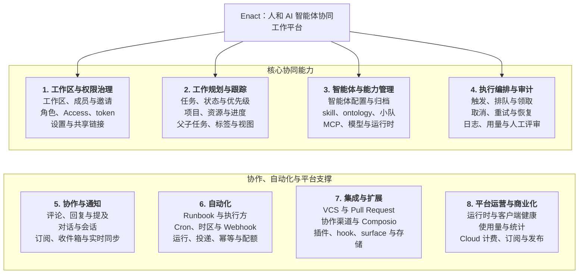
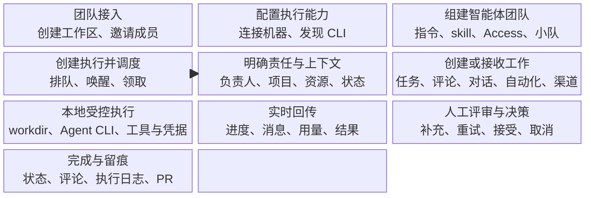
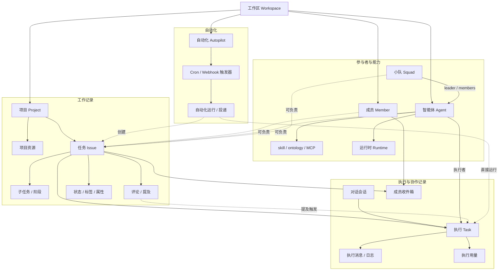
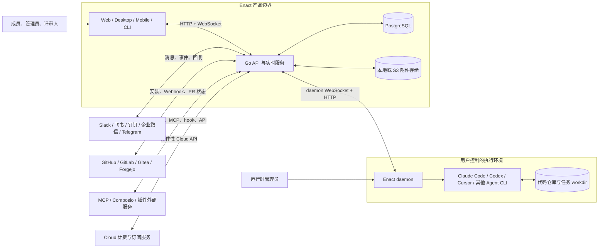
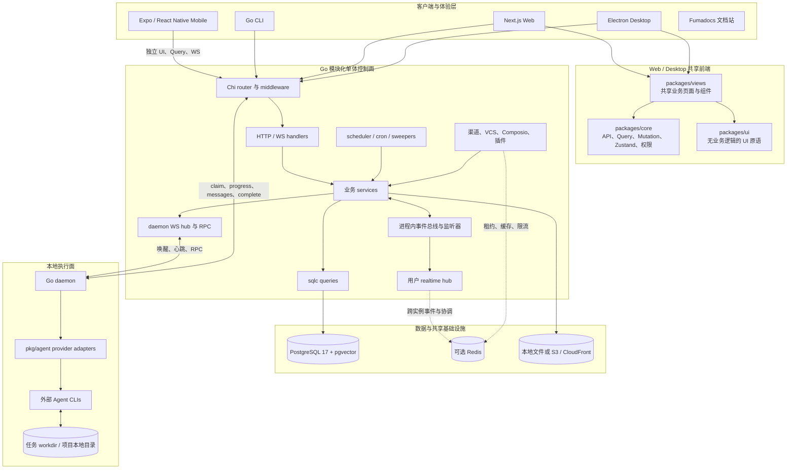
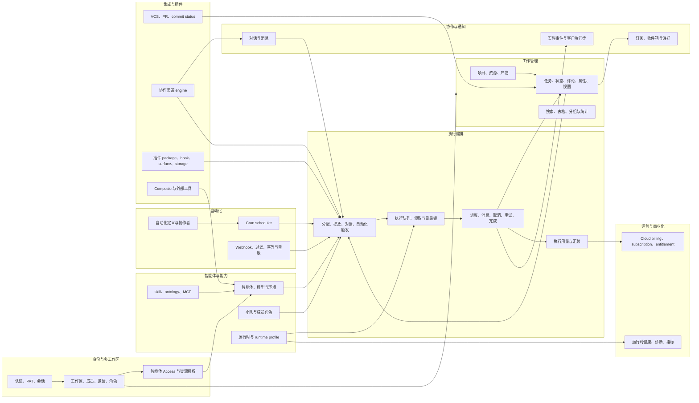
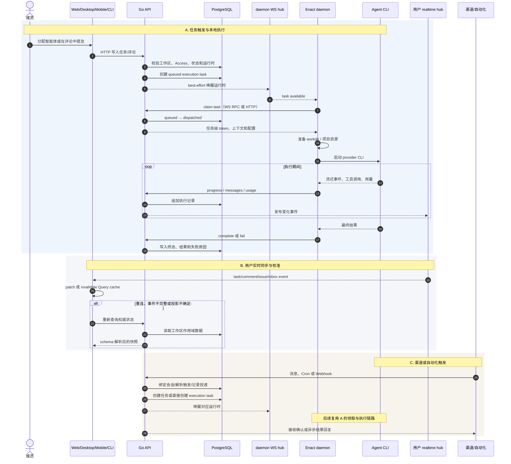
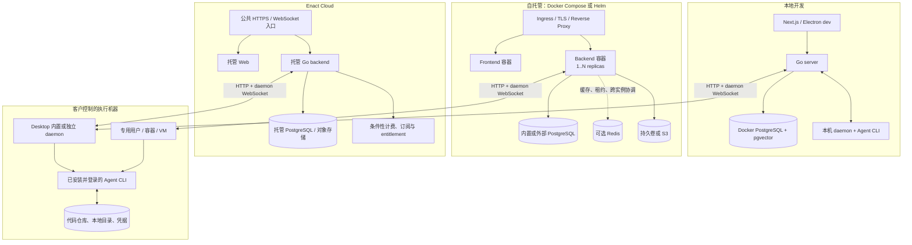

# Enact 当前产品架构

> 业务架构、应用架构与技术架构统一视图  
> 版本：v1.0（当前态）  
> 架构基线：2026-09-02 / Git `6cefa6f5b486`  
> 适用读者：管理层、产品经理、业务分析师、架构师、研发、测试与平台运维

## 执行摘要

Enact 是一个面向小型团队的 AI 原生任务管理与执行协调平台。它把成员、智能体、工作任务、执行记录和运行环境放在同一个工作区内，使一项工作从提出、分派、执行、回传到人工评审都保留在同一条可追溯链路中。产品的核心不是重新实现大模型或 Agent Runtime，而是把现有 AI 编程工具作为外部执行器，通过统一的任务、权限、上下文、状态、通知和审计机制组织为团队成员。

当前架构由两个清晰分离的平面组成：

- **协作与控制面**：Web、Desktop、Mobile、CLI 与 Go 后端共同管理工作区、任务（`issue`）、智能体、项目、小队、对话、自动化、通知、权限、集成和执行状态。PostgreSQL 是业务数据权威来源。
- **本地执行面**：运行在用户电脑或受控服务器上的 Enact 守护进程领取执行（`task`），准备独立工作目录并启动 Claude Code、Codex、Cursor 等外部 Agent CLI。代码、CLI 登录凭据和实际文件操作留在执行电脑。

后端当前采用 **Go 模块化单体**，通过 HTTP API、用户 WebSocket 和 daemon WebSocket 同多端客户端及守护进程通信。Redis、S3/CloudFront、云端计费、部分协作渠道和外部工具连接均为按部署方式或环境变量启用的条件性能力。Web 与 Desktop 共用业务逻辑和页面包；Mobile 保持独立的 UI、状态、查询与实时订阅实现，只共享类型和纯函数。

本文只描述基线提交中能够由代码、配置或产品文档证实的当前能力，不包含目标产品蓝图、问题评级、整改建议或演进路线。

## 1. 文档定位

### 1.1 架构范围

本文覆盖以下系统边界：

- Enact 的业务参与者、业务能力、价值流、核心对象及业务规则；
- Web、Desktop、Mobile、CLI、Go 后端、守护进程与外部 Agent CLI；
- PostgreSQL、可选 Redis、本地/S3 附件存储及本地执行目录；
- GitHub、GitLab、Gitea、Forgejo、Slack、飞书、钉钉、企业微信、Telegram、Composio、MCP 和插件等外部连接；
- 本地开发、自托管与 Enact Cloud 三种运行形态；
- 当前认证授权、工作区隔离、实时通信、执行调度、可靠性、可观测性和发布机制。

以下内容不在本文范围内：

- Enterprise Work Intelligence Platform、Intelligence Space、Capability Hub 等未来产品设想；
- 尚未出现在基线代码、配置或正式产品文档中的能力；
- 架构成熟度打分、风险优先级、问题整改或目标态设计；
- 各业务功能的操作手册、完整 API 参考和逐表数据库字典。

### 1.2 术语约定

| 中文表达 | 代码或产品术语 | 定义 |
| --- | --- | --- |
| 任务 | `issue` | 持续存在的一项工作，承载目标、描述、讨论、状态、负责人和历史。 |
| 执行 | `task` | 智能体的一次具体运行记录；同一任务可产生多次执行。 |
| 智能体 | `agent` | 可复用的身份、指令、模型、skill、Access 和运行时配置，不是常驻进程。 |
| 运行时 | `runtime` | 守护进程在某台电脑上暴露的具体 Agent CLI 执行能力。 |
| 守护进程 | `daemon` | 连接 Enact、领取执行、准备目录、启动 Agent CLI 并回传结果的本地进程。 |
| 工作区 | `workspace` | 成员、任务、智能体和配置的租户与权限边界。 |
| skill | `skill` | 可复用的方法、指令和支持文件集合。 |

除非讨论代码或数据库，本文用“任务”表示 `issue`，用“执行”表示 `task`，避免把长期工作对象与单次 Agent 运行混为一谈。

### 1.3 架构原则

当前实现体现了以下稳定原则：

1. **人和智能体共享工作对象。** 智能体可以成为任务负责人、发表评论和修改状态，执行历史与人的讨论保留在同一任务中。
2. **协作控制与代码执行分离。** 服务端保存协作事实与执行元数据，守护进程在用户控制的机器上执行 Agent CLI。
3. **PostgreSQL 是最终状态。** WebSocket 用于降低延迟；客户端与守护进程在重连或提示丢失后通过查询、领取或轮询重新校准。
4. **工作区是强制作用域。** 请求身份、成员资格、资源归属、查询条件、缓存 key 和实时订阅都必须保留工作区边界。
5. **服务端状态与客户端状态分离。** TanStack Query 管理服务端数据；Zustand 只管理视图、草稿、弹窗和布局等客户端状态。
6. **平台复用外部执行器。** provider 适配层统一启动、流式事件、取消和用量，但不复制 Claude Code、Codex 等工具本身。
7. **执行完成不等于任务完成。** 执行 `completed` 只表示本轮运行结束；任务是否结束由任务状态和人工或集成决策决定。
8. **安装客户端需要 API 漂移容忍。** 网络响应在前端 API 边界经过 schema 解析，下游对新增或缺失字段采取防御性处理。

## 2. 架构总览

Enact 的产品核心可以概括为“一个工作记录、多个触发入口、一个受控执行链路、一个人工负责的结果闭环”。团队可以从任务、评论提及、直接对话、自动化或协作渠道发起工作；后端把触发解析为执行，运行时在指定电脑领取；Agent CLI 在本地完成工作；过程、用量与结果回到原始上下文。

| 架构层 | 当前组成 | 主要责任 |
| --- | --- | --- |
| 体验与接入 | Web、Desktop、Mobile、CLI、协作渠道 | 创建和查看工作、配置智能体、评审结果、接收通知。 |
| 业务应用 | Go API 模块化单体 | 身份与工作区、工作管理、执行编排、协作、自动化、集成、插件及商业化。 |
| 实时与调度 | 用户 WebSocket、daemon WebSocket、事件总线、scheduler、sweeper | 推送变化、唤醒运行时、定时触发、回收和修复执行状态。 |
| 数据与存储 | PostgreSQL、可选 Redis、本地或 S3 附件存储 | 保存权威业务状态、跨实例协调、缓存和文件对象。 |
| 执行 | Enact daemon、provider adapter、外部 Agent CLI、本地 workdir | 领取执行、准备上下文和目录、启动工具、流式回传和结束执行。 |
| 外部生态 | VCS、协作渠道、MCP、Composio、插件、云计费服务 | 引入外部事件、上下文、工具和商业化能力。 |

## 3. 业务架构

### 3.1 业务参与者

| 参与者 | 责任与行为 | 权限边界 |
| --- | --- | --- |
| 工作区 `owner` | 创建和管理工作区、成员、全局设置及所有管理能力。 | 工作区最高管理角色；不能绕过其他成员私有智能体的 Access 运行限制。 |
| 工作区 `admin` | 管理成员、任务状态、智能体和工作区级配置。 | 低于 `owner`；不能执行仅允许 owner 的工作区删除等操作。 |
| 工作区 `member` | 创建和推进任务、项目、评论、对话及允许访问的智能体工作。 | 受成员资格、资源归属和智能体 Access 控制。 |
| 智能体 owner | 配置智能体身份、指令、skill、运行时和 Access。 | 对智能体的 Access 设置拥有最终控制。 |
| 智能体 | 接收任务、评论提及、对话或自动化触发，执行并回写。 | 通过绑定 task/agent 的临时 token 调用 Enact；没有人的收件箱。 |
| 小队 leader | 接收分配给小队的任务，依据成员角色和状态协调执行。 | 小队执行仍以 leader 的智能体可用性和 Access 为入口。 |
| 运行时管理员 | 安装并运行守护进程，选择机器、目录、并发、CLI 和凭据。 | OS 用户及其外围隔离是本地执行的实际安全边界。 |
| 评审人/任务负责人 | 检查产出、补充要求、决定继续、完成或取消。 | 任务状态与业务完成由人或明确集成规则控制。 |
| 外部系统 | 提供 VCS 事件、协作消息、Webhook、工具连接或计费结果。 | 通过安装、token、OAuth、签名、secret 和作用域配置接入。 |

### 3.2 业务能力地图

图 1 将当前产品能力归入八个一级业务能力域。一级能力描述产品稳定责任，不等同于页面或代码目录。



各能力域的业务结果如下：

| 一级能力 | 主要业务结果 | 代表性业务对象 |
| --- | --- | --- |
| 工作区与权限治理 | 团队、数据、成员和可运行智能体在明确租户边界内协作。 | `workspace`、`member`、`workspace_invitation`、`personal_access_token` |
| 工作规划与跟踪 | 一项工作有目标、负责人、状态、项目归属、讨论和可查询历史。 | `issue`、`project`、`issue_status`、`label`、`property`、`issue_view` |
| 智能体与能力管理 | AI 协作者的身份、方法、模型、工具和执行位置可以复用与治理。 | `agent`、`skill`、`squad`、`runtime_profile`、`workspace_mcp_server` |
| 执行编排与审计 | 每次触发形成独立执行，可领取、追踪、取消、恢复和计量。 | `agent_task_queue`、`task_message`、`task_usage`、`task_token` |
| 协作与通知 | 人和智能体围绕同一工作上下文交流，重要变化定向到人。 | `comment`、`chat_session`、`chat_message`、`inbox_item`、`notification_preference` |
| 自动化 | 重复工作可按时间或外部事件触发，并保留运行与投递记录。 | `autopilot`、`autopilot_trigger`、`autopilot_run`、`webhook_delivery` |
| 集成与扩展 | 外部协作、VCS、工具和插件接入同一工作与执行链路。 | `vcs_connection`、`channel_installation`、`plugin_installation`、`user_composio_connection` |
| 平台运营与商业化 | 平台可观测运行状态、统计消耗，并在 Cloud 部署下实施计费授权。 | `runtime_usage`、`client_usage_daily`、Cloud billing/subscription API |

### 3.3 核心价值流

图 2 描述从团队接入到结果留痕的主价值流。任务、评论、对话、自动化和渠道可以从不同位置进入，但都会汇入同一执行编排能力。



价值流中的关键控制点是：

- 分派前检查负责人类型、智能体可见性与 Access、归档状态、运行时绑定和任务状态分类；
- `backlog` 类别用于停放工作，分配智能体不会启动执行；离开该类别且不直接进入终态时才可能触发；
- 每次触发创建独立执行，旧执行不会被新一轮覆盖；
- 本地目录、CLI 登录态和文件修改发生在运行时所在电脑；
- 执行消息、状态与用量持续回写，页面通过实时事件更新；
- 智能体通常把有实质产出的任务推进到 `in_progress` 和 `in_review`，`done` 通常由人工确认或明确的集成规则完成。

### 3.4 核心业务对象关系

图 3 展示工作区作用域内工作记录、参与者与能力、执行协作记录及自动化对象之间的业务归属和主要关联。



关系图表达逻辑归属，而不是数据库外键。Enact 的数据库迁移明确不创建 foreign key 或级联动作；关系校验、工作区约束和依赖清理由应用服务显式完成，必须原子化的流程使用应用事务。

### 3.5 核心业务规则

#### 工作区与成员

- 所有主要业务查询都按 `workspace_id` 过滤；`X-Workspace-ID` 用于选择工作区，不能替代成员资格校验。
- 成员角色为 `owner`、`admin`、`member`；角色管理与智能体 Access 是两套独立控制。
- 工作区删除、成员离开、资源删除等需要清理依赖的行为由应用层显式处理。

#### 任务与状态

- 任务负责人是多态关系，可指向成员、智能体或小队。
- 内置状态类别固定为 `backlog`、`todo`、`in_progress`、`in_review`、`done`、`blocked`、`cancelled`；自定义状态继承其中一个类别的系统行为。
- 状态没有强制线性流转。执行失败且没有其他活动执行或重试时，`in_progress` 类任务回到内置 `todo`。
- 关联 GitHub PR 带关闭意图合并且没有其他 open/draft PR 时，任务可由集成置为 `done`。
- 一个任务最多属于一个项目；父子任务各自独立，阶段结束可唤醒父任务负责人。

#### 智能体、小队与执行

- 智能体是配置，不是常驻进程；每次工作都形成新的执行。
- 智能体 Access 支持 Only me、Entire workspace、Specific people；工作区管理员可管理智能体，但不能绕过 Access 运行私有智能体。
- 小队由智能体 leader 负责接收和协调；分配时以 leader 的运行准备和 Access 为入口。
- 执行状态包含 `deferred`、`queued`、`dispatched`、`waiting_local_directory`、`running`、`completed`、`failed`、`cancelled`。
- 普通执行的基础设施故障可自动重试；自动化“仅运行”模式不自动重试。

#### 协作、通知与自动化

- 对人的提及、分配、订阅变化进入收件箱；智能体没有收件箱，对智能体的提及直接触发执行。
- 对话不依附任务，但每条触发智能体的消息仍会形成执行和可查询记录。
- 自动化由 Runbook、执行方、输出模式、订阅者和一个或多个 Cron/Webhook 触发器组成。
- Webhook 支持事件过滤、签名、大小限制、速率限制和幂等键；被过滤、暂停或重复的投递保留可解释结果。

### 3.6 数据与责任边界

| 边界 | Enact 服务端保存 | 执行电脑保存或控制 |
| --- | --- | --- |
| 协作事实 | 工作区、成员、任务、评论、项目、状态、通知 | 不作为权威来源 |
| 智能体配置 | 指令、模型、skill、Access、运行时引用、允许的环境配置 | Agent CLI 本身及其本地认证状态 |
| 执行记录 | 队列状态、消息、时间、用量、结果和失败原因 | 实际子进程、临时状态与本地日志 |
| 代码与文件 | 项目资源引用、附件或产物元数据 | 仓库 checkout、本地目录和所有实际文件修改 |
| 凭据 | 经配置保存的应用 secret、`custom_env` 和任务级 Enact token | Agent CLI、Git、云 CLI、SSH 等本地凭据 |
| 隔离 | 工作区、身份、token 和 API 作用域 | 守护进程 OS 用户、容器或虚拟机边界 |

## 4. 应用架构

### 4.1 系统上下文

图 4 展示 Enact 与用户、执行环境和外部系统的关系。Go 后端是协作与执行编排中心，但实际 Agent 行为发生在守护进程所在机器。



### 4.2 应用容器与边界

图 5 展示多端体验、共享前端包、Go 控制面、数据与协调设施以及本地执行面的容器边界。



应用容器具有以下边界特征：

- `apps/web` 和 `apps/desktop` 只保留路由、cookie、Electron IPC、窗口与平台适配；业务页面进入共享包。
- `packages/core` 不依赖 DOM、浏览器存储和环境变量，通过 adapter 接受平台能力。
- `packages/ui` 不依赖业务包；`packages/views` 只组合 `core` 与 `ui`，不直接调用 Next.js 或 React Router。
- Mobile 不复用 Web/Desktop 页面、store、query key 或 provider；它维护自己的移动端数据与实时生命周期。
- 服务端是一个部署单元中的模块化单体；路由、handler、service、sqlc、集成 worker 和调度器按模块组织，而不是独立微服务。
- 守护进程与后端是不同信任和部署边界，通过经过认证的 HTTP/WebSocket 协议交互。

### 4.3 应用域与组件关系

图 6 以八个应用域归纳业务组件，并显示它们汇聚到执行编排、协作和外部集成的主要依赖关系。



### 4.4 应用域职责与权威对象

| 应用域 | 服务端责任 | 主要客户端模块 | 权威对象 |
| --- | --- | --- | --- |
| 身份与多工作区 | 登录、token、成员资格、角色、邀请、工作区选择与销毁。 | `auth`、`workspace`、`members`、`invitations` | `workspace`、`member`、`personal_access_token` |
| 工作管理 | 任务 CRUD、状态、项目、关系、标签、属性、视图、搜索和 PR 关联。 | `issues`、`projects`、`labels`、`properties`、`issue-views` | `issue`、`project`、`issue_status`、`issue_dependency` |
| 智能体与能力 | 智能体、skill、小队、ontology、MCP、模型、runtime profile 和 Access。 | `agents`、`skills`、`squads`、`runtimes`、`ontologies` | `agent`、`skill`、`squad`、`agent_runtime`、`runtime_profile` |
| 执行编排 | 解析触发、创建队列记录、领取、心跳、消息、取消、重试、恢复、完成和用量。 | 执行日志、task transcript、diagnostics | `agent_task_queue`、`task_message`、`task_usage` |
| 协作与通知 | 评论、对话、订阅、收件箱、通知偏好和用户实时事件。 | `chat`、`inbox`、`comments`、`realtime` | `comment`、`chat_session`、`inbox_item` |
| 自动化 | 定义、触发器、Cron、Webhook、协作者、订阅者、配额、运行和投递。 | `autopilots` | `autopilot`、`autopilot_trigger`、`autopilot_run`、`webhook_delivery` |
| 集成与插件 | VCS、渠道消息解析与回传、Composio、插件安装、能力、hook 和存储。 | `github`、`vcs`、渠道模块、`plugins`、`composio` | `vcs_connection`、`channel_installation`、`plugin_installation` |
| 运营与商业化 | 健康检查、指标、客户端使用量、Cloud 余额、订阅、席位和 entitlement。 | `billing`、`diagnostics`、`client-usage` | 业务使用量表及条件性 Cloud 服务数据 |

### 4.5 前端架构

#### Web 与 Desktop

Web 使用 Next.js App Router，Desktop 使用 Electron 和 electron-vite。二者通过三个共享包复用相同产品语义：

- `packages/core`：API client、zod schema、TanStack Query 查询和 mutation、权限逻辑、路径、实时更新器、Zustand 客户端 store；
- `packages/ui`：shadcn/Base UI 原语和共享样式，不包含业务逻辑；
- `packages/views`：任务、项目、智能体、对话、自动化、收件箱等共享业务页面。

平台依赖由 adapter 注入：Next.js 路由能力只在 `apps/web/platform`，React Router 和 Electron 能力只在 Desktop platform 层。共享页面通过 `NavigationAdapter` 导航。

#### Mobile

Mobile 使用 Expo、React Native 和 Expo Router，拥有独立的 UI、query key、状态 store、provider、国际化、实时订阅和发布节奏。它可以共享 `@enact/core` 的类型和纯函数，但必须保持以下产品语义一致：

- 相同筛选条件下的数量和可见性；
- 权限和 Access 决策；
- 状态枚举与业务转换；
- 资源 ID、slug 和规范字段。

移动端 WebSocket 会随认证、工作区、AppState 和网络状态挂载或暂停。列表级订阅在工作区会话内常驻，单记录订阅随页面挂载；含完整对象的事件优先 patch cache，信息不足时才 invalidate，以控制移动网络消耗。

#### 状态模型

| 状态类别 | 所有者 | 典型内容 |
| --- | --- | --- |
| 服务端状态 | TanStack Query | 任务、成员、智能体、项目、收件箱、运行时、执行日志。 |
| 客户端/视图状态 | Zustand | 筛选、草稿、弹窗、tab 布局、导航历史。 |
| 平台 plumbing | React Context / adapter | 当前工作区 ID、导航实现、存储实现。 |
| 实时变化 | WebSocket → Query cache | 对已有服务端状态进行 patch 或 invalidate，不复制进 Zustand。 |

### 4.6 后端架构

Go 后端的常规调用链为：

```text
Chi router → middleware → handler → service → sqlc query → PostgreSQL
```

- `internal/middleware`：认证、工作区、角色、请求边界和跨域控制；
- `internal/handler`：HTTP/WS 输入解析、UUID 边界验证、状态码与响应；
- `internal/service`：跨查询业务流程、触发决策、执行生命周期、事务和事件发布；
- `pkg/db/queries`：手写 SQL；`pkg/db/generated` 为 sqlc 生成访问层；
- `internal/realtime`：向用户客户端推送业务事件；
- `internal/daemonws`：维护 daemon 连接、心跳、唤醒提示和有界并发 RPC；
- `internal/scheduler` 与 server sweepers：Cron、运行时离线处理、执行超时、恢复、GC 和配额结算；
- `internal/integrations`：协作渠道、VCS、GitHub 快照和 Composio；
- `internal/storage`：本地文件或 S3 附件实现；
- `internal/service/plugin*`：插件 package、installation、capability、hook、MCP、secret 和 storage。

Redis 配置存在时用于跨实例事件、缓存、限流、liveness 或租约等临时协调；缺省开发和部分单实例场景使用进程内实现。无论哪种模式，Redis 都不是任务、执行或成员关系的权威数据源。

### 4.7 关键交互时序

图 7 在一张图中覆盖三个当前主链路：任务触发与本地执行、用户实时同步、渠道/自动化触发。



## 5. 技术架构

### 5.1 技术栈

| 技术域 | 当前技术 | 主要用途 |
| --- | --- | --- |
| Web | Next.js 15.5.16、React 19、TypeScript、Tailwind CSS 4 | 浏览器产品、Landing page、平台路由与 SSR。 |
| Desktop | Electron、electron-vite、React | macOS/Windows/Linux 客户端、本机进程与窗口管理。 |
| Mobile | Expo SDK 55、React Native 0.82、Expo Router、NativeWind 4 | 独立 iOS 客户端与移动端生命周期。 |
| 前端数据 | TanStack Query 5、Zustand 5、zod 4 | 服务端缓存、客户端状态、API 漂移解析。 |
| UI | shadcn、Base UI、共享语义 token | Web/Desktop 基础组件与共享业务页面。 |
| 后端 | Go 1.26、Chi、sqlc、pgx、gorilla/websocket | HTTP API、业务服务、数据访问和实时通信。 |
| 数据库 | PostgreSQL 17、pgvector | 权威关系数据、搜索/向量扩展能力。 |
| 协调与缓存 | Redis 7（可选） | 跨实例事件、缓存、租约、liveness、限流和临时协调。 |
| 文件存储 | 本地文件或 Amazon S3；可选 CloudFront 签名 | 附件和可下载对象。 |
| 调度 | robfig/cron、Go worker/sweeper | 自动化、清理、恢复、重试和周期性维护。 |
| 可观测性 | `slog`、Prometheus client、健康/就绪端点 | 结构化日志、业务与实时指标、探针。 |
| 构建与交付 | pnpm workspaces、Turborepo、GitHub Actions、Docker、Helm | Monorepo 构建、测试、发布和自托管部署。 |
| 本地执行 | Go daemon、`pkg/agent` provider adapters、外部 CLI | Agent 进程启动、事件转换、取消、用量和本地目录管理。 |

版本表以基线仓库的 `package.json`、`pnpm-workspace.yaml`、`server/go.mod`、Mobile 约束和 CI 配置为准。版本用于记录当前实现，不构成长周期架构契约。

### 5.2 部署拓扑

图 8 对比本地开发、自托管与 Enact Cloud 的控制面、数据面和本地执行面组合方式。



### 5.3 部署形态

| 形态 | 控制面 | 数据 | 执行面 | 条件性组件 |
| --- | --- | --- | --- | --- |
| 本地开发 | 开发机上的 Web/Desktop 与 Go server | Docker PostgreSQL；worktree 可使用隔离数据库和端口 | 同机 daemon 与 CLI | Redis 测试实例、模拟集成 |
| 自托管 Compose | Backend 与 Frontend 容器 | 内置 PostgreSQL、持久卷或外部服务 | 用户指定机器上的 daemon | S3、邮件、渠道、VCS、Composio、Redis |
| 自托管 Helm | Kubernetes 中的 frontend/backend Deployment | 内置单副本 PostgreSQL PVC 或外部 PostgreSQL | 集群外或受控节点上的 daemon | Ingress、S3、CloudFront、PrometheusRule、Redis/外部协调 |
| Enact Cloud | Enact 托管的 Web 与 backend | 托管数据库和对象存储 | 默认仍由用户连接的机器执行 | Cloud 计费、订阅、entitlement 和托管策略 |

### 5.4 通信协议

| 通道 | 参与方 | 用途与一致性 |
| --- | --- | --- |
| HTTP/JSON API | 客户端、CLI、daemon ↔ Go backend | CRUD、查询、领取、进度、消息、完成、配置和管理操作。 |
| 用户 WebSocket | Web/Desktop/Mobile ↔ realtime hub | 推送任务、评论、收件箱、执行等变化；DB 查询负责重连校准。 |
| daemon WebSocket | daemon ↔ daemon WS hub | 心跳、唤醒和 RPC；唤醒是 best-effort，daemon 可回退 HTTP claim。 |
| Webhook | VCS/外部系统 → backend | 自动化或集成事件；使用 token、签名、过滤、限流和幂等。 |
| 渠道长连接/API | Slack、飞书、钉钉、企微、Telegram ↔ integrations | 接收消息、解析身份和会话、回传确认、进度或结果。 |
| MCP/插件 hook | Agent、插件或外部服务 ↔ backend | 暴露受授权工具、上下文、事件 hook 和插件存储。 |
| 本地子进程协议 | daemon ↔ Agent CLI | 参数与环境注入、流式 stdout/event 解析、取消和退出状态。 |

### 5.5 数据与一致性

#### PostgreSQL

PostgreSQL 保存工作区、成员、任务、智能体、项目、执行队列、执行消息、通知、自动化、渠道安装、插件、VCS 和用量等权威状态。sqlc 生成类型安全的数据访问代码。所有查询必须显式保留工作区作用域；数据库不依赖 foreign key 级联来维护业务完整性。

索引由单语句 migration 创建，新增索引使用 `CREATE INDEX CONCURRENTLY` 或 `CREATE UNIQUE INDEX CONCURRENTLY`。并发队列、防重复执行、幂等投递等规则由数据库唯一索引、显式状态条件和应用事务共同实现。

#### Redis

Redis 是可选基础设施，承担跨实例或高频临时状态，例如事件广播、模型/更新缓存、PAT 或成员资格缓存、runtime liveness、Webhook/邀请限流以及渠道 WebSocket 租约。Redis 丢失不应改变 PostgreSQL 中的最终业务事实；相关路径通过查询、重新连接或进程内替代恢复。

#### 附件与对象存储

附件可保存到本地持久目录或 S3。配置 CloudFront 时可生成受控下载访问。数据库保存附件元数据与归属，二进制对象由 storage adapter 管理。

#### 客户端缓存

TanStack Query cache 是服务端状态在客户端的投影。WebSocket 事件包含完整对象时可直接 patch；信息不完整、涉及多个投影或客户端重连时重新查询。Zustand 不持有服务器实体副本。

#### 本地执行目录

默认每个执行拥有独立 workdir，降低并发执行互相覆盖的概率。项目也可以指向指定运行时上的现有本地目录，此时 Agent 直接修改该目录；目录锁用于避免不允许并行的执行同时占用同一位置。

### 5.6 身份、安全与隔离

| 控制点 | 当前机制 |
| --- | --- |
| 人员认证 | 登录会话、JWT/PAT 及相应缓存；敏感路由要求认证的人类 actor。 |
| 工作区授权 | 成员资格、URL/header 工作区选择、资源归属加载器和角色 middleware。 |
| 智能体授权 | owner、工作区角色与 Access 联合决定可见、可改和可运行范围。 |
| daemon 身份 | daemon token/连接身份绑定授权的 workspace、runtime 和用户作用域。 |
| 执行身份 | 服务端签发绑定 task 与 agent 的临时 Enact token。 |
| secret | 渠道、VCS、插件等 secret 使用配置的 secretbox key 加密；缺失 key 时相应敏感能力禁用或降级。 |
| WebSocket | 用户连接执行 Origin、认证、成员资格和资源 scope 校验；daemon 使用 Authorization 身份。 |
| Webhook | 随机 token、可选签名、大小限制、IP/触发器限流、幂等记录和 URL 轮换。 |
| 文件执行 | 默认没有 Enact 文件系统沙箱；daemon 所在 OS 用户可访问的文件和凭据即 Agent 可访问范围。 |

每任务目录和任务级 Enact token 是影响面收敛机制，不是抵御主动逃逸的安全边界。需要强隔离时，当前安全模型要求在 daemon 外部使用专用 Unix 用户、容器或虚拟机，并只挂载任务需要的目录和最小权限凭据。

### 5.7 执行可靠性

- **队列与领取**：服务端创建 `queued` 记录，daemon 通过 WebSocket 提示或 HTTP/WS RPC 领取；领取后进入 `dispatched`/`running`。
- **best-effort 唤醒**：daemon WebSocket 只提供低延迟提示，队列记录与 claim 决定正确性；提示丢失不会永久遗失工作。
- **并发与目录协调**：智能体和运行时可设置并发限制；共享本地目录通过等待状态和锁协调。
- **去重与幂等**：同一任务/智能体的待执行槽、Webhook delivery、daemon frame 和部分触发链路具有数据库或内存去重机制。
- **重试**：基础设施暂态失败按原因和执行类型自动重试；工具认证、配额和业务阻塞等通常需要人工处理。
- **离线与恢复**：runtime 心跳、liveness 与 sweeper 标记离线，回收中断执行、处理 orphan、过期 queued task 和取消确认。
- **状态竞争保护**：完成、失败、取消和重试通过条件更新、事务和事件去重避免重复终结。
- **自动化保护**：Webhook 记录 accepted、skipped、ignored、duplicate 或 rejected；重放创建新投递，不覆盖原记录。

### 5.8 可观测性与运维

- Go 服务使用 `slog` 输出结构化日志，集成启动、禁用、降级和后台 sweeper 结果都有明确记录；
- `/healthz` 与 `/readyz` 提供健康和就绪探针；Cloud runtime 另有相应健康接口；
- Prometheus 指标覆盖实时连接、慢客户端、daemon 消息、业务执行、runtime GC、渠道租约和部分集成行为；
- Helm chart 可创建 PrometheusRule，对采样查询错误和延迟等指标配置告警；
- 使用量按 task、小时、日和 dashboard 投影汇总，Cloud 部署可关联余额、价格、订阅、席位和 entitlement；
- 执行日志保留 task 状态、消息、工具事件、失败原因和用量，支持从任务上下文查看；
- 客户端诊断与反馈接口补充用户侧问题定位。

### 5.9 构建、测试与发布

Monorepo 通过 pnpm workspaces 和 Turborepo 管理 Web、Desktop、Docs 与共享包。Go 后端使用标准 Go 工具链和独立测试。CI 使用 PostgreSQL 17 + pgvector，并在相关集成测试中提供 Redis。

| 范围 | 主要验证 |
| --- | --- |
| 共享业务逻辑 | Vitest，位于 `packages/core` 相邻测试文件。 |
| 共享页面与 UI | Vitest + Testing Library，位于 `packages/views`。 |
| 平台适配 | Web/Desktop 应用测试。 |
| 端到端 | Playwright。 |
| 后端 | Go 单元、handler、数据库和集成测试。 |
| Mobile | 独立 typecheck/lint/test 工作流；发布节奏与主产品 tag 解耦。 |
| 发布 | Git tag 驱动 server/CLI/Desktop 发布；容器镜像用于 Compose/Helm 自托管。 |

### 5.10 兼容性约束

- 已安装 Desktop 客户端可能连接更新版本的后端，API 响应不能假定完全同步发布；
- 前端网络 JSON 通过 zod 和 `parseWithFallback` 解析，服务端枚举必须有未知值处理；
- 关键操作不能只依赖一个后端 boolean 暴露入口，应组合多个可用信号；
- daemon WebSocket RPC 保留 HTTP fallback，新旧 daemon capability 通过版本/能力头协调；
- Mobile 与 Web/Desktop 可采用不同交互和缓存挂载方式，但必须保持业务语义一致。

## 6. 跨层架构映射

| 业务能力 | 应用域与主要组件 | 技术实现 | 权威数据对象 |
| --- | --- | --- | --- |
| 工作区与权限治理 | Auth、Workspace、Member、Invitation、Agent Access | Chi middleware、JWT/PAT、workspace loader、TanStack Query | `workspace`、`member`、`workspace_invitation`、`personal_access_token` |
| 工作规划与跟踪 | Issue、Project、Status、Label、Property、View、Search | Go handlers/services、sqlc、共享 views、React Query | `issue`、`project`、`issue_status`、`issue_view`、关系表 |
| 智能体与能力管理 | Agent、Skill、Ontology、Squad、Runtime、MCP | Go API、provider catalog、共享/移动端配置 UI | `agent`、`skill`、`squad`、`agent_runtime`、MCP 表 |
| 执行编排与审计 | Trigger、TaskService、daemon API/WS、transcript、usage | PostgreSQL 队列、gorilla/websocket、daemon、Agent adapters | `agent_task_queue`、`task_message`、`task_usage`、`task_token` |
| 协作与通知 | Comment、Chat、Inbox、Subscriber、Realtime | 事件总线、用户 WebSocket、Query cache updater | `comment`、`chat_session`、`chat_message`、`inbox_item` |
| 自动化 | Autopilot、Cron、Webhook、Delivery、Quota | robfig/cron、scheduler、签名/限流/幂等服务 | `autopilot*`、`webhook_delivery`、quota 表 |
| 集成与扩展 | VCS、Channel engine、Composio、Plugin service | OAuth/API/Webhook、长连接、secretbox、MCP/hook | VCS、channel、plugin、composio 相关表 |
| 平台运营与商业化 | Health、Metrics、Runtime status、Billing/Subscription | Prometheus、`slog`、健康探针、条件性 Cloud API | usage/rollup 表及 Cloud 服务数据 |

这张矩阵保证八个一级业务能力都有明确的应用责任和技术承载，同时避免把页面、Go 文件或数据库表直接等同于业务能力。

## 7. 当前架构约束与运行前提

本节只记录当前态事实，不表示问题评级或改进建议。

1. Go 后端以单一部署单元提供 API、实时、调度、集成与后台维护；多副本能力依赖 Redis、租约或具体集成的跨副本实现情况。
2. PostgreSQL 是最终业务状态；Redis、进程内事件和 WebSocket 都属于加速或协调机制。
3. 数据库不建立 foreign key，不使用级联删除；应用服务负责引用校验和依赖清理。
4. Web/Desktop 与 Mobile 有意采用不同前端实现和发布节奏，产品语义而非 UI 代码是跨端一致性契约。
5. 用户机器上的代码和凭据不由服务端托管；`custom_env` 是例外，会保存到服务端并在执行时传递。
6. 默认 Agent 执行继承 daemon OS 用户权限，不提供通用文件系统隔离保证。
7. 运行时离线时，普通任务执行可在队列等待；某些即时操作和自动化“仅运行”模式会直接跳过或提示不可用。
8. Cloud billing、subscription、entitlement、Redis、S3、CloudFront、各渠道、Composio 与部分插件能力均由部署和配置决定，不是每个安装必然启用。
9. Desktop、daemon 与后端可能不同版本，API schema 和 capability fallback 是运行兼容的一部分。
10. WebSocket 不承担最终一致性；客户端查询和 daemon claim/轮询是恢复路径。

## 附录 A：事实来源与可追溯性

| 主题 | 主要仓库事实源 | 支撑内容 |
| --- | --- | --- |
| 产品定位与总体架构 | `README.md`、`VISION.md` | 产品边界、核心价值、客户端、后端、数据库、daemon 和 Agent CLI。 |
| 核心概念与执行链路 | `apps/docs/content/docs/concepts.zh.mdx`、`how-enact-works.zh.mdx` | 工作区、任务、智能体、执行、运行时、自动化和数据边界。 |
| 业务规则 | `issues.zh.mdx`、`agents.zh.mdx`、`tasks.zh.mdx`、`squads.zh.mdx` | 负责人、状态、Access、小队、执行状态、重试与完成规则。 |
| 项目与资源 | `projects.zh.mdx`、`project-resources.zh.mdx` | 项目关系、上下文、本地目录与仓库资源。 |
| 协作与自动化 | `comments.zh.mdx`、`chat.zh.mdx`、`inbox.zh.mdx`、`autopilots.zh.mdx` | 评论、会话、订阅、通知、Cron、Webhook 和投递。 |
| 渠道与 VCS | `channels.zh.mdx`、各渠道集成文档、`vcs-integration.zh.mdx` | 渠道入口、账号绑定、会话隔离、VCS 连接和 PR 关联。 |
| 开发分层与约束 | `CLAUDE.md`、`apps/docs/content/docs/developers/architecture.zh.mdx`、`conventions.zh.mdx` | Monorepo、状态所有权、包边界、API 兼容和数据库规则。 |
| Mobile 架构 | `apps/mobile/CLAUDE.md`、`apps/mobile/package.json` | 独立移动端、技术栈、实时策略、语义一致性和发布流程。 |
| API 与应用域 | `server/cmd/server/router.go`、`server/internal/handler`、`server/internal/service` | 路由、业务服务、工作区授权、执行、自动化、集成和插件。 |
| 实时与 daemon | `server/internal/realtime`、`server/internal/daemonws`、`server/pkg/daemon`、`server/pkg/agent` | 两类 WebSocket、心跳、RPC fallback、provider 适配和本地执行。 |
| 数据模型 | `server/migrations/*.up.sql`、`server/pkg/db/queries` | 权威表、队列、用量、渠道、插件和关系模型。 |
| 部署与运维 | `docker-compose*.yml`、`deploy/helm/enact`、`.github/workflows` | 本地、自托管、Helm、存储、探针、指标、CI 和发布。 |
| 安全边界 | `apps/docs/content/docs/security-model.zh.mdx`、auth/middleware/secretbox 实现 | OS 用户边界、任务 token、工作区作用域、secret 与 WebSocket 控制。 |

### 排除源

以下工作区材料没有用于定义本文的当前产品事实：

- `docs/Enterprise_Work_Intelligence_Platform_Product_Functional_Spec_v0.2_20260818.docx`；
- `ProjectIntelligenceSpace /`；
- `intelligence-space-proposals/`；
- 其他没有进入基线提交且描述未来能力的草案。

若上述材料中的名词碰巧与当前代码能力同名，本文仍只依据当前仓库代码、配置和正式产品文档作出陈述。

## 附录 B：架构视图阅读指南

- 业务能力图回答“Enact 当前能够为团队提供什么能力”；
- 价值流回答“一项工作如何从意图走到被评审的结果”；
- 业务对象图回答“长期工作对象、执行对象和协作对象如何关联”；
- 系统上下文图回答“Enact 与人、执行电脑和外部系统的边界在哪里”；
- 应用容器图回答“多端、后端、数据和本地执行分别承担什么”；
- 应用域图回答“模块化单体内部的业务责任如何划分”；
- 时序图回答“触发、领取、执行、回传和实时同步如何协作”；
- 部署图回答“本地、自托管和 Cloud 如何复用同一控制面/执行面分界”。
