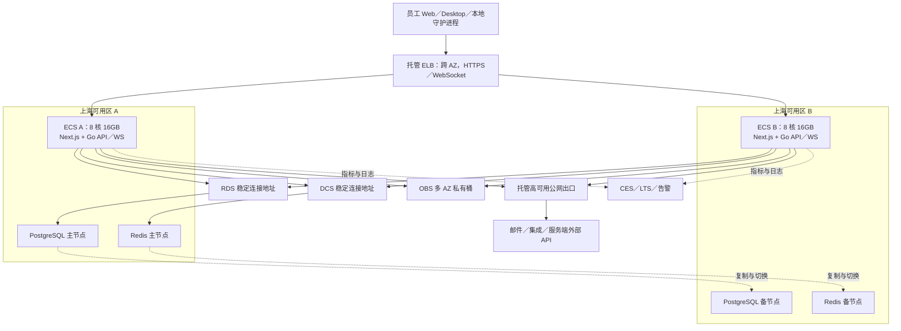

# Enact 企业部署：华为云高可用资源与费用估算

- 评估日期：2026-09-10
- 部署地域：华为云华东-上海一（具体可用区与库存以购买页为准）
- 适用规模：700 个总账号，按部门／项目划分多个工作区，运行时在员工本地
- 文档用途：方案评审、预算申请、云资源询价和上线验收
- 代码依据：当前工作区，Git HEAD 为 `e2689220`，包含尚未提交的改动；不是对某个已发布镜像的认证。

## 1. 建议结论

建议采用同地域跨可用区高可用架构：**2 台 8 核 16GB ECS 应用节点、1 套 4 核 16GB PostgreSQL 主备实例、1 套 2GB Redis 主备实例、跨可用区 ELB、OBS 多 AZ 存储，以及托管公网出口、备份和监控。**

按 **250 人高峰活跃、600 个在线守护进程、80 个本地 task 同时执行、2,000 条长连接验证目标**规划。公网按流量计费，预留 **200–300Mbps 峰值能力**，月出网初始预算 **1–1.5TB**。

| 预算口径 | 金额 | 说明 |
| --- | ---: | --- |
| 起配资源月费估算 | **约 ¥4,800–7,650／月** | 已包含双应用节点、数据库主备、Redis 主备等高可用资源 |
| 对外沟通的月费区间 | **约 ¥5,000–8,000／月** | 工程预算，不是华为云正式报价 |
| 建议立项额度 | **¥6,000–9,000／月** | 对月费估算增加约 15% 预备金后取整 |
| 起配资源年化估算 | **约 ¥5.76万–9.18万／年** | 按当前月度用量乘 12，不包含后续数据增长和扩容 |
| 建议年度立项额度 | **¥7.2万–10.8万／年** | 大规模业务增长、异地灾备和新增外部服务另行预算 |

**估算尚未经过负载测试，也未取得上海地域完整购物车报价。** 用户行为、消息大小、工作区热点分布和服务端 CPU 耗时均需要上线前验证。不能仅凭本清单承诺 700 人性能、端到端零丢失或业务 SLA。

本文区分三类依据：**用户已确认条件**、**代码／官方文档事实**、**工程假设与推算**。文中的 CPU、QPS、带宽和费用区间不等同于云厂商性能承诺。

## 2. 范围与高可用目标

### 2.1 已确认条件与范围

- 企业总账号上限为 700，部署在上海，按部门／项目使用多个工作区。
- 员工电脑运行守护进程和智能体工具；云端负责协作、调度、执行记录与实时通信。
- 本方案覆盖 Enact Web／API／实时服务、PostgreSQL、Redis、附件存储和必要网络。
- 不包含云端运行时池、GPU、自托管模型、大规模 Semantica 文档处理、外部 CapHub 或其他独立业务服务的算力。
- 模型调用／工具订阅、运维人力、实施开发、专线／VPN、企业额外要求的 WAF／堡垒机等不计入上述费用。复用现有 CI 和镜像仓库；新购 CI、SWR 企业版等另行核价。
- 员工电脑或模型供应商故障不在云端高可用覆盖范围内，本地 task 不会因为云端双节点而自动迁移到其他电脑。

### 2.2 建议验收目标

| 目标 | 建议值／处理方式 | 限定条件 |
| --- | --- | --- |
| 服务可用性 | 以月度 **99.9%** 作为初始业务 SLO，30 天约允许 43.2 分钟不可用 | 是工程验收目标，不是将各云产品 SLA 相乘后得出的承诺 |
| 应用进程／单 ECS 故障 | 自动摘除节点、客户端重连；恢复目标 **≤5 分钟** | 另一台节点需能独立承受正常高峰 |
| 单可用区故障 | 另一可用区保留应用能力，RDS／DCS 完成主备切换；恢复目标 **≤5 分钟** | 必须进行跨 AZ 故障演练，实际切换时间待测 |
| 数据恢复点 RPO | 初步按 **≤1 分钟**提出验收要求 | 需与数据库复制模式、复制延迟和切换实测一致；不是已保证值 |
| 误删除／逻辑损坏 | 通过备份／PITR 恢复到新实例并校验后切换；恢复目标初设 **≤4 小时** | 主备复制不能替代备份，按实际数据规模演练 |
| 整个上海地域故障 | 不在本期可用性架构范围内 | 如要求地域级容灾，需要增加异地备份或温备方案并单独核价 |

RDS PostgreSQL 支持同步、异步复制等选项。完全同步可以加强已提交数据的保护，但备库故障可能阻塞写入；异步有利于写入可用性，但不能保证切换时零数据丢失。实施时需按本表目标确定复制策略，**不能同时无条件承诺零丢失与任意故障下不停写**。[官方复制模式说明](https://support.huaweicloud.com/intl/zh-cn/usermanual-rds-pg/rds_pg_05_0061.html)

## 3. 高可用拓扑与资源清单



图中的主备节点位置表示初始布局，故障切换后角色可能变化。应用使用托管连接地址，不绑定某一台数据库或 Redis 节点 IP。

| 云产品 | 数量与起配规格 | 高可用要求／用途 |
| --- | --- | --- |
| ECS | **2 台，每台 8 vCPU／16GB、100GB SSD**；x86 通用计算增强型，具体代际以库存和报价确定 | 每 AZ 一台；每台运行一份 Next.js 和 Go 服务。单台需通过完整正常高峰压测 |
| RDS PostgreSQL | **1 套主备，每节点 4 vCPU／16GB，逻辑存储 300GB SSD**；优先 PostgreSQL 17 | 主备跨 AZ，自动切换。主备报价应包含两个节点，不再重复乘 2；备库不是第二份主库写入能力 |
| DCS Redis | **1 套 2GB 主备，Redis 6／7 基础版** | 主备跨 AZ，使用稳定地址；不是两个互不复制的单机实例 |
| ELB | **1 个独享型应用型弹性规格实例，启用两个 AZ** | HTTPS／WSS、后端健康检查、连接排空。验证至少 2,000 条长连接和每秒 100 次新建连接 |
| EIP | 入口 ELB 绑定 1 个；新建出口时另配出口 EIP | 按流量计费，确认 **200–300Mbps** 峰值限制及扩容额度，不将带宽上限视为性能保证 |
| VPC／子网 | 1 个 VPC，应用与数据访问规则分离，覆盖两个 AZ | RDS／DCS 通过私网访问；公网仅进入受控入口 |
| 公网 NAT | 复用企业高可用出口；否则配置 **1 套托管跨 AZ 公网 NAT** | 防止用某台 ECS 充当单点出口。确认两 AZ 的路由／SNAT 都有效 |
| OBS | **1 个多 AZ 标准存储私有桶**，初期按 500GB 计预算 | 两应用节点共享附件；启用版本控制／生命周期，具体容量与额外版本另计 |
| 数据库备份 | RDS 自动全量／日志备份，保留 7–30 天，启用 PITR | 费用按免费额度外的实际占用核算；定期恢复到新实例验证 |
| 监控与日志 | CES、LTS、外部可用性探测；日志初期保留 30 天 | 告警覆盖 API、数据库、Redis、连接重建、广播延迟和磁盘增长 |
| 域名／TLS／密钥 | 复用企业 DNS、证书和密钥管理 | 两节点配置一致，密钥轮换有流程，镜像构建与部署可重复 |

本规模可以直接使用两台 ECS 部署容器，不必新建 CCE 集群。若复用企业现有 CCE，需另计工作节点、系统预留和集群管理费，并设置跨 AZ 调度、反亲和及滚动更新策略。

华为云提供 4 核 16GB PostgreSQL 主备规格 `rds.pg.x1.xlarge.4.ha`；实际在上海可买到的代际与版本需以控制台确认。[RDS 规格](https://www.huaweicloud.com/product/pg/instance-types.html)

DCS 官方列出的 2GB 主备规格提供 2GB 可用内存、默认 10,000 连接及 128Mbps 带宽；其参考 QPS 不是本项目 Stream 消息负载的保证。[DCS 规格](https://support.huaweicloud.com/productdesc-dcs/dcs-pd-0522002.html) DCS 支持跨 AZ 容灾，公网 NAT 也支持跨 AZ 高可用。[DCS 容灾](https://support.huaweicloud.com/productdesc-dcs/GlobalDRPolicy.html)、[NAT 高可用](https://support.huaweicloud.com/productdesc-natgateway/nat_pro_0001.html)

## 4. 负载假设与计算

### 4.1 人员与本地执行并发

| 参数 | 基准假设 | 性质 |
| --- | ---: | --- |
| 总账号 | 700 | 用户确认 |
| 日活比例 | 70%，即 490 人 | 工程假设 |
| 每日工作时长 | 480 分钟 | 工程假设 |
| 每人实际操作时间 | 90 分钟／日 | 工程假设，不含后台挂页 |
| 人员高峰系数 | 2.5 | 工程假设 |
| 高峰活跃并发 | 250 人 | 490 × 90 ÷ 480 × 2.5 ≈ 230，向上取整 |
| 高峰客户端连接 | 500 个 | 工程假设，包含后台在线；同一人可占多个连接 |
| 在线守护进程 | 600 个 | 工程假设 |
| 每守护进程运行时数量 | 平均 2 个 | 工具与工作区组合可能注册多个运行时 |
| 工作区分布 | 示例按 10 个工作区、高峰每区约 50 个在线客户端 | 用户只确认多个工作区，数量及均匀分布尚未确认 |
| 每位日活用户的 task 数 | 2 次／日，每次平均 10 分钟 | 工程假设；task 指一次智能体执行，与业务任务 issue 区分 |
| 执行高峰系数 | 4 | 工程假设 |

```text
平均人员活跃并发 = 490 × 90 ÷ 480 ≈ 92 人
设计人员活跃并发 = 92 × 2.5，向上取整到 250 人

每日 task 数 = 490 × 2 = 980 次
平均执行并发 = 980 × 10 ÷ 480 ≈ 20 个 task
设计执行并发 = 20 × 4 ≈ 80 个 task
```

运行时在本地省去了云端编译、测试和工具进程算力，但每次执行仍会产生云端鉴权、领取、状态检查、记录写入和实时广播。

### 4.2 HTTP 与控制消息

代码事实：运行时默认每 15 秒心跳；守护进程默认每 30 秒执行机器级批量领取；任务取消检查默认 5 秒；消息缓冲每 500ms 尝试刷新，非空才上报。心跳和领取优先走 WebSocket，正常时不重复算成 HTTP 请求。[默认间隔](/Users/jaden/PycharmProjects/Enact/server/internal/daemon/config.go:23)、[心跳](/Users/jaden/PycharmProjects/Enact/server/internal/daemon/wakeup.go:277)、[领取](/Users/jaden/PycharmProjects/Enact/server/internal/daemon/daemon.go:4710)、[取消检查](/Users/jaden/PycharmProjects/Enact/server/internal/daemon/daemon.go:644)、[上报](/Users/jaden/PycharmProjects/Enact/server/internal/daemon/daemon.go:8166)

| 高峰负载项 | 计算 | 每秒负载 |
| --- | --- | ---: |
| 用户操作 API | 250 人 ÷ 每 8 秒一次操作 × 每操作 4 个 API | 125 HTTP 请求 |
| task 消息上报 | 80 个并发执行 × 平均每秒 1 个非空批次 | 80 HTTP 请求 |
| 取消状态检查 | 80 ÷ 5，按持续启用保守计入 | 16 HTTP 请求 |
| 补查、通知、自动化、集成及额外唤醒等预留 | 工程预留 | 50 HTTP 请求等量预算 |
| 运行时心跳 | 600 × 2 ÷ 15 | 80 次控制操作 |
| 基础批量领取 | 600 ÷ 30，不含额外唤醒 | 20 次控制操作 |
| **合计** | HTTP 与控制消息分开核算 | **约 271 HTTP 请求／秒＋100 次控制操作／秒** |

每个请求的 CPU／SQL 代价不同，371 次操作／秒只是负载输入，不能直接当成统一服务能力单位。新任务唤醒会增加领取频率；多工作区、多工具、旧版客户端回退和外部自动化需通过实测替换预留值。

前端 Query 默认 `staleTime: Infinity`，关闭聚焦自动刷新，重连后重新校准；常规页面并不是所有用户持续全量轮询。[缓存配置](/Users/jaden/PycharmProjects/Enact/packages/core/query-client.ts:7)

| 场景 | 人员／执行假设 | HTTP 请求／秒 | 心跳与基础领取／秒 | 合计操作／秒 |
| --- | --- | ---: | ---: | ---: |
| 日常 | 100 人，12 秒一次操作、3 API／次；350 daemon；20 task、0.5 批／秒；额外 20 | 59 | 58 | 117 |
| 设计高峰 | 250 人，8 秒一次操作、4 API／次；600 daemon；80 task、1 批／秒；额外 50 | 271 | 100 | 371 |
| 压力场景 | 400 人，6 秒一次操作、5 API／次；700 daemon；150 task、2 批／秒；额外 100 | 763 | 117 | 880 |

三种场景均按每 daemon 平均两个运行时、每 task 五秒一次取消检查计算。压力场景用于定位容量边界，不承诺起配资源在单节点故障时仍承受该场景。

### 4.3 广播、带宽与月出网

**当前代码把 task／聊天高频消息广播到工作区；虽然已有任务作用域基础设施，但订阅路由尚未启用。** 不能按只有打开任务的 1–3 人接收来估计网络。[广播入口](/Users/jaden/PycharmProjects/Enact/server/cmd/server/listeners.go:224)

```text
设计高峰原始消息 = 80 task × 1 批／秒 × 2 条／批 = 160 条／秒
每条消息平均接收客户端数 = 50
实际客户端投递 = 160 × 50 = 8,000 次／秒
平均序列化消息大小 = 1KB（假设）
消息出网带宽 = 8,000 × 1,000 字节 × 8 ≈ 64Mbps

用户 API 响应 = 125 次／秒 × 平均 20KB × 8 ≈ 20Mbps
其他事件、查询、协议开销预算 = 20–40Mbps
设计高峰业务出网 ≈ 100–125Mbps，未计集中大附件下载
```

因此建议 EIP／ELB 预留 200–300Mbps 峰值能力，并验证限额。平均消息 1KB 增至 4KB时，广播部分会从 64Mbps 变成约 256Mbps；400 人／150 task 的压力场景也可能超过 300Mbps，应把压测器和网络配额一并放大，避免误判为应用瓶颈。

工作区广播的正确公式是 `Σ（工作区消息速率 × 该工作区在线客户端数 × 消息字节数）`。平均每条消息的接收数是按消息量加权的，不是简单的总人数除以工作区数；部门与项目成员重叠、多端在线都会增加该数值。

月度采用 22 个工作日、每 task 平均 1MB 持久化内容、序列化流量近似等量、平均 25 个接收客户端的假设：

```text
原始执行记录 = 980 × 22 × 1MB = 21.56GB／月
task 广播出网 = 21.56GB × 25 ≈ 539GB／月
加消息封装、API、页面和附件后，初始总出网预算 = 1–1.5TB／月
```

以上使用十进制 KB／GB／TB 便于估算；正式账单按各产品计量口径。月度平均接收数 25 与高峰 50 不矛盾，不把峰值按全天持续使用来计费。数据持久化内容和线上消息封装不同，1MB 的对应关系需要抽样修正。

敏感性示例：平均接收数从 25 增至 100，task 广播出网从约 539GB 增至 2.16TB／月；这比账号数小幅增长更影响费用。700 人一分钟内各加载 3MB 静态文件也需要约 280Mbps，应验证集中登录与重连。CDN 可减少源站静态资源下载压力，不会消除 WebSocket 广播量。

### 4.4 CPU、内存与数据库

8 核节点是考虑 N+1 的容量预算，而不是根据用户数量直接换算：假设每次业务操作消耗 5ms CPU，371 次／秒约占 1.86 核；再给 Next.js、广播、上传和后台维护预留 2 核，按故障接管时 CPU 目标 60% 计算，`(1.86 + 2) ÷ 60% ≈ 6.4 核`，向上选择 8 核。**5ms 和 2 核预留均待剖析实测；HTTP 响应时间不能当成 CPU 时间。**

内存除进程、连接和缓存外，还需覆盖文件上传。当前上传上限约 100MB，接口解析 multipart 并把文件读入内存；10 个大文件同时上传，文件内容就可能超过 1GB，另有解析和拷贝开销。本文不假设已实现浏览器直传 OBS，建议实施时配置并发限制。[上传实现](/Users/jaden/PycharmProjects/Enact/server/internal/handler/file.go:393)

数据库按请求组合先以 **1,000–2,000 次 SQL 执行／秒**作为压测范围，不等同于业务事务数或磁盘 IOPS。消息接口包含任务／权限读取和批量插入，多条消息会产生多行写入。[消息接口](/Users/jaden/PycharmProjects/Enact/server/internal/handler/daemon.go:4400)

每个后端默认业务连接池上限 25，双实例约 50 个连接，另留监控、迁移和运维余量。数据库连接不能按 700 人一人一个配置。[连接池](/Users/jaden/PycharmProjects/Enact/server/cmd/server/dbstats.go:22)

300GB 起配包括执行记录、索引、业务数据与维护空间。按 21.56GB 原始执行记录／月，暂估实际数据库新增 **30–50GB／月**；若每 task 拆成 200–1,000 条记录，则月新增约 430万–2,160万条消息，索引和行开销需要单独观测。完整保留一年，准备扩至 **600GB–1TB**；没有假定代码已经自动归档／删除旧记录。备份、WAL、对象存储各自计量，不混入同一个 300GB 指标。

Redis 中继默认使用 8 个分片流、每流近似最多 2,000 条；按 2KB 记录估算，原始流数据约 32MB，再加内部结构、缓存、复制等开销。2GB 适合作为起点，但大消息、热点分片和保留策略会改变结果。长度截断可能让热点流实际回放时间短于配置时长，不能宣称所有事件必定保留 10 分钟。[中继默认值](/Users/jaden/PycharmProjects/Enact/server/internal/realtime/sharded_stream_relay.go:18)

## 5. 预估费用与报价边界

按包月／包年类常规购买计算稳定资源，ELB、流量等按实际用量预算；不使用新客限购价、竞价实例或临时活动价作为企业长期成本依据。

| 计费项目 | 数量／假设 | 月费预算 | 依据性质 |
| --- | --- | ---: | --- |
| ECS 与云盘 | 2 × 8 核 16GB，各 100GB SSD | ¥1,600–2,200 | 工程估算；官方上海示例 4 核 8GB＋100GB 高 IO 包月 ¥446，仅用于校准量级，不能当作本规格报价 |
| RDS PostgreSQL | 4 核 16GB 主备＋300GB SSD | ¥1,500–2,200 | 工程估算，需取得上海主备整体报价，避免漏备库或重复计算备库 |
| DCS Redis | 2GB 跨 AZ 主备 | ¥200–400 | 工程估算，需核对版本、架构和节点数 |
| ELB | 双 AZ、应用型弹性规格 | ¥250–500 | 工程预留，包括实例及 LCU；动态流量和连接决定账单 |
| 公网与 OBS 下载流量 | 合计 1–1.5TB／月 | ¥800–1,200 | 以官方上海 EIP 参考价 ¥0.80／GB 校准；OBS 出网按自身价格单独结算 |
| OBS 存储／日志／额外备份 | 500GB 对象、30 天日志、7–30 天 DB 备份 | ¥250–650 | 工程预留；按多 AZ 存储、请求次数、日志量和免费备份额度外用量复核 |
| 公网出口 | 新建托管 NAT、出口 EIP 等固定费用 | ¥200–500 | 工程预留；若复用现有高可用出口可扣减，流量不在此行重复计入 |
| **合计** | 已包含所列 HA 节点 | **¥4,800–7,650** | **不是正式报价** |

华为云官方上海一示例提供了 c7 4 核 8GB＋100GB 高 IO 云盘包月 ¥446、按需 ¥0.905／小时，以及 EIP ¥0.80／GB 的参考值。本文没有取得 8 核节点及其余产品组合的动态购买价，不将该示例价格线性外推成正式报价。[上海一成本示例](https://support.huaweicloud.com/dshpccs-high-tech/dshpccs_02.html)

RDS 费用包含实例、存储和超过免费额度的备份等计费项。[RDS 计费](https://support.huaweicloud.com/price-rds-pg/rds_00_0006.html) ELB 弹性规格费用由实例费和 LCU 组成，按新建连接、并发连接、处理字节、规则评估等维度计算；并非只看 2,000 条连接。固定规格还需注意 AZ 数量对费用的影响。[ELB 计费](https://support.huaweicloud.com/price-elb/elb_billing_0003.html)

询价时应逐项确认：上海实际 SKU／AZ 库存、购买周期与续费价、税费口径、主备是否包含两个节点、300GB 的实际计费口径、SSD 性能和可扩容范围、OBS 多 AZ 与下载价格、ELB 两 AZ 完整费用、出口固定费、备份免费额度，以及公网峰值配额。

业务增长后优先更新执行消息月增量和广播接收数，再更新费用。新增 WAF、专线、异地备份、外部语义服务、付费证书、企业镜像仓库及生产实施工作应单列，不能用本表预备金承诺覆盖全部新增范围。

## 6. 当前代码上线为高可用的必要工作

购买冗余资源不代表应用已实现高可用。以下是上线前待完成／待验证项，本次仅编写评估文档，未修改部署配置。

| 项目 | 当前依据与必要处理 |
| --- | --- |
| 跨实例广播 | 两后端必须连接相同的 Redis 协调服务，确认 `REDIS_URL`、中继配置及跨节点事件送达。缺少 Redis 时使用进程内单节点广播；不要把异常回退视为正常 HA 模式。[实现](/Users/jaden/PycharmProjects/Enact/server/cmd/server/main.go:350) |
| 发布不中断 | 默认 Helm 后端是 `Recreate`。实施中改为逐节点替换并配合连接排空、就绪检查和版本兼容；不要同时重启两实例。[模板](/Users/jaden/PycharmProjects/Enact/deploy/helm/enact/templates/backend.yaml:32) |
| 健康检查 | 将存活与就绪检查分开；后端 `/healthz` 用于就绪、`/health` 用于存活。前端也要有可用性检查。验证依赖服务故障时摘除行为，不引发两节点反复重启 |
| WebSocket | ELB 正确转发用户与守护进程连接；空闲超时覆盖心跳周期。验证连接排空、指数退避、重连校准与一个 AZ 故障后的连接再分布 |
| 后台任务与渠道 | 核对每个启用的调度、集成、Webhook 和长连接消费者的跨实例互斥／幂等。渠道租约默认可使用 PostgreSQL，不强制另买 Redis 租约实例；若改用 Redis 租约，需确认无驱逐策略及故障安全性。[租约选择](/Users/jaden/PycharmProjects/Enact/server/cmd/server/router.go:221) |
| 附件存储 | 使用共享 OBS，不能依赖两节点各自的本地上传目录。OBS 支持的签名模式和域名访问方式需要联调；下载权限不因迁移变为公开读 |
| OBS 参数 | 核对 `AWS_ENDPOINT_URL`、`S3_REGION`、`S3_BUCKET`；OBS 禁止 path 方式访问桶，应明确使用虚拟主机方式，设置并验证 `S3_USE_PATH_STYLE=false`。代码对自定义端点的默认值可能不同，不能只填 endpoint 就上线 |
| 数据库迁移 | 在目标 RDS 验证扩展、并发建索引权限和迁移完整性；发布采用与旧应用兼容的迁移流程。存在启动迁移锁不等于所有版本均可无中断滚动更新 |
| 密钥与会话 | 两节点 JWT／加密密钥及配置一致，秘密从受控配置注入；检查前端多副本缓存、构建版本和会话行为 |
| 消息持久化 | 当前 task 消息批次上报失败路径记录日志但缺少可靠重试，切换窗口可能有消息缺口。需要验证重放恢复机制或补齐持久队列／幂等重试后，才能提出端到端零丢失保证。[上报路径](/Users/jaden/PycharmProjects/Enact/server/internal/daemon/daemon.go:8157) |
| 外部依赖与恢复 | 本地电脑、模型服务、企业网络、DNS、邮件和身份服务也影响体验。为其建立独立监控；演练数据库／对象恢复及应用重新部署 |

OBS V4 仅支持部分载荷签名模式，当前 AWS SDK 适配需验证上传、预签名下载、文件名和校验和。[OBS V4 说明](https://support.huaweicloud.com/obs_faq/obs_faq_0274.html) OBS 域名文档说明禁止 path 请求方式访问桶。[OBS 域名规则](https://support.huaweicloud.com/usermanual-obs/obs_41_0060.html)

RDS PostgreSQL 17 官方支持列表包含 `pgcrypto`、`pg_trgm` 和 `pgvector`；实际以实例的 `pg_available_extensions` 为准。迁移中可跳过的扩展不代表相应索引必然存在，中文搜索需用真实数据验证。[扩展列表](https://support.huaweicloud.com/intl/en-us/usermanual-rds-pg/rds_09_0045.html)

## 7. 压测、故障演练与扩容条件

先用按需资源完成验证，再确定长期购买规格；压测器应部署在独立机器，计入临时实施费用，不占用两台生产应用节点。统计 HTTP 请求、WS 控制操作、原始业务事件和最终投递次数，避免混用 QPS。

| 验证 | 工作负载／目标 |
| --- | --- |
| 高峰持续压测 | 250 人活跃＋600 daemon／1,200 运行时＋80 task，持续 60 分钟；使用多个工作区与真实大小消息 |
| 压力与突发 | 400 人活跃＋700 daemon＋150 task；700 客户端集中登录／重连，独立验证 2,000 长连接与每秒 100 次新建连接 |
| 广播热点 | 把多数执行放在一个大工作区；分别测试 1KB、4KB 和真实工具输出尾部消息，观测带宽、积压与慢客户端断连 |
| 单节点与 AZ 接管 | 在正常高峰下关闭一台 ECS；分别进行 RDS、DCS 切换及受控 AZ 故障演练；核对重复执行、消息缺失、渠道连接和实际 RTO／RPO |
| 数据规模 | 采用预计 3–6 个月数据；任务、评论、千万至亿级消息条数按实测增长量生成，验证搜索、列表、看板、执行历史和写入延迟 |
| 上传与备份 | 并发大文件上传、OBS 权限及签名下载；恢复数据库备份到新实例并核对业务记录与附件引用 |
| 初始延迟目标 | 普通 CRUD P95 <500ms；消息上报 P95 <500ms；已持久化事件到客户端推送 P95 <1s；非预期错误率 <0.1% |
| 故障容量目标 | 单应用节点承受正常高峰时 CPU 尽量 ≤60%–70%、内存 ≤75%，无持续增长的队列或明显连接池等待 |

扩容判断应结合原因：

- 应用 CPU／内存或广播积压持续升高，先定位热点，再升级 ECS 或增加实例。不能靠增加实例降低向同一批客户端投递的总流量。
- RDS CPU、连接等待、慢 SQL 或锁等待持续升高，先优化 SQL／索引／批次，再考虑 8 核 32GB。单纯加大连接池可能加重数据库竞争。
- 数据盘达到约 70% 时安排扩容，预留维护和 WAL 空间；日志／消息归档需要真实实现，不能只写保留期。
- Redis 内存超过约 70%、出现驱逐、Stream 积压或读写带宽接近限额时，先检查保留策略，再评估 4GB 或更高规格。
- 公网持续接近峰值上限的 60%–70%，或热点工作区消息量显著增加时，核对广播接收数；再决定提高带宽、调整工作区使用方式或开发任务级订阅。

## 8. 交付状态与后续决策

本次已完成：资源与费用估算、代码路径核对、华为云官方能力／计费资料核对、HA 拓扑及验收条件整理。

尚未完成：云资源创建、部署配置改造、OBS 实际联调、生产负载测试、数据库／Redis 故障演练、恢复演练和正式价格询价。没有运行应用测试；本次只新增文档，校验范围为计算、文件引用和文档结构。

建议以 **双 8 核 16GB ECS＋4 核 16GB RDS 主备＋2GB DCS 主备**发起询价，并以 **¥6,000–9,000／月立项额度**覆盖起配资源与有限预备金。上线批准条件是第 6 节配置工作完成、第 7 节正常高峰与故障接管验收通过；更高 SLO、零丢失或地域级容灾要求需补充架构和预算。
