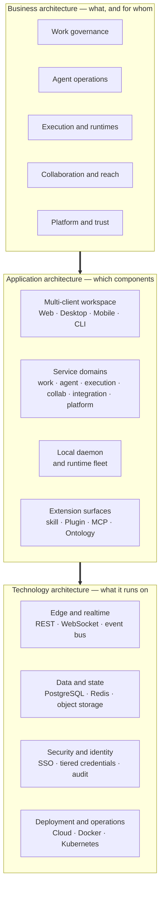

# Enact Architecture Documentation

> **About this set**: These documents describe Enact's **target-state architecture**, written for enterprise evaluation, solution discussions, and implementation alignment. Chinese is the primary version — see the matching `.zh.md` files.

---

## Enact on one page

### The problem

Enterprises are already running Claude Code, Codex, and Cursor. Each lives in its own terminal tab: the session ends and the context is gone, background has to be pasted in again and again, and nobody can say **which agent touched this code, what commands it ran, or what it cost**.

The tools keep getting better while the way we work with them has regressed to single-machine habits. This is not a model capability problem. It is a **missing work system**.

### The proposition

**Enact puts people and agents in one work system.**

An agent in Enact is not a button on a toolbar — it is a **first-class assignee**. It has an identity, a charter, reusable capability packs, and an explicit visibility scope. It can be assigned work, comment, and move status. People make judgments and grant authority; agents execute and produce. Both work off the same record, the same timeline, and the same audit trail.

### The boundary

Enact deliberately does **not** do two things:

- **No in-house model, no in-house coding agent.** Reasoning is rented from external runtimes — 23 supported agent CLI protocol families today. The model layer is commoditizing fast; betting there is dangerous.
- **Not another Jira.** The board is one projection of work, not the only entry point. Assignment, @-mention, chat, and Autopilot are four peer ways to delegate, and management actions should happen on their own wherever possible.

What Enact claims is the **layer in between**: the facts, accountability, evidence, and accumulated capability of enterprise work. The stronger general-purpose agents get, the more that layer is worth.

---

## The three layers

**Business architecture** answers who has what problem and who is accountable. **Application architecture** answers how the system decomposes and how the pieces cooperate. **Technology architecture** answers what it runs on and how it stays secure and available.

---

## Eight architecture principles

These constrain all three layers. Where any later design conflicts with them, the principle wins.

| # | Principle | Why |
| --- | --- | --- |
| 1 | **Agents are first-class assignees** | Only when an agent can be assigned work, comment, move status, and be held accountable does human-agent collaboration acquire the same management semantics as human collaboration. Otherwise it is just faster autocomplete. |
| 2 | **Identity is separate from compute** | The agent is the identity — charter, capabilities, visibility. The runtime is the computer that executes it. Decoupled, an agent can move machines, and machines can be organized by capacity and compliance independently. |
| 3 | **The data and execution boundary is fixed** | Work records stay in Enact; code and credentials stay on your machines. The boundary is **identical** on Cloud and self-hosted, so a security review only has to be done once. |
| 4 | **Humans authorize the gates that matter** | A model may gather evidence, explain it, and flag risk — but may never declare a critical gate passed. Releases and irreversible actions land on a named person. |
| 5 | **Server state and client state stay separate** | Server state (work, members, run records) has one source of truth and invalidates on demand; client state (filters, drafts, layout) is local. Mixing them produces failures that are impossible to reproduce across clients and reconnects. |
| 6 | **Every run leaves an accountable person and evidence** | Each execution is attributed to a real person and leaves a complete run record. This is the precondition for bringing agents under enterprise governance, and the only basis for retrospectives. |
| 7 | **Extension surfaces before built-in features** | skills, plugins, MCP servers, runtime profiles, and ontologies cover the overwhelming majority of customization. Open a surface rather than welding domain logic into the core. |
| 8 | **Optional subsystems degrade, they don't fail** | When cache, metrics, model gateway, or channel integrations are absent, the system runs degraded rather than refusing service. Minimal deployments work, and local faults don't escalate. |

---

## Which document to read

| Document | Audience | Answers |
| --- | --- | --- |
| [Business architecture](business-architecture.md) | Business decision-makers, delivery owners, procurement | What problem it solves, which roles are involved, the capability map, how work flows, how it is priced, what to measure |
| [Application architecture](application-architecture.md) | Enterprise architects, product owners, integrators | How the system decomposes, where the boundaries are, how components interact, how to integrate with existing systems, where to extend |
| [Technology architecture](technology-architecture.md) | Enterprise IT, security, operations | The stack, deployment topologies, where data lives, the security model, observability, degradation behavior |

Suggested order: everyone reads "Enact on one page" and the eight principles first, then the document that matches their role. **Security and compliance reviewers should start at [Technology architecture · Security](technology-architecture.md#6-security-architecture).**

---

## Relationship to the Enterprise Work Intelligence Platform spec v0.2

This repository also contains *Enterprise Work Intelligence Platform — Product & Functional Specification v0.2* under `docs/`. That is a broader platform concept that positions Enact as the orchestration layer within a three-layer structure (Intelligence Space × Capability Hub × Enact). It is an **alignment draft describing a future direction**.

**This documentation set does not adopt that three-layer framing.** It describes the architecture of the Enact product itself. The relationship: Enact is the work and execution governance layer that exists today; that specification explores what it might mean to add an enterprise fact layer and a capability asset layer above it. **For evaluating Enact, this set is authoritative.**
