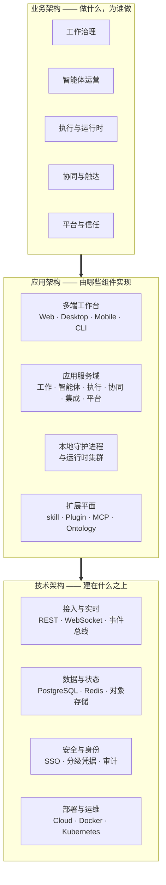

# Enact 架构文档集

> **文档说明**：本文档集描述 Enact 的**目标态架构**，面向企业评估、方案沟通与实施对齐。中文为主版，英文见同名 `.md` 文件。

---

## 一页读懂 Enact

### 问题

企业已经在用 Claude Code、Codex、Cursor 这些编码智能体，但它们各自活在一个终端标签页里：会话结束就失忆，上下文靠人反复粘贴，没人说得清**哪个智能体动过这段代码、它执行了什么命令、花了多少钱**。工具在变强，协作方式却退回到了单机时代。

这不是模型能力问题，是**工作系统缺位**问题。

### 主张

**Enact 让人与智能体在同一个工作系统里协作。**

智能体在 Enact 里不是工具面板上的一个按钮，而是**一等受托人**：它有身份、有职责说明、有可复用的能力包、有明确的可见范围，可以被指派任务、可以评论、可以推进状态。人做判断与授权，智能体做执行与产出，二者共用同一份任务记录、同一条时间线、同一套审计线索。

### 边界

Enact 明确**不做**两件事：

- **不自研模型，也不重造编码智能体。** 推理能力向外部运行时租用——已支持 23 个协议族的智能体 CLI。模型层在快速商品化，把赌注押在那里是危险的。
- **不做又一个 Jira。** 看板是任务的一种投影，不是唯一入口。指派、@ 提及、Chat、自动化四种委派方式并列，管理动作尽量自动发生。

Enact 要占住的是**中间那一层**：企业工作的事实、责任、证据与能力沉淀。通用智能体越强，这一层越有价值。

---

## 三层架构总图

三层的对应关系是：**业务架构**回答"为谁解决什么问题、由谁负责"；**应用架构**回答"拆成哪些组件、彼此怎么协作"；**技术架构**回答"跑在什么之上、怎么保证安全与可用"。

---

## 八条架构原则

这八条是贯穿三层的设计约束。后续任何一处设计如果与它们冲突，以原则为准。

| # | 原则 | 为什么 |
| --- | --- | --- |
| 1 | **智能体是一等受托人** | 只有当智能体能被指派、能评论、能推进状态、能被追责，人机协作才具备与人际协作相同的管理语义；否则它只是个更快的代码补全。 |
| 2 | **身份与算力分离** | 智能体是身份（职责、能力、可见范围），运行时是执行它的计算机。二者解耦后，同一个智能体可以换机器执行，机器可以按算力与合规要求独立编排。 |
| 3 | **数据与执行边界固定** | 工作记录留在 Enact，代码与凭据留在你的机器。这条边界在云端与自托管下**完全一致**，让安全评估只需做一次。 |
| 4 | **关键闸门由人授权** | 模型可以收集证据、解释证据、提示风险，但不得自判关键闸门通过。发布与不可逆操作必须落到具体的自然人。 |
| 5 | **服务端状态与客户端状态分离** | 服务端状态（任务、成员、运行记录）只有一个真相源并按需失效；客户端状态（筛选、草稿、布局）本地持有。混用会在多端与实时场景下产生难以复现的错乱。 |
| 6 | **每次运行都留下责任人与证据** | 每一次执行都归属到一个可问责的自然人，并留下完整的执行记录。这是把智能体纳入企业治理的前提，也是事后复盘的唯一依据。 |
| 7 | **扩展点优先于内置功能** | skill、Plugin、MCP Server、Runtime Profile、Ontology 五个扩展点覆盖绝大多数定制诉求。优先开放扩展点，而不是把行业逻辑焊进内核。 |
| 8 | **可选子系统降级而非失败** | 缓存、指标、模型网关、渠道集成等可选子系统缺失时，系统降级运行而不是拒绝服务。这让最小部署也能跑起来，也让局部故障不升级为全站故障。 |

---

## 三份文档导航

| 文档 | 读者 | 回答什么 |
| --- | --- | --- |
| [业务架构](business-architecture.zh.md) | 业务决策人、交付负责人、采购 | 解决什么问题、涉及哪些角色、能力地图是什么、业务流程怎么跑、怎么计费、拿什么衡量收益 |
| [应用架构](application-architecture.zh.md) | 企业架构师、产品负责人、集成方 | 系统拆成哪些组件、边界在哪、组件之间怎么交互、如何与既有系统集成、从哪里扩展 |
| [技术架构](technology-architecture.zh.md) | 企业 IT、安全、运维 | 用什么技术栈、怎么部署、数据放在哪、安全模型是什么、怎么监控、故障时如何降级 |
| [工作区横切与隔离](workspace-scoping.zh.md) | 架构师、后端与前端开发 | 一项功能该跨工作区共享还是留在工作区内，判定规则与已落地部分 |

建议阅读顺序：所有角色先读本页的"一页读懂"与"八条原则"，再进入与自己相关的那一份。安全与合规评审请直接从[技术架构 · 安全架构](technology-architecture.zh.md#6-安全架构)一节开始。

---

## 与《企业工作智能平台产品功能规格书 v0.2》的关系

本仓库 `docs/` 下另有一份《Enterprise Work Intelligence Platform — Product & Functional Specification v0.2》。那是一份更大范围的平台设想，把 Enact 定位为 Intelligence Space × Capability Hub × Enact 三层结构中的编排层，属于**未来方向的对齐草案**。

**本架构文档集不采用该三层设定**，描述的是 Enact 产品自身的架构。两者的关系是：Enact 是已经成型的工作与执行治理层；那份规格书探讨的是在其之上再叠加企业事实层与能力资产层的可能性。评估 Enact 时请以本文档集为准。
