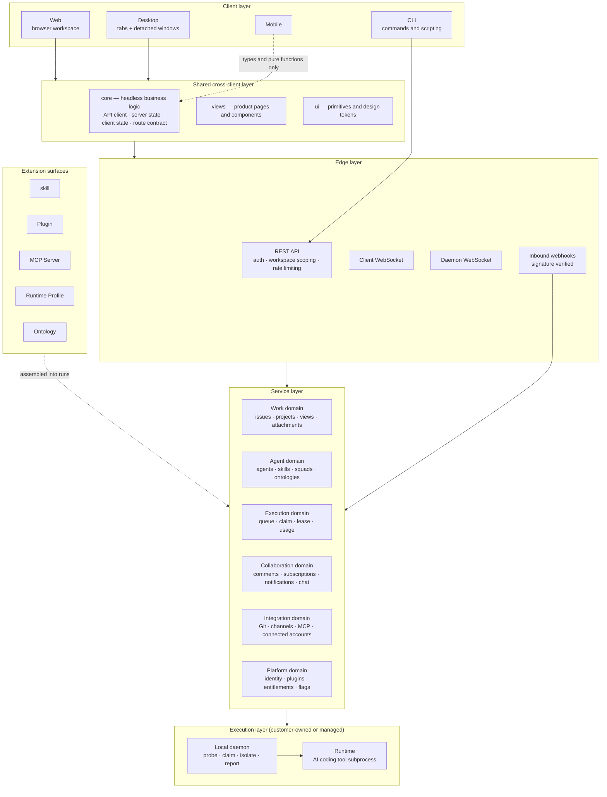
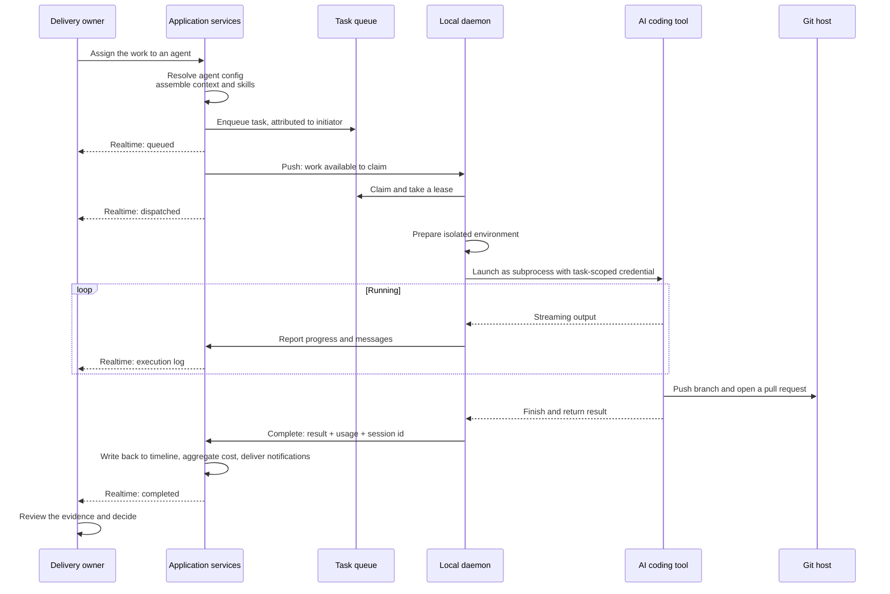
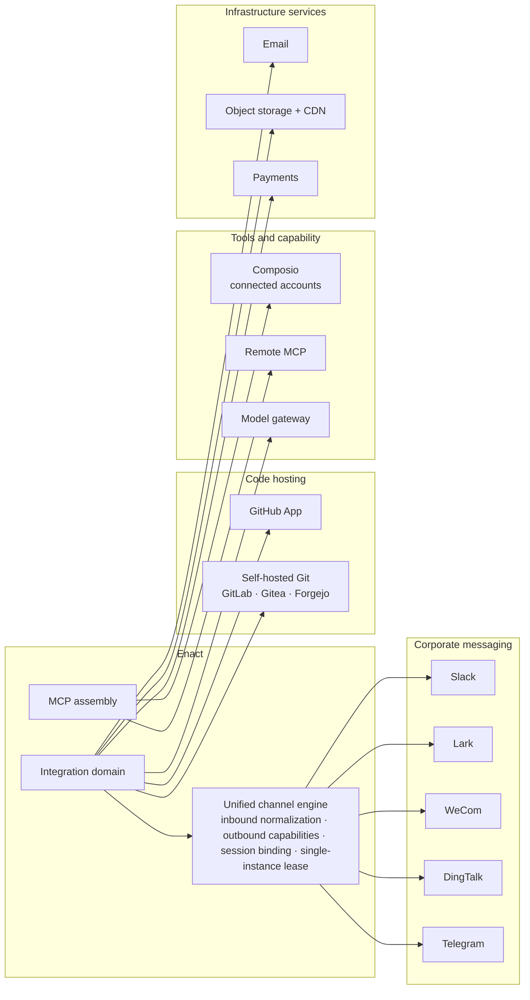

# Enact Application Architecture

> **About this document**: Describes Enact's **target-state application architecture**, for enterprise architects, product owners, and integrators. For the business view see [Business architecture](business-architecture.md); for infrastructure and security see [Technology architecture](technology-architecture.md).

---

## 1. The application landscape

The load-bearing judgment: **the execution layer is not on the server.** The service layer records, orchestrates, and schedules; the actual reading and writing of code and the running of commands happen on machines the customer owns. That single split determines every security and integration decision that follows.

---

## 2. Component catalogue

### 2.1 Clients

| Component | Responsibility | Boundary |
| --- | --- | --- |
| **Web** | The full browser workspace covering every product capability; also hosts the marketing site and documentation entry | Platform-specific routing and runtime capabilities are confined to a dedicated platform layer and never leak into shared code |
| **Desktop** | The desktop workspace. Beyond Web it adds: workspace tabs, detachable standalone work windows, native notifications and badges, auto-update, and **a bundled CLI plus a local daemon management panel** | The only client that can directly manage the daemon on that machine |
| **Mobile** | Covers the high-frequency situations: my work, inbox, chat, work detail and creation, projects | **Independently implemented** — shares only type definitions and pure functions; owns its UI, state, build pipeline, and release cadence |
| **CLI** | Command-line entry across issues, agents, skills, squads, chat, autopilots, and runtimes; also **the daemon binary itself** | Callable by other coding agents; the scripting and automation entry point |

**The mobile consistency contract**: UI and interaction may be redesigned for the phone, but **product semantics must not diverge** — counts and visibility, permissions and access, state enums and transitions, and data identity must all agree with web and desktop.

### 2.2 The shared layer

Web and desktop share nearly all implementation, stitched together by three packages and three adapters:

| Package | Contents | Hard constraint |
| --- | --- | --- |
| **core** | Headless business logic: typed API client, server-state definitions, client-state stores, realtime cache updates, route contract, permission rules, i18n | No UI library, no browser storage, no environment variables |
| **views** | Product pages and components: work, agents, runtimes, settings, editor, chat — all product UI | No framework-specific routing API; navigation only through the adapter |
| **ui** | Primitives and design tokens | No business logic |

Dependency direction is one-way: `views → core + ui`; `core` and `ui` never depend on each other.

**Three platform adapters** are the only seam between shared code and a specific platform:

| Adapter | What it abstracts |
| --- | --- |
| **Navigation adapter** | Routing. Shared code expresses "go here"; the platform decides browser router or memory router |
| **Storage adapter** | Persistence. Shared code never touches browser storage directly |
| **Runtime configuration** | API and realtime endpoints, auth mode, client identity, locale |

A **shared path builder** is additionally the cross-client route contract: web maps it onto browser routes; desktop maps the same path strings onto a memory router and persists them for tabs.

### 2.3 Service domains

The backend divides by business domain, each exposing workspace-scoped REST endpoints:

| Domain | Carries |
| --- | --- |
| **Work** | Full work lifecycle, parent/child and dependencies, status and properties, projects and resource binding, views with server-side grouping and pagination, search, attachments |
| **Agent** | Agent configuration, Access, skill and ontology attachment, squad composition, AI-guided agent building, provisioning and version reconciliation of built-in delivery families |
| **Execution** | Task queue, runtime claim and lease, streaming progress and messages, retry and cancellation, orphan recovery, usage and cost aggregation, failure attribution |
| **Collaboration** | Comments and threads, reactions, subscriptions, notification routing and preferences, inbox, chat sessions and quick actions |
| **Integration** | GitHub App, self-hosted Git connections, the unified engine behind five messaging channels, Composio connected accounts, MCP server management |
| **Platform** | Identity and credentials, workspaces and members, plugin lifecycle and grants, entitlements and quotas, feature flags, usage dashboards |

### 2.4 The local daemon

The daemon runs on **machines the customer owns** and is the sole entry to the execution layer:

1. **Probe** — scan the host for installed AI coding tools, combine with workspace runtime profiles, register available runtimes
2. **Claim** — claim tasks from the queue in batches, receiving full execution context (agent identity, prompt, skills, repositories and directories, MCP connections, available tools)
3. **Prepare** — build an isolated execution environment per task
4. **Execute** — launch the AI coding tool as a subprocess under timeouts and watchdogs
5. **Report** — stream progress and messages back, then write the result, usage, and failure reason

The daemon is the CLI binary itself; desktop bundles it and can manage its lifecycle.

### 2.5 The plugin platform

Plugins are how third parties **extend Enact itself** — complementary to skills, which extend what agents can do:

| Capability | Description |
| --- | --- |
| **UI surfaces** | Custom interfaces hosted in a sandboxed iframe, communicating over a constrained protocol |
| **Action API** | A restricted interface for reading and writing workspace data, carrying plugin context |
| **Hooks** | Subscribe to system events and respond |
| **MCP bridge** | Expose plugin capability as agent-callable tools, with credentials resolved per connection |
| **Scoped storage** | Plugin-private key-value storage |

Plugin versions are immutable; installation, grants, and tool approvals all require explicit admin consent.

---

## 3. Interaction patterns

Enact uses five interaction patterns, each with a clear remit:

| Pattern | Used for | Characteristics |
| --- | --- | --- |
| **Synchronous REST** | User-initiated reads and writes | Workspace-scoped authorization, tiered rate limiting, schema-validated responses |
| **Client WebSocket** | Pushing server changes to the UI | Workspace rooms and per-user routing, with fine-grained scope subscriptions |
| **Daemon WebSocket** | Server-to-execution push and invocation | Supports in-channel RPC sharing the same handlers as the HTTP endpoints |
| **In-process event bus** | Decoupling domains | One state change fans out to subscription updates, activity trail, notification delivery, and plugin dispatch |
| **Inbound webhooks** | External systems reaching in | Credentials in the path or signature rather than headers; verified per delivery |

**Task dispatch is pull-based**: the server never dials out to an execution machine — the daemon initiates the claim. This is what lets execution machines sit entirely inside a corporate network with no inbound ports.

### 3.1 End to end: from assignment to pull request

Note the last step: **a completed run is not completed work.** A human decides to merge, reject, or continue after reviewing the evidence.

---

## 4. Journeys mapped to components

### Journey A — a delivery owner delegates and accepts

| Step | Components |
| --- | --- |
| File the work with a clear goal and acceptance criteria | Client → Work domain |
| Pick an agent or squad and assign | Agent domain (Access check) → Execution domain (enqueue) |
| Watch the execution log and interim output | Execution domain → Client WebSocket |
| Add requirements in comments, @-mention for another run | Collaboration domain → Execution domain |
| Review evidence, inspect the linked pull request, decide to merge | Integration domain (Git) + Work domain |
| Check token and cost for the run | Execution domain (usage aggregation) |

### Journey B — a domain expert captures capability

| Step | Components |
| --- | --- |
| Distil the approach from a successful run | Execution domain (run record) |
| Author a skill, or import one from a repository | Agent domain (skill management) |
| Attach to several agents and set visibility | Agent domain (attach + Access) |
| Later runs assemble the capability automatically | Execution domain (context assembly) |

### Journey C — a platform admin brings it into the enterprise

| Step | Components |
| --- | --- |
| Deploy self-hosted, wire up enterprise identity | Platform domain (identity) |
| Connect self-hosted Git and repositories | Integration domain (VCS connections) |
| Connect corporate messaging so the team can reach agents from chat | Integration domain (channel engine) |
| Start the daemon on dedicated machines, set concurrency and visibility | Execution domain (runtime management) |
| Configure notification policy, plugin grants, usage aggregation | Platform + Collaboration domains |

---

## 5. Integration architecture

### 5.1 Code hosting

| Integration | Form |
| --- | --- |
| **GitHub** | GitHub App installation bound per workspace; signature-verified inbound webhooks; tracking of pull requests, check runs, and check suites; PR card snapshots |
| **Self-hosted Git** | GitLab / Gitea / Forgejo, with per-connection webhook signatures and sealed secrets — for enterprises whose code may not leave the network |

The key design point: **Enact does not host code.** It records the relationship between work and pull requests; the code stays on the customer's own Git host.

### 5.2 Corporate messaging channels

Five channels run through a **unified channel engine** rather than five bespoke implementations: normalized inbound messages, outbound capabilities declared as a bitmask, session binding, deduplication and audit, and a lease mechanism guaranteeing a single active connection per installation. Adding a channel means implementing the channel interface.

The value is **reaching agents from the tools the team already uses**, without switching to Enact first. Account binding maps the messaging identity to an Enact member, so permissions and audit are not relaxed just because the entry point differs.

### 5.3 Tools and capability

| Integration | Description |
| --- | --- |
| **Composio connected accounts** | Per-user third-party SaaS authorizations, overlaid at execution time as tools available to that task |
| **MCP servers** | Three sources — workspace-level, agent-level, and plugin-bridged — assembled into one tool configuration per run |
| **Model gateway** | The OpenAI-compatible gateway endpoint is replaceable, so an enterprise can point it at its own model proxy or a privately deployed model |

**Credential boundary**: credentials for remote tools are resolved and delivered per connection at execution time and never persisted into the task record.

---

## 6. Cross-client consistency and state governance

### 6.1 State tiers

| State class | Owner | Examples |
| --- | --- | --- |
| **Server state** | Single source of truth on the server; clients cache and invalidate | Work, members, agents, run records, inbox |
| **Client state** | Held locally, preferences may persist | Filters, drafts, modals, tab layout, navigation history |
| **Platform plumbing** | Injected by the platform | Workspace context, navigation implementation |

The two classes are **strictly not mixed**. Realtime events update the server-state cache only and never mirror server payloads into client-state stores — doing so produces failures across multiple clients and reconnects that cannot be reproduced.

Every workspace-scoped cache key must include the workspace identifier, so switching workspaces cannot cross data over.

### 6.2 When optimistic updates apply

Only when four conditions hold **simultaneously**: the outcome is locally predictable, the user stays on the same screen, failure is rare, and rollback is trivial. The canonical fit is field-level patches such as status and assignee.

**Flows that navigate or confirm** (create, delete, leave a workspace) must await the server before navigating and cleaning up. Message sending uses a pending pattern — render immediately with a visible pending state and retry on failure — rather than silent optimism.

### 6.3 API forward compatibility

An installed desktop client may connect to a newer backend, so response parsing must tolerate field drift:

- Network JSON is schema-validated with a fallback, never cast to a type
- Downstream UI accesses fields defensively with defaults
- Server booleans are checked explicitly rather than by truthiness
- Every switch over a server enum has a default branch

### 6.4 Internationalization

Four locales (English, Chinese, Japanese, Korean) cover all UI copy and documentation. The glossary is a hard constraint — in particular, the recorded unit of work and one execution run must be spelled distinguishably in every locale. No locale may use one word for both concepts.

---

## 7. The five extension surfaces

Customization goes through extension surfaces, not core modifications. Five surfaces cover different levels:

| Surface | Extends | Author | Governance |
| --- | --- | --- | --- |
| **skill** | **how an agent does a kind of work** | Domain expert | Authored in the workspace or imported from a repository; attaches to many agents; bound by Access |
| **Ontology** | **domain semantics and terminology** | Domain expert | Attached to agents to give them a domain concept baseline |
| **Runtime Profile** | **which machine and which tool** executes | Orchestration engineer | Defined per workspace; may only be based on an officially supported protocol family |
| **MCP Server** | **what tools an agent can call** | Orchestration engineer / admin | Workspace-level, agent-level, or plugin-bridged; credentials resolved on demand |
| **Plugin** | **the Enact platform itself** | Third-party developer | Immutable versions; installation, grants, and tool approvals require explicit admin consent |

The selection rule: **if a skill can do it, do not write a plugin.** A skill is content — no code review, no grant flow, lowest iteration cost. A plugin is code — more powerful, and correspondingly more expensive to govern.

---

## Next

- [Technology architecture](technology-architecture.md) — deployment, execution isolation, security model, operations
- [Business architecture](business-architecture.md) — which business capabilities these components serve
