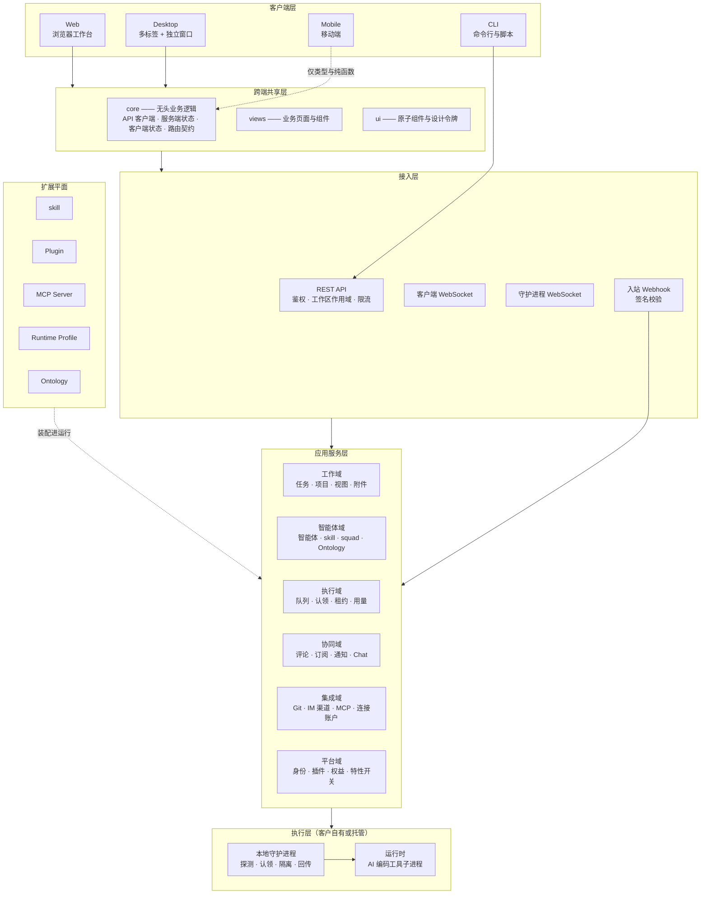
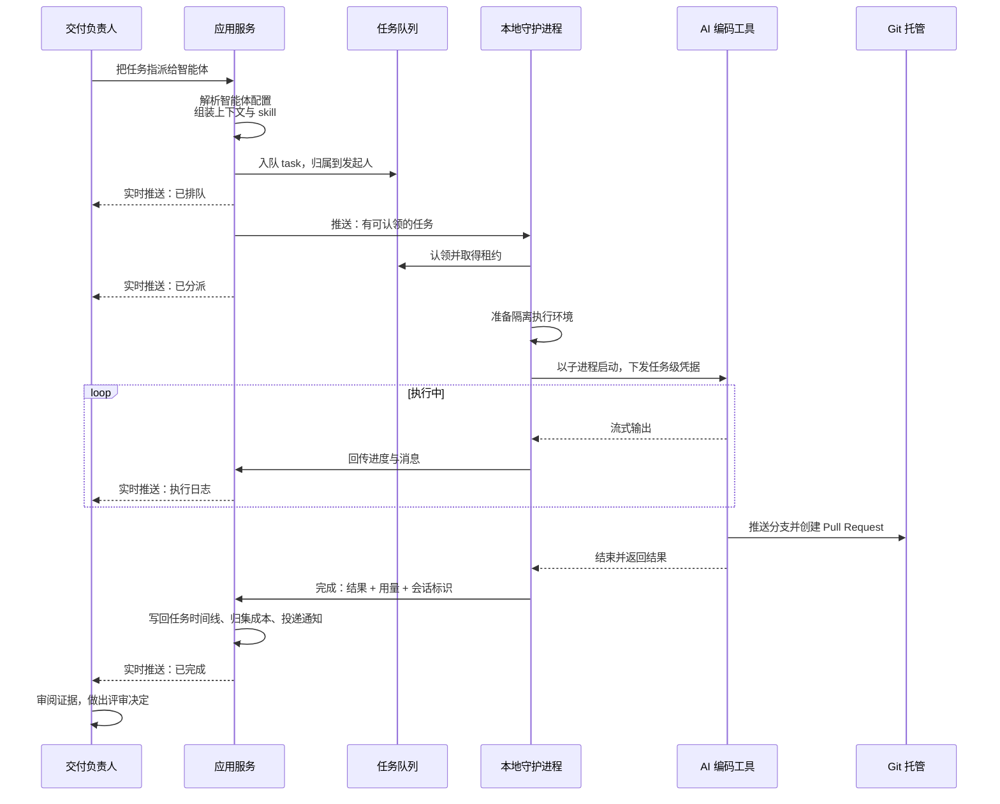
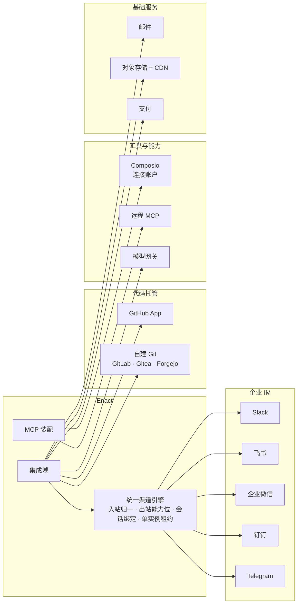

# Enact 应用架构

> **文档说明**：本文描述 Enact 的**目标态应用架构**，面向企业架构师、产品负责人与集成方。业务视角见[业务架构](business-architecture.zh.md)，基础设施与安全见[技术架构](technology-architecture.zh.md)。

---

## 1. 应用全景

分层的核心判断：**执行层不在服务端**。应用服务层只负责记录、编排与调度，真正的代码读写与命令执行发生在客户自有的机器上。这条切分决定了后面所有的安全与集成设计。

---

## 2. 应用组件目录

### 2.1 客户端

| 组件 | 职责 | 边界 |
| --- | --- | --- |
| **Web** | 浏览器端完整工作台，覆盖全部产品能力；同时承载营销站与文档站入口 | 平台特有的路由与运行时能力集中在独立的平台层，不渗入共享代码 |
| **Desktop** | 桌面工作台。相较 Web 额外提供：多标签工作区、可分离的独立任务窗口、原生通知与角标、自动更新、**内置 CLI 与本地守护进程管理面板** | 唯一可以直接管理本机守护进程的客户端 |
| **Mobile** | 移动端。覆盖我的任务、收件箱、Chat、任务详情与创建、项目等高频场景 | **独立实现**：只共享类型定义与纯函数，UI、状态、构建与发布节奏自持 |
| **CLI** | 命令行入口，覆盖任务、智能体、skill、squad、Chat、自动化、运行时等；同时是**守护进程本体** | 可被其他编码智能体调用，作为脚本化与自动化的接入点 |

**移动端的一致性契约**：UI 与交互可以按手机场景重新设计，但**产品语义必须一致**——计数与可见性、权限与访问、状态枚举与流转、数据身份四项不允许出现分歧。

### 2.2 跨端共享层

Web 与 Desktop 共享绝大部分实现，靠三个包与三道适配器缝合：

| 包 | 内容 | 硬约束 |
| --- | --- | --- |
| **core** | 无头业务逻辑：类型化 API 客户端、服务端状态定义、客户端状态存储、实时缓存更新、路由契约、权限规则、i18n | 不依赖任何 UI 库、不触碰浏览器存储与环境变量 |
| **views** | 业务页面与组件：任务、智能体、运行时、设置、编辑器、Chat 等全部产品界面 | 不依赖任何具体框架的路由 API，只通过导航适配器访问 |
| **ui** | 原子组件与设计令牌 | 不依赖业务逻辑 |

依赖方向单向：`views → core + ui`，`core` 与 `ui` 互不依赖。

**三道平台适配器**是共享代码与具体平台之间的唯一接缝：

| 适配器 | 抽象了什么 |
| --- | --- |
| **导航适配器** | 路由跳转。共享代码只表达"去哪里"，由平台决定用浏览器路由还是内存路由 |
| **存储适配器** | 持久化。共享代码不直接触碰浏览器存储，由平台注入实现 |
| **运行配置** | API 与实时地址、鉴权方式、客户端身份、语言环境 |

此外，**统一的路径构造器**是跨端路由契约：Web 把它映射到浏览器路由，Desktop 把同样的路径字符串映射到内存路由并用于标签页持久化。

### 2.3 应用服务域

后端按业务域划分，每个域对外暴露工作区作用域下的 REST 接口：

| 域 | 承载 |
| --- | --- |
| **工作域** | 任务全生命周期、父子与依赖、状态与属性、项目与资源绑定、视图与服务端分组分页、检索、附件 |
| **智能体域** | 智能体配置、Access、skill 与 Ontology 挂载、squad 编组、AI 对话式智能体构建、内置交付族的下发与版本对账 |
| **执行域** | 任务队列、运行时认领与租约、进度与消息回传、重试与取消、孤儿恢复、用量与成本归集、失败归因 |
| **协同域** | 评论与线程、表情回应、订阅关系、通知分发与偏好、收件箱、Chat 会话与快捷动作 |
| **集成域** | GitHub App、自建 Git 连接、五大 IM 渠道的统一引擎、Composio 连接账户、MCP 服务器管理 |
| **平台域** | 身份与凭据、工作区与成员、插件生命周期与授权、权益与配额、特性开关、用量看板 |

### 2.4 本地守护进程

守护进程运行在**客户自有的机器**上，是执行层的唯一入口：

1. **探测**——扫描本机已安装的 AI 编码工具，结合工作区自定义运行时画像，注册为可用运行时
2. **认领**——从队列批量认领任务，取得完整的执行上下文（智能体身份、提示、skill、仓库与目录、MCP 连接、可用工具）
3. **准备**——为每个任务准备隔离的执行环境
4. **执行**——把 AI 编码工具作为子进程启动，施加超时与看门狗
5. **回传**——流式回传进度与消息，最终写回结果、用量与失败原因

守护进程同时是 CLI 二进制本身，桌面端内置并可托管其生命周期。

### 2.5 插件平台

插件是**第三方扩展 Enact 自身**的机制，与 skill（扩展智能体能力）互补：

| 插件能力 | 说明 |
| --- | --- |
| **界面扩展** | 沙箱 iframe 承载的自定义界面，通过受控协议与宿主通信 |
| **Action API** | 插件读写工作区数据的受限接口，携带插件上下文 |
| **Hook** | 订阅系统事件并作出响应 |
| **MCP 桥接** | 把插件能力暴露为智能体可调用的工具，凭据按连接即时解析 |
| **作用域存储** | 插件私有的键值存储 |

插件版本不可变，安装、权限授予与工具批准均需管理员显式同意。

---

## 3. 应用交互模式

Enact 用五种交互模式，各有明确的适用场景：

| 模式 | 用于 | 特征 |
| --- | --- | --- |
| **同步 REST** | 用户发起的读写 | 工作区作用域鉴权、分级限流、响应经模式校验 |
| **客户端 WebSocket** | 把服务端变更实时推给界面 | 按工作区房间与用户路由，支持细粒度作用域订阅 |
| **守护进程 WebSocket** | 服务端向执行层推送与调用 | 支持通道内 RPC，与 HTTP 接口共用同一套处理逻辑 |
| **进程内事件总线** | 域之间解耦 | 一次状态变更派生出订阅关系更新、活动留痕、通知投递、插件分发 |
| **入站 Webhook** | 外部系统触达 | 凭据置于路径或签名而非请求头，逐条验签 |

**任务分发采用拉取式**：服务端不主动连接执行机，由守护进程发起认领。这使得执行机可以完全位于企业内网、无需任何入站端口。

### 3.1 端到端时序：从指派任务到产出 Pull Request

注意最后一步：**运行完成不等于任务完成**。人在看完证据后才决定合入、驳回还是继续。

---

## 4. 用户旅程与组件映射

### 旅程 A —— 交付负责人委派并验收

| 步骤 | 涉及组件 |
| --- | --- |
| 建任务、写清楚目标与验收标准 | 客户端 → 工作域 |
| 选择智能体或 squad 并指派 | 智能体域（Access 校验）→ 执行域（入队） |
| 观察执行日志与中间产出 | 执行域 → 客户端 WebSocket |
| 在评论区追加要求，@ 智能体再跑一轮 | 协同域 → 执行域 |
| 审阅证据、查看关联 Pull Request、决定合入 | 集成域（Git）+ 工作域 |
| 查看本次运行的 token 与成本 | 执行域（用量归集） |

### 旅程 B —— 领域专家沉淀能力

| 步骤 | 涉及组件 |
| --- | --- |
| 从一次成功运行中提炼做法 | 执行域（执行记录） |
| 编写 skill 或从仓库导入 | 智能体域（skill 管理） |
| 挂载到多个智能体，设定可见范围 | 智能体域（挂载 + Access） |
| 后续运行自动装配该能力 | 执行域（上下文组装） |

### 旅程 C —— 平台管理员接入企业环境

| 步骤 | 涉及组件 |
| --- | --- |
| 部署自托管实例，接入企业身份 | 平台域（身份） |
| 连接自建 Git 与代码仓库 | 集成域（VCS 连接） |
| 接入企业 IM，让团队在聊天工具里触达智能体 | 集成域（渠道引擎） |
| 在专用机器上启动守护进程，设定并发与可见性 | 执行域（运行时管理） |
| 配置通知策略、插件授权、用量归集 | 平台域 + 协同域 |

---

## 5. 集成架构

### 5.1 代码托管

| 集成 | 形式 |
| --- | --- |
| **GitHub** | GitHub App 安装，逐工作区绑定；Webhook 验签入站；跟踪 Pull Request、检查运行与检查套件；PR 卡片快照 |
| **自建 Git** | GitLab / Gitea / Forgejo，逐连接的 Webhook 签名与密钥封装；面向不允许代码出网的企业 |

关键设计：Enact **不托管代码**。它记录任务与 Pull Request 之间的关联，代码始终在客户自己的 Git 托管上。

### 5.2 企业 IM 渠道

五个渠道走**统一渠道引擎**，而不是各写一套：入站消息归一化、出站能力按位声明、会话绑定、去重与审计、以及保证每个安装只有单一活跃连接的租约机制。新增渠道只需实现渠道接口。

价值在于**让团队在已有的沟通工具里触达智能体**，不必先切换到 Enact。账号绑定确保 IM 侧身份能对应到 Enact 成员，权限与审计不因入口不同而放松。

### 5.3 工具与能力接入

| 接入 | 说明 |
| --- | --- |
| **Composio 连接账户** | 逐用户的第三方 SaaS 授权，在执行时叠加为该任务可用的工具 |
| **MCP Server** | 工作区级、智能体级、插件桥接三种来源，统一装配为执行时的工具配置 |
| **模型网关** | 兼容 OpenAI 协议的网关地址可替换，便于接入企业自有的模型代理或私有部署模型 |

**凭据边界**：远程工具的凭据在建立连接时按需解析下发，不落进任务记录。

---

## 6. 多端一致性与状态治理

### 6.1 状态分层

| 状态类别 | 归属 | 例子 |
| --- | --- | --- |
| **服务端状态** | 单一真相源在服务端，客户端只缓存并按需失效 | 任务、成员、智能体、运行记录、收件箱 |
| **客户端状态** | 本地持有，可持久化偏好 | 筛选条件、草稿、模态框、标签页布局、导航历史 |
| **平台管道** | 由平台注入 | 工作区上下文、导航实现 |

两类状态**严格不混用**。实时事件只更新服务端状态缓存，绝不把服务端数据镜像进客户端状态存储——否则多端与断线重连场景会产生难以复现的错乱。

所有工作区作用域的缓存键都必须包含工作区标识，防止切换工作区时串数据。

### 6.2 乐观更新的适用边界

只有当四个条件**同时成立**时才做乐观更新：结果本地可预测、用户停留在当前界面、失败罕见、回滚代价极低。典型的合规场景是状态与受托人这类字段级修改。

**涉及导航或确认的流程**（创建、删除、离开工作区）必须等服务端确认后再跳转与清理。消息发送采用待发状态模式：立即渲染并显示明确的待发标记，失败可重试——而不是静默乐观。

### 6.3 API 前后兼容

已安装的桌面客户端可能连接到更新的后端，因此响应解析必须能容忍字段漂移：

- 网络返回的 JSON 一律经模式校验并带回退，不直接断言类型
- 下游界面对字段做防御性可选访问与默认值
- 对服务端布尔值用显式判断，不依赖真假值语义
- 服务端枚举的分支处理必须有兜底分支

### 6.4 国际化

四语言（英 / 中 / 日 / 韩）覆盖全部界面文案与文档。术语表是强约束——尤其是"任务"（记录的工作单元）与 `task`（一次执行运行）在中文里必须用可区分的写法，绝不允许一个词同时指两个概念。

---

## 7. 五种扩展点

Enact 的定制诉求走扩展点，而不是改内核。五种扩展点覆盖不同层面：

| 扩展点 | 扩展什么 | 谁来做 | 治理方式 |
| --- | --- | --- | --- |
| **skill** | 智能体**怎么做某类工作** | 领域专家 | 工作区内编写或从仓库导入；挂载到多个智能体；受 Access 约束 |
| **Ontology** | 领域**语义与术语** | 领域专家 | 挂载到智能体，为其提供领域概念基线 |
| **Runtime Profile** | **在哪台机器、用什么工具**执行 | AI 编排工程师 | 工作区级定义；只能基于官方支持的协议族 |
| **MCP Server** | 智能体**能调用什么工具** | 编排工程师 / 管理员 | 工作区级、智能体级、插件桥接三种来源；凭据按需解析 |
| **Plugin** | **Enact 平台自身**的界面与行为 | 第三方开发者 | 版本不可变；安装、授权、工具批准均需管理员显式同意 |

选择原则：**能用 skill 解决的不要写插件**。skill 是内容，无需代码审查与授权流程，迭代成本最低；插件是代码，能力更强但治理成本也更高。

---

## 下一步

- [技术架构](technology-architecture.zh.md) —— 部署形态、执行隔离、安全模型与运维
- [业务架构](business-architecture.zh.md) —— 这些组件服务于哪些业务能力
