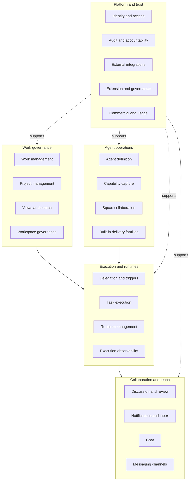
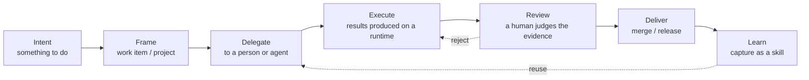
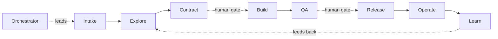
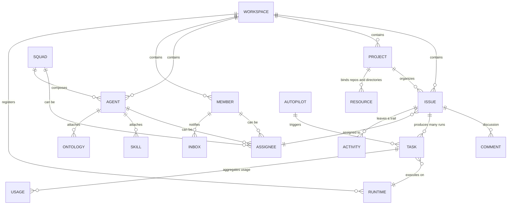

# Enact Business Architecture

> **About this document**: Describes Enact's **target-state business architecture**, for business decision-makers, delivery owners, and procurement evaluation. For implementation, see [Application architecture](application-architecture.md) and [Technology architecture](technology-architecture.md).

---

## 1. The problem and the value proposition

Once an enterprise adopts coding agents, four new problems reliably appear. None of them is a model capability problem — all four are **missing collaboration and governance**.

| The problem | What Enact does | The observable result |
| --- | --- | --- |
| **Context is lost, repeatedly.** Agent sessions forget everything when they end. Background gets pasted in again and again, and the story of one piece of work is scattered across terminals and chat logs. | Work, discussion, attachments, history, and run records converge on one timeline. When an agent is triggered, it takes its context from there. | Delivery people stop being human context couriers. Handing the same work to a different agent needs no re-briefing. |
| **Accountability and permissions are fuzzy.** Who started this agent, what can it read, where can it write, on whose behalf is it acting? | Every run is attributed to an accountable person. Agents carry an explicit visibility scope. Execution credentials are issued per task, minimally scoped. | Any change can answer: who authorized it, in whose name, and what it touched. |
| **Cost is invisible.** Token and compute spend is spread across individual accounts and cannot be attributed to a project or a team. | Usage and cost are aggregated by task, agent, runtime, and workspace into a queryable view. | You can answer "what did this project spend on agents this month, and on which stages". |
| **Know-how doesn't accumulate.** What works lives in one person's prompts; a new person or a new project starts over. | Effective practice is captured as reusable, versioned skills and ontologies, attachable across agents and projects. | One round of tuning benefits the whole team instead of leaving when its author does. |

**The value proposition in one line**: Enact is the **system of record and action** for people and agents working together — turning intent into work that can be executed, verified, and accounted for.

---

## 2. Customers and roles

### 2.1 Target customers

The core is **technical organizations that already run coding agents and have started to feel out of control**: software engineering teams, digital delivery teams, and enterprises that must bring the delivery process under compliance audit. The typical trigger is a team running three or more agent tools at once and starting to hit "nobody can say who changed this".

Customers with strong data-sovereignty or deployment-location requirements — financial services, public sector, cross-border compliance — are a priority segment. Enact's self-hosted form and fixed data boundary are designed for exactly that.

### 2.2 Organization roles

Three roles inside a workspace, kept as lowercase English identifiers per the naming conventions:

| Role | Scope |
| --- | --- |
| `owner` | Workspace ownership, billing and subscription, irreversible actions such as deleting the workspace |
| `admin` | Members and invitations, integration configuration, workspace settings, plugin enablement |
| `member` | Everyday work: creating and advancing work, configuring their own agents, triggering runs |

Organization roles govern **settings and team management only**. They are not the same thing as resource visibility, which is controlled per resource by Access (see 2.4).

### 2.3 Working roles

Beyond organization roles, Enact carries a set of **accountability boundaries** rather than job titles. One person can hold several:

| Working role | Where it lands in Enact |
| --- | --- |
| **Delivery owner** | Breaks down and delegates work, holds the gates, owns the outcome |
| **Domain expert** | Defines agent charters, writes and maintains skills, curates domain ontologies |
| **AI orchestration engineer** | Configures runtimes and runtime profiles, composes squads, tunes models and concurrency, wires MCP and tools |
| **QA / release authority** | Verifies independently, reviews run evidence, decides release / hold / reject |
| **Platform administrator** | Deployment and upgrades, identity, integrations, secrets and policy, usage and cost governance |

### 2.4 Non-human participants

This is where Enact differs fundamentally from conventional work management: **the assignee does not have to be a person.**

| Participant | Definition |
| --- | --- |
| **Agent** | An AI collaborator in the workspace — a reusable configuration of name, instructions, model, skills, Access, and runtime. It is **not a long-running process; it executes only when triggered.** |
| **Squad** | A group of agents and members led by an agent leader. Assign work to the squad and the leader coordinates. |
| **Autopilot** | Triggers runs automatically on a schedule or from external events; can also be run manually. |

**Access — per-resource visibility**, three levels:

- **Only me** (default) — visible and usable only to the creator
- **Entire workspace** — visible and usable to all members
- **Specific people** — an explicit allowlist

Admins can **manage** a resource but **cannot bypass** Access to use an agent outside their own visibility. That separation of management rights from usage rights is deliberate.

---

## 3. Business capability map

### 3.1 L0 / L1 overview

### 3.2 L2 detail

| L0 | L1 | L2 capabilities |
| --- | --- | --- |
| **Work governance** | Work management | Create and quick-create, parent/child and dependencies, status transitions, priority, start and due dates, labels, custom properties, batch operations, subscriptions |
| | Project management | Project organization and progress, resource binding (repositories / local directories), project artifacts |
| | Views and search | List / table / board / swimlane / Gantt, server-side grouping and pagination, saved views, filtering and sorting, full-text search |
| | Workspace governance | Workspace isolation, members and roles, invitations and share links, issue prefix and numbering, status and label definitions, quick actions |
| **Agent operations** | Agent definition | Instructions, model and thinking level, Access scope, concurrency limits, custom environment and arguments |
| | Capability capture | Authoring, importing, and refreshing skills; repository skills; built-in platform skills; domain ontologies |
| | Squad collaboration | Squad composition, leader coordination, member orchestration, no-action determination |
| | Agent building | Manual creation, AI-guided builder sessions |
| | Built-in delivery families | The nine AI-SDLC system agents and delivery squad; the MMM delivery family |
| **Execution and runtimes** | Delegation and triggers | Assignment, @-mention in comments, chat, Autopilot (schedule / webhook / event) |
| | Task execution | Queueing and priority, runtime claim, leases and timeouts, streaming progress, retries, cancellation, orphan recovery |
| | Runtime management | Daemon registration and heartbeat, runtime profiles, health and online state, concurrency limits, private vs shared runtimes, managed cloud runtimes |
| | Execution observability | Execution log, run timeline, token and cost aggregation, failure attribution, usage dashboards |
| **Collaboration and reach** | Discussion and review | Comments and threads, reactions, subscriptions, @-mentioning people or agents |
| | Notifications and inbox | Inbox, notification preferences and muting, desktop and mobile push, unread counts |
| | Chat | Sessions and messages, quick-action suggestions, pinned agents, history and draft recovery |
| | Messaging channels | Two-way messaging and account binding for Slack, Lark, WeCom, DingTalk, Telegram |
| **Platform and trust** | Identity and access | SSO (OIDC / SAML), SCIM sync, domain allowlists, organization roles, per-resource Access, tiered credentials |
| | Audit and accountability | Activity log, run attribution, execution evidence, retention policy |
| | External integrations | GitHub App, self-hosted Git (GitLab / Gitea / Forgejo), Composio connected accounts, MCP, inbound webhooks |
| | Extension and governance | Plugin platform and grants, feature flags, workspace policy |
| | Commercial and usage | Seat subscriptions, credit wallet, entitlements and quotas, usage aggregation |

---

## 4. Core business flows

### 4.1 The value chain

Two links carry the weight: **review is a human judgment** (the model's job is only to get the evidence in order), and **learning flows back** — a round of tuning becomes a skill that the next delegation picks up automatically, instead of leaving with the person who did it.

### 4.2 Four ways to delegate

Four peer methods, chosen by situation:

| Method | When | Trigger |
| --- | --- | --- |
| **Assign work** | Formal work with a defined deliverable that needs a record and tracking | Set the assignee to an agent or squad |
| **@-mention** | Pulling an agent into an ongoing discussion for one specific point | @ the agent in a comment |
| **Chat** | Questions, exploration, quick experiments — no work item needed | Talk to the agent directly; each message triggers one run |
| **Autopilot** | Recurring work, or work driven by external events | Schedule / webhook / system event |

One rule spans all four: **agents never start work on their own.** Every run originates in an explicit action.

### 4.3 A key distinction: one work item, many runs

This is the easiest thing to get wrong about Enact's model, and the key difference from a conventional ticketing system:

- An **issue** is the recorded unit of work — description, discussion, status, history.
- A **`task`** is one concrete execution record for an agent. Every trigger produces one.

**One issue can produce many runs over its life.** When the execution log reads Completed, it means **that one run has ended** — not that the issue is done. Whether the issue is done depends on the actual progress of the work and its status.

### 4.4 The AI-SDLC delivery family

Enact ships a complete delivery orchestration: every new workspace gets nine system agents and a delivery squad, led by an orchestrator.

Three disciplines are built into it:

1. **Explore before build.** Establish goals, boundaries, and authoritative sources first, rather than dumping a pile of context on a model.
2. **Verification is independent of implementation.** Test intent derives from the approved contract, not reverse-engineered from the code — otherwise you are only testing what the code does, not what it should do.
3. **Humans authorize the gates.** Contract approval and the release decision are human nodes; the model may not declare them passed.

The orchestration contract ships as product-owned content, and workspace customization layers **underneath** it — so the approval gates cannot be edited away.

### 4.5 Proof of cross-domain reuse

The same skeleton is already instantiated outside software delivery: the **MMM marketing-mix-modeling delivery family** provides domain agents, skills, and a delivery squad in exactly the same shape. That demonstrates the orchestration structure is not bound to software engineering — swap the domain agents and capability packs and it carries a different class of professional delivery.

---

## 5. Business object model

| Object | Definition |
| --- | --- |
| **Workspace** | The self-contained scope where a team works; all work and configuration live inside it. People and agents collaborate in the same workspace. |
| **Issue** | A piece of work to be done, plus the description, discussion, status, and history around it. The basic unit of day-to-day work. |
| **Project** | Organizes related issues under one goal, tracks progress, and can bind repositories and directories as execution context. |
| **Agent** | An AI collaborator — a reusable configuration; executes only when triggered. |
| **Skill** | A reusable capability pack. Instructions define **who** an agent is; a skill describes **how** a kind of work is done, and attaches to many agents. |
| **Runtime** | Where execution actually happens: a computer connected to Enact and the AI coding tools on it. The agent is the identity; the runtime is the computer. |
| **Task** | One concrete execution record for an agent. |
| **Squad** | A group led by an agent leader. |
| **Chat** | Conversation not attached to an issue — good for questions and quick experiments. |
| **Inbox** | A member's notification center. Agents do not use the inbox. |
| **Autopilot** | Triggers runs on a schedule or from external events. |

---

## 6. Accountability and governance

Bringing agents under enterprise governance requires four things to hold at once.

### 6.1 An accountable person

Every run is attributed to a specific human — not "an agent did it" but "a person initiated it in the name of an agent". That attribution is established when the task is enqueued and carried throughout. It is the starting point of every audit.

### 6.2 Least-privilege execution credentials

An executing agent receives a **task-scoped credential** bound to a specific user, agent, task, and workspace, invalid once the task ends. It cannot act as the initiator, and it cannot impersonate another agent. Commercial and billing endpoints are closed to this class of credential entirely — an agent cannot read or act on its owner's account.

### 6.3 A complete activity and execution trail

Two levels of record:

- **Activity log** — business-level state change: who changed what, and when.
- **Execution record** — the run itself: which tools were called, which commands ran, which files were read and written, how many tokens were consumed, and why it failed.

### 6.4 Human gates

Critical nodes require human authorization. A model may gather evidence, explain it, and flag risk, but **may not declare a critical gate passed.** Computable conditions go to deterministic rules; risk-acceptance conditions land on a named individual. A hold must state the missing evidence; a rejection must record the reason and the conditions for re-entry.

---

## 7. Commercial model and delivery forms

### 7.1 Licensing

Enact is **open core** under the Enact License (Apache 2.0 plus additional conditions):

| Use | Commercial license required |
| --- | --- |
| **Internal self-hosted use within one organization** (including multiple workspaces) | **No** |
| Running only the backend / daemon / CLI, with no Enact user interface | No, but attribution must be retained |
| Providing a hosted service to third parties (whether or not you charge) | **Yes** |
| Embedding Enact in a product distributed commercially | **Yes** |
| Removing or modifying Enact branding and product name | Requires a separate branding waiver |

What this means in practice: **use it yourself, free; resell it, license it.** Publishing a fork's source is not itself a hosted service, but each operator must obtain its own commercial license.

### 7.2 Subscription and metering

Three parallel commercial lines:

| Line | Unit | Key rule |
| --- | --- | --- |
| **Workspace subscription** (Free / Pro) | **Human seat** | **Agents never consume a seat.** Seats cover current human members and pending invitations. Seat increases go through a quote-then-confirm flow with prorated pricing shown before purchase. |
| **Credit wallet** | Prepaid credits | Meters managed cloud runtime compute and model gateway calls. |
| **Self-hosted** | Not metered | Self-hosted deployments are unmetered by default. |

"Agents don't take a seat" is a deliberate pricing decision: the marginal cost of growing an agent team does not land on seats, so customers are not penalized for hiring more agents.

Free is limited by exactly two gates — a **recent-work window** and **monthly successful automation runs**. Pro has neither limit.

### 7.3 Delivery forms

| Form | For |
| --- | --- |
| **Enact Cloud** | Getting started fast, with no infrastructure to run |
| **Self-hosted · Docker Compose** | Single machine or small scale; the fastest path to private deployment |
| **Self-hosted · Kubernetes** | Production scale, high availability, enterprises with an existing platform |

**Orthogonal** to the deployment form is where execution happens: agents can run on **your own machines** (local daemon) or on **managed cloud runtimes**. The two mix — sensitive repositories on your own machines, general work on managed capacity.

The core commitment: **the data and execution boundary is identical on Cloud and self-hosted**, so the security review only has to be done once.

---

## 8. Business metrics

Measure Enact's contribution with this set:

| Dimension | Metrics |
| --- | --- |
| **Speed** | Lead time from framing to delivery, gate wait time |
| **Quality** | First-pass rate, rework rate, defect escape rate |
| **Collaboration effectiveness** | Context failure rate (runs that fail for want of information), human approval burden |
| **Capability accumulation** | Skill reuse rate, number of capability assets reused across projects |
| **Cost** | Cost per run, cost per unit of delivery, agent spend attributed by project or team |

**One explicit discipline: never derive individual performance from token consumption or AI usage rate.** Those numbers belong to capacity planning and cost attribution. Turning them into personal KPIs distorts behavior immediately — people generate meaningless runs to move the number, and every other metric loses meaning.

---

## Next

- [Application architecture](application-architecture.md) — which components deliver these capabilities, and how to integrate
- [Technology architecture](technology-architecture.md) — deployment, security model, and operations
