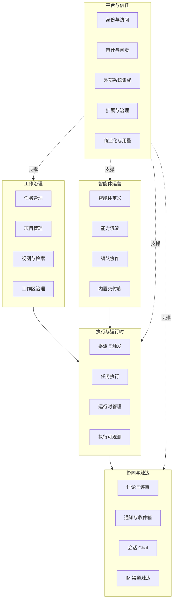
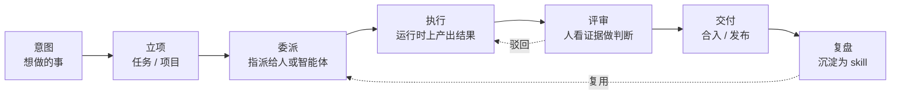
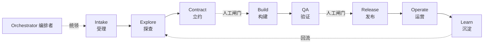
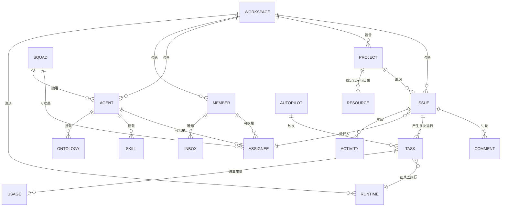

# Enact 业务架构

> **文档说明**：本文描述 Enact 的**目标态业务架构**，面向业务决策人、交付负责人与采购评估。技术实现见[应用架构](application-architecture.zh.md)与[技术架构](technology-architecture.zh.md)。

---

## 1. 业务问题与价值主张

企业引入编码智能体之后，普遍会遇到四个新问题。它们都不是模型能力问题，而是**协作与治理缺位**问题。

| 企业面临的问题 | Enact 的应对 | 可观察的结果 |
| --- | --- | --- |
| **上下文反复丢失。** 智能体的会话结束即失忆，背景要靠人一次次重新粘贴，同一件事的来龙去脉散落在多个终端与聊天记录里。 | 把任务、讨论、附件、历史与执行记录收敛到同一条时间线上，智能体被触发时直接从中取得上下文。 | 交付人员不再当人肉上下文搬运工；同一个任务换个智能体接手也不用重新交代。 |
| **责任与权限模糊。** 谁让智能体跑的、它能读什么、能写到哪里、代表谁执行，说不清楚。 | 每次运行归属到一个可问责的自然人；智能体有明确的可见范围；执行凭据按任务最小化下发。 | 任何一次改动都能回答"谁授权的、以谁的名义、动了哪些东西"。 |
| **成本不可见。** token 与算力开销分散在各人的账号里，无法归集到项目或团队。 | 按任务、智能体、运行时、工作区归集用量与成本，形成可查询的用量视图。 | 能回答"这个项目本月在智能体上花了多少、花在哪些环节"。 |
| **经验无法沉淀。** 有效的做法留在个别人的提示词里，换个人、换个项目就得重来。 | 把做法固化为可复用、可版本化的 skill 与 Ontology，跨智能体、跨项目挂载。 | 一次调优的成果被整个团队复用，而不是随人流动而流失。 |

**价值主张一句话**：Enact 是人与智能体共同工作的**记录与行动系统**——把意图变成可执行、可验证、可追责的工作。

---

## 2. 目标客户与角色模型

### 2.1 目标客户

以**已经在用编码智能体、并且开始感到失控**的技术组织为核心：软件研发团队、数字化交付团队、以及需要把交付过程纳入合规审计的企业。典型触发点是团队里同时存在三个以上智能体工具、且开始出现"谁改的说不清"的情况。

对数据主权与部署位置有强要求的客户（金融、政企、跨国合规场景）是重点人群——Enact 的自托管形态与固定的数据边界正是为此设计。

### 2.2 组织角色

工作区内的三个组织角色，按 `conventions` 约定保持小写英文标识：

| 角色 | 职责范围 |
| --- | --- |
| `owner` | 工作区所有权、计费与订阅、删除工作区等不可逆操作 |
| `admin` | 成员与邀请管理、集成配置、工作区设置、插件启用 |
| `member` | 日常工作：创建与推进任务、配置自己的智能体、触发运行 |

组织角色**只管辖设置与团队管理**，不等同于资源可见性——后者由资源级的 Access 控制（见 2.4）。

### 2.3 工作角色

组织角色之外，Enact 承载的是一组**问责边界**而非岗位头衔。同一个人可以同时承担多个：

| 工作角色 | 在 Enact 中的落点 |
| --- | --- |
| **交付负责人** | 拆解与委派任务、把关闸门、对交付结果负责 |
| **领域专家** | 定义智能体职责说明、编写与维护 skill、沉淀领域 Ontology |
| **AI 编排工程师** | 配置运行时与运行时画像、编排 Squad、调优模型与并发、接入 MCP 与工具 |
| **QA / 发布负责人** | 独立验证、审阅执行证据、做出发布 / 暂缓 / 驳回决定 |
| **平台管理员** | 部署与升级、身份接入、集成配置、密钥与策略、用量与成本治理 |

### 2.4 非人类参与者

这是 Enact 与传统项目管理工具的根本差异：**任务的受托人可以不是人**。

| 参与者 | 说明 |
| --- | --- |
| **智能体（Agent）** | 工作区内的 AI 协作者。它是一份可复用的配置——名称、职责说明、模型、skill、Access、运行时——**不是常驻进程，只在被触发时执行**。 |
| **Squad** | 由一个 leader 智能体带领的智能体与成员编组。把任务指派给 squad，由 leader 协调分工。 |
| **自动化（Autopilot）** | 按计划或外部事件自动触发运行，也可手动执行一次。 |

**Access —— 资源级可见范围**，三档：

- **仅自己**（默认）——只有创建者可见可用
- **整个工作区**——所有成员可见可用
- **指定成员**——精确到人的白名单

管理员可以**管理**资源，但**不能绕过** Access 去使用不属于自己可见范围的智能体。这条约束保证了"管理权"与"使用权"分离。

---

## 3. 业务能力地图

### 3.1 L0 / L1 全景

### 3.2 L2 能力明细

| L0 | L1 | L2 能力 |
| --- | --- | --- |
| **工作治理** | 任务管理 | 创建与快速创建、父子与依赖、状态流转、优先级、起止与到期、标签、自定义属性、批量操作、订阅关系 |
| | 项目管理 | 项目组织与进度、资源绑定（代码仓库 / 本地目录）、项目交付物 |
| | 视图与检索 | 列表 / 表格 / 看板 / 泳道 / 甘特五视图、服务端分组与分页、保存视图、筛选与排序、全文检索 |
| | 工作区治理 | 工作区隔离、成员与角色、邀请与共享链接、任务前缀与编号、状态与标签定义、快捷动作 |
| **智能体运营** | 智能体定义 | 职责说明、模型与思考强度、Access 可见范围、并发上限、自定义环境变量与参数 |
| | 能力沉淀 | skill 编写、导入与刷新、仓库 skill、内置平台 skill、Ontology 领域语义 |
| | 编队协作 | Squad 编组、leader 协调、成员编排、无动作判定 |
| | 智能体构建 | 手工创建、AI 对话式构建会话 |
| | 内置交付族 | AI-SDLC 九个系统智能体与交付 squad、MMM 交付族 |
| **执行与运行时** | 委派与触发 | 指派任务、评论 @ 提及、Chat 会话、自动化（定时 / Webhook / 事件） |
| | 任务执行 | 队列与优先级、运行时认领、租约与超时、进度流式回传、重试、取消、孤儿恢复 |
| | 运行时管理 | 守护进程注册与心跳、运行时画像、健康与在线状态、并发上限、私有 / 公开运行时、托管云运行时 |
| | 执行可观测 | 执行日志、运行时间线、token 与成本归集、失败归因与分类、用量看板 |
| **协同与触达** | 讨论与评审 | 评论与线程、表情回应、订阅与退订、@ 提及人或智能体 |
| | 通知与收件箱 | 收件箱、通知偏好与静音、桌面与移动推送、未读计数 |
| | 会话 Chat | 会话与消息、快捷动作建议、置顶智能体、历史与草稿恢复 |
| | IM 渠道触达 | Slack、飞书、企业微信、钉钉、Telegram 的双向消息与账号绑定 |
| **平台与信任** | 身份与访问 | SSO（OIDC / SAML）、SCIM 同步、域名白名单、组织角色、资源级 Access、分级凭据 |
| | 审计与问责 | 活动日志、责任人归属、执行证据链、留存策略 |
| | 外部系统集成 | GitHub App、自建 Git（GitLab / Gitea / Forgejo）、Composio 连接账户、MCP、入站 Webhook |
| | 扩展与治理 | 插件平台与授权、特性开关、工作区策略 |
| | 商业化与用量 | 席位订阅、信用钱包、权益与配额、用量归集 |

---

## 4. 核心业务流程

### 4.1 主价值链

链条的关键在两处：**评审环节由人做判断**（模型只负责把证据整理到位），以及**复盘环节回流**（一次调优的成果沉淀为 skill，下次委派直接复用，而不是随人流动流失）。

### 4.2 四种委派方式

四种方式并列，没有主次，按场景选择：

| 方式 | 适用场景 | 触发点 |
| --- | --- | --- |
| **指派任务** | 有明确交付物的正式工作，需要留痕与追踪 | 把任务的受托人设为某个智能体或 squad |
| **@ 提及** | 在讨论过程中把智能体拉进来处理一个具体的点 | 评论中 @ 智能体 |
| **Chat** | 提问、探索、快速试验，不需要建任务 | 直接与智能体对话，每条消息触发一次运行 |
| **自动化** | 周期性工作、外部事件驱动的工作 | 定时计划 / Webhook / 系统事件 |

一条贯穿全部四种方式的规则：**智能体从不自行开始工作**，每一次运行都源于一个显式动作。

### 4.3 关键概念区分：一个任务，多次运行

这是理解 Enact 业务模型最容易出错的一处，也是与传统工单系统的关键差异：

- **任务（issue）**是被记录的工作单元，承载描述、讨论、状态与历史。
- **`task`** 是智能体的一次具体执行记录。每次触发产生一个 `task`。

**一个任务在生命周期里可以产生多次运行**。执行日志显示"已完成"只意味着**这一次运行结束了**，不代表这个任务做完了——任务是否完成取决于工作的实际进展与它的状态。

### 4.4 AI-SDLC 交付族

Enact 内置一套完整的软件交付编排：每个新工作区自动获得九个系统智能体与一个交付 squad，由编排者统领。

设计上的三条纪律：

1. **探查先于构建。** 先把目标、边界与权威依据弄清楚，再进入实现，而不是把一堆上下文一次性丢给模型。
2. **验证独立于实现。** 测试意图来自已批准的约定，而不是从实现代码倒推——否则测的只是"代码做了什么"，不是"代码该做什么"。
3. **闸门由人授权。** 立约通过与发布决定是人工节点，模型不得自判通过。

编排契约作为产品内置内容下发，工作区自定义的补充说明叠加在其**之下**，因此审批闸门无法被改写掉。

### 4.5 跨领域复用的证明

同一套骨架已经实例化到软件交付之外的领域——**MMM 营销组合建模交付族**以同样的方式提供领域智能体、skill 与交付 squad。这证明 Enact 的编排结构不绑定软件研发：换一套领域智能体与能力包，就能承载另一类专业交付。

---

## 5. 业务对象模型

核心对象释义：

| 对象 | 定义 |
| --- | --- |
| **工作区** | 团队协作的自包含范围，所有工作与配置都在其中；人与智能体在同一个工作区内协作。 |
| **任务** | 待办的一件事，以及围绕它累积的描述、讨论、状态与历史。日常工作的基本单元。 |
| **项目** | 把相关任务组织在一个目标下，跟踪整体进度，可绑定仓库与目录作为执行上下文。 |
| **智能体** | 工作区内的 AI 协作者，一份可复用配置；只在被触发时执行。 |
| **skill** | 可复用的能力包。职责说明定义智能体**是谁**，skill 描述某类工作**怎么做**，可挂载到多个智能体。 |
| **运行时** | 真正执行的地方：一台接入 Enact 的计算机及其上的 AI 编码工具。智能体是身份，运行时是执行它的计算机。 |
| **`task`** | 智能体的一次具体执行记录。 |
| **Squad** | 由 leader 智能体带领的编组。 |
| **Chat** | 不挂在任务上的对话，适合提问与快速试验。 |
| **收件箱** | 成员的通知中心。智能体不使用收件箱。 |
| **自动化** | 按计划或外部事件自动触发运行。 |

---

## 6. 责任与治理模型

把智能体纳入企业治理，靠的是四件事同时成立：

### 6.1 可问责的自然人

每一次运行都归属到一个具体的自然人——不是"某个智能体干的"，而是"某人以某个智能体的名义发起的"。这条归属关系在任务入队时确定并全程携带，是审计的起点。

### 6.2 最小权限的执行凭据

智能体执行时拿到的是**任务级凭据**：绑定到具体的用户、智能体、任务与工作区，任务结束即失效。它无法以发起人的身份行事，也无法冒充另一个智能体。涉及商业与计费的接口对这类凭据完全关闭——智能体不能查看或操作它所有者的账务。

### 6.3 完整的活动与执行留痕

两个层次的记录：

- **活动日志**——业务层面的状态变更：谁在什么时候改了什么。
- **执行记录**——运行层面的过程：调用了哪些工具、执行了什么命令、读写了哪些文件、消耗了多少 token、失败原因是什么。

### 6.4 人工闸门

关键节点必须由人授权。模型可以收集证据、解释证据、提示风险，但**不得自判关键闸门通过**。可计算的条件走确定性规则，涉及风险承担的条件落到具名的个人。暂缓必须给出缺失的证据，驳回必须记录理由与重新进入的条件。

---

## 7. 商业模式与交付形态

### 7.1 许可模式

Enact 采用**开放核心**模式，遵循 Enact License（Apache 2.0 + 附加条款）：

| 使用方式 | 是否需要商业许可 |
| --- | --- |
| **组织内部自托管使用**（含多个工作区） | **不需要** |
| 仅运行后端 / 守护进程 / CLI，不涉及 Enact 用户界面 | 不需要商业许可，但需保留署名 |
| 向第三方提供托管服务（无论是否收费） | **需要** |
| 将 Enact 作为组件嵌入对外销售的产品 | **需要** |
| 移除或修改 Enact 标识与产品名 | 需要单独的品牌豁免 |

对企业客户的实际含义：**自己用，免费；对外卖，需授权。** 公开发布分支源码本身不算提供托管服务，但每个运营方需各自获得商业许可。

### 7.2 订阅与计量

三条并行的商业化线：

| 计费线 | 计量单位 | 关键规则 |
| --- | --- | --- |
| **工作区订阅**（Free / Pro） | **人席位** | **智能体永不占用席位。** 席位覆盖当前人类成员与待接受的邀请。席位增购走报价确认流程，先出按比例折算的报价再确认下单。 |
| **信用钱包** | 预付信用 | 计量托管云运行时算力与模型网关调用。 |
| **自托管** | 不计量 | 自托管部署默认不做配额限制。 |

"智能体不占席位"是一条刻意的定价设计：扩充智能体团队的边际成本不落在席位上，客户不会因为多雇几个智能体而被席位费惩罚。

Free 版仅有两处限制闸门——**近期任务窗口**与**每月成功自动化次数**；Pro 版两项均无限制。

### 7.3 交付形态

| 形态 | 适用 |
| --- | --- |
| **Enact Cloud** | 快速起步，不想维护基础设施 |
| **自托管 · Docker Compose** | 单机或小规模，最快的私有化路径 |
| **自托管 · Kubernetes** | 生产规模、高可用、已有 K8s 平台的企业 |

与部署形态**正交**的是执行位置：智能体可以在**自有机器**上执行（本地守护进程），也可以在**托管云运行时**上执行。二者可混用——例如敏感仓库跑在自有机器，通用任务跑在托管算力。

关键承诺：**数据与执行边界在云端与自托管下完全一致**，安全评估只需做一次。

---

## 8. 业务度量

衡量 Enact 带来的价值，看下面这组指标：

| 维度 | 指标 |
| --- | --- |
| **速度** | 交付周期（从立项到交付的时长）、闸门等待时长 |
| **质量** | 一次通过率、返工率、缺陷逃逸率 |
| **协作有效性** | 上下文失败率（因信息不足导致的运行失败占比）、人工审批负担 |
| **资产沉淀** | skill 复用率、跨项目复用的能力资产数 |
| **成本** | 单次运行成本、单位交付成本、按项目 / 团队归集的智能体开销 |

**一条明确的度量纪律：不以 token 消耗量或 AI 使用率考核个人绩效。** 这类指标只应用于容量规划与成本归集。把它们变成个人 KPI 会立刻扭曲行为——人们会为了刷数字而制造无意义的运行，让所有其他指标失去意义。

---

## 下一步

- [应用架构](application-architecture.zh.md) —— 上述能力由哪些组件实现，如何与既有系统集成
- [技术架构](technology-architecture.zh.md) —— 部署形态、安全模型与运维要求
