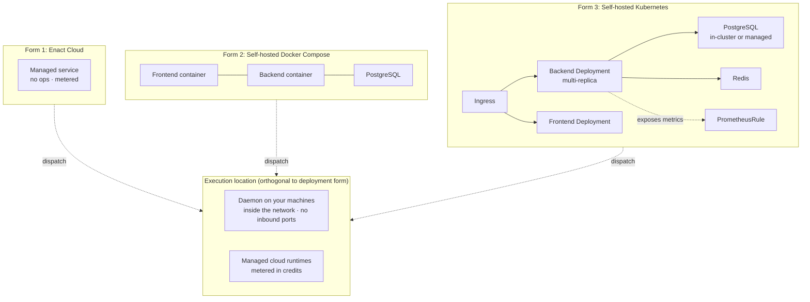
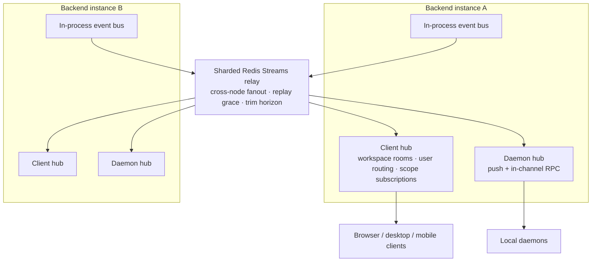
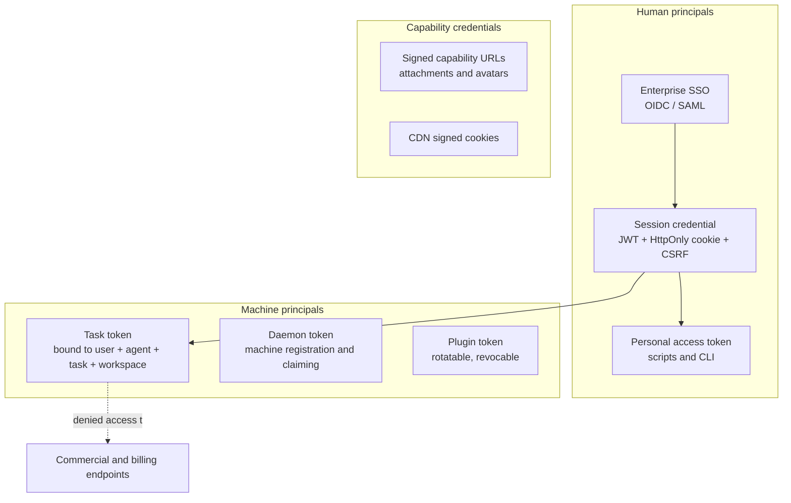
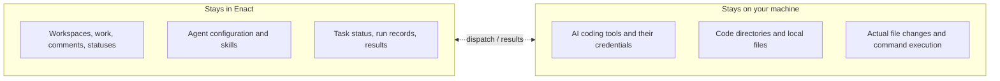

# Enact Technology Architecture

> **About this document**: Describes Enact's **target-state technology architecture**, for enterprise IT, security, and operations review. For the business view see [Business architecture](business-architecture.md); for components see [Application architecture](application-architecture.md).
>
> Security reviewers should start at [Section 6 · Security architecture](#6-security-architecture).

---

## 1. The stack

| Layer | Technology |
| --- | --- |
| **Backend** | Go · Chi router · sqlc type-safe queries · pgx connection pool · gorilla/websocket |
| **Primary database** | PostgreSQL 17 |
| **Cache and coordination** | Redis (rate limiting, claim caches, realtime relay, single-instance channel leases) |
| **Object storage** | S3-compatible storage or local disk, optionally fronted by a CDN |
| **Web frontend** | Next.js App Router · React · TanStack Query · Zustand · Tailwind |
| **Desktop** | Electron · Vite · memory router |
| **Mobile** | Expo / React Native |
| **Execution** | A Go daemon plus third-party AI coding tool subprocesses |
| **Observability** | Structured logging · Prometheus metrics · distributed tracing · pprof |
| **Distribution** | Multi-architecture container images · Helm chart · cross-platform CLI binaries |

**Supported agent runtimes**: AI coding tool CLIs across 23 protocol families, including Claude Code, Codex, Copilot, Cursor, Kimi, Qwen Code, Grok, OpenCode, Trae, and Qoder, plus built-in runtime identities derived from those families. Custom runtime profiles may only be based on an officially supported protocol family, which keeps execution behavior predictable.

---

## 2. Deployment architecture

### 2.1 Three deployment forms



| Form | For | Key characteristics |
| --- | --- | --- |
| **Enact Cloud** | Fast start, no infrastructure team | The only form where metering and quotas are active |
| **Docker Compose** | Single machine or small-scale private deployment | One command brings up the full stack; database migrations run automatically on container start |
| **Kubernetes** | Production scale and high availability | The Helm chart provides backend, frontend, database, ingress, config, and alerting-rule templates; secrets come from an external Secret reference |

**Manual deployment** is also supported: a single Go binary plus PostgreSQL plus the frontend, for environments with strict image controls.

### 2.2 Multi-replica safety

The backend scales horizontally. Three places need single-winner semantics, and each has a mechanism:

| Situation | Mechanism |
| --- | --- |
| Database migrations | A session-level advisory lock guarantees only one instance migrates at a time |
| Scheduled jobs | A unique key of job name, scope, and planned time acts as both the claim and the audit record |
| Messaging channel long connections | A per-installation connection lease guarantees one active connection per channel installation |

### 2.3 Execution location

Execution location is **orthogonal** to deployment form, and the two mix:

- **Your own machines** — the daemon runs on dedicated hosts, containers, or VMs inside the corporate network. **Claiming is pull-based, so no inbound ports are required** — this is what makes an internal-network deployment possible.
- **Managed cloud runtimes** — capacity provided by Enact, metered against the credit wallet.

A typical hybrid: sensitive repositories pinned to your own machines, general work absorbed elastically by managed capacity.

---

## 3. Execution and isolation

### 3.1 The execution path

```
Probe local tools and runtime profiles
      ↓ register
Claim tasks in batches, take a lease
      ↓
Prepare an isolated environment (in its own subprocess)
      ↓
Launch the AI coding tool as a subprocess with a task-scoped credential
      ↓ stream back
Write result, usage, session id, and failure reason
```

### 3.2 Per-task working directory isolation

For work bound to a local directory, every run gets its own git worktree. The design holds three invariants:

1. **The agent sees the user's current changes.** Tracked modifications are carried in as a stash commit; untracked files are copied under file-count and size caps. Otherwise the agent works against stale code.
2. **The user's directory is never written to.** All writes happen under an environment root the daemon owns.
3. **Nothing is silently discarded.** Uncommitted work is committed to the branch on every exit path — including failure and cancellation.

Concurrent tasks therefore never contend for one checkout. A repository cache with partial clone reduces repeated fetch cost.

### 3.3 Process isolation and lifecycle control

- **Preparation runs in its own subprocess** with its own process group, so a preparation step blocked on the filesystem can be killed as a group and cannot "come back to life" and resume writing after a retry.
- **Layered watchdogs**: overall timeout, semantic inactivity timeout, first-turn no-progress timeout, idle timeout, and handshake timeout — each targeting a different failure shape.
- **Leases and orphan recovery**: a separate preparation timeout bounds claim-to-running; a server-side sweeper marks unreachable runtimes offline and their in-flight work is reclaimed and redispatched.

### 3.4 Being precise about sandboxing

**Enact does not promise a filesystem sandbox.** This is a deliberate product decision and must be explicit in any security assessment.

Agents are asked to install dependencies, run builds, use cloud provider CLIs, and drive toolchains that expect a normal home directory. A partial filesystem sandbox breaks that work in ways that are hard to diagnose — the tool reports "not logged in" or silently uses the wrong account — while failing to stop the thing that actually matters, since it cannot prevent a task from reading credentials and sending them over the network.

So Enact's position is: **it does not pretend to be the boundary. Put one around it.**

The per-task working directory, per-task tool state, and task-scoped credentials described above are **blast-radius reduction, not an adversarial security boundary.** For the real boundary see [6.4](#64-the-execution-boundary-and-recommended-isolation).

---

## 4. Data architecture

### 4.1 The primary database

A single PostgreSQL instance carries all business data — roughly 120 tables across identity and tenancy, work, agents and runtimes, execution and usage, collaboration, automation, plugins, integrations, and operations.

**A core convention: no database foreign keys and no cascades.** Referential integrity, validation, and dependent cleanup are all handled explicitly in application code, with application transactions where atomicity is required. The reasoning: cascading deletes produce unpredictable locking and duration at scale, and they hide business rules inside the schema. Explicit cleanup makes the blast radius of a delete readable, testable, and batchable.

**Migration conventions** (directly relevant to operations):

- Every migration ships a paired forward and rollback script
- **All indexes are created concurrently**, and each concurrent index gets its own file — PostgreSQL will not build an index concurrently inside a transaction or a multi-statement string. The migration runner therefore executes migration files outside an explicit transaction
- A conditionally skipped migration is still recorded in the ledger, so later migrations touching conditionally present objects must use idempotent DDL

**Connection usage at runtime**: pooled, with retry at startup. Metrics collection uses its own small pool so a stalled scrape cannot starve business connections.

### 4.2 Search

Search is built for CJK-friendly matching: bigram and trigram GIN indexes accelerate substring queries.

**Every search query runs inside a read-only transaction with a statement-level timeout**, and a timeout is mapped to an explicit service-unavailable response rather than an unbounded wait. One runaway search cannot take down the instance.

### 4.3 What Redis is for

Redis is an **optional acceleration and coordination layer**, not a source of truth:

| Use | Behavior when absent |
| --- | --- |
| API rate limiting | Requests pass (no limiting) |
| Empty-claim and reclaim caches | Falls back to querying the database |
| Cross-node realtime relay | Degrades to single-node in-memory fanout |
| Channel connection leases | Falls back to the database lease backend |

### 4.4 Object storage

Attachments and media go to S3-compatible storage or local disk. Downloads are served through **presigned links** or HMAC-signed capability URLs, because native image tags and browser downloads cannot carry custom headers. A CDN can front this, with signed cookies controlling access.

---

## 5. Realtime architecture and horizontal scale



### 5.1 Two independent realtime channels

| Channel | Serves | Characteristics |
| --- | --- | --- |
| **Client hub** | Browser, desktop, mobile | Workspace-room broadcast, per-user delivery, fine-grained scope subscriptions; membership and subscription authorization checked on connect |
| **Daemon hub** | The execution layer | Pushes "work available to claim", runtime profile changes, and similar; supports in-channel RPC sharing handlers with the HTTP endpoints |

### 5.2 Key mechanisms

- **Event coverage spans every domain**: work, comments, agents, the execution lifecycle (queued / dispatched / running / progress / completed / failed / cancelled), inbox, members, workspace, skills, chat, projects, autopilots, squads, daemons, and Git integrations.
- **Personal events are delivered per user**: inbox and invitation events never go out as a workspace broadcast, which prevents notification content leaking to other members of the same workspace.
- **Internal fields are stripped before egress**: payload fields intended only for server-side use are removed prior to serialization, forming a declarative internal/external boundary.
- **Slow clients are evicted**: a connection whose write backlog exceeds a threshold is dropped, so one slow client cannot degrade everyone.
- **Event deduplication**: each connection tracks delivered event identifiers, so a replay within the grace window is not re-delivered.
- **Trusted proxies**: origin checks honor forwarded headers only from configured proxy CIDRs.

---

## 6. Security architecture

### 6.1 The credential system

Enact uses **tiered credentials** — different purposes get different strength and lifetime:



| Credential | Purpose | Constraints |
| --- | --- | --- |
| **Session credential** | Browser and desktop interaction | HttpOnly, strict same-site; state-changing requests must carry a CSRF token |
| **Personal access token** | CLI, scripts, automation | Enumerable and revocable |
| **Task token** | An agent calling back during execution | **Bound to a specific user, agent, task, and workspace**; cannot impersonate the initiator or another agent; invalid once the task ends |
| **Daemon token** | Execution machine identity | Established through a pairing flow; revocable |
| **Plugin token** | Plugin calls to the Action API | Rotatable and revocable |
| **Signed capability URLs** | Attachment and avatar access | HMAC signature plus expiry, for contexts that cannot carry headers |

**One hard constraint**: task tokens are explicitly denied access to commercial and billing endpoints. An agent cannot read or act on its owner's account.

### 6.2 Enterprise identity

| Capability | Description |
| --- | --- |
| **Single sign-on** | OIDC / SAML against the enterprise identity provider |
| **User and group sync** | SCIM for automated provisioning and deprovisioning |
| **Registration control** | Signup switch, email allowlist, domain allowlist — controlling who may self-register |
| **Workspace creation control** | Self-service workspace creation can be disabled globally, leaving provisioning to admins |

### 6.3 The authorization model

Four layers, each narrowing the last:

1. **Workspace membership** — every query is filtered by workspace; non-members see nothing
2. **Organization role** — `owner` / `admin` / `member` govern settings and team management
3. **Per-resource Access** — visibility of agents and similar resources (only me / entire workspace / specific people). **Admins can manage but cannot bypass**
4. **Principal type checks** — sensitive endpoints require a human principal and reject machine credentials outright

Workspace resolution has an explicit precedence: a task token's own binding is authoritative, so a workspace cannot be switched via request headers.

### 6.4 The execution boundary and recommended isolation

This is the heart of an enterprise security assessment.

#### The data and execution boundary



| Enact | Connected computer |
| --- | --- |
| Workspaces, work items, comments, and statuses | AI coding tools and their credentials |
| Agent configuration and skills | Code directories and local files |
| Task status, run records, and results | Actual file changes and command execution |

**This boundary is identical on Enact Cloud and in self-hosted deployments.**

**One exception must be stated plainly**: anything saved into an agent's custom environment variables is stored on the Enact server and passed to the runtime at execution time. **Do not put secrets that must never leave your machine into custom environment variables.**

#### The real security boundary: the daemon's operating-system user

By default a task runs with the **full permissions of the operating-system user running the daemon**: it can read and write every file that user can, use that user's credentials, and reach the network without restriction.

The boundary must therefore be built outside the daemon. Three recommended options, in increasing strength:

| Option | Isolation | Description |
| --- | --- | --- |
| **Dedicated system user** | Baseline | Create a separate user, grant only the repositories and credentials the agents actually need; your own account is untouched |
| **Container** | Medium | Run the daemon in a container with only the mounts and secrets required |
| **Virtual machine** | Strong | Full isolation, at the cost of provisioning a machine |

Whichever you choose, treat every credential reachable from that environment as a credential the agent may use: scope tokens narrowly, prefer per-purpose deploy keys over personal keys, and keep unrelated production credentials out of that user's home directory.

### 6.5 Secrets management

| Measure | Description |
| --- | --- |
| **External secret management** | Secrets can be resolved from an external secret manager rather than living in config files |
| **Per-channel key isolation** | Each messaging integration uses its own encryption key |
| **Per-connection credential sealing** | Credentials for self-hosted Git connections and similar are stored encrypted |
| **Remote tool credentials resolved on demand** | Fetched per connection at execution time, never written into the task record |
| **Secrets never enter prompts or execution traces** | A hard requirement |
| **Log redaction** | Sensitive values are redacted before output |

### 6.6 Network and edge security

| Measure | Description |
| --- | --- |
| **CORS allowlist** | Origins configured explicitly; no wildcards |
| **Content Security Policy** | Applied uniformly, constraining what the frontend may load |
| **Trusted proxies** | Forwarded headers honored only from configured CIDRs, preventing origin and client-address spoofing |
| **Tiered rate limiting** | Authentication and lead-submission endpoints limited separately; webhooks have per-delivery, per-IP, and absolute limits |
| **Webhook signature verification** | Verified per delivery |
| **Public callback credentials in path and signature** | Because cross-site redirects strip cookies and headers |

### 6.7 Audit

| Level | Contents | Purpose |
| --- | --- | --- |
| **Activity log** | Business state changes: who, when, what changed | Business traceability |
| **Execution record** | Tool calls, commands, file reads and writes, token consumption, failure reason | Engineering triage and compliance audit |
| **Attribution** | The accountable person behind each run | Accountability and retrospectives |

In a self-hosted deployment all audit data stays in the customer's own database, with retention set by the customer.

---

## 7. Observability and operations

| Capability | Implementation |
| --- | --- |
| **Structured logging** | Levelled logs with a request identifier throughout; client platform, version, and OS are recorded so issues can be localized per client |
| **Metrics** | Prometheus metrics across HTTP, business events, database pool, realtime connections, channel leases and media, and pricing. **The metrics server listens on its own port**, separate from application traffic, and should be bound to loopback by default |
| **Distributed tracing** | Cross-service traces correlated with the request identifier |
| **Health probes** | Separate liveness and readiness probes, suited to Kubernetes rolling updates |
| **Profiling** | The pprof endpoint is bound to loopback and never exposed externally |
| **Alerting** | Alerting rule templates ship with the Helm chart |

**Background workers**: runtime sweeper, heartbeat batching, autopilot failure monitor, quota reconciliation, webhook delivery, channel connection supervision, media reconciliation, and the distributed job scheduler.

**Graceful shutdown runs in an explicit order**: drain HTTP → cancel the sweeper → flush heartbeats → join workers → release leases → close metrics and profiling. A configurable pre-shutdown hold works with load balancer draining.

---

## 8. Reliability and degradation

### 8.1 The degradation matrix

A design discipline: **when an optional subsystem is absent, the system runs degraded rather than refusing service.** This lets minimal deployments work and stops local faults from escalating.

| Missing subsystem | Degraded behavior | Impact |
| --- | --- | --- |
| Redis unavailable | Single-node in-memory realtime; no rate limiting; claim caches fall back to the database | Realtime events do not cross nodes in a multi-replica setup; no rate-limit protection |
| Model gateway unconfigured | No session titles or quick-action suggestions | Convenience features only |
| Metrics address unset | No metrics endpoint | Observability only |
| A channel key missing | That channel's endpoints return service unavailable | That channel only |
| Email service unconfigured | Invitation links are logged for manual distribution | Invitations need a manual step |
| No runtime online | Work waits in the queue | Nothing is lost; claimed automatically once a runtime comes online |

### 8.2 Execution reliability

| Mechanism | Effect |
| --- | --- |
| **Leases** | Held after claiming; work is reclaimed and redispatched if it does not start in time |
| **Layered watchdogs** | Separate limits for overall duration, semantic inactivity, first-turn no progress, idle, and handshake |
| **Retry and failure classification** | Failures are attributed by type (context exhaustion, missing tool, timeout, and so on), which determines retriability |
| **Orphan recovery** | Work in flight on an unreachable runtime is identified and reclaimed |
| **Cancellation acknowledgement** | Cancellation requires confirmation from the execution side, so state cannot be left dangling |

### 8.3 Backup and recovery

What a self-hosted deployment must back up:

1. **PostgreSQL** — all business data; the one source of truth that must be backed up
2. **Object storage** — attachments and media
3. **Configuration and secrets** — environment configuration and external secret references

Nothing on the daemon side needs backing up: runtimes can re-register at any time, and working directories are ephemeral.

---

## 9. Non-functional targets

The following are target-state settings; actual values are adjusted to deployment scale and the agreed SLA:

| Dimension | Target |
| --- | --- |
| **Availability** | Multi-replica control plane with non-disruptive rolling updates; failure of one execution machine does not affect other work |
| **API performance** | Sub-second P95 for ordinary reads and writes; search protected by a hard statement timeout |
| **Realtime latency** | Seconds from event to client visibility |
| **Horizontal scale** | The backend is stateless and scales with load; realtime fanout crosses nodes through the sharded relay |
| **Execution capacity** | Scales linearly with the number of runtimes and their concurrency limits; the queue absorbs peaks |
| **RPO / RTO** | Determined by the database backup policy; the control plane is stateless, so recovery time is database recovery time |
| **Data residency** | In self-hosted form, all data stays within infrastructure the customer designates |

---

## 10. Key technology decisions

| Decision | Rationale |
| --- | --- |
| **Go for the backend** | Single-binary distribution, fast startup, a concurrency model suited to many long-lived connections and background workers. One codebase produces the server, the CLI, and the daemon, so their shared protocol definitions cannot drift |
| **One PostgreSQL, no specialized stores** | At this data scale, transactional consistency and operational simplicity beat the benefit of splitting stores. Search is solved with extension indexes rather than a separate search cluster |
| **No database foreign keys or cascades** | Cascading deletes create unpredictable locking and duration at scale, and hide business rules in the schema. Explicit application-layer cleanup makes the blast radius readable, testable, and batchable |
| **Execution pushed down to a local daemon** | The core structural choice. Code and credentials never leave the enterprise network, execution machines need no inbound ports, and the enterprise decides its own isolation strength |
| **Pull-based task dispatch** | The server never dials out to execution machines, so they can live behind NAT and under strict egress policy |
| **Rent external agent runtimes rather than build a model** | Reasoning is commoditizing rapidly and returns there are diminishing. The value is in the layer of work facts, accountability, evidence, and accumulated capability — the stronger general agents get, the more that layer is worth |
| **No promised filesystem sandbox** | A partial sandbox breaks the toolchains agents need while failing to stop credential exfiltration. Better to state where the boundary is and give a reliable way to build it than to offer false assurance |
| **Shared headless business logic across clients** | Web and desktop share business logic and UI, diverging only at navigation, storage, and runtime configuration — so one business rule cannot drift into two behaviors |

---

## Related

- [Business architecture](business-architecture.md) — capabilities, roles, and commercial model
- [Application architecture](application-architecture.md) — components, interaction patterns, integrations
- [Architecture overview](README.md) — the one-page read and the architecture principles
