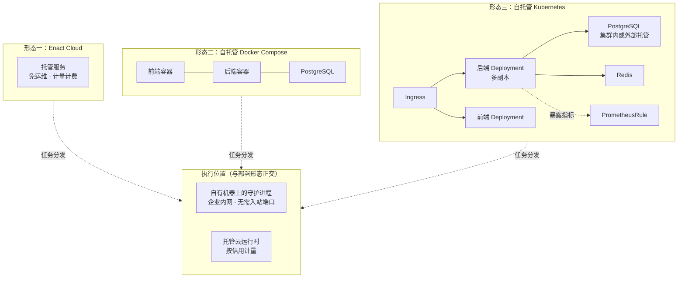
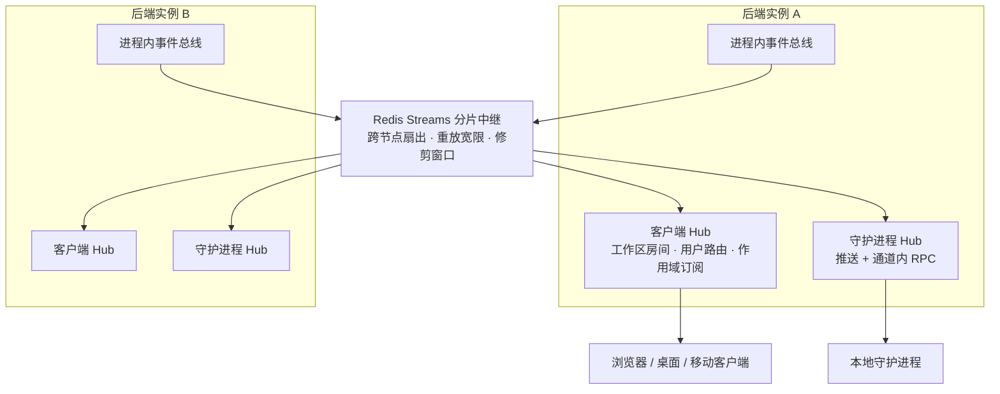
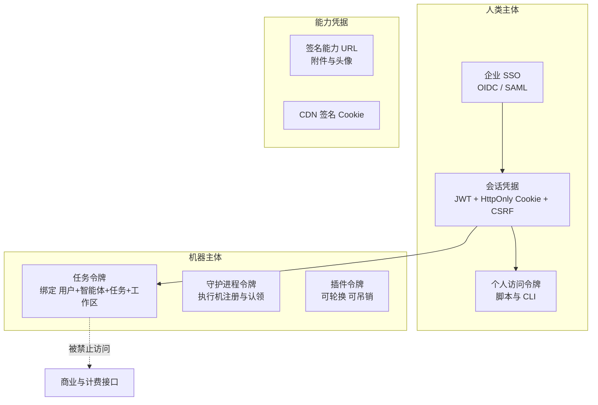

# Enact 技术架构

> **文档说明**：本文描述 Enact 的**目标态技术架构**，面向企业 IT、安全与运维评审。业务视角见[业务架构](business-architecture.zh.md)，组件视角见[应用架构](application-architecture.zh.md)。
>
> 安全评审建议从[第 6 节 · 安全架构](#6-安全架构)开始。

---

## 1. 技术栈总览

| 层次 | 技术选型 |
| --- | --- |
| **后端服务** | Go · Chi 路由 · sqlc 类型安全查询 · pgx 连接池 · gorilla/websocket |
| **主数据库** | PostgreSQL 17 |
| **缓存与协调** | Redis（限流、认领缓存、实时中继、渠道单实例租约） |
| **对象存储** | S3 兼容存储或本地磁盘，可选 CDN 分发 |
| **Web 前端** | Next.js App Router · React · TanStack Query · Zustand · Tailwind |
| **桌面端** | Electron · Vite · 内存路由 |
| **移动端** | Expo / React Native |
| **执行层** | Go 编写的守护进程 + 第三方 AI 编码工具子进程 |
| **可观测** | 结构化日志 · Prometheus 指标 · 分布式追踪 · pprof |
| **分发** | 多架构容器镜像 · Helm Chart · 跨平台 CLI 二进制 |

**支持的智能体运行时**：覆盖 23 个协议族的 AI 编码工具 CLI，包括 Claude Code、Codex、Copilot、Cursor、Kimi、Qwen Code、Grok、OpenCode、Trae、Qoder 等，以及在这些协议族之上派生的内置运行时身份。自定义运行时画像只能基于官方支持的协议族，保证执行行为可预期。

---

## 2. 部署架构

### 2.1 三种部署形态



| 形态 | 适用场景 | 关键特征 |
| --- | --- | --- |
| **Enact Cloud** | 快速起步、无基础设施团队 | 唯一启用计量与配额的形态 |
| **Docker Compose** | 单机或小规模私有化 | 一条命令起全栈；镜像启动时自动执行数据库迁移 |
| **Kubernetes** | 生产规模、高可用 | Helm Chart 提供后端 / 前端 / 数据库 / 入口 / 配置 / 告警规则模板；密钥走外部 Secret 引用 |

此外支持**手工部署**：单个 Go 二进制 + PostgreSQL + 前端，适合有严格镜像管控的环境。

### 2.2 多副本安全性

后端可水平扩展多副本。三处需要单赢者语义的地方都有对应机制：

| 场景 | 机制 |
| --- | --- |
| 数据库迁移 | 会话级咨询锁，保证同一时刻只有一个实例执行迁移 |
| 定时任务调度 | 以「任务名 + 作用域 + 计划时刻」唯一键作为抢占凭据，既是租约也是审计记录 |
| IM 渠道长连接 | 逐安装的连接租约，保证每个渠道安装只有一个活跃连接 |

### 2.3 执行位置

与部署形态**正交**的是执行位置。两者可混用：

- **自有机器**——守护进程运行在企业内网的专用主机、容器或虚拟机上。**采用拉取式认领，无需任何入站端口**，这是它能放进内网的关键。
- **托管云运行时**——由 Enact 提供的算力节点，按信用钱包计量。

典型混合策略：敏感仓库固定在自有机器上执行，通用任务交给托管算力弹性承接。

---

## 3. 执行与隔离架构

### 3.1 执行链路

```
探测本机工具与运行时画像
      ↓ 注册
批量认领任务 + 取得租约
      ↓
准备隔离执行环境（独立子进程完成）
      ↓
以子进程启动 AI 编码工具，下发任务级凭据
      ↓ 流式回传
写回结果、用量、会话标识与失败原因
```

### 3.2 逐任务的工作目录隔离

对绑定了本地目录的任务，每次执行获得独立的 git worktree。设计遵循三条不变式：

1. **智能体能看到用户当前的改动。** 已跟踪的修改以暂存提交的方式带入，未跟踪文件按容量与数量上限复制。否则智能体会基于过时的代码工作。
2. **绝不写用户的工作目录。** 所有写入发生在守护进程自有的环境根目录下。
3. **绝不静默丢弃工作。** 未提交的改动在每一条退出路径上（包括失败与取消）都会提交到分支上。

并发任务因此不会争抢同一份检出。仓库缓存与部分克隆减少重复拉取开销。

### 3.3 进程隔离与生命周期控制

- **准备阶段在独立子进程中执行**，并设置独立进程组。这样即使某个准备动作被文件系统阻塞，也能被整组强制终止，不会在重试后"复活"继续写文件。
- **多重看门狗**：总超时、语义静默超时、首轮无进展超时、空闲超时、握手超时——分别应对不同的卡死形态。
- **租约与孤儿恢复**：认领到开始运行之间有独立的准备超时；服务端巡检将失联的运行时标记为离线，其上的在途任务被回收重新分发。

### 3.4 关于沙箱的准确表述

**Enact 不承诺文件系统沙箱。** 这是一个刻意的产品决策，必须在安全评估中明确：

智能体被要求安装依赖、执行构建、使用云厂商 CLI、驱动期望完整家目录的工具链。局部的文件系统沙箱会以难以诊断的方式破坏这些工作（工具报告"未登录"或静默使用错误账号），却挡不住真正要紧的事——它无法阻止一个任务读取凭据并通过网络外发。

因此 Enact 的立场是：**不假装自己是边界，请在它外面建立边界。**

上述的逐任务工作目录、逐任务工具状态、任务级凭据，都是**降低爆炸半径的工程措施，不是对抗性安全边界**。真正的边界见 [6.4 执行边界与推荐隔离方案](#64-执行边界与推荐隔离方案)。

---

## 4. 数据架构

### 4.1 主数据库

单个 PostgreSQL 实例承载全部业务数据，约 120 张表，覆盖身份与租户、工作、智能体与运行时、执行与用量、协同、自动化、插件、集成、运维九类。

**核心约定：不使用数据库外键与级联。** 关系完整性、校验与依赖清理全部在应用层显式处理，需要原子性时使用应用事务。理由是：级联删除在大规模数据下会产生不可预期的锁与耗时，且把业务规则藏进了 schema；显式清理让删除范围可读、可测、可分批。

**迁移规范**（对运维直接相关）：

- 每个迁移成对提供正向与回滚脚本
- **所有索引一律并发创建**，且每个并发索引单独一个文件——PostgreSQL 不允许在事务或多语句串中并发建索引。迁移执行器因此不在显式事务中运行迁移文件
- 条件性跳过的迁移仍会记入迁移账本，因此后续涉及条件性对象的迁移必须使用幂等 DDL

**运行时对连接的使用**：连接池化，启动阶段带重试；指标采集使用独立的小连接池，避免抓取阻塞时挤占业务连接。

### 4.2 检索

面向中日韩友好的检索方案：bigram 与 trigram GIN 索引加速模糊匹配。

**所有检索查询运行在只读事务中并设置语句级超时**，超时被映射为明确的服务不可用响应而非无限等待。这保证一次代价失控的检索不会拖垮整个实例。

### 4.3 Redis 的用途

Redis 是**可选加速与协调层**，不是数据真相源：

| 用途 | 缺失时的行为 |
| --- | --- |
| 接口限流 | 放行（不限流） |
| 空认领与重认领缓存 | 回退到直接查库 |
| 实时事件跨节点中继 | 退化为单节点内存分发 |
| IM 渠道连接租约 | 回退到数据库租约后端 |

### 4.4 对象存储

附件与媒体走 S3 兼容存储或本地磁盘。下载通过**预签名链接**或 HMAC 签名的能力 URL 提供——因为原生图片标签与浏览器下载场景无法携带自定义请求头。可选接入 CDN，并以签名 Cookie 控制访问。

---

## 5. 实时架构与横向扩展



### 5.1 两条独立的实时通道

| 通道 | 服务对象 | 特性 |
| --- | --- | --- |
| **客户端 Hub** | 浏览器、桌面、移动端 | 按工作区房间广播、按用户定向投递、支持细粒度作用域订阅；连接时校验成员身份与订阅授权 |
| **守护进程 Hub** | 执行层 | 推送"有可认领任务"、运行时画像变更等；支持通道内 RPC，与 HTTP 接口共用同一套处理逻辑 |

### 5.2 关键机制

- **事件类型覆盖全域**：任务、评论、智能体、执行生命周期（排队 / 分派 / 运行中 / 进度 / 完成 / 失败 / 取消）、收件箱、成员、工作区、skill、Chat、项目、自动化、squad、守护进程、Git 集成等。
- **个人事件定向投递**：收件箱与邀请类事件按用户投递，绝不走工作区广播——这防止了通知内容泄露给同工作区的其他成员。
- **出站前剥离内部字段**：事件载荷中仅供服务端使用的字段在序列化前被移除，形成声明式的内外边界。
- **慢客户端驱逐**：写入积压超过阈值的连接被主动断开，防止单个慢客户端拖累全局。
- **事件去重**：每个连接记录已投递的事件标识，重放宽限期内不重复投递。
- **可信代理**：来源校验仅在配置的可信代理网段内采信转发头。

---

## 6. 安全架构

### 6.1 凭据体系

Enact 采用**分级凭据**，不同用途使用不同强度与生命周期的凭据：



| 凭据 | 用途 | 约束 |
| --- | --- | --- |
| **会话凭据** | 浏览器与桌面端交互 | HttpOnly、严格同站；状态变更请求强制携带 CSRF 令牌 |
| **个人访问令牌** | CLI、脚本、自动化 | 可列举、可吊销 |
| **任务令牌** | 智能体执行期间回调 | **绑定到具体的用户、智能体、任务与工作区**；无法冒充发起人或其他智能体；任务结束失效 |
| **守护进程令牌** | 执行机身份 | 配对流程建立，可吊销 |
| **插件令牌** | 插件调用 Action API | 可轮换、可吊销 |
| **签名能力 URL** | 附件与头像访问 | HMAC 签名 + 有效期，用于无法携带请求头的场景 |

**一条硬约束**：任务令牌被明确禁止访问商业与计费接口。智能体不能查看或操作它所有者的账务信息。

### 6.2 企业身份接入

| 能力 | 说明 |
| --- | --- |
| **单点登录** | OIDC / SAML 对接企业身份提供商 |
| **用户与组同步** | SCIM 自动开通与回收 |
| **注册管控** | 注册开关、邮箱白名单、域名白名单——限制哪些人可以自助注册 |
| **工作区创建管控** | 可全局禁用工作区自助创建，由管理员统一开设 |

### 6.3 授权模型

四层叠加，逐层收窄：

1. **工作区成员身份**——所有查询强制按工作区过滤，非成员不可见
2. **组织角色**——`owner` / `admin` / `member` 管辖设置与团队管理
3. **资源级 Access**——智能体等资源的可见范围（仅自己 / 整个工作区 / 指定成员）。**管理员可管理但不可绕过**
4. **主体类型校验**——敏感接口强制要求人类主体，机器凭据一律拒绝

工作区的解析优先级明确：任务令牌自带的绑定关系具有最高权威性，防止通过请求头切换工作区。

### 6.4 执行边界与推荐隔离方案

这是企业安全评估的核心。

#### 数据与执行边界


| Enact | 接入的计算机 |
| --- | --- |
| 工作区、任务、评论与状态 | AI 编码工具及其凭据 |
| 智能体配置与 skill | 代码目录与本地文件 |
| 任务状态、运行记录与结果 | 实际的文件改动与命令执行 |

**这条边界在 Enact Cloud 与自托管部署下完全一致。**

**一处例外需明确告知**：保存在智能体自定义环境变量中的内容存储在 Enact 服务端，并在执行时下发给运行时。**不要把绝不能离开本机的密钥放进自定义环境变量。**

#### 真正的安全边界：守护进程所属的操作系统用户

任务默认以**运行守护进程的操作系统用户的完整权限**执行：可以读写该用户能访问的任何文件、使用该用户的凭据、不受限制地访问网络。

因此必须在守护进程外部建立边界，按强度递增有三种推荐方案：

| 方案 | 隔离强度 | 说明 |
| --- | --- | --- |
| **专用系统用户** | 基础 | 创建独立用户，只授予智能体确实需要的仓库与凭据，本人账号不受影响 |
| **容器** | 中 | 只挂载必要的目录与密钥 |
| **虚拟机** | 强 | 完全隔离，代价是需要单独供给机器 |

无论选哪种，都应把该环境内可触达的凭据视为智能体可以使用的凭据：令牌按用途最小化授权，优先使用专用部署密钥而非个人密钥，不要在该用户的家目录里留存无关的生产凭据。

### 6.5 密钥管理

| 措施 | 说明 |
| --- | --- |
| **外部密钥管理** | 支持从外部密钥管理服务解析密钥，不必落在配置文件里 |
| **分渠道密钥隔离** | 每个 IM 渠道集成使用独立的加密密钥，互不影响 |
| **连接级凭据封装** | 自建 Git 连接等的凭据加密存储 |
| **远程工具凭据即时解析** | 按连接实时获取，不写入任务记录 |
| **密钥不进入提示词与执行轨迹** | 这是硬性要求 |
| **日志脱敏** | 敏感值在输出前统一脱敏 |

### 6.6 网络与接入安全

| 措施 | 说明 |
| --- | --- |
| **跨域白名单** | 显式配置允许来源，不使用通配 |
| **内容安全策略** | 统一下发，约束前端可加载的资源来源 |
| **可信代理** | 仅在配置的网段内采信转发头，防止来源与客户端地址伪造 |
| **分级限流** | 认证类与线索提交类接口独立限流；Webhook 另有按投递、按 IP 与绝对上限三层限流 |
| **Webhook 验签** | 逐条校验签名 |
| **公共回调凭据置于路径与签名** | 因为跨站跳转会剥离 Cookie 与请求头 |

### 6.7 审计

| 层次 | 内容 | 用途 |
| --- | --- | --- |
| **活动日志** | 业务状态变更：谁、何时、改了什么 | 业务追溯 |
| **执行记录** | 工具调用、命令、文件读写、token 消耗、失败原因 | 工程排障与合规审计 |
| **责任归属** | 每次运行的可问责自然人 | 问责与复盘 |

自托管部署下，全部审计数据留在客户自己的数据库中，留存策略由客户自定。

---

## 7. 可观测性与运维

| 能力 | 实现 |
| --- | --- |
| **结构化日志** | 分级日志 + 请求标识贯穿；记录客户端平台、版本与操作系统，便于按客户端定位问题 |
| **指标** | Prometheus 指标覆盖 HTTP、业务事件、数据库连接池、实时连接、渠道租约与媒体、定价等。**指标服务监听独立端口**，与业务端口分离，默认建议绑定回环地址 |
| **分布式追踪** | 跨服务链路追踪，与请求标识关联 |
| **健康探针** | 存活探针与就绪探针分离，适配 Kubernetes 滚动更新 |
| **性能剖析** | pprof 端点固定绑定回环地址，不对外暴露 |
| **告警** | Helm Chart 内置告警规则模板 |

**后台作业**：运行时巡检、心跳批处理、自动化失败监控、配额对账、Webhook 投递、渠道连接监管、媒体对账、以及分布式定时调度器。

**优雅停机按明确顺序执行**：HTTP 排空 → 巡检取消 → 心跳落盘 → 工作协程汇合 → 释放租约 → 关闭指标与剖析端点。可配置停机前的保持时长，配合负载均衡摘流。

---

## 8. 可靠性与降级

### 8.1 降级矩阵

Enact 的一条设计纪律是：**可选子系统缺失时降级运行，而不是拒绝服务。** 这既让最小部署能跑起来，也让局部故障不升级为全站故障。

| 子系统缺失 | 降级行为 | 影响面 |
| --- | --- | --- |
| Redis 不可用 | 单节点内存实时分发；不限流；认领缓存回退查库 | 多副本下实时事件不跨节点；无限流保护 |
| 模型网关未配置 | 不生成会话标题与快捷动作建议 | 仅影响便利功能 |
| 指标地址未配置 | 不暴露指标端点 | 仅影响可观测性 |
| 某 IM 渠道密钥缺失 | 该渠道接口返回服务不可用 | 仅该渠道 |
| 邮件服务未配置 | 邀请链接记录到日志，可人工分发 | 邀请流程需人工介入 |
| 无在线运行时 | 任务留在队列中等待 | 任务不丢失，运行时上线后自动认领 |

### 8.2 执行可靠性

| 机制 | 作用 |
| --- | --- |
| **租约** | 认领后持有租约，超时未开始则回收重新分发 |
| **多重看门狗** | 总超时、语义静默、首轮无进展、空闲、握手分别设限 |
| **重试与失败分类** | 失败按类型归因（上下文耗尽、工具缺失、超时等），据此决定是否可重试 |
| **孤儿恢复** | 运行时失联后其在途任务被识别并回收 |
| **取消确认** | 取消动作需执行侧确认，避免状态悬空 |

### 8.3 备份与恢复

自托管部署的备份对象：

1. **PostgreSQL** —— 全部业务数据，唯一必须备份的真相源
2. **对象存储** —— 附件与媒体
3. **配置与密钥** —— 环境配置与外部密钥引用

守护进程侧无需备份：运行时可随时重新注册，工作目录是临时的。

---

## 9. 非功能指标

以下为目标态设定，实际取值随部署规模与 SLA 约定调整：

| 维度 | 目标 |
| --- | --- |
| **可用性** | 控制面多副本部署，滚动更新不中断服务；单个执行机故障不影响其他任务 |
| **接口性能** | 常规读写接口 P95 亚秒级；检索类接口硬性语句超时保护 |
| **实时时延** | 事件从产生到客户端可见为秒级 |
| **横向扩展** | 后端无状态，可按负载水平扩展；实时扇出经分片中继跨节点 |
| **执行容量** | 按运行时数量与各自并发上限线性扩展；队列削峰 |
| **RPO / RTO** | 由数据库备份策略决定；控制面无状态，恢复时间取决于数据库恢复 |
| **数据驻留** | 自托管形态下全部数据留在客户指定的基础设施内 |

---

## 10. 关键技术决策

| 决策 | 理由 |
| --- | --- |
| **后端用 Go** | 单二进制分发、启动快、并发模型适合大量长连接与后台协程；同一份代码同时产出服务端、CLI 与守护进程，三者共享协议定义不会漂移 |
| **单 PostgreSQL，不引入专用存储** | 业务数据规模内，单库的事务一致性与运维简单性远比分库收益大；检索用扩展索引解决，避免额外引入检索集群 |
| **不使用数据库外键与级联** | 级联删除在大规模数据下产生不可预期的锁与耗时，且把业务规则藏进 schema。显式的应用层清理让删除范围可读、可测、可分批 |
| **执行下沉到本地守护进程** | 这是产品的核心结构选择。代码与凭据不出企业网络，执行机可完全位于内网且无需入站端口；同时让企业按自己的合规要求决定隔离强度 |
| **拉取式任务分发** | 服务端不主动连接执行机，因此执行机可以在 NAT 后、在严格出站策略下工作 |
| **租用外部智能体运行时，不自研模型** | 推理能力正在快速商品化，把资源投在那里回报递减。价值在于工作事实、责任、证据与能力沉淀这一层——通用智能体越强，这一层越有价值 |
| **不承诺文件系统沙箱** | 局部沙箱会破坏智能体所需的正常工具链，却挡不住凭据外发。与其提供虚假的安全感，不如明确边界位置并给出可靠的隔离方案 |
| **跨端共享无头业务逻辑** | Web 与桌面共享业务逻辑与界面，只在导航、存储与运行配置三处分叉，避免同一业务规则在两端产生分歧 |

---

## 相关文档

- [业务架构](business-architecture.zh.md) —— 业务能力、角色与商业模式
- [应用架构](application-architecture.zh.md) —— 组件划分、交互模式与集成
- [架构总览](README.zh.md) —— 一页读懂与架构原则
